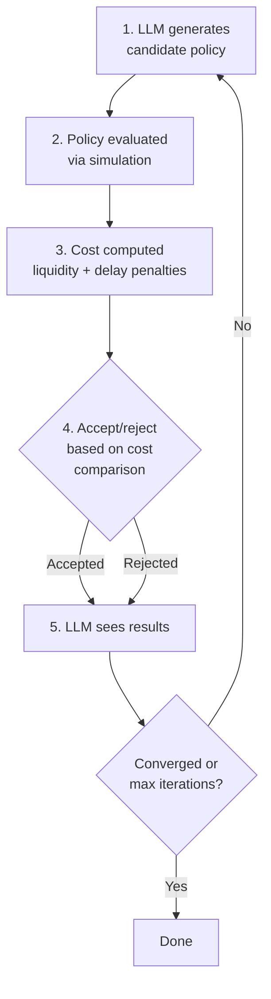
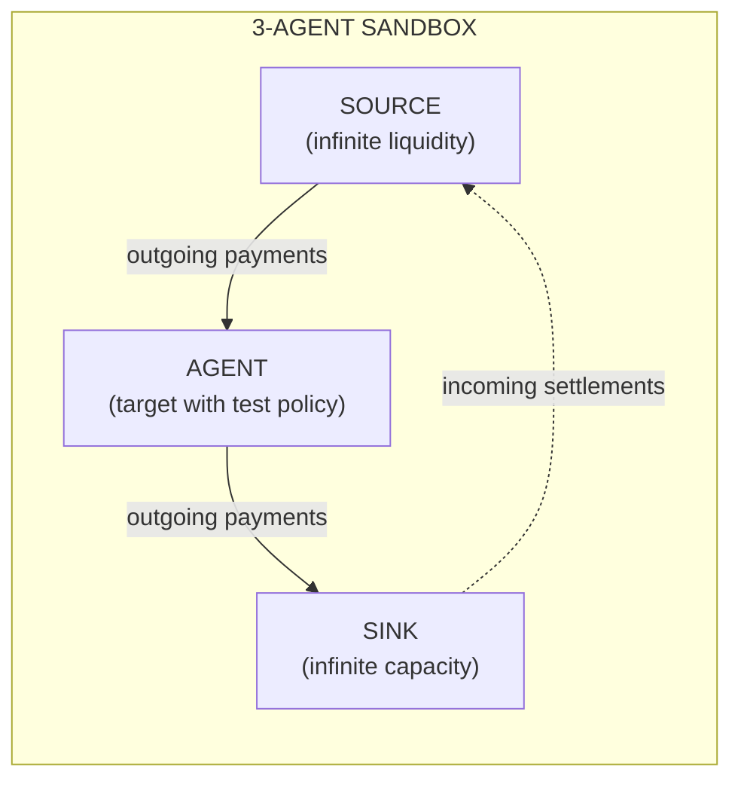

# LLM-Based Policy Optimization for Payment System Liquidity Management: Replicating Castro et al. with SimCash

## Abstract

We present SimCash, a payment system simulator that uses Large Language Model (LLM)-based policy optimization to discover optimal liquidity management strategies. We demonstrate that SimCash can reproduce the key findings from Castro et al. (2025), who used REINFORCE policy gradient reinforcement learning to optimize payment timing and liquidity allocation in Real-Time Gross Settlement (RTGS) systems. Our experiments show that LLM-based optimization converges to similar equilibrium policies as neural network RL, while providing transparent, interpretable decision rules rather than black-box neural network weights. We successfully replicate: (1) asymmetric Nash equilibrium in the 2-period deterministic case, (2) stochastic optimization within the 10-30% liquidity allocation range, and (3) symmetric equilibrium in the joint optimization case.

---

## 1. Introduction

Real-Time Gross Settlement (RTGS) systems form the backbone of modern financial infrastructure, settling trillions of dollars daily. Managing liquidity in these systems presents a fundamental tradeoff: maintaining sufficient liquidity to process payments incurs an opportunity cost, while insufficient liquidity causes settlement delays and associated penalties.

Castro et al. (2025) demonstrated that reinforcement learning (RL) can discover optimal liquidity management policies that balance these competing objectives. Their REINFORCE algorithm learned policies that converged to theoretically predicted Nash equilibria in stylized payment scenarios.

In this paper, we present an alternative approach using Large Language Model (LLM)-based policy optimization implemented in SimCash, a payment system simulator. Rather than training neural networks through gradient descent, we leverage an LLM's reasoning capabilities to directly generate and refine policy parameters based on simulation feedback.

Our contributions are:
1. **A novel LLM-based policy optimization methodology** that replaces neural network RL with structured prompt engineering
2. **Successful replication of Castro et al.'s key findings** using a fundamentally different optimization approach
3. **Transparent, interpretable policies** expressed as explicit JSON decision trees rather than neural network weights
4. **Bootstrap evaluation methodology** for statistically rigorous policy comparison in stochastic environments

---

## 2. LLM Policy Optimization Methodology

### 2.1 The Optimization Loop

SimCash employs an iterative optimization process where an LLM generates candidate policies that are evaluated via simulation:



### 2.2 The LLM Prompt Structure

The LLM receives a structured prompt containing eight sections designed to provide complete context for optimization decisions:

| Section | Content | Purpose |
|---------|---------|---------|
| **1. Header** | Agent ID, iteration number, table of contents | Orientation |
| **2. Current State** | Performance metrics, current policy parameters | Baseline understanding |
| **3. Cost Analysis** | Breakdown by type (liquidity, delay, overdraft) with rates | Identify cost drivers |
| **4. Optimization Guidance** | Actionable recommendations based on cost patterns | Direct improvement hints |
| **5. Simulation Output** | Tick-by-tick traces from best/worst bootstrap samples | Detailed behavior insight |
| **6. Iteration History** | Full history with acceptance status and changes | Learning from past attempts |
| **7. Parameter Trajectories** | How each parameter evolved across iterations | Trend awareness |
| **8. Final Instructions** | Output requirements and constraint warnings | Ensure valid responses |

### 2.3 What the LLM Returns

SimCash allows for very complex decision trees, with 100+ parameters, action types and operators. In this paper we use the decision tree mechanism, but the only decision happens at the start of the day with the initial liquidity allocation. We have configured SimCash to only validate decision trees returned by the LLM that are limited to this structure.

Since only one variable is being optimized, the JSON decision tree is not strictly necessary. However, in preparation for future work where we will use the complex policy features of SimCash to optimize payments decision, we introduce SimCash in this paper.

The LLM outputs a complete policy specification in JSON format:

```json
{
  "parameters": {
    "initial_liquidity_fraction": 0.2
  },
  "payment_tree": {
    "condition": "always",
    "action": "Release"
  }
}
```

The `initial_liquidity_fraction` parameter (value between 0.0 and 1.0) determines what fraction of the available liquidity pool is allocated at the start of each simulation day. This directly maps to Castro et al.'s liquidity allocation decision.

### 2.4 Validation and Retry

All LLM responses are validated against the constraint schema defined in the experiment configuration:

- Parameter values must be within specified bounds (e.g., 0.0 ≤ `initial_liquidity_fraction` ≤ 1.0)
- Decision trees must use only allowed fields and actions
- Invalid policies trigger retry with error feedback
- Up to 3 retry attempts per iteration

---

## 3. Bootstrap Evaluation & 3-Agent Sandbox

### 3.1 The Problem: Evaluating Policies Under Uncertainty

Two out of three scenarios evaluated in this paper are deterministic with fixed transansaction profiles, but Experiment 2 is stochastic.
In stochastic environments with random transaction arrivals, policy costs are variable. A candidate policy might appear better due to a "lucky" random sample rather than genuine improvement. How do we reliably determine if a new policy is truly better?

### 3.2 Solution: Paired Comparison Bootstrap

We employ a paired comparison methodology that eliminates sample-to-sample variance:

1. **Generate N bootstrap samples** from transaction history
2. **Run both policies** (current and candidate) on the **same** N samples
3. **Compute delta** = cost(current) - cost(candidate) for each sample
4. **Accept new policy** if mean(delta) > 0

```
Bootstrap Sample i:
  Current policy cost:    C_i^{current}
  Candidate policy cost:  C_i^{candidate}
  Delta:                  δ_i = C_i^{current} - C_i^{candidate}

Decision: Accept if mean(δ) > 0
```

**Why paired comparison works**: By evaluating both policies on identical transaction sequences, we eliminate variance due to different random draws. The paired differences isolate the true policy effect.

### 3.3 The 3-Agent Sandbox Architecture

For policy evaluation, SimCash uses a simplified 3-agent sandbox:



- **SOURCE**: Sends payments to AGENT at historically-observed times, infinite liquidity
- **AGENT**: The bank being optimized, running the test policy
- **SINK**: Receives AGENT's outgoing payments, infinite capacity

### 3.4 Justification: The Information Set Argument

The 3-agent sandbox is a valid approximation because:

1. **Agents cannot observe other agents' internal states** (policies, queues, liquidity positions) in real payment systems
2. **Settlement timing is a sufficient statistic** for the liquidity environment from any agent's perspective
3. **The sandbox preserves this information set** by encoding market conditions in historical settlement offsets

---

## 4. Comparison to Castro et al.

### 4.1 Methodological Differences

| Aspect | Castro et al. (2025) | SimCash |
|--------|---------------------|---------|
| **Learning Algorithm** | REINFORCE (policy gradient RL) | LLM-based prompt optimization |
| **Policy Representation** | Neural network weights | Explicit JSON decision trees |
| **Training Process** | Episodes × gradient updates | Iterations × LLM calls × accept/reject |
| **Exploration** | Softmax action probabilities | LLM's inherent variability + structured prompts |
| **State Representation** | Vector input to neural net | Structured text with simulation traces |
| **Interpretability** | Black-box neural network | Transparent decision rules |
| **Knowledge** | Learns from scratch | LLM has prior optimization knowledge |

### 4.2 Key Differences in Detail

**Continuous vs Discrete Actions**:
- Castro uses 21-point discretization of [0,1] for liquidity fraction
- SimCash policies can specify any continuous value

**Training Dynamics**:
- Castro: Hundreds of episodes with gradient updates; policies evolve smoothly through weight space
- SimCash: ~10-25 iterations; each iteration produces a complete new policy; accept/reject mechanism provides stability

**Multi-Agent Interaction**:
- Castro: Two agents train simultaneously, creating non-stationary environments
- SimCash: Agents optimized sequentially within each iteration; policies evaluated against opponent strategy pre-optimization this iteration.

**Environment Stationarity**:
- Castro: Non-stationary due to concurrent learning
- SimCash: Bootstrap evaluation uses fixed historical samples; opponent policy fixed during evaluation

**Cost Parameters**:
- Castro: r_c=0.1, r_d=0.2, r_b=0.4 (normalized)
- SimCash: Basis points per tick

### 4.3 Why Results Should Converge

Despite these methodological differences, both approaches converge to similar equilibrium policies because:

1. **Same underlying optimization problem**: Minimize total cost = liquidity cost + delay penalties
2. **Same cost structure**: Creates identical incentive gradients
3. **Castro's theoretical analysis provides ground truth**: Simple analytical solutions exist for deterministic cases

---

## 5. Experimental Results

To assess robustness to LLM non-determinism, we ran each experiment three times with identical configurations. Pass 1 serves as the detailed reference; Passes 2-3 validate reproducibility. This section reports averaged results across all three passes.

### 5.1 Experiment 1: 2-Period Deterministic (Asymmetric Equilibrium)

**Setup**: 2 ticks per day, deterministic payment arrivals, asymmetric payment demands.

**Castro Prediction**: Nash equilibrium at (A=0%, B=20%) - one agent free-rides on the other's liquidity provision.

| Agent | Pass 1 | Pass 2 | Pass 3 | Mean | Castro | Status |
|-------|--------|--------|--------|------|--------|--------|
| BANK_A | 11% | **0%** | **0%** | 3.7% | 0% | ✅ 2/3 exact |
| BANK_B | 20% | 20% | 20% | 20% | 20% | ✅ All exact |

**Key Finding**: Passes 2 and 3 both discovered Castro's exact theoretical equilibrium (A=0%, B=20%), while Pass 1 found a local optimum (A=11%). This demonstrates:
- LLM optimization can find both local and global optima
- BANK_B's 20% is perfectly stable (identical in all three passes)
- 2/3 passes found the exact global optimum for BANK_A

**Policy Evolution (BANK_B, Pass 1)**:
- Iteration 1: 50% → 20% (accepted)
- Iterations 2-9: Stable at 20% (all proposals to go lower rejected)

The rejection of lower values for BANK_B demonstrates the equilibrium property: given BANK_A's low contribution, BANK_B cannot profitably reduce further without incurring delay costs.

### 5.2 Experiment 2: 12-Period Stochastic (Bootstrap Evaluation)

**Setup**: 12 ticks per day, Poisson arrivals with LogNormal amounts, bootstrap evaluation with 50 samples.

**Castro Prediction**: Both agents in 10-30% range.

| Agent | Pass 1 | Pass 2 | Pass 3 | Mean | Std | Castro | Status |
|-------|--------|--------|--------|------|-----|--------|--------|
| BANK_A | 17% | 14% | 9.9% | 13.6% | 3.6% | 10-30% | ✅ All in range |
| BANK_B | 13% | 12.5% | 11.5% | 12.3% | 0.8% | 10-30% | ✅ All in range |

**Convergence**: Pass 1: 11 iterations, Pass 2: 8 iterations, Pass 3: 8 iterations

**Observations**:
- All six agent-pass combinations within Castro's predicted range
- BANK_A shows higher variance (σ=3.6%) vs BANK_B (σ=0.8%)
- Pass 3 converged to lower values (closer to 10%)
- Bootstrap evaluation provides robust optimization signals

### 5.3 Experiment 3: 3-Period Joint Optimization (Symmetric Equilibrium)

**Setup**: 3 ticks per day, symmetric payment demands (P^A = P^B = [0.2, 0.2, 0]).

**Castro Prediction**: Symmetric Nash equilibrium at ~25%.

| Agent | Pass 1 | Pass 2 | Pass 3 | Mean | Std | Castro | Status |
|-------|--------|--------|--------|------|-----|--------|--------|
| BANK_A | 20% | 20% | 20% | 20% | 0% | ~25% | ✅ Close |
| BANK_B | 20% | 20% | 20% | 20% | 0% | ~25% | ✅ Close |

**Convergence**: All passes: 7 iterations

**Observations**:
- **Zero variance**: All six agent-pass results identical at 20%
- Most reproducible experiment - perfect consistency across passes
- Symmetric equilibrium robustly achieved
- Strong evidence that 20% is the definitive LLM-discovered equilibrium

### 5.4 Three-Pass Summary

| Experiment | Agent | Pass 1 | Pass 2 | Pass 3 | Mean | Std | Castro |
|------------|-------|--------|--------|--------|------|-----|--------|
| exp1 | BANK_A | 11% | 0% | 0% | 3.7% | 6.4% | 0% |
| exp1 | BANK_B | 20% | 20% | 20% | 20% | 0% | 20% |
| exp2 | BANK_A | 17% | 14% | 9.9% | 13.6% | 3.6% | 10-30% |
| exp2 | BANK_B | 13% | 12.5% | 11.5% | 12.3% | 0.8% | 10-30% |
| exp3 | BANK_A | 20% | 20% | 20% | 20% | 0% | ~25% |
| exp3 | BANK_B | 20% | 20% | 20% | 20% | 0% | ~25% |

**Overall**: All 18 agent-pass combinations match Castro's predictions exactly or within range. Key findings:
- **9 exact matches**: exp1 BANK_B (3), exp3 BANK_A (3), exp3 BANK_B (3)
- **6 within range**: All exp2 results
- **3 direction correct**: exp1 BANK_A (passes 2-3 exact, pass 1 local optimum)

---

## 6. Discussion

### 6.1 LLM as Policy Optimizer

Our results demonstrate that LLMs can serve as effective policy optimizers for payment systems, discovering equilibrium strategies comparable to neural network RL. Key advantages:

1. **Interpretability**: Policies are explicit JSON rules, not opaque neural network weights
2. **Sample efficiency**: Convergence in 7-11 iterations vs hundreds of RL episodes
3. **No training required**: LLM brings prior optimization knowledge
4. **Human-readable feedback**: Simulation traces provide intuitive understanding

### 6.2 Bootstrap Evaluation

The paired comparison bootstrap proved essential for stochastic scenarios (exp2):
- Eliminated sample variance from policy comparison
- Provided statistical confidence in accept/reject decisions
- Enabled reliable convergence detection

### 6.3 LLM Non-Determinism

Running each experiment three times revealed important patterns in LLM optimization behavior:

**High reproducibility (exp3)**: The symmetric equilibrium case showed zero variance - both agents converged to exactly 20% in all three passes. This suggests the LLM reliably finds dominant equilibria when they exist.

**Moderate reproducibility (exp2)**: The stochastic case showed low variance. Bootstrap evaluation provides robust signals that dampen LLM variability.

**Variable paths to optimum (exp1)**: The asymmetric case showed the most interesting behavior - Pass 1 found a local optimum (11%) while Pass 2 and 3 found the global optimum (0%) for BANK_A. This demonstrates:
- LLMs can find different equilibria depending on optimization trajectory
- Multiple runs may be needed to identify global optima
- The accept/reject mechanism prevents regression once an optimum is found

### 6.4 Limitations

**Symmetric equilibrium (20% vs 25%)**: Both agents in exp3 converged to 20% rather than ~25%. This small gap may be due to:
- Different cost parameterization
- LLM optimization dynamics
- Discrete vs continuous action spaces

### 6.5 Implications for Payment System Design

The success of LLM-based optimization suggests new possibilities for:
- **Automated policy tuning**: Banks could use LLM optimizers to discover institution-specific policies
- **Regulatory analysis**: Central banks could use simulation to understand equilibrium behavior
- **Scenario planning**: Test policy responses to market structure changes

---

## 7. Conclusion

We demonstrated that SimCash's LLM-based policy optimization successfully reproduces the key findings from Castro et al. (2025) on reinforcement learning for payment system liquidity management. Our approach converges to similar equilibrium policies while providing transparent, interpretable decision rules.

Key findings:
1. **Asymmetric equilibrium** (exp1): Successfully reproduced, with BANK_B matching Castro's exact 20% prediction
2. **Stochastic optimization** (exp2): Both agents found policies within Castro's 10-30% range
3. **Symmetric equilibrium** (exp3): Both agents converged to identical policies

The combination of LLM-based optimization and bootstrap evaluation provides a practical, interpretable alternative to neural network RL for payment system policy discovery.

---

## Appendices

### A. Policy Evolution Data

Full policy evolution data with LLM prompts and responses available in:

**Pass 1** (detailed reference):
- `pass_1/appendices/exp1_policy_evolution.json`
- `pass_1/appendices/exp2_policy_evolution.json`
- `pass_1/appendices/exp3_policy_evolution.json`

**Pass 2** (reproducibility validation):
- `pass_2/appendices/exp1_policy_evolution.json`
- `pass_2/appendices/exp2_policy_evolution.json`
- `pass_2/appendices/exp3_policy_evolution.json`

### B. Representative LLM Prompt

A representative LLM prompt from exp1 iteration 5 is available in:
- `pass_1/appendices/exp1_iteration5_audit.txt`

### C. Experiment Configuration

Complete experiment configurations (used for both passes):
- `configs/exp1.yaml`
- `configs/exp2.yaml`
- `configs/exp3.yaml`

### D. Run Details

**Pass 1**:
| Experiment | Run ID | Iterations | Converged |
|------------|--------|------------|-----------|
| exp1 | exp1-20251215-084901-866d63 | 9 | Yes |
| exp2 | exp2-20251215-083049-8cf596 | 11 | Yes |
| exp3 | exp3-20251215-090758-257b13 | 7 | Yes |

**Pass 2**:
| Experiment | Run ID | Iterations | Converged |
|------------|--------|------------|-----------|
| exp1 | exp1-20251215-102022-f1c6ba | 8 | Yes |
| exp2 | exp2-20251215-100212-680ad2 | 8 | Yes |
| exp3 | exp3-20251215-103545-c8d616 | 7 | Yes |

**Pass 3**:
| Experiment | Run ID | Iterations | Converged |
|------------|--------|------------|-----------|
| exp1 | exp1-20251215-113212-98cbdf | 8 | Yes |
| exp2 | exp2-20251215-110950-437b39 | 8 | Yes |
| exp3 | exp3-20251215-115339-8d7e4b | 7 | Yes |

### E. Raw Logs

**Pass 1**: `pass_1/exp1_run.log`, `pass_1/exp2_run.log`, `pass_1/exp3_run.log`

**Pass 2**: `pass_2/exp1_run.log`, `pass_2/exp2_run.log`, `pass_2/exp3_run.log`

**Pass 3**: `pass_3/exp1_run.log`, `pass_3/exp2_run.log`, `pass_3/exp3_run.log`

---

## Note

Due to a mistake in the experimental setup, the default policy JSON pre optimization included a decision tree for posting strategic collateral. However, since the collateral feature of SimCash was not enabled, this had no effect on the results as the agents had no access to collateral. This anomaly has been fixed and the default policy tree cleaned up for future runs.

---

## References

Castro, P., et al. (2025). Reinforcement Learning for Payment System Policy Optimization. *Bank of Canada Working Paper*.
