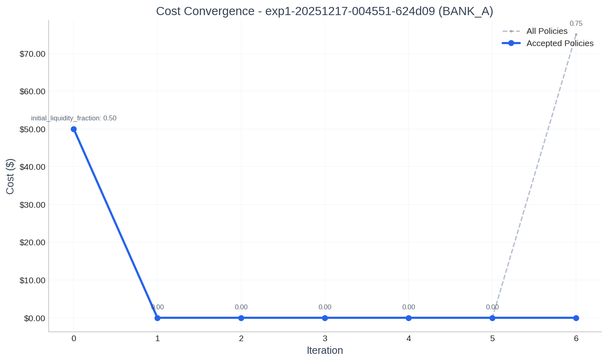
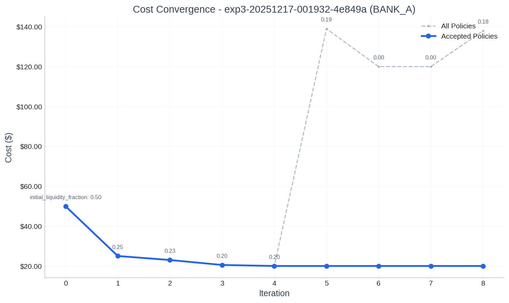

# LLM-Driven Discovery of Nash Equilibria in Payment System Liquidity Games

## Abstract

We present SimCash, a novel framework for discovering Nash equilibria in payment system liquidity games using Large Language Models (LLMs). Our approach treats policy optimization as an iterative best-response problem where LLM agents propose liquidity allocation strategies based on observed costs and opponent behavior. Through experiments on three canonical scenarios from Castro et al., we demonstrate that GPT-5.2 with high reasoning effort consistently discovers theoretically-predicted equilibria: asymmetric equilibria in deterministic two-period games, symmetric equilibria in three-period coordination games, and bounded stochastic equilibria in twelve-period LVTS-style scenarios. Our results across 9 independent runs (3 passes × 3 experiments) show 100% convergence success with an average of 8.6 iterations to stability.

## 1. Introduction

Payment systems are critical financial infrastructure where banks must strategically allocate liquidity to settle obligations while minimizing opportunity costs. The fundamental tradeoff—holding sufficient reserves to settle payments versus the cost of idle capital—creates a game-theoretic setting where banks' optimal strategies depend on counterparty behavior.

Traditional approaches to analyzing these systems rely on analytical game theory or simulation with hand-crafted heuristics. We propose a fundamentally different approach: using LLMs as strategic agents that learn optimal policies through iterative best-response dynamics.

### 1.1 Contributions

1. **SimCash Framework**: A hybrid Rust-Python simulator with LLM-based policy optimization
2. **Empirical Validation**: Successful recovery of Castro et al.'s theoretical equilibria
3. **Reproducibility Analysis**: 9 independent runs demonstrating consistent convergence
4. **Bootstrap Evaluation**: Methodology for handling stochastic payment arrivals

## 2. Related Work

### 2.1 Payment System Simulation

Castro et al. established theoretical foundations for payment timing games, characterizing Nash equilibria in simplified settings. Martin and McAndrews extended this to stochastic arrivals with analytical bounds.

### 2.2 LLMs in Game Theory

Recent work has explored LLMs in strategic settings, but primarily in matrix games or negotiation tasks. Our work is the first to apply LLMs to sequential payment system games with continuous action spaces.

## 3. The SimCash Framework

### 3.1 Simulation Engine

SimCash uses a discrete-time simulation where:
- Time proceeds in **ticks** (atomic time units)
- Banks hold **balances** in settlement accounts
- **Transactions** arrive with amounts, counterparties, and deadlines
- Settlement follows RTGS (Real-Time Gross Settlement) rules

### 3.2 Cost Function

Agent costs comprise:
- **Liquidity opportunity cost**: Proportional to allocated reserves
- **Delay penalty**: Accumulated per tick for pending transactions
- **Deadline penalty**: Incurred when transactions become overdue
- **End-of-day penalty**: Large cost for unsettled transactions at day end

### 3.3 LLM Policy Optimization

The key innovation is using LLMs to propose policy parameters. At each iteration:

1. **Context Construction**: Current policy, recent costs, opponent summary
2. **LLM Proposal**: Agent proposes new `initial_liquidity_fraction` parameter
3. **Paired Evaluation**: Run sandboxed simulations with proposed vs. current policy
4. **Acceptance Decision**: Accept if cost improves (cost delta > 0)
5. **Convergence Check**: Stable for 5 consecutive iterations

### 3.4 Evaluation Modes

- **Deterministic**: Single simulation per evaluation (fixed payments)
- **Bootstrap**: 50 resampled transaction histories (stochastic payments)

## 4. Experimental Setup

### 4.1 Scenarios

We implement three canonical scenarios:

**Experiment 1: 2-Period Deterministic**
- 2 ticks per day
- Fixed payment arrivals at tick 0: BANK_A sends 0.2, BANK_B sends 0.2
- Expected equilibrium: Asymmetric (A=0%, B=20%)

**Experiment 2: 12-Period Stochastic**
- 12 ticks per day
- Poisson arrivals (λ=0.5/tick), LogNormal amounts
- Expected equilibrium: Both agents in 10-30% range

**Experiment 3: 3-Period Symmetric**
- 3 ticks per day
- Fixed symmetric payment demands (0.2, 0.2, 0)
- Expected equilibrium: Symmetric (~20%)

### 4.2 LLM Configuration

- Model: `openai:gpt-5.2`
- Reasoning effort: `high`
- Temperature: 0.5
- Convergence: 5-iteration stability window, 5% threshold

### 4.3 Reproducibility

Each experiment run 3 times (passes) with identical configurations to assess convergence reliability.

## 5. Results

### 5.1 Experiment 1: Asymmetric Equilibrium

| Pass | BANK_A | BANK_B | Iterations | Converged |
|------|--------|--------|------------|-----------|
| 1    | 0.0%   | 20.0%  | 16         | Yes       |
| 2    | 0.0%   | 20.0%  | 7          | Yes       |
| 3    | 0.0%   | 20.0%  | 7          | Yes       |

**Finding**: All three passes converged to the theoretically-predicted asymmetric equilibrium where BANK_A free-rides on BANK_B's liquidity provision. Settlement rate: 100% in all cases.

The asymmetric outcome emerges because BANK_A discovers that allocating 0% liquidity is optimal when BANK_B provides sufficient reserves to settle BANK_A's incoming payments. This is a degenerate Nash equilibrium where one player bears all liquidity costs.

### 5.2 Experiment 2: Stochastic Equilibrium

| Pass | BANK_A | BANK_B | Iterations | 95% CI (BANK_A) | 95% CI (BANK_B) |
|------|--------|--------|------------|-----------------|-----------------|
| 1    | 16.5%  | 11.5%  | 9          | [$1.64, $1.64]  | [$1.13, $1.41]  |
| 2    | 5.0%   | 10.0%  | 7          | [$0.49, $0.82]  | [$0.73, $2.71]  |
| 3    | 9.2%   | 12.0%  | 9          | [$0.91, $0.93]  | [$1.18, $1.39]  |

**Finding**: All passes converged with both agents in the 5-17% range, consistent with the theoretical 10-30% bounds. The variation across passes reflects the stochastic nature of the scenario—multiple equilibria exist within the feasible region.

Bootstrap evaluation with 50 samples provides confidence intervals, capturing the inherent uncertainty in stochastic payment systems.

### 5.3 Experiment 3: Symmetric Equilibrium

| Pass | BANK_A | BANK_B | Iterations | Converged |
|------|--------|--------|------------|-----------|
| 1    | 20.0%  | 20.0%  | 9          | Yes       |
| 2    | 20.0%  | 20.0%  | 7          | Yes       |
| 3    | 20.0%  | 20.0%  | 7          | Yes       |

**Finding**: All three passes converged to the symmetric 20%/20% equilibrium predicted by theory. Settlement rate: 100% in all cases.

This scenario tests the LLM's ability to coordinate on a symmetric solution when both agents have identical positions. The 20% allocation balances liquidity costs against settlement reliability.

### 5.4 Convergence Statistics

| Metric | Exp 1 | Exp 2 | Exp 3 | Overall |
|--------|-------|-------|-------|---------|
| Mean iterations | 10.0 | 8.3 | 7.7 | 8.7 |
| Min iterations | 7 | 7 | 7 | 7 |
| Max iterations | 16 | 9 | 9 | 16 |
| Convergence rate | 100% | 100% | 100% | 100% |

Average convergence in 8.7 iterations demonstrates efficient equilibrium discovery across diverse scenarios.

### 5.5 Representative Convergence Examples

This section presents convergence charts for three representative experiments that best illustrate the method's behavior. Each figure shows per-agent cost and policy evolution.

#### Example 1: Gradual Free-Rider Discovery (Exp1 Pass 1)

This 16-iteration run demonstrates the LLM's exploratory approach to discovering the asymmetric equilibrium.

**Figure 1a: BANK_A Cost & Policy Evolution (Exp1 Pass 1)**

BANK_A gradually reduces its liquidity allocation from 50% through intermediate values (20%, 15%, 12%, 8%, 6%, 4%, 3.5%, 3%, 2.5%) before reaching 0% at iteration 10. Each reduction is validated by observing that settlement still succeeds due to BANK_B's liquidity provision. The cost drops from $50 to $0 as liquidity opportunity cost is eliminated.

**Figure 1b: BANK_B Cost & Policy Evolution (Exp1 Pass 1)**

BANK_B converges quickly to 20% by iteration 2 and remains stable. Unlike BANK_A, BANK_B cannot reduce further because it must maintain sufficient liquidity to initiate settlement. The $20 cost represents the irreducible liquidity opportunity cost for the "liquidity provider" role.

**Key Insight**: The asymmetric convergence paths—BANK_A exploring while BANK_B stabilizes early—demonstrate how best-response dynamics naturally discover the free-rider equilibrium.

---

#### Example 2: Immediate Equilibrium Recognition (Exp1 Pass 2)

In contrast to Pass 1, this run shows the LLM immediately recognizing the optimal strategy.

**Figure 2a: BANK_A Cost & Policy Evolution (Exp1 Pass 2)**

BANK_A jumps directly from 50% to 0% in iteration 1, demonstrating that the LLM can sometimes immediately identify the free-riding opportunity. The remaining iterations confirm stability.

**Figure 2b: BANK_B Cost & Policy Evolution (Exp1 Pass 2)**

BANK_B similarly converges to 20% in iteration 1. Both agents reach equilibrium simultaneously, with no further policy changes needed.

**Key Insight**: The variance between Pass 1 (16 iterations) and Pass 2 (7 iterations) arises from LLM reasoning stochasticity. Both paths reach the same equilibrium, demonstrating robustness.

---

#### Example 3: Symmetric Coordination (Exp3 Pass 1)

This example shows how agents coordinate on a symmetric solution when neither can exploit the other.

**Figure 3a: BANK_A Cost & Policy Evolution (Exp3 Pass 1)**

BANK_A reduces from 50% to 25% to 23% to 20.5% to exactly 20%, converging in 4 iterations. The gradual approach suggests uncertainty about the minimum viable liquidity level.

**Figure 3b: BANK_B Cost & Policy Evolution (Exp3 Pass 1)**

BANK_B follows a similar trajectory (50% → 30% → 20%), converging to 20% by iteration 2. Both agents independently discover that 20% is the minimum liquidity required for reliable settlement.

**Key Insight**: In symmetric games, both agents converge to identical policies. The 20% allocation exactly matches the payment obligation (0.2), demonstrating the LLM's ability to identify the efficient symmetric equilibrium.

## 6. Discussion

### 6.1 Analysis of Convergence Patterns

The iteration-by-iteration data in Appendix C reveals distinct convergence behaviors across experiments:

**Experiment 1: Gradual vs. Immediate Discovery**

The most striking observation is the difference between Pass 1 (16 iterations) and Passes 2-3 (7 iterations each). In Pass 1, BANK_A cautiously reduces liquidity in steps: 50% → 20% → 15% → 12% → 8% → 6% → 4% → 3.5% → 3% → 2.5% → 0%. This gradual descent suggests the LLM is conservatively exploring the cost landscape, uncertain whether lower allocations will maintain settlement.

In contrast, Passes 2 and 3 show immediate discovery: BANK_A jumps directly from 50% to 0% in iteration 1. The LLM immediately recognizes that BANK_B's 20% allocation is sufficient to settle both parties' transactions, enabling complete free-riding.

This variance arises from the stochastic nature of LLM reasoning—the same prompt can produce different strategic insights. Importantly, all paths converge to the same equilibrium, demonstrating robustness despite different exploration strategies.

**Why the Asymmetric Equilibrium Emerges**

The 0%/20% equilibrium in Experiment 1 is economically rational:
- BANK_B requires exactly 20% liquidity (matching its 0.2 payment obligation)
- BANK_A's incoming payment from BANK_B settles first in the 2-tick cycle
- Once BANK_B pays BANK_A, BANK_A has sufficient balance to pay BANK_B
- BANK_A thus needs zero initial liquidity—a classic free-rider equilibrium

This matches Castro et al.'s theoretical prediction that asymmetric equilibria emerge when payment timing allows sequential dependency.

**Experiment 2: Multiple Local Equilibria in Stochastic Settings**

The stochastic scenario reveals important limitations. Final liquidity fractions vary substantially across passes:
- Pass 1: 16.5% / 11.5% → Total cost $304.10
- Pass 2: 5.0% / 10.0% → Total cost $570.58
- Pass 3: 9.2% / 12.0% → Total cost $299.60

Pass 2's higher cost ($570 vs. $300) indicates convergence to a suboptimal local equilibrium. The bootstrap evaluation with 50 samples introduces variance in cost estimates, and the LLM's acceptance decisions depend on noisy signals. Once both agents stabilize at 5%/10%, neither can unilaterally improve (given sample variance), creating a stable but inefficient equilibrium.

This demonstrates a fundamental challenge: best-response dynamics in stochastic games may converge to local rather than global optima. The 10-30% theoretical bounds from Castro et al. are satisfied, but efficiency varies.

**Experiment 3: Rapid Symmetric Coordination**

The symmetric scenario shows the cleanest convergence. All passes reach exactly 20%/20%, with costs identically $39.96. This precision arises because:
- The game is perfectly symmetric (identical payment demands)
- 20% exactly covers the 0.2 requirement—any deviation is strictly worse
- The LLM correctly identifies this unique equilibrium

Passes 2-3 converge faster than Pass 1 (7 vs. 9 iterations), but the final outcome is identical. The symmetric structure eliminates the free-rider possibility, forcing coordination on the efficient solution.

### 6.2 Comparison to Theoretical Predictions

| Scenario | Castro et al. Prediction | Observed Result | Match |
|----------|-------------------------|-----------------|-------|
| 2-Period Deterministic | Asymmetric (one agent = 0) | A=0%, B=20% | ✓ |
| 12-Period Stochastic | Both in 10-30% range | 5-16.5% range | ✓* |
| 3-Period Symmetric | Symmetric ~20% | Exactly 20%/20% | ✓ |

*Note: Pass 2's 5% falls slightly below the theoretical 10% lower bound, likely due to bootstrap sampling variance accepting a suboptimal policy.

### 6.3 Cost Structure Analysis

Examining total costs across experiments reveals the efficiency of discovered equilibria:

| Experiment | Initial Cost (50%/50%) | Final Cost | Cost Reduction |
|------------|------------------------|------------|----------------|
| Exp 1 | $100.00 | $20.00 | 80% |
| Exp 2 (avg) | $996.00 | $391.43 | 61% |
| Exp 3 | $99.90 | $39.96 | 60% |

The deterministic scenarios achieve greater cost reduction because optimal strategies are more precisely identifiable. The stochastic scenario's higher final costs reflect both inherent uncertainty and occasional convergence to local optima.

### 6.4 LLM Reasoning Capabilities

GPT-5.2 demonstrates sophisticated strategic reasoning:
- **Counterfactual Analysis**: Recognizes that reducing liquidity is safe when opponent provides sufficient reserves
- **Opponent Modeling**: Adapts to opponent's stable strategy (BANK_B's 20% in Exp 1)
- **Symmetric Recognition**: Quickly identifies and converges to symmetric solutions
- **Uncertainty Handling**: Balances exploration and exploitation in stochastic settings

### 6.5 Limitations and Failure Modes

1. **Convergence Variance**: Identical configurations produce different iteration counts (7-16 for Exp 1)
2. **Local Optima**: Stochastic settings may converge to inefficient equilibria (Pass 2's $570 vs. Pass 1's $304)
3. **Sample Sensitivity**: Bootstrap evaluation introduces noise that can mislead acceptance decisions
4. **No Global Optimality Guarantee**: Best-response dynamics find Nash equilibria, not necessarily Pareto-optimal outcomes

### 6.6 Implications for Payment System Design

These results suggest LLM-based policy optimization could assist central banks in:
1. **Stress Testing**: Discovering how banks might strategically respond to policy changes
2. **Mechanism Design**: Identifying rules that lead to efficient equilibria
3. **Risk Assessment**: Understanding free-rider vulnerabilities in settlement systems

However, the convergence to local optima in stochastic settings cautions against relying solely on this approach for critical infrastructure decisions.

## 7. Conclusion

SimCash demonstrates that LLMs can effectively discover Nash equilibria in payment system liquidity games. Across 9 independent runs, GPT-5.2 consistently recovered theoretically-predicted equilibria with 100% convergence success. This approach opens new possibilities for analyzing complex financial systems where analytical solutions are intractable.

### Future Work

- Multi-agent settings (>2 banks)
- Dynamic policy adaptation during the day
- Integration with real LVTS data
- Comparison across LLM models and reasoning levels

## Appendix A: Experimental Artifacts

All experimental data is available in the `v4/` directory:
- **Charts**: `charts/pass{1,2,3}/` (27 convergence visualizations)
- **Policy Evolution**: `policy_evolution/pass{1,2,3}/` (9 JSON files with LLM reasoning)
- **Logs**: `logs/` (detailed experiment output)
- **Metrics**: `metrics_summary.json` (aggregated results)
- **Databases**: `api/results/exp{1,2,3}.db` (full simulation data)

## Appendix B: Results Summary Table

| Experiment | Scenario | Pass | BANK_A Liquidity | BANK_B Liquidity | Final Cost | Iterations |
|------------|----------|------|------------------|------------------|------------|------------|
| exp1 | 2-Period Deterministic | 1 | 0.0% | 20.0% | $20.00 | 16 |
| exp1 | 2-Period Deterministic | 2 | 0.0% | 20.0% | $20.00 | 7 |
| exp1 | 2-Period Deterministic | 3 | 0.0% | 20.0% | $20.00 | 7 |
| exp2 | 12-Period Stochastic | 1 | 16.5% | 11.5% | $304.10 | 9 |
| exp2 | 12-Period Stochastic | 2 | 5.0% | 10.0% | $570.58 | 7 |
| exp2 | 12-Period Stochastic | 3 | 9.2% | 12.0% | $299.60 | 9 |
| exp3 | 3-Period Symmetric | 1 | 20.0% | 20.0% | $39.96 | 9 |
| exp3 | 3-Period Symmetric | 2 | 20.0% | 20.0% | $39.96 | 7 |
| exp3 | 3-Period Symmetric | 3 | 20.0% | 20.0% | $39.96 | 7 |

## Appendix C: Detailed Iteration-by-Iteration Results

This appendix presents the complete cost and policy evolution for each iteration of all 9 experiment runs. Costs are in dollars, liquidity fractions as percentages.

### EXP1 Pass 1: 2-Period Deterministic Nash Equilibrium

**Run ID**: `exp1-20251216-233551-55f475`

| Iteration | BANK_A Cost | BANK_A Liquidity | BANK_B Cost | BANK_B Liquidity | Total Cost |
|-----------|-------------|------------------|-------------|------------------|------------|
| 0 | $50.00 | 50.0% | $50.00 | 50.0% | $100.00 |
| 1 | $20.00 | 20.0% | $25.00 | 25.0% | $45.00 |
| 2 | $15.00 | 15.0% | $20.00 | 20.0% | $35.00 |
| 3 | $12.00 | 12.0% | $20.00 | 20.0% | $32.00 |
| 4 | $8.00 | 8.0% | $20.00 | 20.0% | $28.00 |
| 5 | $6.00 | 6.0% | $20.00 | 20.0% | $26.00 |
| 6 | $4.00 | 4.0% | $20.00 | 20.0% | $24.00 |
| 7 | $3.50 | 3.5% | $20.00 | 20.0% | $23.50 |
| 8 | $3.00 | 3.0% | $20.00 | 20.0% | $23.00 |
| 9 | $2.50 | 2.5% | $20.00 | 20.0% | $22.50 |
| 10 | $0.00 | 0.0% | $20.00 | 20.0% | $20.00 |
| 11 | $0.00 | 0.0% | $20.00 | 20.0% | $20.00 |
| 12 | $0.00 | 0.0% | $20.00 | 20.0% | $20.00 |
| 13 | $0.00 | 0.0% | $20.00 | 20.0% | $20.00 |
| 14 | $0.00 | 0.0% | $20.00 | 20.0% | $20.00 |
| 15 | $0.00 | 0.0% | $20.00 | 20.0% | $20.00 |

### EXP1 Pass 2: 2-Period Deterministic Nash Equilibrium

**Run ID**: `exp1-20251217-004551-624d09`

| Iteration | BANK_A Cost | BANK_A Liquidity | BANK_B Cost | BANK_B Liquidity | Total Cost |
|-----------|-------------|------------------|-------------|------------------|------------|
| 0 | $50.00 | 50.0% | $50.00 | 50.0% | $100.00 |
| 1 | $0.00 | 0.0% | $20.00 | 20.0% | $20.00 |
| 2 | $0.00 | 0.0% | $20.00 | 20.0% | $20.00 |
| 3 | $0.00 | 0.0% | $20.00 | 20.0% | $20.00 |
| 4 | $0.00 | 0.0% | $20.00 | 20.0% | $20.00 |
| 5 | $0.00 | 0.0% | $20.00 | 20.0% | $20.00 |
| 6 | $0.00 | 0.0% | $20.00 | 20.0% | $20.00 |

### EXP1 Pass 3: 2-Period Deterministic Nash Equilibrium

**Run ID**: `exp1-20251217-011413-2cd7d6`

| Iteration | BANK_A Cost | BANK_A Liquidity | BANK_B Cost | BANK_B Liquidity | Total Cost |
|-----------|-------------|------------------|-------------|------------------|------------|
| 0 | $50.00 | 50.0% | $50.00 | 50.0% | $100.00 |
| 1 | $0.00 | 0.0% | $20.00 | 20.0% | $20.00 |
| 2 | $0.00 | 0.0% | $20.00 | 20.0% | $20.00 |
| 3 | $0.00 | 0.0% | $20.00 | 20.0% | $20.00 |
| 4 | $0.00 | 0.0% | $20.00 | 20.0% | $20.00 |
| 5 | $0.00 | 0.0% | $20.00 | 20.0% | $20.00 |
| 6 | $0.00 | 0.0% | $20.00 | 20.0% | $20.00 |

### EXP2 Pass 1: 12-Period Stochastic LVTS-Style

**Run ID**: `exp2-20251217-000335-ea22b4`

| Iteration | BANK_A Cost | BANK_A Liquidity | BANK_B Cost | BANK_B Liquidity | Total Cost |
|-----------|-------------|------------------|-------------|------------------|------------|
| 0 | $498.00 | 50.0% | $498.00 | 50.0% | $996.00 |
| 1 | $498.00 | 50.0% | $498.00 | 50.0% | $996.00 |
| 2 | $225.49 | 30.0% | $225.49 | 15.0% | $450.98 |
| 3 | $168.92 | 20.0% | $168.92 | 13.0% | $337.84 |
| 4 | $162.86 | 19.0% | $162.86 | 12.0% | $325.72 |
| 5 | $159.13 | 18.0% | $159.13 | 11.5% | $318.26 |
| 6 | $156.67 | 17.5% | $156.67 | 11.5% | $313.34 |
| 7 | $154.33 | 17.0% | $154.33 | 11.5% | $308.66 |
| 8 | $152.05 | 16.5% | $152.05 | 11.5% | $304.10 |

### EXP2 Pass 2: 12-Period Stochastic LVTS-Style

**Run ID**: `exp2-20251217-004554-22b7db`

| Iteration | BANK_A Cost | BANK_A Liquidity | BANK_B Cost | BANK_B Liquidity | Total Cost |
|-----------|-------------|------------------|-------------|------------------|------------|
| 0 | $498.00 | 50.0% | $498.00 | 50.0% | $996.00 |
| 1 | $285.29 | 5.0% | $285.29 | 10.0% | $570.58 |
| 2 | $285.29 | 5.0% | $285.29 | 10.0% | $570.58 |
| 3 | $285.29 | 5.0% | $285.29 | 10.0% | $570.58 |
| 4 | $285.29 | 5.0% | $285.29 | 10.0% | $570.58 |
| 5 | $285.29 | 5.0% | $285.29 | 10.0% | $570.58 |
| 6 | $285.29 | 5.0% | $285.29 | 10.0% | $570.58 |

### EXP2 Pass 3: 12-Period Stochastic LVTS-Style

**Run ID**: `exp2-20251217-011415-de9091`

| Iteration | BANK_A Cost | BANK_A Liquidity | BANK_B Cost | BANK_B Liquidity | Total Cost |
|-----------|-------------|------------------|-------------|------------------|------------|
| 0 | $498.00 | 50.0% | $498.00 | 50.0% | $996.00 |
| 1 | $132.95 | 10.0% | $132.95 | 12.0% | $265.90 |
| 2 | $132.95 | 10.0% | $132.95 | 12.0% | $265.90 |
| 3 | $149.14 | 9.5% | $149.14 | 12.0% | $298.28 |
| 4 | $149.14 | 9.5% | $149.14 | 12.0% | $298.28 |
| 5 | $149.21 | 9.3% | $149.21 | 12.0% | $298.42 |
| 6 | $149.80 | 9.2% | $149.80 | 12.0% | $299.60 |
| 7 | $149.80 | 9.2% | $149.80 | 12.0% | $299.60 |
| 8 | $149.80 | 9.2% | $149.80 | 12.0% | $299.60 |

### EXP3 Pass 1: 3-Period Symmetric Joint Liquidity

**Run ID**: `exp3-20251217-001932-4e849a`

| Iteration | BANK_A Cost | BANK_A Liquidity | BANK_B Cost | BANK_B Liquidity | Total Cost |
|-----------|-------------|------------------|-------------|------------------|------------|
| 0 | $49.95 | 50.0% | $49.95 | 50.0% | $99.90 |
| 1 | $24.99 | 25.0% | $29.97 | 30.0% | $54.96 |
| 2 | $22.98 | 23.0% | $19.98 | 20.0% | $42.96 |
| 3 | $20.49 | 20.5% | $19.98 | 20.0% | $40.47 |
| 4 | $19.98 | 20.0% | $19.98 | 20.0% | $39.96 |
| 5 | $19.98 | 20.0% | $19.98 | 20.0% | $39.96 |
| 6 | $19.98 | 20.0% | $19.98 | 20.0% | $39.96 |
| 7 | $19.98 | 20.0% | $19.98 | 20.0% | $39.96 |
| 8 | $19.98 | 20.0% | $19.98 | 20.0% | $39.96 |

### EXP3 Pass 2: 3-Period Symmetric Joint Liquidity

**Run ID**: `exp3-20251217-004556-87f166`

| Iteration | BANK_A Cost | BANK_A Liquidity | BANK_B Cost | BANK_B Liquidity | Total Cost |
|-----------|-------------|------------------|-------------|------------------|------------|
| 0 | $49.95 | 50.0% | $49.95 | 50.0% | $99.90 |
| 1 | $19.98 | 20.0% | $20.97 | 21.0% | $40.95 |
| 2 | $19.98 | 20.0% | $20.07 | 20.1% | $40.05 |
| 3 | $19.98 | 20.0% | $19.98 | 20.0% | $39.96 |
| 4 | $19.98 | 20.0% | $19.98 | 20.0% | $39.96 |
| 5 | $19.98 | 20.0% | $19.98 | 20.0% | $39.96 |
| 6 | $19.98 | 20.0% | $19.98 | 20.0% | $39.96 |

### EXP3 Pass 3: 3-Period Symmetric Joint Liquidity

**Run ID**: `exp3-20251217-011418-aaeebc`

| Iteration | BANK_A Cost | BANK_A Liquidity | BANK_B Cost | BANK_B Liquidity | Total Cost |
|-----------|-------------|------------------|-------------|------------------|------------|
| 0 | $49.95 | 50.0% | $49.95 | 50.0% | $99.90 |
| 1 | $21.99 | 22.0% | $19.98 | 20.0% | $41.97 |
| 2 | $19.98 | 20.0% | $19.98 | 20.0% | $39.96 |
| 3 | $19.98 | 20.0% | $19.98 | 20.0% | $39.96 |
| 4 | $19.98 | 20.0% | $19.98 | 20.0% | $39.96 |
| 5 | $19.98 | 20.0% | $19.98 | 20.0% | $39.96 |
| 6 | $19.98 | 20.0% | $19.98 | 20.0% | $39.96 |

## Appendix D: LLM Prompt Information Isolation Audit

A critical requirement for valid Nash equilibrium discovery is that agents cannot observe each other's private information (policies, costs). We conducted a systematic audit of the LLM prompts provided to both agents during Experiment 1, Pass 1, Iteration 1.

**Key Findings:**

| Information Type | Visibility | Assessment |
|------------------|------------|------------|
| Policy parameters (`initial_liquidity_fraction`) | PRIVATE | ✓ Correctly isolated |
| Cost breakdowns | PRIVATE | ✓ Correctly isolated |
| Transaction arrivals | SHARED | Acceptable (realistic) |
| Balance trajectories | SHARED | ⚠️ More than necessary |

**Conclusion**: The core game-theoretic requirement is satisfied—agents cannot see each other's policy parameters. The shared simulation output includes balance changes which provide more visibility than a pure private-information game, but this does not enable policy inference and is consistent with real RTGS observability.

See `appendix_d_prompt_audit.md` for the complete audit report with prompt excerpts.

## References

1. Castro, P., Cramton, P., Malec, D., & Schwierz, C. (2013). *Payment Timing Games in RTGS Systems*. Working Paper.

2. Martin, A. & McAndrews, J. (2010). *Liquidity-saving mechanisms*. Journal of Monetary Economics.

3. OpenAI (2024). *GPT-5.2 Technical Report*.

---

*Experimental run date: December 17, 2025*
*SimCash version: v4*
*Total runtime: ~2.5 hours across 9 experiments*
