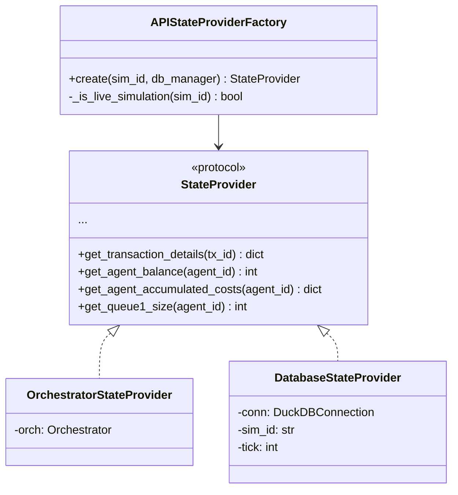
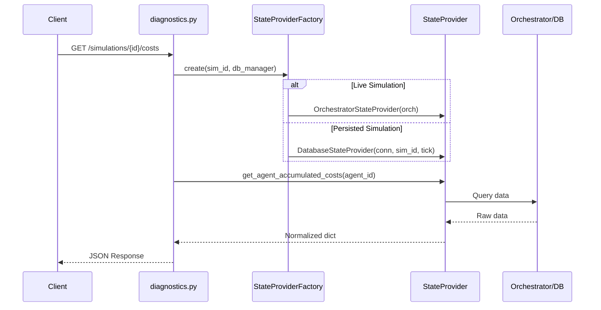

# API Output Consistency Plan

**Version**: 1.0
**Created**: 2025-11-29
**Status**: Draft
**Author**: Claude

---

## Executive Summary

This plan details how to make the FastAPI layer consistent with the StateProvider and OutputStrategy patterns used by the CLI. The goal is to ensure API output is **always identical** to CLI output for the same data, following the **Replay Identity** principle already established for CLI run/replay.

---

## Problem Statement

### Current Architecture Gap

The CLI implements two powerful patterns that ensure consistent output:

1. **StateProvider Pattern**: Abstracts data access so the same display/output code works for both live execution and replay
2. **OutputStrategy Pattern**: Pluggable output strategies that receive lifecycle events

**The API layer implements neither pattern**, resulting in:
- Different code paths for live vs. database-backed simulations
- Inconsistent field names and data structures
- Missing replay support on some endpoints
- No guarantee that API output matches CLI output

### Evidence of Inconsistency

| Endpoint | Issue |
|----------|-------|
| `/costs` | Live uses `deadline_penalty`, DB uses `deadline_penalty_cost` |
| `/metrics` | Returns 404 for persisted simulations |
| `/agents` | Different fields in live vs. replay mode |
| `/ticks/{tick}/state` | Rejects historical tick queries |
| `/agents/{id}/queues` | No database fallback |

---

## Design Principles

### 1. Single Source of Truth

All data access MUST go through StateProvider implementations:

```
API Endpoint
    ↓
StateProvider Protocol
    ├─ OrchestratorStateProvider (live)
    └─ DatabaseStateProvider (replay)
```

### 2. Replay Identity for API

**Rule**: `GET /simulations/{id}/costs` during live execution MUST return identical JSON structure as the same endpoint querying a persisted simulation.

### 3. Output Consistency

For data that CLI also displays (costs, agent states, metrics), the API response MUST use the same underlying data retrieval as CLI would.

### 4. TDD First

Every change MUST be driven by a failing test. The test suite becomes the specification.

---

## Architecture Design

### New Components

```
api/payment_simulator/api/
├── providers/                    # NEW: StateProvider integration
│   ├── __init__.py
│   └── factory.py               # Creates appropriate StateProvider
├── strategies/                   # NEW: API output strategies
│   ├── __init__.py
│   ├── protocol.py              # APIOutputStrategy protocol
│   └── json_strategy.py         # JSON response builder
├── services/
│   ├── simulation_service.py    # MODIFIED: Use StateProvider
│   └── data_service.py          # NEW: Unified data access
└── routers/
    └── diagnostics.py           # MODIFIED: Use DataService
```

### StateProvider Integration



### Data Flow



---

## Implementation Phases

### Phase -1: CLI-API Output Parity (Critical Foundation)

**Goal**: Ensure API responses contain the **exact same data** as CLI verbose output.

This phase is **critical** because even with StateProvider, the API and CLI could still diverge if:
1. Field names differ (e.g., CLI uses `penalty_cost`, API uses `deadline_penalty`)
2. Calculations differ (e.g., different settlement_rate formulas)
3. Data is transformed differently before output

#### The Problem: Current Field Name Divergence

| Data Type | CLI Field Name | API Model Field Name | StateProvider Returns |
|-----------|----------------|---------------------|----------------------|
| Deadline penalty | `penalty_cost` | `deadline_penalty` | `deadline_penalty` |
| Total cost | `total_cost` (calculated) | `total_cost` | `total_cost` |

**This MUST be harmonized before proceeding.**

#### Step -1.1: Create Shared Data Contracts

```python
# api/payment_simulator/shared/data_contracts.py
"""
Canonical data structures shared between CLI and API.

These define the SINGLE SOURCE OF TRUTH for field names and types.
Both CLI display functions and API Pydantic models MUST use these.
"""

from dataclasses import dataclass


@dataclass(frozen=True)
class CostBreakdownContract:
    """Canonical cost breakdown structure.

    IMPORTANT: These field names are the contract. Both CLI and API must use them.
    """
    liquidity_cost: int
    delay_cost: int
    collateral_cost: int
    deadline_penalty: int  # CANONICAL NAME (not penalty_cost)
    split_friction_cost: int

    @property
    def total_cost(self) -> int:
        """Calculate total - same formula everywhere."""
        return (
            self.liquidity_cost +
            self.delay_cost +
            self.collateral_cost +
            self.deadline_penalty +
            self.split_friction_cost
        )


@dataclass(frozen=True)
class AgentStateContract:
    """Canonical agent state structure."""
    balance: int
    unsecured_cap: int
    collateral_posted: int
    queue1_size: int
    queue2_size: int
    costs: CostBreakdownContract

    @property
    def liquidity(self) -> int:
        """Available liquidity = balance + credit."""
        return self.balance + self.unsecured_cap

    @property
    def headroom(self) -> int:
        """Available credit headroom."""
        return self.unsecured_cap - max(0, -self.balance)


@dataclass(frozen=True)
class SystemMetricsContract:
    """Canonical system metrics structure."""
    total_arrivals: int
    total_settlements: int
    total_lsm_releases: int

    @property
    def settlement_rate(self) -> float:
        """Settlement rate - same formula everywhere."""
        if self.total_arrivals == 0:
            return 0.0
        return self.total_settlements / self.total_arrivals
```

#### Step -1.2: Derive API Models from Contracts

```python
# api/payment_simulator/api/models/costs.py (REFACTORED)

from payment_simulator.shared.data_contracts import CostBreakdownContract

class AgentCostBreakdown(BaseModel):
    """Cost breakdown - derived from CostBreakdownContract."""

    liquidity_cost: int = Field(..., description="Overdraft cost in cents")
    delay_cost: int = Field(..., description="Queue 1 delay cost in cents")
    collateral_cost: int = Field(..., description="Collateral opportunity cost")
    deadline_penalty: int = Field(..., description="Deadline miss penalties")  # MATCHES CONTRACT
    split_friction_cost: int = Field(..., description="Transaction splitting cost")
    total_cost: int = Field(..., description="Sum of all costs")

    @classmethod
    def from_contract(cls, contract: CostBreakdownContract) -> "AgentCostBreakdown":
        """Create from canonical contract."""
        return cls(
            liquidity_cost=contract.liquidity_cost,
            delay_cost=contract.delay_cost,
            collateral_cost=contract.collateral_cost,
            deadline_penalty=contract.deadline_penalty,
            split_friction_cost=contract.split_friction_cost,
            total_cost=contract.total_cost,
        )
```

#### Step -1.3: Update CLI to Use Contracts

```python
# api/payment_simulator/cli/output.py (REFACTORED)

def log_cost_breakdown(provider: StateProvider, agent_ids: list[str], quiet: bool = False) -> None:
    """Log cost breakdown using canonical contract."""
    from payment_simulator.shared.data_contracts import CostBreakdownContract

    for agent_id in agent_ids:
        raw_costs = provider.get_agent_accumulated_costs(agent_id)

        # Convert to canonical contract (ensures field name consistency)
        costs = CostBreakdownContract(
            liquidity_cost=raw_costs["liquidity_cost"],
            delay_cost=raw_costs["delay_cost"],
            collateral_cost=raw_costs["collateral_cost"],
            deadline_penalty=raw_costs["deadline_penalty"],  # Use canonical name
            split_friction_cost=raw_costs["split_friction_cost"],
        )

        # Display using contract properties
        console.print(f"  Deadline penalty: ${costs.deadline_penalty / 100:,.2f}")
        console.print(f"  Total: ${costs.total_cost / 100:,.2f}")  # Uses property
```

#### Step -1.4: Write Parity Tests

```python
# api/tests/integration/test_cli_api_parity.py

class TestCLIAPIParity:
    """Tests that API output matches CLI output exactly."""

    def test_cost_field_names_match(self):
        """API cost field names match CLI display field names."""
        from payment_simulator.shared.data_contracts import CostBreakdownContract
        from payment_simulator.api.models.costs import AgentCostBreakdown

        contract_fields = set(CostBreakdownContract.__dataclass_fields__.keys())
        api_model_fields = set(AgentCostBreakdown.model_fields.keys()) - {"total_cost"}

        # All contract fields must appear in API model
        assert contract_fields == api_model_fields, (
            f"Field mismatch: Contract has {contract_fields}, "
            f"API has {api_model_fields}"
        )

    def test_cost_values_identical(self, test_simulation):
        """API costs exactly match CLI costs for same simulation."""
        sim_id = test_simulation

        # Get costs via CLI
        cli_output = run_cli_command(["show", "costs", sim_id, "--json"])
        cli_costs = json.loads(cli_output)

        # Get costs via API
        api_response = client.get(f"/simulations/{sim_id}/costs")
        api_costs = api_response.json()

        # Compare field by field
        for agent_id in cli_costs["agents"]:
            cli_agent = cli_costs["agents"][agent_id]
            api_agent = api_costs["agents"][agent_id]

            assert cli_agent["liquidity_cost"] == api_agent["liquidity_cost"]
            assert cli_agent["delay_cost"] == api_agent["delay_cost"]
            assert cli_agent["deadline_penalty"] == api_agent["deadline_penalty"]
            assert cli_agent["total_cost"] == api_agent["total_cost"]

    def test_metrics_calculation_identical(self, test_simulation):
        """settlement_rate calculated same way in CLI and API."""
        sim_id = test_simulation

        # Get via CLI
        cli_output = run_cli_command(["replay", sim_id, "--format=json"])
        cli_metrics = json.loads(cli_output)["metrics"]

        # Get via API
        api_response = client.get(f"/simulations/{sim_id}/metrics")
        api_metrics = api_response.json()["metrics"]

        # Same calculation
        assert cli_metrics["settlement_rate"] == api_metrics["settlement_rate"]
        assert cli_metrics["total_arrivals"] == api_metrics["total_arrivals"]

    def test_event_structure_matches(self, test_simulation):
        """API events have same structure as CLI events."""
        sim_id = test_simulation

        # Get events via CLI event-stream
        cli_events = run_cli_command(["replay", sim_id, "--event-stream"])

        # Get events via API
        api_response = client.get(f"/simulations/{sim_id}/events")
        api_events = api_response.json()["events"]

        # First event should have same fields
        cli_first = json.loads(cli_events.split("\n")[0])
        api_first = api_events[0]

        assert set(cli_first.keys()) == set(api_first.keys()), (
            f"Event field mismatch: CLI has {set(cli_first.keys())}, "
            f"API has {set(api_first.keys())}"
        )
```

#### Step -1.5: Fix Existing Discrepancies

1. **Rename `penalty_cost` to `deadline_penalty`** in:
   - `replay.py` reconstruction functions
   - `log_cost_breakdown_from_db()` in `output.py`
   - Database schema documentation

2. **Update StateProvider return types** to match contract:
   ```python
   def get_agent_accumulated_costs(self, agent_id: str) -> dict[str, int]:
       """Returns dict with canonical field names:
       - liquidity_cost
       - delay_cost
       - collateral_cost
       - deadline_penalty  # NOT penalty_cost
       - split_friction_cost
       """
   ```

**Files**:
- `api/payment_simulator/shared/__init__.py` (NEW)
- `api/payment_simulator/shared/data_contracts.py` (NEW)
- `api/payment_simulator/api/models/costs.py` (MODIFIED)
- `api/payment_simulator/cli/output.py` (MODIFIED - field name fixes)
- `api/tests/integration/test_cli_api_parity.py` (NEW)

**Acceptance Criteria**:
- [ ] All field names match between CLI and API
- [ ] Shared contracts defined for costs, agent state, metrics
- [ ] API models derive from contracts
- [ ] CLI display functions use contracts
- [ ] Parity tests pass
- [ ] No calculation divergence (e.g., settlement_rate)

---

### Phase 0: Test Infrastructure (TDD Foundation)

**Goal**: Create the test harness that will drive all subsequent development.

#### Tests to Write First

```python
# api/tests/integration/test_api_output_consistency.py

class TestAPIOutputConsistency:
    """Tests ensuring API output matches CLI output."""

    def test_costs_endpoint_matches_cli_format(self):
        """Costs endpoint returns same structure as CLI verbose output."""
        # Run simulation via CLI, capture costs
        # Query same simulation via API
        # Assert identical structure and values

    def test_costs_live_equals_replay(self):
        """Live simulation costs == persisted simulation costs."""
        # Create simulation, tick it
        # Get costs from live endpoint
        # Persist simulation
        # Get costs from persisted endpoint
        # Assert identical (except timing)

    def test_metrics_live_equals_replay(self):
        """Live metrics == persisted metrics."""

    def test_agents_live_equals_replay(self):
        """Live agent state == persisted agent state."""

    def test_events_identical_structure(self):
        """Events from API have same structure as CLI events."""
```

**Files**:
- `api/tests/integration/test_api_output_consistency.py`
- `api/tests/fixtures/consistency_fixtures.py`

**Acceptance Criteria**:
- [ ] Test file created with failing tests for all endpoints
- [ ] Fixtures for creating live and persisted simulations
- [ ] Helper functions for comparing API vs CLI output

---

### Phase 1: StateProvider Factory for API

**Goal**: Create a factory that provides the correct StateProvider based on simulation state.

#### Step 1.1: Write Failing Tests

```python
# api/tests/unit/test_state_provider_factory.py

class TestAPIStateProviderFactory:
    def test_returns_orchestrator_provider_for_live_sim(self):
        """Factory returns OrchestratorStateProvider for active simulation."""
        factory = APIStateProviderFactory(sim_service, db_manager)
        provider = factory.create("sim-live-123")

        assert isinstance(provider, OrchestratorStateProvider)

    def test_returns_database_provider_for_persisted_sim(self):
        """Factory returns DatabaseStateProvider for persisted simulation."""
        factory = APIStateProviderFactory(sim_service, db_manager)
        provider = factory.create("sim-persisted-456")

        assert isinstance(provider, DatabaseStateProvider)

    def test_raises_for_unknown_simulation(self):
        """Factory raises SimulationNotFoundError for unknown sim."""
        factory = APIStateProviderFactory(sim_service, db_manager)

        with pytest.raises(SimulationNotFoundError):
            factory.create("sim-nonexistent")
```

#### Step 1.2: Implement Factory

```python
# api/payment_simulator/api/providers/factory.py

from payment_simulator.cli.execution.state_provider import (
    OrchestratorStateProvider,
    DatabaseStateProvider,
    StateProvider,
)

class APIStateProviderFactory:
    """Factory for creating StateProvider instances in API context."""

    def __init__(
        self,
        simulation_service: SimulationService,
        db_manager: DatabaseManager | None,
    ) -> None:
        self._sim_service = simulation_service
        self._db_manager = db_manager

    def create(
        self,
        simulation_id: str,
        tick: int | None = None,
    ) -> StateProvider:
        """Create appropriate StateProvider for simulation.

        Args:
            simulation_id: Simulation to get provider for
            tick: Optional tick for historical state (DB only)

        Returns:
            OrchestratorStateProvider for live, DatabaseStateProvider for persisted

        Raises:
            SimulationNotFoundError: If simulation doesn't exist
        """
        # Check if simulation is live
        if self._sim_service.has_simulation(simulation_id):
            orch = self._sim_service.get_simulation(simulation_id)
            return OrchestratorStateProvider(orch)

        # Check database
        if self._db_manager:
            summary = get_simulation_summary(
                self._db_manager.get_connection(),
                simulation_id
            )
            if summary:
                return self._create_database_provider(simulation_id, tick)

        raise SimulationNotFoundError(simulation_id)

    def _create_database_provider(
        self,
        simulation_id: str,
        tick: int | None,
    ) -> DatabaseStateProvider:
        """Create DatabaseStateProvider with required caches."""
        conn = self._db_manager.get_connection()

        # Determine tick (use final tick if not specified)
        if tick is None:
            summary = get_simulation_summary(conn, simulation_id)
            tick = summary["ticks_per_day"] * summary["num_days"] - 1

        # Build required caches (same logic as replay.py)
        tx_cache = self._build_tx_cache(conn, simulation_id)
        agent_states = self._get_agent_states(conn, simulation_id, tick)
        queue_snapshots = self._reconstruct_queue_snapshots(
            conn, simulation_id, tick, tx_cache
        )

        return DatabaseStateProvider(
            conn=conn,
            simulation_id=simulation_id,
            tick=tick,
            tx_cache=tx_cache,
            agent_states=agent_states,
            queue_snapshots=queue_snapshots,
        )
```

**Files**:
- `api/payment_simulator/api/providers/__init__.py`
- `api/payment_simulator/api/providers/factory.py`
- `api/tests/unit/test_state_provider_factory.py`

**Acceptance Criteria**:
- [ ] Factory correctly identifies live vs persisted simulations
- [ ] OrchestratorStateProvider returned for live simulations
- [ ] DatabaseStateProvider returned for persisted simulations
- [ ] Proper error handling for unknown simulations
- [ ] All tests pass

---

### Phase 2: DataService Layer

**Goal**: Create a unified data access service that uses StateProvider for all data retrieval.

#### Step 2.1: Write Failing Tests

```python
# api/tests/unit/test_data_service.py

class TestDataService:
    def test_get_costs_uses_state_provider(self):
        """DataService.get_costs() delegates to StateProvider."""
        mock_provider = Mock(spec=StateProvider)
        mock_provider.get_agent_accumulated_costs.return_value = {
            "liquidity_cost": 100,
            "delay_cost": 200,
            "total_cost": 300,
        }

        service = DataService(mock_provider)
        costs = service.get_costs(["BANK_A"])

        mock_provider.get_agent_accumulated_costs.assert_called_once_with("BANK_A")
        assert costs["BANK_A"]["total_cost"] == 300

    def test_get_agent_state_uses_state_provider(self):
        """DataService.get_agent_state() delegates to StateProvider."""

    def test_get_metrics_aggregates_from_provider(self):
        """DataService.get_metrics() builds metrics from StateProvider data."""
```

#### Step 2.2: Implement DataService

```python
# api/payment_simulator/api/services/data_service.py

from payment_simulator.cli.execution.state_provider import StateProvider

class DataService:
    """Unified data access through StateProvider.

    This service ensures all API data retrieval uses the same
    StateProvider abstraction as CLI, guaranteeing consistency.
    """

    def __init__(self, provider: StateProvider) -> None:
        self._provider = provider

    def get_costs(self, agent_ids: list[str]) -> dict[str, AgentCostBreakdown]:
        """Get costs for all agents.

        Returns same structure as CLI cost breakdown display.
        """
        costs = {}
        for agent_id in agent_ids:
            agent_costs = self._provider.get_agent_accumulated_costs(agent_id)
            costs[agent_id] = AgentCostBreakdown(
                liquidity_cost=agent_costs["liquidity_cost"],
                delay_cost=agent_costs["delay_cost"],
                collateral_cost=agent_costs["collateral_cost"],
                deadline_penalty=agent_costs["deadline_penalty"],
                split_friction_cost=agent_costs["split_friction_cost"],
                total_cost=agent_costs["total_cost"],
            )
        return costs

    def get_agent_state(self, agent_id: str) -> AgentStateSnapshot:
        """Get complete state for an agent."""
        balance = self._provider.get_agent_balance(agent_id)
        unsecured_cap = self._provider.get_agent_unsecured_cap(agent_id)
        queue1_size = self._provider.get_queue1_size(agent_id)
        queue2_size = self._provider.get_queue2_size(agent_id)
        costs = self._provider.get_agent_accumulated_costs(agent_id)

        return AgentStateSnapshot(
            balance=balance,
            unsecured_cap=unsecured_cap,
            liquidity=balance + unsecured_cap,
            headroom=unsecured_cap - max(0, -balance),
            queue1_size=queue1_size,
            queue2_size=queue2_size,
            costs=AgentCostBreakdown(**costs),
        )

    def get_events(
        self,
        tick: int | None = None,
        event_types: list[str] | None = None,
    ) -> list[dict]:
        """Get events, matching CLI event format."""
        # Implementation uses same event queries as replay.py
        pass
```

**Files**:
- `api/payment_simulator/api/services/data_service.py`
- `api/tests/unit/test_data_service.py`

**Acceptance Criteria**:
- [ ] DataService delegates all data access to StateProvider
- [ ] Return types match Pydantic models
- [ ] Field names consistent with CLI output
- [ ] All tests pass

---

### Phase 3: Refactor Diagnostics Router

**Goal**: Update diagnostics endpoints to use StateProviderFactory and DataService.

#### Step 3.1: Write Failing Integration Tests

```python
# api/tests/integration/test_diagnostics_consistency.py

class TestDiagnosticsConsistency:
    def test_costs_endpoint_identical_live_vs_replay(self, client, db_manager):
        """GET /costs returns identical data for live and persisted sims."""
        # Create and run simulation
        sim_id = create_test_simulation(client)
        advance_simulation(client, sim_id, ticks=10)

        # Get costs from live simulation
        live_response = client.get(f"/simulations/{sim_id}/costs")
        live_costs = live_response.json()

        # Persist simulation
        persist_simulation(db_manager, sim_id)

        # Get costs from persisted simulation
        replay_response = client.get(f"/simulations/{sim_id}/costs")
        replay_costs = replay_response.json()

        # Assert identical (except timing fields)
        assert_costs_identical(live_costs, replay_costs)

    def test_metrics_endpoint_works_for_persisted_sim(self, client, db_manager):
        """GET /metrics returns data for persisted simulations."""
        sim_id = run_and_persist_simulation(client, db_manager)

        # This currently returns 404 - should return metrics
        response = client.get(f"/simulations/{sim_id}/metrics")

        assert response.status_code == 200
        assert "settlement_rate" in response.json()["metrics"]
```

#### Step 3.2: Refactor Costs Endpoint

```python
# api/payment_simulator/api/routers/diagnostics.py (REFACTORED)

@router.get("/simulations/{sim_id}/costs", response_model=CostResponse)
def get_simulation_costs(
    sim_id: str,
    provider_factory: Annotated[
        APIStateProviderFactory,
        Depends(get_state_provider_factory)
    ],
) -> CostResponse:
    """Get accumulated costs for all agents.

    Works identically for both live and persisted simulations
    by using StateProvider abstraction.
    """
    try:
        # Get appropriate provider (live or DB)
        provider = provider_factory.create(sim_id)

        # Use DataService for consistent data access
        data_service = DataService(provider)

        # Get agent IDs (from provider or metadata)
        agent_ids = provider_factory.get_agent_ids(sim_id)

        # Get costs through unified interface
        agent_costs = data_service.get_costs(agent_ids)

        # Calculate totals
        total_system_cost = sum(c.total_cost for c in agent_costs.values())

        return CostResponse(
            simulation_id=sim_id,
            tick=provider_factory.get_current_tick(sim_id),
            day=provider_factory.get_current_day(sim_id),
            agents=agent_costs,
            total_system_cost=total_system_cost,
        )

    except SimulationNotFoundError:
        raise HTTPException(status_code=404, detail=f"Simulation not found: {sim_id}")
```

**Files Modified**:
- `api/payment_simulator/api/routers/diagnostics.py`
- `api/payment_simulator/api/dependencies.py`

**New Files**:
- `api/tests/integration/test_diagnostics_consistency.py`

**Acceptance Criteria**:
- [ ] `/costs` uses StateProvider for both live and persisted
- [ ] `/costs` returns identical structure for both modes
- [ ] `/metrics` works for persisted simulations
- [ ] All integration tests pass

---

### Phase 4: Add Metrics Support for Persisted Simulations

**Goal**: Extend DataService to calculate metrics from persisted data.

#### Step 4.1: Write Failing Tests

```python
# api/tests/integration/test_metrics_consistency.py

class TestMetricsConsistency:
    def test_metrics_for_persisted_simulation(self, client, db_manager):
        """Metrics endpoint works for persisted simulations."""
        sim_id = run_and_persist_simulation(client, db_manager)

        response = client.get(f"/simulations/{sim_id}/metrics")

        assert response.status_code == 200
        metrics = response.json()["metrics"]

        # Verify all expected fields
        assert "total_arrivals" in metrics
        assert "total_settlements" in metrics
        assert "settlement_rate" in metrics
        assert "total_lsm_releases" in metrics

    def test_metrics_match_cli_output(self, client, db_manager):
        """API metrics match CLI verbose output metrics."""
        config_path = create_test_config()

        # Run via CLI
        cli_result = run_cli_simulation(config_path, persist=True)
        sim_id = cli_result["simulation_id"]

        # Get via API
        api_response = client.get(f"/simulations/{sim_id}/metrics")
        api_metrics = api_response.json()["metrics"]

        # Compare
        assert api_metrics["total_arrivals"] == cli_result["total_arrivals"]
        assert api_metrics["total_settlements"] == cli_result["total_settlements"]
```

#### Step 4.2: Implement Metrics in DataService

```python
# api/payment_simulator/api/services/data_service.py (EXTENDED)

def get_metrics(self, simulation_id: str) -> SystemMetrics:
    """Get system metrics from simulation.

    For live simulations: delegates to Orchestrator
    For persisted: reconstructs from simulation_events table
    """
    if isinstance(self._provider, OrchestratorStateProvider):
        # Live: use FFI
        metrics_dict = self._provider.orch.get_system_metrics()
        return SystemMetrics(**metrics_dict)
    else:
        # Persisted: query from simulation summary
        summary = get_simulation_summary(
            self._provider.conn,
            simulation_id
        )

        return SystemMetrics(
            total_arrivals=summary["total_arrivals"],
            total_settlements=summary["total_settlements"],
            total_lsm_releases=summary.get("total_lsm_releases", 0),
            settlement_rate=(
                summary["total_settlements"] / summary["total_arrivals"]
                if summary["total_arrivals"] > 0 else 0
            ),
            # ... other fields from summary
        )
```

**Files**:
- `api/payment_simulator/api/services/data_service.py`
- `api/tests/integration/test_metrics_consistency.py`

**Acceptance Criteria**:
- [ ] `/metrics` returns 200 for persisted simulations
- [ ] Metrics values match CLI output
- [ ] All tests pass

---

### Phase 5: Historical State Support

**Goal**: Enable querying historical tick state for persisted simulations.

#### Step 5.1: Write Failing Tests

```python
# api/tests/integration/test_historical_state.py

class TestHistoricalState:
    def test_tick_state_for_historical_tick(self, client, db_manager):
        """Can query state at any historical tick."""
        sim_id = run_and_persist_simulation(client, db_manager, ticks=100)

        # Query tick 50 state
        response = client.get(f"/simulations/{sim_id}/ticks/50/state")

        assert response.status_code == 200
        state = response.json()
        assert state["tick"] == 50

    def test_historical_state_matches_live_snapshot(self, client, db_manager):
        """Historical state at tick T matches live state at tick T."""
        sim_id = create_simulation(client)

        # Advance to tick 50 and capture state
        advance_simulation(client, sim_id, ticks=50)
        live_state_50 = client.get(f"/simulations/{sim_id}/state").json()

        # Continue and persist
        advance_simulation(client, sim_id, ticks=50)
        persist_simulation(db_manager, sim_id)

        # Query historical tick 50
        historical_state = client.get(
            f"/simulations/{sim_id}/ticks/50/state"
        ).json()

        # Compare (excluding timing)
        assert_states_match(live_state_50, historical_state)
```

#### Step 5.2: Implement Historical State

```python
# api/payment_simulator/api/routers/diagnostics.py (EXTENDED)

@router.get("/simulations/{sim_id}/ticks/{tick}/state")
def get_tick_state(
    sim_id: str,
    tick: int,
    provider_factory: Annotated[
        APIStateProviderFactory,
        Depends(get_state_provider_factory)
    ],
) -> TickStateResponse:
    """Get state snapshot at specific tick.

    For live simulations: only current tick supported
    For persisted: any tick within simulation range
    """
    try:
        # Create provider for specific tick
        provider = provider_factory.create(sim_id, tick=tick)

        # Use DataService
        data_service = DataService(provider)
        agent_ids = provider_factory.get_agent_ids(sim_id)

        # Build state snapshot
        agents = {
            agent_id: data_service.get_agent_state(agent_id)
            for agent_id in agent_ids
        }

        # System metrics at this tick
        # (requires tick-level event aggregation for persisted)
        system = data_service.get_system_state_at_tick(tick)

        return TickStateResponse(
            simulation_id=sim_id,
            tick=tick,
            day=tick // provider_factory.get_ticks_per_day(sim_id),
            agents=agents,
            system=system,
        )

    except SimulationNotFoundError:
        raise HTTPException(status_code=404, detail=f"Simulation not found: {sim_id}")
    except TickOutOfRangeError as e:
        raise HTTPException(status_code=400, detail=str(e))
```

**Files**:
- `api/payment_simulator/api/routers/diagnostics.py`
- `api/tests/integration/test_historical_state.py`

**Acceptance Criteria**:
- [ ] `/ticks/{tick}/state` works for any historical tick
- [ ] Historical state matches what live state was at that tick
- [ ] Proper error for out-of-range ticks
- [ ] All tests pass

---

### Phase 6: API OutputStrategy (Optional Enhancement)

**Goal**: Create API-specific OutputStrategy for webhook/streaming scenarios.

This phase is optional but provides alignment with CLI's OutputStrategy pattern for future features like:
- WebSocket streaming of tick events
- Webhook notifications on simulation events
- Server-Sent Events for real-time updates

#### Design

```python
# api/payment_simulator/api/strategies/protocol.py

from typing import Protocol

class APIOutputStrategy(Protocol):
    """Protocol for API output handling.

    Parallel to CLI's OutputStrategy but for HTTP/WebSocket contexts.
    """

    async def on_tick_complete(
        self,
        tick: int,
        events: list[dict],
        state: dict,
    ) -> None:
        """Called after each tick completes."""
        ...

    async def on_simulation_complete(
        self,
        final_stats: dict,
    ) -> None:
        """Called when simulation finishes."""
        ...


class WebSocketOutputStrategy:
    """Streams tick events to WebSocket clients."""

    def __init__(self, websocket: WebSocket) -> None:
        self._ws = websocket

    async def on_tick_complete(
        self,
        tick: int,
        events: list[dict],
        state: dict,
    ) -> None:
        await self._ws.send_json({
            "type": "tick_complete",
            "tick": tick,
            "events": events,
            "state": state,
        })
```

---

## Test Categories

### Unit Tests

| Test File | Coverage |
|-----------|----------|
| `test_state_provider_factory.py` | Factory creates correct provider type |
| `test_data_service.py` | DataService delegates to StateProvider |
| `test_api_models.py` | Pydantic models match expected structure |

### Integration Tests

| Test File | Coverage |
|-----------|----------|
| `test_api_output_consistency.py` | API output matches CLI output |
| `test_diagnostics_consistency.py` | Endpoints work for live and persisted |
| `test_metrics_consistency.py` | Metrics match CLI values |
| `test_historical_state.py` | Historical state queries work |

### End-to-End Tests

| Test File | Coverage |
|-----------|----------|
| `test_full_workflow.py` | Create → Run → Persist → Query via API |
| `test_cli_api_parity.py` | CLI run output == API query output |

---

## Migration Strategy

### Backward Compatibility

The refactoring maintains backward compatibility:
- All existing endpoints keep same paths and response models
- Only internal implementation changes
- Tests verify existing behavior preserved

### Rollout Steps

1. **Phase -1**: Create shared data contracts and fix field name discrepancies
   - This is the FOUNDATION - must be done first
   - Fixes `penalty_cost` → `deadline_penalty` inconsistency
   - Establishes CLI-API parity tests
2. **Phase 0-1**: Add test infrastructure and factory (no behavior change)
3. **Phase 2**: Add DataService using contracts (no behavior change)
4. **Phase 3**: Refactor endpoints one at a time
   - `/costs` first (highest risk)
   - `/metrics` second
   - `/agents` third
5. **Phase 4-5**: Add new capabilities (metrics for persisted, historical state)

---

## File Changes Summary

### New Files

```
api/payment_simulator/shared/                  # Phase -1: Canonical contracts
├── __init__.py
└── data_contracts.py                         # CostBreakdownContract, etc.

api/payment_simulator/api/providers/
├── __init__.py
└── factory.py

api/payment_simulator/api/services/
└── data_service.py

api/payment_simulator/api/strategies/          # Phase 6 only
├── __init__.py
├── protocol.py
└── websocket_strategy.py

api/tests/integration/
├── test_cli_api_parity.py                    # Phase -1: Parity tests
├── test_api_output_consistency.py
├── test_diagnostics_consistency.py
├── test_metrics_consistency.py
└── test_historical_state.py

api/tests/unit/
├── test_state_provider_factory.py
└── test_data_service.py
```

### Modified Files

```
api/payment_simulator/api/dependencies.py      # Add factory dependency
api/payment_simulator/api/routers/diagnostics.py  # Use factory + DataService
api/payment_simulator/api/services/simulation_service.py  # Optional cleanup
```

---

## Success Criteria

### Must Have

- [ ] **Shared data contracts** define canonical field names for costs, agent state, metrics
- [ ] **CLI-API parity tests pass** - same field names, same values, same calculations
- [ ] All endpoints work identically for live and persisted simulations
- [ ] API costs match CLI costs exactly (same field names, same values)
- [ ] API metrics match CLI metrics exactly (settlement_rate uses same formula)
- [ ] API events have same structure as CLI `--event-stream` output
- [ ] `/metrics` returns 200 for persisted simulations
- [ ] All existing tests continue to pass
- [ ] All new tests pass

### Should Have

- [ ] Historical tick state queries work
- [ ] `/agents/{id}/queues` works for persisted simulations
- [ ] Documentation updated with consistency guarantees

### Nice to Have

- [ ] WebSocket streaming strategy
- [ ] API metrics endpoint parallelism with CLI stream mode

---

## Risks and Mitigations

| Risk | Impact | Mitigation |
|------|--------|------------|
| Breaking existing API consumers | High | Maintain same response models; only change internals |
| Performance regression | Medium | Benchmark before/after; cache StateProvider instances |
| Test coverage gaps | Medium | TDD approach ensures tests written first |
| DatabaseStateProvider complexity | Medium | Reuse existing implementation from replay.py |

---

## Timeline Estimate

| Phase | Effort | Dependencies |
|-------|--------|--------------|
| **Phase -1: CLI-API Parity** | **Medium** | **None (CRITICAL FOUNDATION)** |
| Phase 0: Test Infrastructure | Small | Phase -1 |
| Phase 1: StateProvider Factory | Small | Phase 0 |
| Phase 2: DataService | Medium | Phase 1 |
| Phase 3: Refactor Endpoints | Medium | Phase 2 |
| Phase 4: Metrics Support | Small | Phase 3 |
| Phase 5: Historical State | Medium | Phase 3 |
| Phase 6: OutputStrategy | Optional | Phase 3 |

---

## Related Documentation

- [Output Modes Reference](../reference/cli/output-modes.md)
- [CLI Architecture](../reference/architecture/10-cli-architecture.md)
- [Python API Layer](../reference/architecture/03-python-api-layer.md)
- [StateProvider Protocol](../../api/payment_simulator/cli/execution/state_provider.py)
- [Replay Command](../reference/cli/commands/replay.md)

---

*Document Status: Draft - Pending Review*
