# Bootstrap Sandbox: TDD Development Plan

**Status**: Draft
**Author**: Claude
**Date**: 2025-12-10
**Version**: 1.1

**Related**: [Conceptual Plan](refactor-conceptual-plan.md) - Theoretical foundation and architecture

---

## Executive Summary

This document provides a detailed Test-Driven Development (TDD) plan for implementing the 3-agent bootstrap sandbox for Monte Carlo policy evaluation. The implementation uses **Option B** (existing `scenario_events` + `CustomTransactionArrivalEvent`) requiring **zero Rust changes**.

**Key Deliverables**:
1. Bootstrap sample data structures with offset-based remapping
2. Transaction history collector from simulation events
3. Bootstrap sampler with deterministic resampling
4. Sandbox configuration builder (3-agent setup)
5. Policy evaluator with paired comparison for delta calculation
6. Castro experiment integration

---

## Guiding Principles

### TDD Red-Green-Refactor Cycle

```mermaid
flowchart LR
    Red["🔴 RED<br/>Write failing test"] --> Green["🟢 GREEN<br/>Minimal code to pass"]
    Green --> Refactor["🔵 REFACTOR<br/>Clean up, no new behavior"]
    Refactor --> Red

    style Red fill:#ffcdd2
    style Green fill:#c8e6c9
    style Refactor fill:#bbdefb
```



**Rules**:
1. **Never write production code without a failing test**
2. **Write the minimum code to make the test pass**
3. **Refactor only when tests are green**
4. **Each test should test ONE thing**

### Test Pyramid

```
        /\
       /  \      E2E Tests (few)
      /────\     - Full Castro iteration with bootstrap
     /      \
    /────────\   Integration Tests (moderate)
   /          \  - Sandbox runs with scenario_events
  /────────────\ - History collector with real events
 /              \
/────────────────\ Unit Tests (many)
                   - Data structures
                   - Remapping logic
                   - Sampler algorithms
```

---

## Architecture Overview

### Component Diagram


### File Structure

```
api/payment_simulator/
├── ai_cash_mgmt/
│   ├── bootstrap/                    # NEW: Bootstrap evaluation module
│   │   ├── __init__.py
│   │   ├── models.py                 # Phase 1: Data structures
│   │   ├── history_collector.py      # Phase 2: Event parsing
│   │   ├── sampler.py                # Phase 3: Bootstrap resampling
│   │   ├── sandbox_config.py         # Phase 4: 3-agent config builder
│   │   ├── evaluator.py              # Phase 5: Policy evaluation
│   │   └── delta_calculator.py       # Phase 5: Paired comparison
│   └── optimization/
│       └── castro_bootstrap.py       # Phase 6: Castro integration

api/tests/
├── ai_cash_mgmt/
│   ├── unit/
│   │   └── bootstrap/                # Unit tests
│   │       ├── test_models.py
│   │       ├── test_history_collector.py
│   │       ├── test_sampler.py
│   │       ├── test_sandbox_config.py
│   │       └── test_evaluator.py
│   └── integration/
│       └── bootstrap/                # Integration tests
│           ├── test_sandbox_runs.py
│           ├── test_paired_evaluation.py
│           └── test_castro_integration.py
```

---

## Phase 1: Data Structures

### Goal
Define immutable data structures for transaction records with offset-based timing.

### Test Specifications

#### Test 1.1: TransactionRecord Creation
```python
# tests/ai_cash_mgmt/unit/bootstrap/test_models.py

def test_transaction_record_creation():
    """TransactionRecord stores transaction with relative timing offsets."""
    record = TransactionRecord(
        tx_id="tx-001",
        sender_id="BANK_A",
        receiver_id="BANK_B",
        amount=500000,  # $5,000.00
        priority=5,
        original_arrival_tick=10,
        deadline_offset=5,      # deadline = arrival + 5
        settlement_offset=3,    # settled = arrival + 3
    )

    assert record.tx_id == "tx-001"
    assert record.amount == 500000
    assert record.deadline_offset == 5
    assert record.settlement_offset == 3
    assert record.was_settled is True  # settlement_offset is not None


def test_transaction_record_unsettled():
    """TransactionRecord handles unsettled transactions."""
    record = TransactionRecord(
        tx_id="tx-002",
        sender_id="BANK_A",
        receiver_id="BANK_B",
        amount=100000,
        priority=3,
        original_arrival_tick=5,
        deadline_offset=10,
        settlement_offset=None,  # Never settled!
    )

    assert record.was_settled is False
```

#### Test 1.2: Transaction Remapping
```python
def test_remap_to_new_arrival_tick():
    """Remapping preserves offsets while changing arrival tick."""
    record = TransactionRecord(
        tx_id="tx-001",
        sender_id="BANK_A",
        receiver_id="BANK_B",
        amount=500000,
        priority=5,
        original_arrival_tick=10,
        deadline_offset=5,
        settlement_offset=3,
    )

    # Remap to new arrival at tick 2
    remapped = record.remap_to_tick(new_arrival=2, eod_tick=12)

    assert remapped.arrival_tick == 2
    assert remapped.deadline_tick == 7   # 2 + 5
    assert remapped.settlement_tick == 5  # 2 + 3
    assert remapped.amount == 500000  # Unchanged


def test_remap_caps_at_eod():
    """Remapping caps deadline and settlement at end-of-day."""
    record = TransactionRecord(
        tx_id="tx-001",
        sender_id="BANK_A",
        receiver_id="BANK_B",
        amount=500000,
        priority=5,
        original_arrival_tick=5,
        deadline_offset=10,
        settlement_offset=8,
    )

    # Remap to tick 8, but EoD is tick 12
    remapped = record.remap_to_tick(new_arrival=8, eod_tick=12)

    assert remapped.arrival_tick == 8
    assert remapped.deadline_tick == 12  # Capped: min(8+10, 12)
    assert remapped.settlement_tick == 12  # Capped: min(8+8, 12)


def test_remap_unsettled_transaction():
    """Remapping unsettled transaction has no settlement_tick."""
    record = TransactionRecord(
        tx_id="tx-001",
        sender_id="BANK_A",
        receiver_id="BANK_B",
        amount=500000,
        priority=5,
        original_arrival_tick=5,
        deadline_offset=10,
        settlement_offset=None,
    )

    remapped = record.remap_to_tick(new_arrival=2, eod_tick=12)

    assert remapped.settlement_tick is None
```

#### Test 1.3: BootstrapSample Structure
```python
def test_bootstrap_sample_creation():
    """BootstrapSample holds remapped transactions and beats."""
    outgoing = [
        RemappedTransaction(tx_id="tx-1", sender_id="A", receiver_id="B",
                           amount=1000, priority=5, arrival_tick=0,
                           deadline_tick=5, settlement_tick=None),
    ]
    incoming = [
        RemappedTransaction(tx_id="tx-2", sender_id="B", receiver_id="A",
                           amount=2000, priority=5, arrival_tick=0,
                           deadline_tick=5, settlement_tick=3),
    ]

    sample = BootstrapSample(
        agent_id="BANK_A",
        sample_idx=0,
        seed=12345,
        outgoing_txns=outgoing,
        incoming_settlements=incoming,
        total_ticks=12,
    )

    assert sample.agent_id == "BANK_A"
    assert len(sample.outgoing_txns) == 1
    assert len(sample.incoming_settlements) == 1


def test_bootstrap_sample_liquidity_at_tick():
    """BootstrapSample computes incoming liquidity at specific tick."""
    incoming = [
        RemappedTransaction(tx_id="tx-1", sender_id="B", receiver_id="A",
                           amount=5000, priority=5, arrival_tick=0,
                           deadline_tick=5, settlement_tick=3),
        RemappedTransaction(tx_id="tx-2", sender_id="C", receiver_id="A",
                           amount=3000, priority=5, arrival_tick=0,
                           deadline_tick=5, settlement_tick=3),  # Same tick!
        RemappedTransaction(tx_id="tx-3", sender_id="B", receiver_id="A",
                           amount=2000, priority=5, arrival_tick=0,
                           deadline_tick=5, settlement_tick=7),
    ]

    sample = BootstrapSample(
        agent_id="BANK_A",
        sample_idx=0,
        seed=12345,
        outgoing_txns=[],
        incoming_settlements=incoming,
        total_ticks=12,
    )

    assert sample.get_incoming_liquidity_at_tick(3) == 8000  # 5000 + 3000
    assert sample.get_incoming_liquidity_at_tick(7) == 2000
    assert sample.get_incoming_liquidity_at_tick(5) == 0  # No beats at tick 5
```

### Implementation

```python
# api/payment_simulator/ai_cash_mgmt/bootstrap/models.py

from __future__ import annotations
from dataclasses import dataclass


@dataclass(frozen=True)
class TransactionRecord:
    """Historical transaction with relative timing offsets.

    Stores offsets (not absolute ticks) so the transaction can be
    remapped to different arrival times while preserving relative timing.
    """
    tx_id: str
    sender_id: str
    receiver_id: str
    amount: int  # cents (i64 equivalent)
    priority: int
    original_arrival_tick: int
    deadline_offset: int  # ticks from arrival to deadline
    settlement_offset: int | None  # ticks from arrival to settlement (None if unsettled)

    @property
    def was_settled(self) -> bool:
        """Whether this transaction was settled in the original simulation."""
        return self.settlement_offset is not None

    def remap_to_tick(self, new_arrival: int, eod_tick: int) -> RemappedTransaction:
        """Remap this transaction to a new arrival tick.

        Args:
            new_arrival: The new arrival tick
            eod_tick: End-of-day tick (caps deadline and settlement)

        Returns:
            RemappedTransaction with absolute ticks
        """
        return RemappedTransaction(
            tx_id=self.tx_id,
            sender_id=self.sender_id,
            receiver_id=self.receiver_id,
            amount=self.amount,
            priority=self.priority,
            arrival_tick=new_arrival,
            deadline_tick=min(new_arrival + self.deadline_offset, eod_tick),
            settlement_tick=(
                min(new_arrival + self.settlement_offset, eod_tick)
                if self.settlement_offset is not None
                else None
            ),
        )


@dataclass(frozen=True)
class RemappedTransaction:
    """Transaction with absolute ticks after bootstrap remapping."""
    tx_id: str
    sender_id: str
    receiver_id: str
    amount: int
    priority: int
    arrival_tick: int
    deadline_tick: int
    settlement_tick: int | None  # For incoming: when liquidity arrives


@dataclass(frozen=True)
class BootstrapSample:
    """One bootstrap sample with remapped transactions."""
    agent_id: str
    sample_idx: int
    seed: int
    outgoing_txns: tuple[RemappedTransaction, ...]
    incoming_settlements: tuple[RemappedTransaction, ...]
    total_ticks: int

    def get_incoming_liquidity_at_tick(self, tick: int) -> int:
        """Get total incoming liquidity settling at this tick."""
        return sum(
            tx.amount
            for tx in self.incoming_settlements
            if tx.settlement_tick == tick
        )

    def get_outgoing_arrivals_at_tick(self, tick: int) -> tuple[RemappedTransaction, ...]:
        """Get outgoing transactions arriving at this tick."""
        return tuple(tx for tx in self.outgoing_txns if tx.arrival_tick == tick)
```

---

## Phase 2: Transaction History Collector

### Goal
Parse simulation events to build `AgentTransactionHistory` with proper offset calculation.

### Test Specifications

#### Test 2.1: Parse Arrival Events
```python
# tests/ai_cash_mgmt/unit/bootstrap/test_history_collector.py

def test_collect_arrival_creates_pending_record():
    """Arrival event creates pending TransactionRecord."""
    events = [
        {
            "event_type": "arrival",
            "tick": 5,
            "tx_id": "tx-001",
            "sender_id": "BANK_A",
            "receiver_id": "BANK_B",
            "amount": 100000,
            "priority": 7,
            "deadline_tick": 15,
        }
    ]

    collector = TransactionHistoryCollector()
    collector.process_events(events)

    history = collector.get_agent_history("BANK_A")
    assert len(history.outgoing) == 1

    record = history.outgoing[0]
    assert record.tx_id == "tx-001"
    assert record.original_arrival_tick == 5
    assert record.deadline_offset == 10  # 15 - 5
    assert record.settlement_offset is None  # Not yet settled
```

#### Test 2.2: Match Settlement to Arrival
```python
def test_settlement_updates_offset():
    """Settlement event updates settlement_offset on matching arrival."""
    events = [
        {
            "event_type": "arrival",
            "tick": 5,
            "tx_id": "tx-001",
            "sender_id": "BANK_A",
            "receiver_id": "BANK_B",
            "amount": 100000,
            "priority": 7,
            "deadline_tick": 15,
        },
        {
            "event_type": "rtgs_immediate_settlement",
            "tick": 8,
            "tx_id": "tx-001",
            "sender_id": "BANK_A",
            "receiver_id": "BANK_B",
            "amount": 100000,
        },
    ]

    collector = TransactionHistoryCollector()
    collector.process_events(events)

    history = collector.get_agent_history("BANK_A")
    record = history.outgoing[0]

    assert record.settlement_offset == 3  # 8 - 5
    assert record.was_settled is True
```

#### Test 2.3: Incoming vs Outgoing Classification
```python
def test_incoming_outgoing_classification():
    """Transactions are classified by direction relative to agent."""
    events = [
        # BANK_A sends to BANK_B
        {"event_type": "arrival", "tick": 0, "tx_id": "tx-001",
         "sender_id": "BANK_A", "receiver_id": "BANK_B",
         "amount": 1000, "priority": 5, "deadline_tick": 10},
        # BANK_B sends to BANK_A
        {"event_type": "arrival", "tick": 2, "tx_id": "tx-002",
         "sender_id": "BANK_B", "receiver_id": "BANK_A",
         "amount": 2000, "priority": 5, "deadline_tick": 12},
        # Settlements
        {"event_type": "rtgs_immediate_settlement", "tick": 1, "tx_id": "tx-001",
         "sender_id": "BANK_A", "receiver_id": "BANK_B", "amount": 1000},
        {"event_type": "rtgs_immediate_settlement", "tick": 5, "tx_id": "tx-002",
         "sender_id": "BANK_B", "receiver_id": "BANK_A", "amount": 2000},
    ]

    collector = TransactionHistoryCollector()
    collector.process_events(events)

    # From BANK_A's perspective
    history_a = collector.get_agent_history("BANK_A")
    assert len(history_a.outgoing) == 1  # tx-001 (A sends)
    assert len(history_a.incoming) == 1  # tx-002 (A receives)
    assert history_a.outgoing[0].tx_id == "tx-001"
    assert history_a.incoming[0].tx_id == "tx-002"

    # From BANK_B's perspective
    history_b = collector.get_agent_history("BANK_B")
    assert len(history_b.outgoing) == 1  # tx-002 (B sends)
    assert len(history_b.incoming) == 1  # tx-001 (B receives)
```

#### Test 2.4: Handle LSM Settlements
```python
def test_lsm_bilateral_updates_settlement():
    """LSM bilateral offset events update settlement_offset."""
    events = [
        {"event_type": "arrival", "tick": 0, "tx_id": "tx-001",
         "sender_id": "BANK_A", "receiver_id": "BANK_B",
         "amount": 5000, "priority": 5, "deadline_tick": 10},
        {"event_type": "arrival", "tick": 1, "tx_id": "tx-002",
         "sender_id": "BANK_B", "receiver_id": "BANK_A",
         "amount": 3000, "priority": 5, "deadline_tick": 10},
        # LSM finds bilateral offset
        {"event_type": "lsm_bilateral_offset", "tick": 5,
         "agent_a": "BANK_A", "agent_b": "BANK_B",
         "tx_ids": ["tx-001", "tx-002"],
         "amount_a": 5000, "amount_b": 3000},
    ]

    collector = TransactionHistoryCollector()
    collector.process_events(events)

    history_a = collector.get_agent_history("BANK_A")
    assert history_a.outgoing[0].settlement_offset == 5  # 5 - 0
    assert history_a.incoming[0].settlement_offset == 4  # 5 - 1
```

#### Test 2.5: Handle Queue2 Release
```python
def test_queue2_release_updates_settlement():
    """Queue2 liquidity release updates settlement_offset."""
    events = [
        {"event_type": "arrival", "tick": 0, "tx_id": "tx-001",
         "sender_id": "BANK_A", "receiver_id": "BANK_B",
         "amount": 100000, "priority": 5, "deadline_tick": 10},
        # Transaction waits in queue, then releases
        {"event_type": "queue2_liquidity_release", "tick": 7,
         "tx_id": "tx-001", "sender_id": "BANK_A", "receiver_id": "BANK_B",
         "amount": 100000, "queue_wait_ticks": 7},
    ]

    collector = TransactionHistoryCollector()
    collector.process_events(events)

    history = collector.get_agent_history("BANK_A")
    assert history.outgoing[0].settlement_offset == 7  # Released at tick 7
```

### Implementation Sketch

```python
# api/payment_simulator/ai_cash_mgmt/bootstrap/history_collector.py

from __future__ import annotations
from dataclasses import dataclass, field
from .models import TransactionRecord


@dataclass
class AgentTransactionHistory:
    """Per-agent view of historical transactions."""
    agent_id: str
    outgoing: list[TransactionRecord] = field(default_factory=list)
    incoming: list[TransactionRecord] = field(default_factory=list)


class TransactionHistoryCollector:
    """Collects transaction history from simulation events."""

    def __init__(self) -> None:
        self._pending: dict[str, _PendingRecord] = {}  # tx_id -> pending
        self._agent_histories: dict[str, AgentTransactionHistory] = {}

    def process_events(self, events: list[dict]) -> None:
        """Process events in order."""
        for event in events:
            event_type = event.get("event_type")
            if event_type == "arrival":
                self._handle_arrival(event)
            elif event_type in ("rtgs_immediate_settlement", "queue2_liquidity_release"):
                self._handle_settlement(event)
            elif event_type == "lsm_bilateral_offset":
                self._handle_lsm_bilateral(event)
            elif event_type == "lsm_cycle_settlement":
                self._handle_lsm_cycle(event)

    def get_agent_history(self, agent_id: str) -> AgentTransactionHistory:
        """Get finalized history for an agent."""
        # Finalize any pending records and return
        ...
```

---

## Phase 3: Bootstrap Sampler

### Goal
Implement bootstrap resampling with deterministic seed management.

### Test Specifications

#### Test 3.1: Resample With Replacement
```python
# tests/ai_cash_mgmt/unit/bootstrap/test_sampler.py

def test_resample_with_replacement():
    """Bootstrap samples with replacement (same tx can appear multiple times)."""
    history = AgentTransactionHistory(
        agent_id="BANK_A",
        outgoing=[
            TransactionRecord(tx_id="tx-1", sender_id="A", receiver_id="B",
                            amount=1000, priority=5, original_arrival_tick=0,
                            deadline_offset=10, settlement_offset=2),
            TransactionRecord(tx_id="tx-2", sender_id="A", receiver_id="B",
                            amount=2000, priority=5, original_arrival_tick=3,
                            deadline_offset=10, settlement_offset=4),
        ],
        incoming=[],
    )

    sampler = BootstrapSampler(seed=42, ticks_per_day=12)
    sample = sampler.create_sample(history, sample_idx=0)

    # With replacement: might get duplicates, might miss some
    assert len(sample.outgoing_txns) == 2  # Same count as original
    # Can't assert exact content (random), but structure is correct
    for tx in sample.outgoing_txns:
        assert tx.tx_id in ("tx-1", "tx-2")
```

#### Test 3.2: Deterministic Resampling
```python
def test_deterministic_with_same_seed():
    """Same seed produces identical samples."""
    history = AgentTransactionHistory(
        agent_id="BANK_A",
        outgoing=[make_record(f"tx-{i}") for i in range(10)],
        incoming=[make_record(f"rx-{i}") for i in range(10)],
    )

    sampler1 = BootstrapSampler(seed=12345, ticks_per_day=12)
    sampler2 = BootstrapSampler(seed=12345, ticks_per_day=12)

    sample1 = sampler1.create_sample(history, sample_idx=0)
    sample2 = sampler2.create_sample(history, sample_idx=0)

    assert sample1 == sample2  # Identical!


def test_different_seeds_different_samples():
    """Different seeds produce different samples."""
    history = AgentTransactionHistory(
        agent_id="BANK_A",
        outgoing=[make_record(f"tx-{i}") for i in range(10)],
        incoming=[make_record(f"rx-{i}") for i in range(10)],
    )

    sampler1 = BootstrapSampler(seed=11111, ticks_per_day=12)
    sampler2 = BootstrapSampler(seed=99999, ticks_per_day=12)

    sample1 = sampler1.create_sample(history, sample_idx=0)
    sample2 = sampler2.create_sample(history, sample_idx=0)

    assert sample1 != sample2  # Different
```

#### Test 3.3: Arrival Tick Remapping
```python
def test_arrival_ticks_uniformly_distributed():
    """Remapped arrival ticks are uniformly distributed across day."""
    history = AgentTransactionHistory(
        agent_id="BANK_A",
        outgoing=[make_record(f"tx-{i}") for i in range(100)],
        incoming=[],
    )

    sampler = BootstrapSampler(seed=42, ticks_per_day=12)
    sample = sampler.create_sample(history, sample_idx=0)

    # Check arrival ticks are in valid range
    for tx in sample.outgoing_txns:
        assert 0 <= tx.arrival_tick < 12

    # Check roughly uniform (not all bunched up)
    arrival_counts = [0] * 12
    for tx in sample.outgoing_txns:
        arrival_counts[tx.arrival_tick] += 1

    # No single tick should have all transactions
    assert max(arrival_counts) < len(sample.outgoing_txns)
```

#### Test 3.4: Multiple Samples Generation
```python
def test_create_multiple_samples():
    """Create multiple bootstrap samples for Monte Carlo."""
    history = AgentTransactionHistory(
        agent_id="BANK_A",
        outgoing=[make_record(f"tx-{i}") for i in range(10)],
        incoming=[make_record(f"rx-{i}") for i in range(10)],
    )

    sampler = BootstrapSampler(seed=42, ticks_per_day=12)
    samples = sampler.create_samples(history, num_samples=20)

    assert len(samples) == 20

    # Each sample should have different idx
    idxs = [s.sample_idx for s in samples]
    assert idxs == list(range(20))

    # Samples should differ (not all identical)
    assert len(set(s.outgoing_txns for s in samples)) > 1
```

#### Test 3.5: Incoming Beats Use Settlement Tick
```python
def test_incoming_uses_settlement_as_beat_tick():
    """Incoming transactions become 'beats' at their settlement tick."""
    history = AgentTransactionHistory(
        agent_id="BANK_A",
        outgoing=[],
        incoming=[
            TransactionRecord(tx_id="rx-1", sender_id="B", receiver_id="A",
                            amount=5000, priority=5, original_arrival_tick=2,
                            deadline_offset=10, settlement_offset=3),
        ],
    )

    sampler = BootstrapSampler(seed=42, ticks_per_day=12)
    sample = sampler.create_sample(history, sample_idx=0)

    # For incoming: the "beat" happens at settlement_tick
    beat = sample.incoming_settlements[0]
    assert beat.settlement_tick is not None
    # settlement_tick = remapped_arrival + settlement_offset
```

---

## Phase 3B: Statistical Validation Tests

### Goal
Verify that bootstrap samples preserve the statistical properties of the original transaction history. These tests ensure the bootstrap methodology is sound before using samples for policy evaluation.

### File Location
```
api/tests/ai_cash_mgmt/unit/bootstrap/test_statistical_validation.py
```

### Statistical Properties to Validate

| Property | Test Method | Null Hypothesis |
|----------|-------------|-----------------|
| **Amount distribution** | Kolmogorov-Smirnov test | Bootstrap amounts come from same distribution as original |
| **Priority distribution** | Chi-squared test | Priority frequencies match original |
| **Mean preservation** | Bootstrap CI coverage | True mean lies within 95% CI ~95% of time |
| **Variance preservation** | F-test / Levene's test | Variances are equal |
| **Temporal patterns** | Per-tick rate comparison | Arrival rate per tick matches original pattern |
| **Settlement timing** | KS test on offsets | Settlement offset distribution preserved |

### Scenario 1: Simple (Uniform Distribution)

**Characteristics**:
- 50 transactions with uniform amounts ($100-$1000)
- Single priority level (5)
- Uniform arrival times across day
- Consistent settlement offset (2-4 ticks)

**Purpose**: Validate basic bootstrap mechanics work correctly with the simplest possible distribution.

```python
# tests/ai_cash_mgmt/unit/bootstrap/test_statistical_validation.py

import numpy as np
from scipy import stats
import pytest

class TestScenario1Simple:
    """Statistical validation for simple uniform distribution scenario."""

    @pytest.fixture
    def simple_history(self) -> AgentTransactionHistory:
        """Create simple scenario: uniform amounts, single priority."""
        np.random.seed(42)  # Reproducible test data

        transactions = []
        for i in range(50):
            transactions.append(TransactionRecord(
                tx_id=f"tx-{i}",
                sender_id="BANK_A",
                receiver_id="BANK_B",
                amount=np.random.randint(10000, 100001),  # $100-$1000 uniform
                priority=5,  # Fixed priority
                original_arrival_tick=np.random.randint(0, 12),  # Uniform arrival
                deadline_offset=10,
                settlement_offset=np.random.randint(2, 5),  # 2-4 ticks
            ))

        return AgentTransactionHistory(
            agent_id="BANK_A",
            outgoing=transactions,
            incoming=[],
        )

    def test_amount_distribution_preserved_ks_test(self, simple_history):
        """Bootstrap sample amounts have same distribution as original (KS test).

        H0: Bootstrap amounts come from same distribution as original
        Accept if p-value > 0.05
        """
        original_amounts = np.array([tx.amount for tx in simple_history.outgoing])

        sampler = BootstrapSampler(seed=12345, ticks_per_day=12)

        # Generate many bootstrap samples and aggregate amounts
        all_bootstrap_amounts = []
        for i in range(100):  # 100 bootstrap samples
            sample = sampler.create_sample(simple_history, sample_idx=i)
            all_bootstrap_amounts.extend([tx.amount for tx in sample.outgoing_txns])

        bootstrap_amounts = np.array(all_bootstrap_amounts)

        # Kolmogorov-Smirnov test
        ks_stat, p_value = stats.ks_2samp(original_amounts, bootstrap_amounts)

        assert p_value > 0.05, (
            f"KS test rejected H0: distributions differ (p={p_value:.4f}, stat={ks_stat:.4f}). "
            f"Bootstrap amounts should match original distribution."
        )

    def test_mean_within_bootstrap_ci(self, simple_history):
        """True mean should lie within 95% bootstrap CI approximately 95% of time.

        This tests bootstrap CI coverage - a fundamental property.
        """
        original_amounts = np.array([tx.amount for tx in simple_history.outgoing])
        true_mean = np.mean(original_amounts)

        sampler = BootstrapSampler(seed=42, ticks_per_day=12)

        # Compute bootstrap CI for mean
        bootstrap_means = []
        for i in range(1000):  # 1000 bootstrap replications
            sample = sampler.create_sample(simple_history, sample_idx=i)
            sample_amounts = [tx.amount for tx in sample.outgoing_txns]
            bootstrap_means.append(np.mean(sample_amounts))

        ci_lower = np.percentile(bootstrap_means, 2.5)
        ci_upper = np.percentile(bootstrap_means, 97.5)

        assert ci_lower <= true_mean <= ci_upper, (
            f"True mean {true_mean:.2f} outside 95% CI [{ci_lower:.2f}, {ci_upper:.2f}]. "
            f"Bootstrap CI should contain true parameter."
        )

    def test_variance_preserved_levene(self, simple_history):
        """Bootstrap sample variance matches original (Levene's test).

        H0: Variances are equal
        Accept if p-value > 0.05
        """
        original_amounts = np.array([tx.amount for tx in simple_history.outgoing])

        sampler = BootstrapSampler(seed=99, ticks_per_day=12)

        # Collect bootstrap amounts
        bootstrap_amounts = []
        for i in range(50):
            sample = sampler.create_sample(simple_history, sample_idx=i)
            bootstrap_amounts.extend([tx.amount for tx in sample.outgoing_txns])

        # Levene's test (more robust than F-test)
        stat, p_value = stats.levene(original_amounts, np.array(bootstrap_amounts))

        assert p_value > 0.05, (
            f"Levene's test rejected H0: variances differ (p={p_value:.4f}). "
            f"Bootstrap should preserve variance."
        )

    def test_priority_distribution_preserved(self, simple_history):
        """Priority distribution is preserved (trivial for single priority)."""
        sampler = BootstrapSampler(seed=42, ticks_per_day=12)
        sample = sampler.create_sample(simple_history, sample_idx=0)

        # All should be priority 5
        priorities = [tx.priority for tx in sample.outgoing_txns]
        assert all(p == 5 for p in priorities), "Single priority should be preserved"

    def test_settlement_offset_distribution_preserved(self, simple_history):
        """Settlement offset distribution preserved (KS test)."""
        original_offsets = np.array([
            tx.settlement_offset for tx in simple_history.outgoing
            if tx.settlement_offset is not None
        ])

        sampler = BootstrapSampler(seed=42, ticks_per_day=12)

        # Note: settlement_offset is preserved exactly during resampling
        # But the sampled transactions may differ, so distribution should match
        bootstrap_offsets = []
        for i in range(100):
            sample = sampler.create_sample(simple_history, sample_idx=i)
            for tx in sample.outgoing_txns:
                # We need to trace back to original record to get offset
                # This tests that we're sampling from the right distribution
                pass  # Implementation depends on how offsets are tracked

        # For now, verify offsets are in valid range
        sample = sampler.create_sample(simple_history, sample_idx=0)
        for tx in sample.outgoing_txns:
            # Deadline offset should be preserved
            assert tx.deadline_tick - tx.arrival_tick == 10
```

### Scenario 2: Slightly Complex (Log-Normal Amounts, Mixed Priorities)

**Characteristics**:
- 100 transactions with log-normal amounts (realistic payment distribution)
- Categorical priority distribution: 20% high (8-10), 50% normal (4-7), 30% low (0-3)
- Non-uniform arrivals (morning-heavy)
- Variable settlement offsets (1-8 ticks)

**Purpose**: Validate bootstrap preserves shape of skewed distributions and categorical variables.

```python
class TestScenario2SlightlyComplex:
    """Statistical validation for log-normal amounts and mixed priorities."""

    @pytest.fixture
    def complex_history(self) -> AgentTransactionHistory:
        """Create scenario: log-normal amounts, categorical priorities, morning-heavy."""
        np.random.seed(42)

        # Priority distribution: 20% high, 50% normal, 30% low
        priority_probs = [0.30, 0.50, 0.20]  # low, normal, high
        priority_ranges = [(0, 3), (4, 7), (8, 10)]

        # Morning-heavy arrival pattern (ticks 0-3 have 60% of arrivals)
        arrival_weights = [0.15, 0.15, 0.15, 0.15, 0.08, 0.08, 0.06, 0.06, 0.04, 0.04, 0.02, 0.02]

        transactions = []
        for i in range(100):
            # Log-normal amounts: mean ~$500, heavy right tail
            amount = int(np.random.lognormal(mean=10.5, sigma=1.0))  # ~$36k mean, skewed
            amount = max(1000, min(amount, 10_000_000))  # Clamp to $10-$100k

            # Categorical priority
            priority_band = np.random.choice([0, 1, 2], p=priority_probs)
            priority = np.random.randint(priority_ranges[priority_band][0],
                                        priority_ranges[priority_band][1] + 1)

            # Morning-heavy arrivals
            arrival_tick = np.random.choice(12, p=arrival_weights)

            # Variable settlement offset
            settlement_offset = np.random.randint(1, 9)

            transactions.append(TransactionRecord(
                tx_id=f"tx-{i}",
                sender_id="BANK_A",
                receiver_id="BANK_B",
                amount=amount,
                priority=priority,
                original_arrival_tick=arrival_tick,
                deadline_offset=12,
                settlement_offset=settlement_offset,
            ))

        return AgentTransactionHistory(
            agent_id="BANK_A",
            outgoing=transactions,
            incoming=[],
        )

    def test_lognormal_shape_preserved(self, complex_history):
        """Log-normal distribution shape is preserved (skewness and kurtosis)."""
        original_amounts = np.array([tx.amount for tx in complex_history.outgoing])
        original_skew = stats.skew(original_amounts)
        original_kurtosis = stats.kurtosis(original_amounts)

        sampler = BootstrapSampler(seed=42, ticks_per_day=12)

        # Generate bootstrap samples
        bootstrap_amounts = []
        for i in range(100):
            sample = sampler.create_sample(complex_history, sample_idx=i)
            bootstrap_amounts.extend([tx.amount for tx in sample.outgoing_txns])

        bootstrap_skew = stats.skew(bootstrap_amounts)
        bootstrap_kurtosis = stats.kurtosis(bootstrap_amounts)

        # Skewness should be similar (both positive for log-normal)
        assert abs(bootstrap_skew - original_skew) < 0.5, (
            f"Skewness differs: original={original_skew:.2f}, bootstrap={bootstrap_skew:.2f}"
        )

        # Kurtosis should be similar
        assert abs(bootstrap_kurtosis - original_kurtosis) < 2.0, (
            f"Kurtosis differs: original={original_kurtosis:.2f}, bootstrap={bootstrap_kurtosis:.2f}"
        )

    def test_priority_categorical_distribution_chi_squared(self, complex_history):
        """Priority distribution matches original (chi-squared test).

        H0: Bootstrap priority frequencies match original
        Accept if p-value > 0.05
        """
        # Original priority counts
        original_priorities = [tx.priority for tx in complex_history.outgoing]
        original_counts = np.bincount(original_priorities, minlength=11)

        sampler = BootstrapSampler(seed=42, ticks_per_day=12)

        # Bootstrap priority counts (aggregate many samples)
        bootstrap_priorities = []
        for i in range(100):
            sample = sampler.create_sample(complex_history, sample_idx=i)
            bootstrap_priorities.extend([tx.priority for tx in sample.outgoing_txns])

        bootstrap_counts = np.bincount(bootstrap_priorities, minlength=11)

        # Normalize to same total for comparison
        original_freq = original_counts / sum(original_counts)
        bootstrap_freq = bootstrap_counts / sum(bootstrap_counts)

        # Chi-squared test (need expected counts > 5, so group small categories)
        # Group into: low (0-3), normal (4-7), high (8-10)
        original_grouped = [
            sum(original_counts[0:4]),
            sum(original_counts[4:8]),
            sum(original_counts[8:11]),
        ]
        bootstrap_grouped = [
            sum(bootstrap_counts[0:4]),
            sum(bootstrap_counts[4:8]),
            sum(bootstrap_counts[8:11]),
        ]

        # Scale bootstrap to same total as original for chi-squared
        scale = sum(original_grouped) / sum(bootstrap_grouped)
        bootstrap_scaled = [c * scale for c in bootstrap_grouped]

        chi2, p_value = stats.chisquare(bootstrap_scaled, original_grouped)

        assert p_value > 0.05, (
            f"Chi-squared test rejected H0: priority distributions differ (p={p_value:.4f}). "
            f"Original: {original_grouped}, Bootstrap: {bootstrap_grouped}"
        )

    def test_morning_heavy_pattern_preserved(self, complex_history):
        """Morning-heavy arrival pattern is preserved in bootstrap samples.

        Original has 60% of arrivals in ticks 0-3.
        Bootstrap should have similar concentration.
        """
        # Original pattern
        original_arrivals = [tx.original_arrival_tick for tx in complex_history.outgoing]
        original_morning = sum(1 for t in original_arrivals if t < 4) / len(original_arrivals)

        sampler = BootstrapSampler(seed=42, ticks_per_day=12)

        # Bootstrap pattern (check remapped arrival ticks)
        # Note: arrival ticks are remapped uniformly, but transaction SELECTION
        # preserves the original distribution of amounts/priorities
        sample = sampler.create_sample(complex_history, sample_idx=0)

        # The bootstrap samples FROM the original transactions, so if we
        # track which original transactions were selected, their characteristics
        # are preserved. The ARRIVAL TICK is remapped, but the transaction
        # attributes come from the original distribution.

        # For this test, we verify that the same transactions are available
        # (with replacement), preserving the characteristic distribution
        assert len(sample.outgoing_txns) == len(complex_history.outgoing)

    def test_amount_percentiles_preserved(self, complex_history):
        """Key percentiles of amount distribution are preserved."""
        original_amounts = np.array([tx.amount for tx in complex_history.outgoing])

        sampler = BootstrapSampler(seed=42, ticks_per_day=12)

        bootstrap_amounts = []
        for i in range(100):
            sample = sampler.create_sample(complex_history, sample_idx=i)
            bootstrap_amounts.extend([tx.amount for tx in sample.outgoing_txns])

        bootstrap_amounts = np.array(bootstrap_amounts)

        # Check key percentiles
        for pct in [25, 50, 75, 90, 95]:
            original_pct = np.percentile(original_amounts, pct)
            bootstrap_pct = np.percentile(bootstrap_amounts, pct)

            # Allow 20% tolerance
            tolerance = 0.20 * original_pct
            assert abs(bootstrap_pct - original_pct) < tolerance, (
                f"Percentile {pct} differs too much: "
                f"original={original_pct:.2f}, bootstrap={bootstrap_pct:.2f}"
            )
```

### Scenario 3: Complex (Temporal Patterns, Correlations, Multiple Counterparties)

**Characteristics**:
- 200 transactions across 3 counterparties
- Correlated amounts and priorities (high priority → larger amounts)
- Time-varying arrival rates (morning rush, lunch lull, EOD spike)
- Bimodal settlement offsets (immediate vs queued)
- Different patterns per counterparty

**Purpose**: Validate bootstrap handles real-world complexity including correlations and multi-dimensional structure.

```python
class TestScenario3Complex:
    """Statistical validation for complex scenario with correlations and temporal patterns."""

    @pytest.fixture
    def complex_multiparty_history(self) -> AgentTransactionHistory:
        """Create complex scenario: correlations, multiple counterparties, temporal patterns."""
        np.random.seed(42)

        # Counterparty-specific patterns
        counterparties = {
            "BANK_B": {"weight": 0.5, "mean_amount": 50000, "priority_bias": 5},
            "BANK_C": {"weight": 0.3, "mean_amount": 150000, "priority_bias": 7},
            "BANK_D": {"weight": 0.2, "mean_amount": 500000, "priority_bias": 9},
        }

        # Temporal pattern: morning rush (0-2), lunch lull (5-6), EOD spike (10-11)
        tick_weights = [0.15, 0.12, 0.10, 0.08, 0.07, 0.04, 0.04, 0.06, 0.08, 0.10, 0.08, 0.08]

        transactions = []
        for i in range(200):
            # Select counterparty
            cp = np.random.choice(
                list(counterparties.keys()),
                p=[c["weight"] for c in counterparties.values()]
            )
            cp_config = counterparties[cp]

            # Amount: log-normal with counterparty-specific mean
            amount = int(np.random.lognormal(
                mean=np.log(cp_config["mean_amount"]),
                sigma=0.5
            ))
            amount = max(1000, min(amount, 50_000_000))

            # Priority: correlated with amount (larger → higher priority)
            # Base priority from counterparty, adjusted by amount
            base_priority = cp_config["priority_bias"]
            amount_factor = np.log10(amount) - 4  # 0 for $10k, 1 for $100k
            priority = int(np.clip(base_priority + amount_factor + np.random.normal(0, 1), 0, 10))

            # Arrival tick: temporal pattern
            arrival_tick = np.random.choice(12, p=tick_weights)

            # Settlement offset: bimodal (immediate: 1-2 ticks, or queued: 5-8 ticks)
            if np.random.random() < 0.6:  # 60% immediate
                settlement_offset = np.random.randint(1, 3)
            else:  # 40% queued
                settlement_offset = np.random.randint(5, 9)

            transactions.append(TransactionRecord(
                tx_id=f"tx-{i}",
                sender_id="BANK_A",
                receiver_id=cp,
                amount=amount,
                priority=priority,
                original_arrival_tick=arrival_tick,
                deadline_offset=10,
                settlement_offset=settlement_offset,
            ))

        return AgentTransactionHistory(
            agent_id="BANK_A",
            outgoing=transactions,
            incoming=[],
        )

    def test_counterparty_distribution_preserved(self, complex_multiparty_history):
        """Counterparty distribution is preserved in bootstrap samples."""
        # Original counterparty counts
        original_cps = [tx.receiver_id for tx in complex_multiparty_history.outgoing]
        original_counts = {cp: original_cps.count(cp) for cp in set(original_cps)}

        sampler = BootstrapSampler(seed=42, ticks_per_day=12)

        # Bootstrap counterparty counts
        bootstrap_cps = []
        for i in range(100):
            sample = sampler.create_sample(complex_multiparty_history, sample_idx=i)
            bootstrap_cps.extend([tx.receiver_id for tx in sample.outgoing_txns])

        bootstrap_counts = {cp: bootstrap_cps.count(cp) for cp in set(bootstrap_cps)}

        # Normalize and compare
        total_orig = sum(original_counts.values())
        total_boot = sum(bootstrap_counts.values())

        for cp in original_counts:
            orig_freq = original_counts[cp] / total_orig
            boot_freq = bootstrap_counts.get(cp, 0) / total_boot

            # Allow 10% tolerance
            assert abs(boot_freq - orig_freq) < 0.10, (
                f"Counterparty {cp} frequency differs: "
                f"original={orig_freq:.3f}, bootstrap={boot_freq:.3f}"
            )

    def test_amount_priority_correlation_preserved(self, complex_multiparty_history):
        """Correlation between amount and priority is preserved.

        Original has positive correlation (larger amounts → higher priority).
        Bootstrap should preserve this correlation structure.
        """
        # Original correlation
        original_amounts = np.array([tx.amount for tx in complex_multiparty_history.outgoing])
        original_priorities = np.array([tx.priority for tx in complex_multiparty_history.outgoing])
        original_corr, _ = stats.pearsonr(np.log10(original_amounts), original_priorities)

        sampler = BootstrapSampler(seed=42, ticks_per_day=12)

        # Bootstrap correlation
        bootstrap_amounts = []
        bootstrap_priorities = []
        for i in range(50):
            sample = sampler.create_sample(complex_multiparty_history, sample_idx=i)
            bootstrap_amounts.extend([tx.amount for tx in sample.outgoing_txns])
            bootstrap_priorities.extend([tx.priority for tx in sample.outgoing_txns])

        bootstrap_corr, _ = stats.pearsonr(
            np.log10(np.array(bootstrap_amounts)),
            np.array(bootstrap_priorities)
        )

        # Correlation should be similar (within 0.15)
        assert abs(bootstrap_corr - original_corr) < 0.15, (
            f"Amount-priority correlation differs: "
            f"original={original_corr:.3f}, bootstrap={bootstrap_corr:.3f}"
        )

    def test_bimodal_settlement_preserved(self, complex_multiparty_history):
        """Bimodal settlement offset distribution is preserved.

        Original has two modes: immediate (1-2) and queued (5-8).
        Bootstrap should preserve this bimodality.
        """
        original_offsets = np.array([
            tx.settlement_offset for tx in complex_multiparty_history.outgoing
        ])

        # Check bimodality in original
        immediate_orig = np.sum((original_offsets >= 1) & (original_offsets <= 2))
        queued_orig = np.sum((original_offsets >= 5) & (original_offsets <= 8))

        sampler = BootstrapSampler(seed=42, ticks_per_day=12)

        # Check bimodality in bootstrap
        bootstrap_offsets = []
        for i in range(100):
            sample = sampler.create_sample(complex_multiparty_history, sample_idx=i)
            # Get offsets from the selected transactions
            # (The sample preserves the original transaction's settlement_offset)
            for tx in sample.outgoing_txns:
                # Need to track which original transaction was selected
                # This depends on implementation details
                pass

        # Alternative: verify KS test on full distribution
        bootstrap_all_offsets = []
        for i in range(100):
            sample = sampler.create_sample(complex_multiparty_history, sample_idx=i)
            # Assuming we can access the original offsets somehow
            # This test may need adjustment based on actual implementation

        # For now, verify the structure exists
        assert immediate_orig / len(original_offsets) > 0.5, "Should have ~60% immediate"
        assert queued_orig / len(original_offsets) > 0.3, "Should have ~40% queued"

    def test_temporal_pattern_first_half_vs_second_half(self, complex_multiparty_history):
        """Temporal imbalance (more morning transactions) is reflected in samples.

        Original has ~50% of transactions in first 4 ticks.
        Since arrival ticks are remapped uniformly, this tests that the
        TRANSACTION CHARACTERISTICS (amounts, priorities) sampled reflect
        the original distribution, not the temporal pattern directly.
        """
        original_txs = complex_multiparty_history.outgoing

        # Morning transactions tend to have different characteristics
        morning_txs = [tx for tx in original_txs if tx.original_arrival_tick < 4]
        afternoon_txs = [tx for tx in original_txs if tx.original_arrival_tick >= 4]

        morning_mean_amount = np.mean([tx.amount for tx in morning_txs])
        afternoon_mean_amount = np.mean([tx.amount for tx in afternoon_txs])

        # Bootstrap samples should preserve this mix
        sampler = BootstrapSampler(seed=42, ticks_per_day=12)

        bootstrap_amounts = []
        for i in range(100):
            sample = sampler.create_sample(complex_multiparty_history, sample_idx=i)
            bootstrap_amounts.extend([tx.amount for tx in sample.outgoing_txns])

        # The overall amount distribution should match
        original_mean = np.mean([tx.amount for tx in original_txs])
        bootstrap_mean = np.mean(bootstrap_amounts)

        # Allow 10% tolerance
        assert abs(bootstrap_mean - original_mean) / original_mean < 0.10, (
            f"Mean amount differs: original={original_mean:.2f}, bootstrap={bootstrap_mean:.2f}"
        )

    def test_joint_distribution_counterparty_amount(self, complex_multiparty_history):
        """Joint distribution of (counterparty, amount) is preserved.

        Different counterparties have different amount distributions.
        Bootstrap should preserve this conditional structure.
        """
        # Original: mean amount per counterparty
        original_by_cp = {}
        for tx in complex_multiparty_history.outgoing:
            if tx.receiver_id not in original_by_cp:
                original_by_cp[tx.receiver_id] = []
            original_by_cp[tx.receiver_id].append(tx.amount)

        original_means = {cp: np.mean(amounts) for cp, amounts in original_by_cp.items()}

        sampler = BootstrapSampler(seed=42, ticks_per_day=12)

        # Bootstrap: mean amount per counterparty
        bootstrap_by_cp = {cp: [] for cp in original_by_cp}
        for i in range(100):
            sample = sampler.create_sample(complex_multiparty_history, sample_idx=i)
            for tx in sample.outgoing_txns:
                if tx.receiver_id in bootstrap_by_cp:
                    bootstrap_by_cp[tx.receiver_id].append(tx.amount)

        bootstrap_means = {cp: np.mean(amounts) if amounts else 0
                         for cp, amounts in bootstrap_by_cp.items()}

        # Each counterparty's mean should be preserved (within 20%)
        for cp in original_means:
            orig = original_means[cp]
            boot = bootstrap_means.get(cp, 0)
            assert abs(boot - orig) / orig < 0.20, (
                f"Counterparty {cp} mean amount differs: "
                f"original={orig:.2f}, bootstrap={boot:.2f}"
            )
```

### Summary: Statistical Validation Test Matrix

| Test | Scenario 1 (Simple) | Scenario 2 (Medium) | Scenario 3 (Complex) |
|------|---------------------|---------------------|----------------------|
| **Amount KS test** | ✓ Uniform | ✓ Log-normal | ✓ Multi-modal |
| **Mean CI coverage** | ✓ | - | - |
| **Variance Levene** | ✓ | - | - |
| **Skewness/Kurtosis** | - | ✓ | - |
| **Priority chi-squared** | ✓ (trivial) | ✓ Categorical | - |
| **Percentiles** | - | ✓ | - |
| **Counterparty freq** | - | - | ✓ |
| **Correlation preserved** | - | - | ✓ Amount-priority |
| **Bimodal settlement** | - | - | ✓ |
| **Joint distribution** | - | - | ✓ CP × Amount |

### Implementation Notes

```python
# Helper functions for statistical tests

def assert_ks_same_distribution(sample1: np.ndarray, sample2: np.ndarray,
                                alpha: float = 0.05, name: str = ""):
    """Assert two samples come from same distribution (KS test)."""
    stat, p_value = stats.ks_2samp(sample1, sample2)
    assert p_value > alpha, (
        f"KS test rejected H0 for {name}: p={p_value:.4f} < {alpha}. "
        f"Distributions appear different."
    )


def assert_chi_squared_same_distribution(observed: list[int], expected: list[int],
                                         alpha: float = 0.05, name: str = ""):
    """Assert categorical distributions match (chi-squared test)."""
    # Scale expected to same total as observed
    scale = sum(observed) / sum(expected)
    expected_scaled = [e * scale for e in expected]

    chi2, p_value = stats.chisquare(observed, expected_scaled)
    assert p_value > alpha, (
        f"Chi-squared test rejected H0 for {name}: p={p_value:.4f} < {alpha}. "
        f"Observed: {observed}, Expected: {expected_scaled}"
    )


def compute_bootstrap_ci(statistic_fn, history, sampler, num_replicates=1000,
                        confidence=0.95):
    """Compute bootstrap confidence interval for a statistic."""
    statistics = []
    for i in range(num_replicates):
        sample = sampler.create_sample(history, sample_idx=i)
        stat = statistic_fn(sample)
        statistics.append(stat)

    alpha = 1 - confidence
    ci_lower = np.percentile(statistics, 100 * alpha / 2)
    ci_upper = np.percentile(statistics, 100 * (1 - alpha / 2))

    return ci_lower, ci_upper, statistics
```

---

## Phase 4: Sandbox Configuration Builder

### Goal
Build `SimulationConfig` for 3-agent sandbox using existing schema.

### Test Specifications

#### Test 4.1: Creates Three Agents
```python
# tests/ai_cash_mgmt/unit/bootstrap/test_sandbox_config.py

def test_creates_three_agents():
    """Sandbox config has SOURCE, target agent, and SINK."""
    sample = make_sample(agent_id="BANK_A", num_outgoing=5, num_incoming=3)
    agent_config = AgentConfig(
        id="BANK_A",
        opening_balance=100000,
        credit_limit=50000,
    )

    builder = SandboxConfigBuilder(ticks_per_day=12)
    config = builder.build(sample, agent_config, policy={"tree": {}})

    agent_ids = [a.id for a in config.agents]
    assert "SOURCE" in agent_ids
    assert "BANK_A" in agent_ids
    assert "SINK" in agent_ids
    assert len(config.agents) == 3


def test_source_has_infinite_balance():
    """SOURCE agent has very large balance."""
    sample = make_sample(agent_id="BANK_A")
    config = SandboxConfigBuilder(ticks_per_day=12).build(
        sample, make_agent_config(), policy={}
    )

    source = next(a for a in config.agents if a.id == "SOURCE")
    assert source.opening_balance >= 10_000_000_000_00  # $100M+


def test_sink_has_infinite_credit():
    """SINK agent can receive unlimited amounts."""
    sample = make_sample(agent_id="BANK_A")
    config = SandboxConfigBuilder(ticks_per_day=12).build(
        sample, make_agent_config(), policy={}
    )

    sink = next(a for a in config.agents if a.id == "SINK")
    assert sink.credit_limit >= 10_000_000_000_00  # $100M+
```

#### Test 4.2: Disables Automatic Arrivals
```python
def test_no_automatic_arrivals():
    """No agent has arrival_config (all transactions via scenario_events)."""
    sample = make_sample(agent_id="BANK_A")
    config = SandboxConfigBuilder(ticks_per_day=12).build(
        sample, make_agent_config(), policy={}
    )

    for agent in config.agents:
        assert agent.arrival_config is None
```

#### Test 4.3: Scenario Events for Outgoing
```python
def test_outgoing_becomes_scenario_events():
    """Outgoing transactions become CustomTransactionArrivalEvent (A → SINK)."""
    outgoing = [
        RemappedTransaction(tx_id="tx-1", sender_id="BANK_A", receiver_id="X",
                           amount=5000, priority=7, arrival_tick=3,
                           deadline_tick=10, settlement_tick=None),
    ]
    sample = BootstrapSample(
        agent_id="BANK_A", sample_idx=0, seed=42,
        outgoing_txns=tuple(outgoing), incoming_settlements=(),
        total_ticks=12,
    )

    config = SandboxConfigBuilder(ticks_per_day=12).build(
        sample, make_agent_config(), policy={}
    )

    # Find the outgoing event
    outgoing_events = [
        e for e in config.scenario_events
        if e.from_agent == "BANK_A" and e.to_agent == "SINK"
    ]
    assert len(outgoing_events) == 1

    event = outgoing_events[0]
    assert event.amount == 5000
    assert event.priority == 7
    assert event.schedule.tick == 3  # arrival_tick


def test_outgoing_deadline_converted_to_relative():
    """Deadline in scenario_event is relative to arrival tick."""
    outgoing = [
        RemappedTransaction(tx_id="tx-1", sender_id="BANK_A", receiver_id="X",
                           amount=5000, priority=5, arrival_tick=3,
                           deadline_tick=10, settlement_tick=None),
    ]
    sample = BootstrapSample(
        agent_id="BANK_A", sample_idx=0, seed=42,
        outgoing_txns=tuple(outgoing), incoming_settlements=(),
        total_ticks=12,
    )

    config = SandboxConfigBuilder(ticks_per_day=12).build(
        sample, make_agent_config(), policy={}
    )

    event = config.scenario_events[0]
    assert event.deadline == 7  # 10 - 3 = relative deadline
```

#### Test 4.4: Scenario Events for Beats
```python
def test_beats_become_scenario_events():
    """Incoming settlements become beats (SOURCE → A at settlement_tick)."""
    incoming = [
        RemappedTransaction(tx_id="rx-1", sender_id="X", receiver_id="BANK_A",
                           amount=8000, priority=5, arrival_tick=0,
                           deadline_tick=10, settlement_tick=5),
    ]
    sample = BootstrapSample(
        agent_id="BANK_A", sample_idx=0, seed=42,
        outgoing_txns=(), incoming_settlements=tuple(incoming),
        total_ticks=12,
    )

    config = SandboxConfigBuilder(ticks_per_day=12).build(
        sample, make_agent_config(), policy={}
    )

    # Find the beat event
    beat_events = [
        e for e in config.scenario_events
        if e.from_agent == "SOURCE" and e.to_agent == "BANK_A"
    ]
    assert len(beat_events) == 1

    event = beat_events[0]
    assert event.amount == 8000
    assert event.schedule.tick == 5  # settlement_tick (the "beat")
    assert event.priority == 10  # High priority for immediate release
    assert event.deadline == 1  # Tight deadline
```

#### Test 4.5: Policy Assignment
```python
def test_target_agent_gets_test_policy():
    """Target agent gets the policy being evaluated."""
    sample = make_sample(agent_id="BANK_A")
    test_policy = {"bank_tree": {"condition": "always", "action": "release"}}

    config = SandboxConfigBuilder(ticks_per_day=12).build(
        sample, make_agent_config(), policy=test_policy
    )

    target = next(a for a in config.agents if a.id == "BANK_A")
    assert target.policy.type == "Inline"
    assert target.policy.decision_trees == test_policy


def test_source_sink_get_fifo_policy():
    """SOURCE and SINK use FIFO (immediate release)."""
    sample = make_sample(agent_id="BANK_A")

    config = SandboxConfigBuilder(ticks_per_day=12).build(
        sample, make_agent_config(), policy={}
    )

    source = next(a for a in config.agents if a.id == "SOURCE")
    sink = next(a for a in config.agents if a.id == "SINK")

    assert source.policy.type == "Fifo"
    assert sink.policy.type == "Fifo"
```

---

## Phase 5: Policy Evaluator

### Goal
Evaluate policies using sandbox and calculate paired deltas.

### Test Specifications

#### Test 5.1: Single Policy Evaluation
```python
# tests/ai_cash_mgmt/integration/bootstrap/test_sandbox_runs.py

def test_sandbox_runs_without_error():
    """Sandbox simulation completes without error."""
    sample = make_sample(agent_id="BANK_A", num_outgoing=5, num_incoming=3)
    policy = load_fifo_policy()

    evaluator = BootstrapPolicyEvaluator()
    result = evaluator.evaluate(sample, policy, agent_config, cost_rates)

    assert result.agent_id == "BANK_A"
    assert result.total_cost >= 0
    assert result.transactions_processed == 5


def test_evaluation_returns_cost_breakdown():
    """Evaluation includes detailed cost breakdown."""
    sample = make_sample(agent_id="BANK_A", num_outgoing=5, num_incoming=3)
    policy = load_fifo_policy()

    evaluator = BootstrapPolicyEvaluator()
    result = evaluator.evaluate(sample, policy, agent_config, cost_rates)

    assert hasattr(result, 'delay_cost')
    assert hasattr(result, 'overdraft_cost')
    assert hasattr(result, 'deadline_penalty')

    # Total should equal sum of components
    assert result.total_cost == (
        result.delay_cost + result.overdraft_cost +
        result.deadline_penalty + result.overdue_delay_cost
    )
```

#### Test 5.2: Paired Evaluation (Same Sample)
```python
# tests/ai_cash_mgmt/integration/bootstrap/test_paired_evaluation.py

def test_paired_evaluation_same_sample():
    """Both policies evaluated on identical transactions."""
    sample = make_sample(agent_id="BANK_A", num_outgoing=10, num_incoming=5)
    old_policy = load_fifo_policy()
    new_policy = load_liquidity_aware_policy()

    evaluator = BootstrapPolicyEvaluator()
    delta = evaluator.evaluate_delta(sample, old_policy, new_policy, agent_config, cost_rates)

    assert delta.sample_idx == sample.sample_idx
    assert delta.cost_old >= 0
    assert delta.cost_new >= 0
    assert delta.delta == delta.cost_new - delta.cost_old


def test_identical_policies_zero_delta():
    """Same policy evaluated twice should give zero delta."""
    sample = make_sample(agent_id="BANK_A", num_outgoing=10, num_incoming=5)
    policy = load_fifo_policy()

    evaluator = BootstrapPolicyEvaluator()
    delta = evaluator.evaluate_delta(sample, policy, policy, agent_config, cost_rates)

    assert delta.delta == 0
    assert delta.cost_old == delta.cost_new
```

#### Test 5.3: Monte Carlo Aggregation
```python
def test_monte_carlo_aggregation():
    """Monte Carlo computes statistics across multiple samples."""
    history = make_history(num_outgoing=20, num_incoming=15)
    sampler = BootstrapSampler(seed=42, ticks_per_day=12)
    samples = sampler.create_samples(history, num_samples=10)

    old_policy = load_fifo_policy()
    new_policy = load_liquidity_aware_policy()

    evaluator = BootstrapPolicyEvaluator()
    result = evaluator.evaluate_monte_carlo(
        samples, old_policy, new_policy, agent_config, cost_rates
    )

    assert result.num_samples == 10
    assert result.mean_delta is not None
    assert result.std_delta is not None
    assert result.confidence_interval_95 is not None
    assert len(result.confidence_interval_95) == 2

    # Improvement probability
    assert 0.0 <= result.improvement_probability <= 1.0
```

#### Test 5.4: Determinism
```python
def test_evaluation_is_deterministic():
    """Same sample + policy gives identical results."""
    sample = make_sample(agent_id="BANK_A", seed=12345)
    policy = load_fifo_policy()

    evaluator = BootstrapPolicyEvaluator()
    result1 = evaluator.evaluate(sample, policy, agent_config, cost_rates)
    result2 = evaluator.evaluate(sample, policy, agent_config, cost_rates)

    assert result1.total_cost == result2.total_cost
    assert result1.delay_cost == result2.delay_cost
```

---

## Phase 6: Castro Integration

### Goal
Integrate bootstrap evaluation into Castro experiment module.

### Test Specifications

#### Test 6.1: Castro Uses Bootstrap for Policy Comparison
```python
# tests/ai_cash_mgmt/integration/bootstrap/test_castro_integration.py

def test_castro_iteration_uses_bootstrap():
    """Castro iteration uses bootstrap for policy evaluation."""
    # Setup
    game_state = create_game_state_after_full_simulation()

    # Run one iteration
    iteration_result = run_castro_iteration(
        game_state,
        use_bootstrap=True,
        num_bootstrap_samples=10,
    )

    # Verify bootstrap was used
    assert iteration_result.evaluation_method == "bootstrap"
    assert iteration_result.num_samples == 10

    # Policy comparison should have delta
    for agent_result in iteration_result.agent_results:
        assert agent_result.cost_delta is not None
        assert agent_result.improvement_probability is not None


def test_castro_accepts_improved_policy():
    """Castro accepts policy when bootstrap shows improvement."""
    game_state = create_game_state_with_bad_policy()
    better_policy = create_obviously_better_policy()

    # Mock LLM to return the better policy
    with mock_llm_response(better_policy):
        result = run_castro_iteration(game_state, use_bootstrap=True)

    # Should accept the improvement
    assert result.policy_accepted is True
    assert result.cost_delta < 0  # Negative = improvement


def test_castro_rejects_worse_policy():
    """Castro rejects policy when bootstrap shows degradation."""
    game_state = create_game_state_with_good_policy()
    worse_policy = create_obviously_worse_policy()

    with mock_llm_response(worse_policy):
        result = run_castro_iteration(game_state, use_bootstrap=True)

    # Should reject the degradation
    assert result.policy_accepted is False
    assert result.cost_delta > 0  # Positive = degradation
```

#### Test 6.2: History Collection After Full Simulation
```python
def test_history_collected_from_simulation():
    """Transaction history is collected after full simulation."""
    # Run full simulation first
    sim_result = run_full_simulation(config)

    # Collect history for bootstrap
    collector = TransactionHistoryCollector()
    collector.process_events(sim_result.all_events)

    for agent_id in config.agent_ids:
        history = collector.get_agent_history(agent_id)
        # Should have transactions
        assert len(history.outgoing) > 0 or len(history.incoming) > 0
```

---

## Phase 7: End-to-End Testing

### Goal
Verify complete workflow from simulation to policy optimization.

### Test Specifications

#### Test 7.1: Full Workflow
```python
# tests/ai_cash_mgmt/integration/bootstrap/test_e2e.py

def test_full_bootstrap_workflow():
    """Complete workflow: simulate → collect → sample → evaluate → decide."""
    # 1. Run initial simulation
    config = load_test_config()
    orch = Orchestrator.new(config.to_ffi_dict())
    for _ in range(config.ticks_per_day):
        orch.tick()
    events = orch.get_all_events()

    # 2. Collect history
    collector = TransactionHistoryCollector()
    collector.process_events(events)

    # 3. Generate bootstrap samples
    history = collector.get_agent_history("BANK_A")
    sampler = BootstrapSampler(seed=42, ticks_per_day=config.ticks_per_day)
    samples = sampler.create_samples(history, num_samples=20)

    # 4. Evaluate policies
    old_policy = config.agents[0].policy
    new_policy = create_test_policy()

    evaluator = BootstrapPolicyEvaluator()
    result = evaluator.evaluate_monte_carlo(
        samples, old_policy, new_policy,
        agent_config=config.agents[0],
        cost_rates=config.cost_rates,
    )

    # 5. Make decision
    should_accept = result.mean_delta < 0 and result.improvement_probability > 0.8

    # Verify structure (not specific values)
    assert result.num_samples == 20
    assert isinstance(result.mean_delta, (int, float))
    assert 0.0 <= result.improvement_probability <= 1.0
```

#### Test 7.2: Determinism Across Runs
```python
def test_full_workflow_deterministic():
    """Full workflow produces identical results with same seed."""
    # Run twice with same seed
    result1 = run_full_workflow(seed=12345)
    result2 = run_full_workflow(seed=12345)

    assert result1.mean_delta == result2.mean_delta
    assert result1.std_delta == result2.std_delta
    assert result1.improvement_probability == result2.improvement_probability
```

---

## Implementation Order


### Phase Dependencies

| Phase | Depends On | Can Start When |
|-------|------------|----------------|
| 1. Data Structures | None | Immediately |
| 2. History Collector | Phase 1 | Phase 1 tests green |
| 3. Bootstrap Sampler | Phases 1, 2 | Phase 2 tests green |
| 3B. Statistical Validation | Phase 3 | Phase 3 tests green |
| 4. Config Builder | Phases 1, 3, 3B | Phase 3B tests green |
| 5. Policy Evaluator | Phases 1-4 | Phase 4 tests green |
| 6. Castro Integration | Phases 1-5 | Phase 5 tests green |
| 7. E2E Tests | Phases 1-6 | Phase 6 tests green |

**Note**: Phase 3B (Statistical Validation) is a **gate** before Phase 4. We must verify that bootstrap samples are statistically valid before using them for policy evaluation. This prevents building on a flawed foundation.

---

## Acceptance Criteria

### Must Have (P0)

- [ ] All unit tests pass
- [ ] All integration tests pass
- [ ] Bootstrap evaluation produces consistent results (determinism)
- [ ] Paired policy comparison uses identical samples
- [ ] Cost delta calculation is accurate
- [ ] Castro can use bootstrap for policy acceptance decisions
- [ ] **Statistical validation tests pass for all three scenarios**
  - [ ] Scenario 1 (Simple): KS test, mean CI coverage, variance Levene
  - [ ] Scenario 2 (Medium): Log-normal shape, chi-squared priorities, percentiles
  - [ ] Scenario 3 (Complex): Correlation, counterparty distribution, joint distribution

### Should Have (P1)

- [ ] Performance: <500ms per sample evaluation
- [ ] Monte Carlo with 20 samples completes in <10s
- [ ] Detailed cost breakdown in evaluation results
- [ ] Confidence interval calculation for delta
- [ ] Bootstrap CI coverage verified (~95% for 95% CI)

### Nice to Have (P2)

- [ ] Stratified sampling option
- [ ] Parallel sample evaluation
- [ ] Caching of intermediate results
- [ ] Visualization of bootstrap distributions
- [ ] Additional statistical tests (Anderson-Darling, Cramér-von Mises)

---

## Risk Mitigation

| Risk | Mitigation |
|------|------------|
| CustomTransactionArrivalEvent doesn't work as expected | Test early in Phase 4 with manual scenario_events |
| Performance too slow | Profile and optimize; consider Option A if needed |
| LSM interferes with 3-agent setup | Verify in integration tests; disable LSM if necessary |
| SOURCE/SINK policies don't release immediately | Test FIFO policy behavior explicitly |

---

## Related Documentation

- [Conceptual Plan](refactor-conceptual-plan.md) - Theoretical foundation
- [Config Schemas](../../../api/payment_simulator/config/schemas.py) - Pydantic models
- [Settlement Engine](../../reference/architecture/06-settlement-engines.md) - RTGS mechanics
- [Cost Model](../../reference/architecture/12-cost-model.md) - Cost formulas

---

*Document Version 1.1 - TDD Development Plan with Statistical Validation*
