# Bootstrap-Based Monte Carlo Policy Evaluation

**Status**: Draft
**Author**: Claude
**Date**: 2025-12-10
**Version**: 2.5

**Revision 2.5 Notes**: Clarified that bootstrap evaluator uses the SAME policy evaluation logic as full simulation. Policy conditions (credit_headroom, collateral_posted) require tracking in bootstrap state. Only settlement mechanics are simplified, not policy evaluation.

**Revision 2.4 Notes**: Converted all ASCII diagrams to mermaid flowcharts, sequence diagrams, and gantt charts for better rendering and consistency with project conventions.

**Revision 2.3 Notes**: Added Part 10 - Documentation Phase with detailed specifications for 11 reference documents in `docs/reference/castro/`. Includes document templates, mermaid flowchart style guide, section outlines, TDD tests, and phased timeline aligned with implementation.

**Revision 2.2 Notes**: Clarified "Liquidity Beats" remapping mechanism with explicit notation. Transactions are stored with relative offsets (deadline_offset, settlement_offset) and remapped to new arrival ticks while preserving these offsets. This ensures LSM/Q2/gridlock effects from historical data propagate correctly.

**Revision 2.1 Notes**: Refined critical analysis based on review. Key insight: bootstrap captures more than initially assessed—strategic response is delayed but present via daily updates, LSM/Queue2 effects are preserved in historical settlement timing, and gridlock manifests as slow settlement distributions rather than explicit mechanism.

---

## Executive Summary

This document describes a **bootstrap resampling approach** for evaluating cash management policies in the Castro experiment system. The method aligns with how a real-world AI cash manager would reason about policy performance under uncertainty, using only historically observed transactions rather than assumed parametric distributions.

**Key insight**: A bank's AI cash manager cannot know the true distribution of future payment arrivals. It can only observe what has happened and reason about what might happen based on that history.

---

## Part 1: Theoretical Foundation

### 1.1 The Real-World Scenario We're Modeling

Consider a bank's Treasury department deploying an AI-powered cash management system:

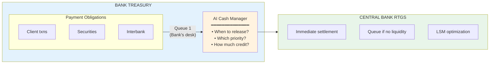

**AI Cash Manager's Information Set:**

| Known (✓) | Unknown (✗) |
|-----------|-------------|
| Current balance at central bank | Future payment arrivals |
| Pending outgoing payments (amounts, deadlines, priorities) | Other banks' strategies |
| Historical pattern of incoming payments | Exact timing of incoming settlements |
| Cost parameters (overdraft rates, delay penalties) | |

### 1.2 The Fundamental Tension (from game_concept_doc.md)

Banks face a core tradeoff every business day:

> **Liquidity costs money.** Holding large reserves at the central bank ties up capital that could earn returns elsewhere. Borrowing intraday credit (whether collateralized or priced) has explicit costs.
>
> **Delay costs money.** Client service agreements, regulatory deadlines, and reputational concerns create pressure to settle payments promptly.

This creates a **coordination problem**:

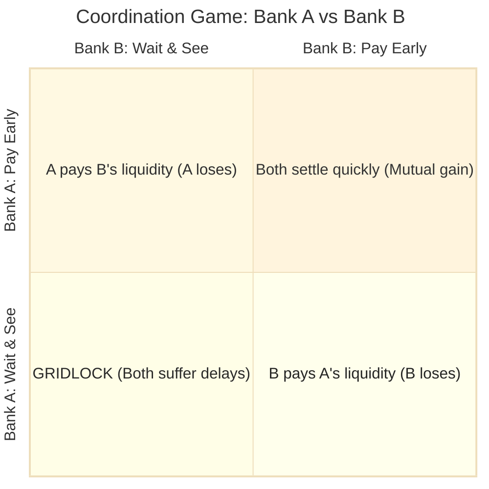

| | **Bank B: Pay Early** | **Bank B: Wait & See** |
|---|---|---|
| **Bank A: Pay Early** | Both settle quickly *(mutual gain)* | A pays B's liquidity *(A loses)* |
| **Bank A: Wait & See** | B pays A's liquidity *(B loses)* | **GRIDLOCK** *(Both suffer delays)* |

This resembles a **Stag Hunt** or **Prisoner's Dilemma** depending on cost parameters.

### 1.3 What the AI Cash Manager Needs to Do

The AI must evaluate candidate policies by asking:

> "If I use this decision tree for the rest of the day, what costs should I expect?"

**The challenge**: The AI doesn't know:
1. What new payment obligations will arrive
2. When counterparties will pay (providing incoming liquidity)
3. Whether the payment system will experience congestion or gridlock

### 1.4 Why Bootstrap? A Statistical Argument

#### The Frequentist Perspective

**Traditional Monte Carlo** (current broken implementation):
```
"Let's assume arrivals follow Poisson(λ=5) with LogNormal amounts.
 Generate 10 synthetic days and average the costs."
```

**Problem**: How do we know λ=5 is correct? What if today is unusual?

**Bootstrap approach**:
```
"I don't know the true distribution. But I have historical observations.
 Let me resample from what I've actually seen to estimate uncertainty."
```

#### The Bootstrap Principle (Efron, 1979)

The **bootstrap** treats the empirical distribution of observed data as an approximation of the true unknown distribution:

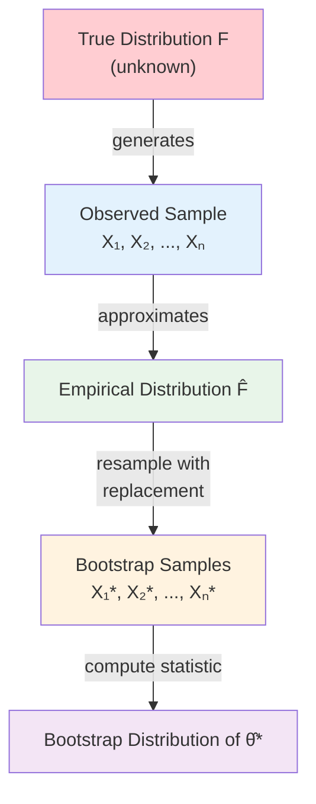

**Key property**: Bootstrap provides consistent estimates of sampling distributions without parametric assumptions.

#### Why This Matters for Policy Evaluation

Consider an AI evaluating a policy that says "release payments when balance > $50,000":

```
Historical observation:
  - Day had 47 transactions
  - 23 arrivals in morning, 24 in afternoon
  - Largest: $200k, Smallest: $5k
  - Mean incoming settlement time: 3.2 ticks after arrival

Bootstrap samples:
  Sample 1: 47 transactions (some repeated, some missing)
            → Simulated cost: $2,650
  Sample 2: 47 transactions (different mix)
            → Simulated cost: $2,720
  ...
  Sample 10: 47 transactions
            → Simulated cost: $2,580

Result: E[cost] ≈ $2,668 ± $28 (95% CI)
```

This tells the AI: "Given what you've seen, this policy costs roughly $2,668 with uncertainty around ±$56."

---

## Part 2: The Model in Detail

### 2.1 Single-Agent Perspective

The bootstrap evaluator adopts a **single-agent perspective**. For agent A:

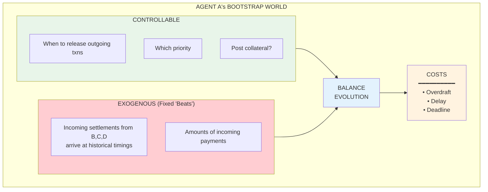

### 2.2 The "Liquidity Beats" Concept

**Critical modeling choice**: We treat incoming settlements as **fixed external events** that define when Agent A receives liquidity.

#### The Remapping Mechanism

When a historical transaction is bootstrapped, we preserve its **relative timing** (offsets from arrival) while assigning a **new arrival tick**:

**Historical Transaction (Tx: B → A)**

| Variable | Value | Description |
|----------|-------|-------------|
| v | $50,000 | Value of Tx |
| T | tick 5 | Original arrival tick |
| TxD | tick 15 | Deadline tick (deadline_offset = 10) |
| TxS | tick 10 | Actual settlement tick (settlement_offset = 5) |

```mermaid
gantt
    title Historical Transaction Timeline
    dateFormat X
    axisFormat %s

    section Original
    Arrival (T=5)           :milestone, m1, 5, 0
    Settlement (TxS=10)     :milestone, m2, 10, 0
    Deadline (TxD=15)       :milestone, m3, 15, 0
    Settlement offset (5)   :active, 5, 10
    Deadline offset (10)    :crit, 5, 15
```

**Bootstrap Remapping (same Tx, new arrival at tick t=2)**

| Variable | Formula | Value |
|----------|---------|-------|
| t | randomly sampled | tick 2 |
| txD | t + deadline_offset | 2 + 10 = tick 12 |
| txS | t + settlement_offset | 2 + 5 = tick 7 |

```mermaid
gantt
    title Bootstrap Remapped Timeline (offsets PRESERVED)
    dateFormat X
    axisFormat %s

    section Remapped
    Arrival (t=2)           :milestone, m1, 2, 0
    Settlement (txS=7)      :milestone, m2, 7, 0
    Deadline (txD=12)       :milestone, m3, 12, 0
    Settlement offset (5)   :active, 2, 7
    Deadline offset (10)    :crit, 2, 12
```

**Effect**: Agent A receives liquidity v at tick txS (= tick 7). This affects A's ability to settle its own outgoing transactions.

#### Why Preserve Settlement Offset?

The historical `settlement_offset = TxS - T` encodes **all system dynamics** that affected that transaction:
- Queue 2 waiting time (if sender had insufficient funds)
- LSM cycles (if bilateral/multilateral offset occurred)
- Gridlock effects (if system was congested)

By preserving this offset, we implicitly capture these dynamics without modeling them explicitly.

#### Implementation

```python
@dataclass(frozen=True)
class TransactionRecord:
    """Historical transaction with relative timing offsets."""
    tx_id: str
    sender_id: str
    receiver_id: str
    amount: int  # cents
    priority: int

    # Relative offsets (preserved during bootstrap)
    deadline_offset: int      # ticks from arrival to deadline
    settlement_offset: int    # ticks from arrival to actual settlement

    # Original absolute ticks (for reference only)
    original_arrival_tick: int

    def remap_to_tick(self, new_arrival: int, eod_tick: int) -> "RemappedTransaction":
        """Remap this transaction to a new arrival tick."""
        return RemappedTransaction(
            tx_id=self.tx_id,
            sender_id=self.sender_id,
            receiver_id=self.receiver_id,
            amount=self.amount,
            priority=self.priority,
            arrival_tick=new_arrival,
            deadline_tick=min(new_arrival + self.deadline_offset, eod_tick),
            settlement_tick=min(new_arrival + self.settlement_offset, eod_tick),
        )


@dataclass(frozen=True)
class RemappedTransaction:
    """Transaction with absolute ticks after bootstrap remapping."""
    tx_id: str
    sender_id: str
    receiver_id: str
    amount: int
    priority: int
    arrival_tick: int
    deadline_tick: int
    settlement_tick: int  # When liquidity arrives (for incoming txns)
```

#### Timeline Visualization

```
Timeline showing "liquidity beats" (incoming settlements to Agent A):

Tick:    0    1    2    3    4    5    6    7    8    9    10   11   12
         │    │    │    │    │    │    │    │    │    │    │    │    │
         │    │    │    ▼    │    │    ▼    │    │    │    ▼    │    │
         │    │    │  $50k   │    │  $30k   │    │    │  $80k   │    │
         │    │    │         │    │         │    │    │         │    │
         └────┴────┴─────────┴────┴─────────┴────┴────┴─────────┴────┴──►

These "beats" define when Agent A receives liquidity.
Agent A's policy decides when to SPEND this liquidity.
```

**Why "beats"?** Like a musical beat, these are the rhythmic moments when liquidity arrives. The AI can't change when other banks pay—it can only decide how to respond.

#### Statistical Properties of Liquidity Beats

From historical data, we can compute:

| Statistic | Meaning | Example |
|-----------|---------|---------|
| Mean inter-arrival time | Average gap between incoming payments | 2.3 ticks |
| Variance | Regularity of incoming flow | High = bursty, Low = steady |
| Autocorrelation | Do payments cluster? | Morning rush, afternoon lull |
| Amount distribution | Size profile of incoming | LogNormal(μ=10, σ=1.5) |

Bootstrap preserves these statistical properties **without assuming we know them**.

### 2.3 Transaction Lifecycle Model

Each transaction goes through a lifecycle:

```
                                    HISTORICAL OBSERVATION
                                    ─────────────────────────
      Arrival                 Policy Decision              Settlement
         │                          │                          │
         ▼                          ▼                          ▼
    ┌─────────┐              ┌─────────────┐             ┌───────────┐
    │ tick=0  │──────────────│ tick=0..T   │─────────────│ tick=5    │
    │ amount  │              │ Hold/Submit │             │ via RTGS  │
    │ deadline│              │             │             │ or LSM    │
    │ priority│              │             │             │           │
    └─────────┘              └─────────────┘             └───────────┘
         │                                                     │
         └──────────────── ticks_to_settle = 5 ───────────────┘

                                    BOOTSTRAP EVALUATION
                                    ────────────────────────
      Arrival (resampled)     Policy Decision (evaluated)   Settlement
         │                          │                          │
         ▼                          ▼                          ▼
    ┌─────────┐              ┌─────────────┐             ┌───────────┐
    │ tick=2  │──────────────│ tick=2..T   │─────────────│ instant   │
    │ (shifted)│              │ NEW policy  │             │ (if funds │
    │         │              │ evaluated   │             │  available)│
    └─────────┘              └─────────────┘             └───────────┘
```

**Key distinction**:
- **Historical settlement time**: Reflects the OLD policy + system dynamics
- **Bootstrap evaluation**: Tests NEW policy with instant settlement (if funds available)

This is a simplification—see Critical Analysis section.

### 2.4 Cost Model Alignment

The bootstrap evaluator implements the same cost model as the full simulation:

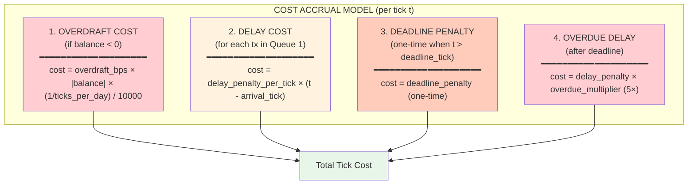

**Numeric Example**:

| Parameter | Value |
|-----------|-------|
| Day length | 12 ticks |
| Opening balance | $100k |
| Transaction amount | $150k (larger than balance!) |
| Deadline | tick 8 |
| overdraft_bps | 10 (0.10% annualized) |
| delay_penalty_per_tick | $1 |
| deadline_penalty | $100 |
| overdue_multiplier | 5× |

```mermaid
gantt
    title Policy Comparison: Release Immediately vs Wait for Liquidity
    dateFormat X
    axisFormat %s

    section Policy A (Release Immediately)
    Release $150k (overdraft)    :crit, 0, 12
    Total cost: $50              :milestone, 12, 0

    section Policy B (Wait for Liquidity)
    Delay cost accruing          :active, 0, 5
    Liquidity arrives ($80k)     :milestone, 5, 0
    Settled (no overdraft)       :done, 5, 12
    Total cost: $5               :milestone, 12, 0
```

| Policy | Action | Cost Breakdown | Total |
|--------|--------|----------------|-------|
| **A: Release immediately** | Release at tick 0 | Overdraft: $4.17/tick × 12 = $50 | **$50** |
| **B: Wait for liquidity** | Wait until tick 5 | Delay: $1/tick × 5 = $5 | **$5** |

**Policy B wins!** But only if incoming liquidity is reliable.

---

## Part 3: Critical Analysis

### 3.1 What Bootstrap Captures vs. What It Misses

| Aspect | Bootstrap Captures | Limitation |
|--------|-------------------|------------|
| Transaction uncertainty | ✓ Resampling variation | Novel transaction types unseen in history |
| Amount distribution | ✓ Empirical distribution | Black swan events beyond observed range |
| Timing patterns | ✓ Historical clustering | Sudden regime changes |
| Counterparty behavior | ✓ Delayed response (daily updates) | Same-day strategic adaptation |
| LSM/Queue 2 effects | ✓ Via historical `ticks_to_settle` | Outgoing settlement timing is simplified |
| Gridlock | ✓ As outcome distribution (slow settlements) | Not as explicit mechanism |

**Key insight**: Many effects that appear "missing" are actually captured implicitly through historical settlement timing data. When yesterday had gridlock, settlements were slow, and those slow settlement times propagate through bootstrap samples.

### 3.2 Strategic Response: Delayed But Present

**Original concern**: Bootstrap treats other agents' behavior as fixed within an evaluation.

**Counterargument**: In production, optimization runs **daily** (or every N ticks). Each day:
1. Bootstrap from previous N days of transactions
2. Evaluate and update policy
3. Other agents are doing the same thing!

This creates **best-response dynamics** with a one-day lag:

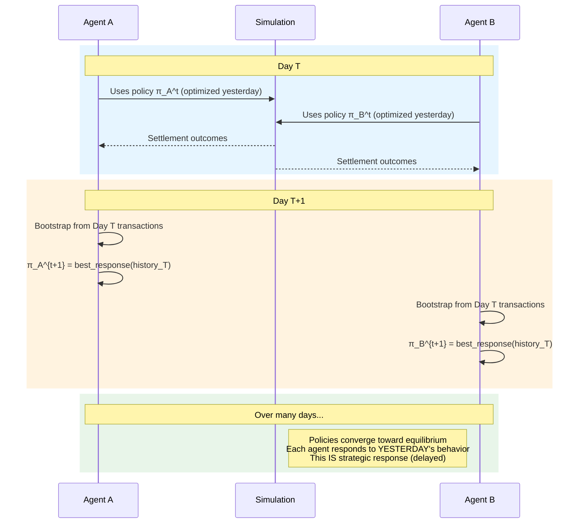

**This is realistic!** Real treasury departments don't react instantaneously to competitor strategies. They observe outcomes, analyze data, and adjust policies periodically.

**What bootstrap DOES capture**:
- Response to counterparty patterns (delayed by bootstrap window)
- Adaptation to system-wide conditions (via historical settlement timing)
- Learning from gridlock episodes (reflected in slow settlement data)

**What bootstrap does NOT capture**:
- Same-day strategic adaptation (but real banks don't do this either!)
- Instantaneous game-theoretic equilibration (a theoretical construct)

### 3.3 Settlement Model: Incoming vs. Outgoing

**Key distinction**: Bootstrap handles incoming and outgoing settlements differently.

#### Incoming Settlements (Liquidity Beats)

Incoming settlements are treated as **fixed external events** with **historical timing preserved**:

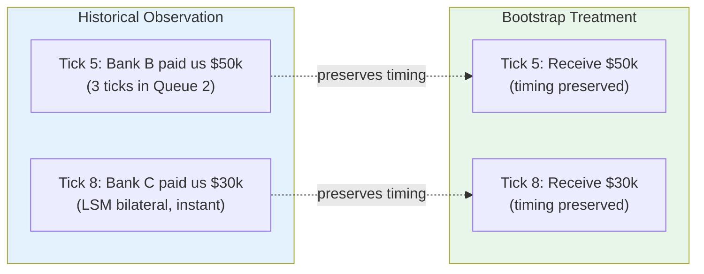

| Effect | Captured? | How |
|--------|-----------|-----|
| LSM effects | ✓ | Historical settlement timing reflects LSM success |
| Queue 2 effects | ✓ | `ticks_to_settle` includes queue time |
| Gridlock effects | ✓ | Slow days = slow settlement times |

**This is the "liquidity beats" concept**: incoming cash arrives at historically-observed times, which implicitly encode all the system dynamics that affected those settlements.

#### Outgoing Settlements (Simplified Model)

Outgoing settlements use a **simplified instant-or-queue model**:

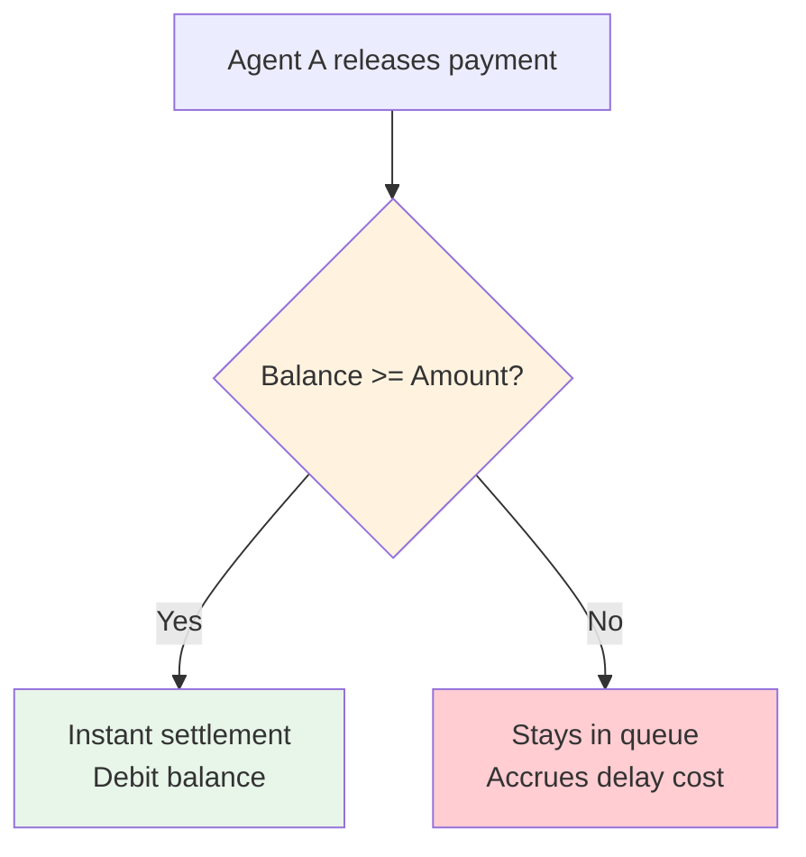

**This is a CONSERVATIVE estimate**:
- Real world: LSM might find bilateral offset, settling sooner
- Bootstrap: Assumes no such luck, must have balance on hand

**Implications**:
- Bootstrap is **conservative** on outgoing settlements (assumes worst case)
- If a policy works well under bootstrap, it will likely work better in reality
- For research purposes: use full simulation to see actual LSM benefits

### 3.4 Statistical Validity of Bootstrap

**Theorem (Bootstrap Consistency)**:
Under regularity conditions, the bootstrap distribution converges to the true sampling distribution as n → ∞.

**In our context** (n = number of historical transactions observed):

| Sample Size | Reliability | Recommendation |
|-------------|-------------|----------------|
| n < 30 (small) | Variance estimates may be unreliable; heavy tails underrepresented | Use stratified bootstrap |
| 30 ≤ n ≤ 100 (moderate) | Reasonably reliable; check rare event coverage | Standard bootstrap appropriate |
| n > 100 (large) | Highly reliable | May use subsampling for efficiency |

**Confidence Intervals**:

```python
# Bootstrap percentile confidence interval
bootstrap_costs = [evaluate_policy(sample) for sample in bootstrap_samples]
ci_lower = np.percentile(bootstrap_costs, 2.5)
ci_upper = np.percentile(bootstrap_costs, 97.5)

# Interpretation:
# "With 95% confidence, the true expected cost lies in [ci_lower, ci_upper]"
```

### 3.5 Revised Assessment: What's Captured vs. Simplified

| Aspect | Status | Notes |
|--------|--------|-------|
| LSM effects (incoming) | ✓ Captured | Via historical `ticks_to_settle` |
| LSM effects (outgoing) | ~ Conservative | Assumes no beneficial offsets |
| Queue 2 dynamics (incoming) | ✓ Captured | Wait time included in settlement timing |
| Queue 2 dynamics (outgoing) | ~ Simplified | Instant-or-wait model |
| Credit headroom (condition) | ✓ Track in state | If policy checks `credit_headroom`, track `balance + credit_limit` |
| Credit headroom (settlement) | ~ Simplified | Bootstrap uses balance-only check, not balance+credit |
| Collateral posting (condition) | ✓ Track in state | If policy checks `collateral_posted`, track it |
| Collateral posting (action) | ◯ Phase 2 | Need to model collateral→liquidity conversion mechanics |
| Gridlock (as outcome) | ✓ Captured | Slow settlement days propagate |
| Gridlock (as mechanism) | ✗ Not modeled | Would need explicit Q2 simulation |
| Strategic response | ✓ Delayed | Via daily re-optimization |
| Same-day adaptation | ✗ Not modeled | But realistic (banks don't do this either) |

**Legend**: ✓ = captured, ~ = partially/conservatively, ◯ = future enhancement, ✗ = not modeled

**Important**: The bootstrap evaluator uses the **same policy evaluation logic** as the full simulation. If a policy references a context field (like `credit_headroom`), the bootstrap state must track it. The simplification is in **settlement mechanics**, not in policy evaluation.

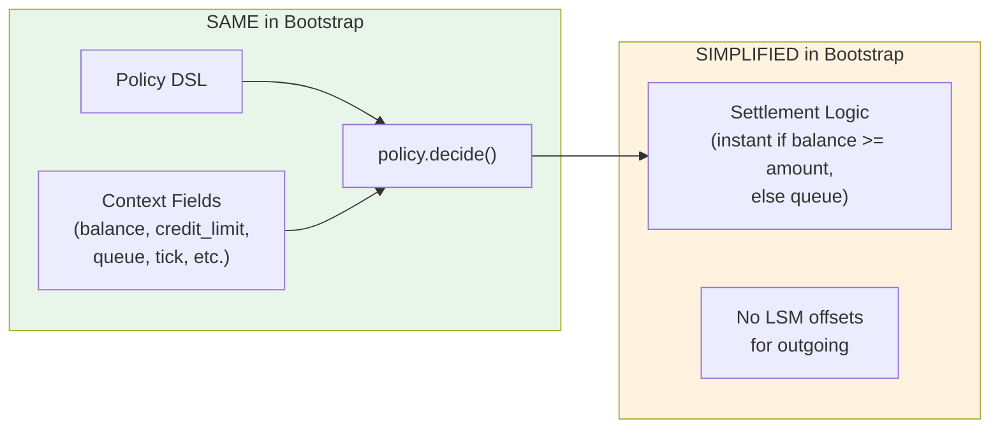

### 3.6 Data Scope Configuration

**For production (daily optimization)**:
- Bootstrap from past N days (configurable, e.g., N=5)
- Each day: update policy, run simulation, collect new transactions
- Older data ages out of bootstrap window

**For research (full simulation first)**:
- Run complete simulation (all ticks) with initial policies
- Bootstrap from entire simulation history
- Iterate on policies until convergence
- Then verify with fresh full simulation

```python
@dataclass
class BootstrapConfig:
    """Configuration for bootstrap data scope."""

    # Number of days of history to use
    history_days: int = 5

    # Minimum transactions required before bootstrap is valid
    min_transactions: int = 30

    # Whether to weight recent transactions more heavily
    recency_weighted: bool = False
```

---

## Part 4: What We're Actually Optimizing

### 4.1 The Optimization Objective

The LLM is optimizing a **best response** policy:

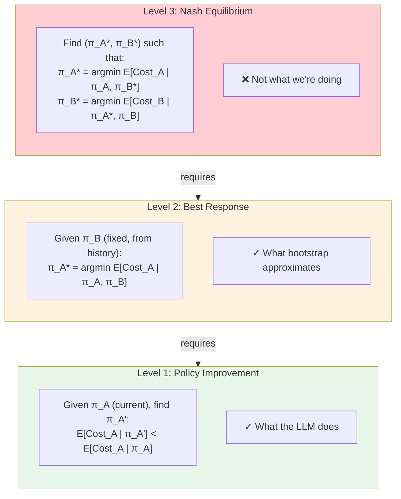

**Bootstrap enables Level 1 and approximates Level 2.**

### 4.2 Convergence Analysis

When all agents optimize simultaneously using bootstrap:

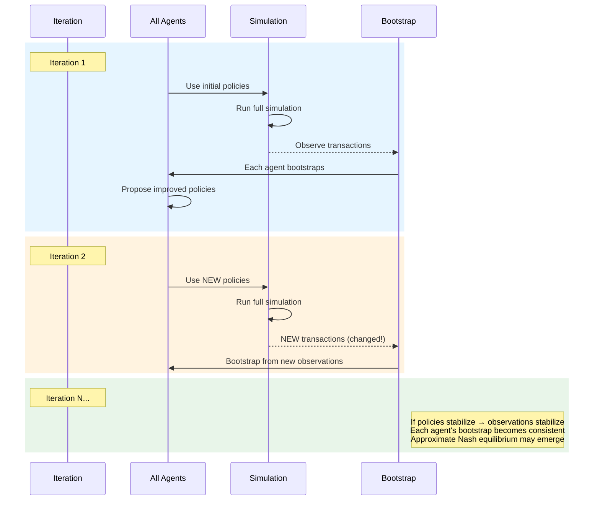

**Convergence conditions**:
1. Policies must not oscillate wildly
2. Transaction patterns must stabilize
3. No single agent dominates system dynamics

### 4.3 Flow of a Complete Iteration

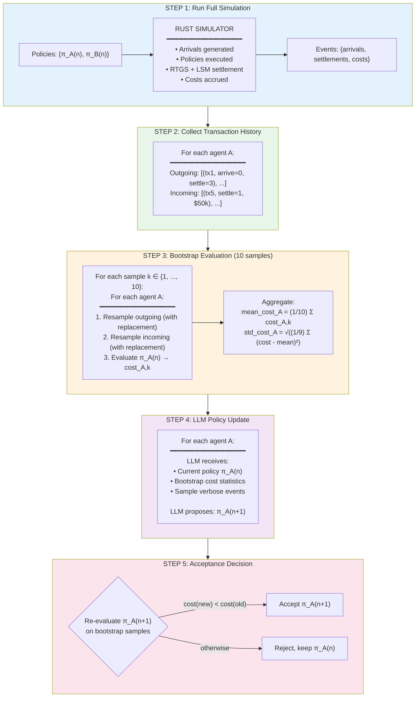

---

## Part 5: Worked Example

### 5.1 Scenario Setup

```yaml
# LVTS-Style 12-Period Scenario
simulation:
  ticks_per_day: 12
  num_days: 1

agents:
  - id: BANK_A
    opening_balance: 100000  # $1,000.00
    credit_limit: 50000      # $500.00 overdraft allowed

  - id: BANK_B
    opening_balance: 100000  # $1,000.00
    credit_limit: 50000

arrivals:
  BANK_A:
    rate_per_tick: 4.5  # Poisson(4.5) → ~54 transactions/day
    amount:
      type: LogNormal
      mean: 5000  # $50.00 average
      std: 3000

costs:
  overdraft_cost_bps: 10.0      # 0.10% annualized
  delay_penalty_per_tick: 100   # $1.00 per tick
  deadline_penalty: 10000       # $100.00 one-time
  overdue_delay_multiplier: 5.0
```

### 5.2 Historical Observation (After Full Simulation)

```
Agent A's Transaction History:
────────────────────────────────────────────────────────────────────────
Outgoing (A → others):
  tx-001: amount=$80.00,  arrive=0,  deadline=5,  settled=2  (3 tick wait)
  tx-002: amount=$45.00,  arrive=0,  deadline=8,  settled=1  (1 tick wait)
  tx-003: amount=$120.00, arrive=1,  deadline=7,  settled=4  (3 tick wait)
  tx-004: amount=$30.00,  arrive=2,  deadline=10, settled=3  (1 tick wait)
  tx-005: amount=$65.00,  arrive=3,  deadline=9,  settled=6  (3 tick wait)
  ... (47 more)

Incoming (others → A):
  tx-101: amount=$55.00,  settled=1  → "beat" at tick 1
  tx-102: amount=$90.00,  settled=3  → "beat" at tick 3
  tx-103: amount=$40.00,  settled=5  → "beat" at tick 5
  tx-104: amount=$75.00,  settled=7  → "beat" at tick 7
  ... (42 more)

Total outgoing: $2,847.00 across 52 transactions
Total incoming: $2,695.00 across 46 settlements
Net flow: -$152.00 (A is net payer)
────────────────────────────────────────────────────────────────────────
```

### 5.3 Bootstrap Sample Generation

```
Bootstrap Sample #3 (seed=42):
────────────────────────────────────────────────────────────────────────
Outgoing (resampled with replacement):
  tx-001: amount=$80.00,  arrive=0  (selected)
  tx-003: amount=$120.00, arrive=1  (selected)
  tx-003: amount=$120.00, arrive=1  (DUPLICATE - selected again)
  tx-005: amount=$65.00,  arrive=3  (selected)
  tx-002: amount=$45.00,  arrive=0  (selected)
  ... (47 more, with possible repeats)

Incoming "beats" (resampled with replacement):
  tick 1: $55.00 + $55.00 = $110.00  (tx-101 sampled twice!)
  tick 3: $90.00
  tick 5: $40.00
  tick 7: $75.00 + $90.00 = $165.00  (different transactions sampled)
  ... (remapped to fit 12-tick window)

Note: Resampling can create "bursty" or "sparse" scenarios
────────────────────────────────────────────────────────────────────────
```

### 5.4 Policy Evaluation on Bootstrap Sample

```
Evaluating Policy: "Release if (priority >= 5) OR (ticks_to_deadline <= 3)"
────────────────────────────────────────────────────────────────────────

Tick 0:
  Balance: $1,000.00
  Arrivals: tx-001 ($80, prio=5, deadline=5), tx-002 ($45, prio=3, deadline=8)
  Policy: Release tx-001 (prio=5), Hold tx-002 (prio<5, deadline not urgent)
  Action: Release $80 → Balance = $920
  Queue: [tx-002]
  Costs: $0

Tick 1:
  Balance: $920 + $110 (incoming) = $1,030
  Arrivals: tx-003 ($120, prio=7, deadline=7)
  Policy: Release tx-003 (prio=7)
  Action: Release $120 → Balance = $910
  Queue: [tx-002] (1 tick delay cost)
  Costs: $1 delay

Tick 2:
  Balance: $910
  Arrivals: tx-003 DUPLICATE ($120, prio=7, deadline=7)
  Policy: Release
  Action: Release $120 → Balance = $790
  Queue: [tx-002] (2 tick delay cost)
  Costs: $1 delay

...continuing...

Tick 11 (EOD):
  Balance: $650
  Queue: [tx-047 overdue]
  Costs: $100 deadline penalty + $25 overdue delay

TOTAL COST for Sample #3: $267.00
────────────────────────────────────────────────────────────────────────
```

### 5.5 Monte Carlo Aggregation

```
Monte Carlo Results (10 bootstrap samples):
────────────────────────────────────────────────────────────────────────
┌─────────────┬──────────────┬─────────────┬─────────────┬────────────┐
│ Sample      │ Total Cost   │ Delay Cost  │ Overdraft   │ Deadlines  │
│             │              │             │ Cost        │ Missed     │
├─────────────┼──────────────┼─────────────┼─────────────┼────────────┤
│ 1           │ $2,665.57    │ $1,890.00   │ $75.57      │ 7          │
│ 2           │ $2,662.37    │ $1,812.00   │ $50.37      │ 8          │
│ 3           │ $2,712.20    │ $1,956.00   │ $106.20     │ 6          │
│ 4           │ $2,685.95    │ $1,900.00   │ $85.95      │ 7          │
│ 5           │ $2,661.10    │ $1,808.00   │ $53.10      │ 8          │
│ 6           │ $2,701.55    │ $1,944.00   │ $57.55      │ 7          │
│ 7           │ $2,693.59    │ $1,928.00   │ $65.59      │ 7          │
│ 8           │ $2,648.66    │ $1,794.00   │ $54.66      │ 8          │
│ 9           │ $2,638.29    │ $1,780.00   │ $58.29      │ 8          │
│ 10          │ $2,617.67    │ $1,752.00   │ $65.67      │ 8          │
├─────────────┼──────────────┼─────────────┼─────────────┼────────────┤
│ Mean        │ $2,668.69    │ $1,856.40   │ $67.29      │ 7.4        │
│ Std Dev     │ $28.15       │ $72.31      │ $16.83      │ 0.7        │
│ 95% CI      │ ±$17.44      │ ±$44.81     │ ±$10.43     │ ±0.4       │
└─────────────┴──────────────┴─────────────┴─────────────┴────────────┘

Interpretation:
  - Mean cost: $2,668.69 (our best estimate)
  - 95% CI: [$2,651.25, $2,686.13]
  - Delay cost dominates (69.6% of total)
  - Overdraft cost small (2.5% of total)
  - ~7 deadline misses per day (out of ~52 transactions)
────────────────────────────────────────────────────────────────────────
```

---

## Part 6: Implementation Design

### 6.1 Decision: Python First

After reviewing the architecture documentation:

| Factor | Python | Rust |
|--------|--------|------|
| **FFI Principle** | "Minimal crossings" | Would add new FFI surface |
| **Scope** | Single-agent, simplified | Full multi-agent dynamics |
| **Foundation** | TransactionSampler exists | Start from scratch |
| **Performance** | ~1ms/eval (adequate) | ~0.1ms/eval (overkill) |
| **Research** | Fast iteration | Slower modification |

**Decision**: Implement in Python. Bootstrap is fundamentally a **statistical procedure**, not a **simulation**. The Rust engine is designed for high-fidelity multi-agent simulation—bootstrap doesn't need that complexity.

**Future path**: If bootstrap becomes production-critical with thousands of samples, add `Orchestrator.bootstrap_evaluate()` in Rust as a single FFI entry point.

### 6.2 Component Architecture

```mermaid
flowchart TB
    subgraph Pipeline["BOOTSTRAP EVALUATION PIPELINE"]

        subgraph Input["Input"]
            Verbose["VerboseOutput<br/>(events_by_tick)<br/>━━━━━━━━━━━━━━<br/>Raw events from<br/>Rust simulation"]
        end

        subgraph Collector["TransactionHistoryCollector"]
            C1["• Parse Arrival events → TransactionRecord"]
            C2["• Match Settlement events → update settlement_tick"]
            C3["• Handle LSM events (bilateral, cycle)"]
            C4["• Group by agent (outgoing vs incoming)"]
        end

        subgraph History["AgentTransactionHistory"]
            HA["BANK_A:<br/>├── outgoing: [tx1, tx2, ...]<br/>└── incoming: [tx3, tx4, ...]"]
            HB["BANK_B:<br/>├── outgoing: [tx5, tx6, ...]<br/>└── incoming: [tx1, tx2, ...]"]
        end

        subgraph Sampler["BootstrapSampler"]
            S1["Input: AgentTransactionHistory, seed"]
            S2["Algorithm:<br/>1. random.choices(outgoing)<br/>2. random.choices(incoming)<br/>3. Remap arrival ticks<br/>4. Remap settlement ticks (beats)"]
            S3["Output: BootstrapSample"]
        end

        subgraph Evaluator["BootstrapPolicyEvaluator"]
            E1["Input: BootstrapSample, Policy,<br/>AgentConfig, CostConfig"]
            E2["State: balance, credit_limit,<br/>collateral_posted, queue, tick"]
            E3["for tick in range(total_ticks):<br/>  balance += incoming_at_tick<br/>  queue.extend(arrivals_at_tick)<br/>  context = build_context(state)<br/>  releases = policy.decide(context)<br/>  settle if balance >= amount<br/>  costs.accrue()"]
            E4["Output: PolicyEvaluationResult"]
        end

        subgraph Aggregate["Aggregation"]
            A1["mean_cost = Σ costs / n"]
            A2["std_cost = √variance"]
            A3["ci = percentile(2.5%, 97.5%)"]
        end
    end

    Input --> Collector --> History
    History -->|"For each Monte Carlo sample"| Sampler
    Sampler --> Evaluator --> Aggregate

    style Input fill:#e3f2fd
    style Collector fill:#e8f5e9
    style History fill:#fff3e0
    style Sampler fill:#f3e5f5
    style Evaluator fill:#fce4ec
    style Aggregate fill:#e8f5e9
```

### 6.3 Data Structures

See Section 2.2 for the detailed `TransactionRecord` and `RemappedTransaction` dataclasses that implement the offset-based remapping mechanism.

```python
@dataclass
class AgentTransactionHistory:
    """Per-agent view of historical transactions with relative timing offsets."""
    agent_id: str
    outgoing: list[TransactionRecord]
    incoming: list[TransactionRecord]

    def summary_statistics(self) -> dict[str, float]:
        """Compute summary statistics for LLM context."""
        settled_outgoing = [tx for tx in self.outgoing if tx.settlement_offset is not None]
        return {
            "num_outgoing": len(self.outgoing),
            "num_incoming": len(self.incoming),
            "total_outgoing_volume": sum(tx.amount for tx in self.outgoing),
            "total_incoming_volume": sum(tx.amount for tx in self.incoming),
            "avg_outgoing_amount": np.mean([tx.amount for tx in self.outgoing]) if self.outgoing else 0,
            "avg_settlement_offset": np.mean([tx.settlement_offset for tx in settled_outgoing]) if settled_outgoing else 0,
            "settlement_rate": len(settled_outgoing) / len(self.outgoing) if self.outgoing else 1.0,
        }


@dataclass
class BootstrapSample:
    """One bootstrap sample with remapped absolute ticks."""
    agent_id: str
    outgoing_txns: list[RemappedTransaction]     # Agent's outgoing obligations (to evaluate policy on)
    incoming_settlements: list[RemappedTransaction]  # "Liquidity beats" (fixed timing)
    total_ticks: int
    eod_tick: int

    def get_arrivals_at_tick(self, tick: int) -> list[RemappedTransaction]:
        """Get outgoing transactions arriving at this tick."""
        return [tx for tx in self.outgoing_txns if tx.arrival_tick == tick]

    def get_incoming_liquidity_at_tick(self, tick: int) -> int:
        """Get total incoming liquidity settling at this tick."""
        return sum(tx.amount for tx in self.incoming_settlements if tx.settlement_tick == tick)


@dataclass
class PolicyEvaluationResult:
    """Result of evaluating a policy on one bootstrap sample."""
    agent_id: str
    sample_idx: int
    seed: int

    # Total cost
    total_cost: int  # cents

    # Cost breakdown
    delay_cost: int
    overdraft_cost: int
    deadline_penalty: int
    overdue_delay_cost: int

    # Metrics
    transactions_processed: int
    transactions_settled: int
    transactions_unsettled: int
    avg_settlement_delay: float
    max_overdraft: int

    @property
    def settlement_rate(self) -> float:
        """Fraction of transactions settled."""
        if self.transactions_processed == 0:
            return 1.0
        return self.transactions_settled / self.transactions_processed
```

---

## Part 7: TDD Test Specifications

*[The detailed TDD tests from the previous version are retained here - see implementation phases 1-5 in original document]*

---

## Part 8: Open Questions and Recommendations

### 8.1 Resolved Questions

| Question | Decision | Rationale |
|----------|----------|-----------|
| Rust vs Python | Python | Statistical procedure, not simulation |
| Sample size | Same as original (standard bootstrap) | Simplicity, statistical validity |
| Arrival remapping | Preserve relative timing | Maintains transaction relationships |

### 8.2 Open Questions for Future Work

1. **Should we add a simplified LSM model?**
   - Current: No LSM in bootstrap (instant settlement if funds available)
   - Option: Add bilateral offset check between outgoing and "virtual incoming"
   - **Recommendation**: Phase 2 enhancement. Current model is conservative.

2. **Should we model credit headroom?**
   - Current: Only balance matters for settlement
   - Option: Add `balance + credit_limit >= amount` check
   - **Recommendation**: Yes, add in Phase 1. Simple change with significant impact.

3. **How to handle regime changes?**
   - Problem: Bootstrap assumes past ≈ future
   - Option: Use weighted bootstrap (recent observations weighted higher)
   - **Recommendation**: Future research. Current use case doesn't require this.

4. **Should we run bootstrap on multiple past days?**
   - Current: Bootstrap from single simulation
   - Option: Collect history over multiple days, bootstrap from combined pool
   - **Recommendation**: Future enhancement for more robust estimates.

### 8.3 Known Limitations to Document for Users

```markdown
## Limitations of Bootstrap Policy Evaluation

1. **No strategic response modeling**: Other agents' behavior is treated as fixed.
   Impact: May miss retaliatory responses or cooperation opportunities.

2. **Simplified settlement**: No LSM optimization, Queue 2 dynamics, or gridlock.
   Impact: Underestimates benefit of LSM, overestimates delay costs.

3. **Single-day horizon**: Bootstrap samples from one day's observations.
   Impact: May miss longer-term patterns or rare events.

4. **Independence assumption**: Transactions resampled independently.
   Impact: May break temporal dependencies (e.g., clustered arrivals).

5. **No collateral dynamics**: Credit headroom not currently modeled.
   Impact: Underestimates liquidity options.
```

---

## Part 9: References

### Academic References

1. Efron, B. (1979). "Bootstrap methods: Another look at the jackknife." *Annals of Statistics*, 7(1), 1-26.

2. Efron, B., & Tibshirani, R. J. (1993). *An Introduction to the Bootstrap*. Chapman & Hall/CRC.

3. Bech, M. L., & Garratt, R. (2003). "The intraday liquidity management game." *Journal of Economic Theory*, 109(2), 198-219.

### SimCash Documentation

- [Game Concept Document](../game_concept_doc.md) - Real-world context and validation criteria
- [Cost Model](../reference/architecture/12-cost-model.md) - Cost formulas and accrual
- [Tick Loop Anatomy](../reference/architecture/11-tick-loop-anatomy.md) - Simulation mechanics
- [Patterns and Conventions](../reference/patterns-and-conventions.md) - Code standards

---

## Part 10: Documentation Phase

### 10.1 Overview

Following implementation, create extensive documentation in `docs/reference/castro/` that matches the style and conventions of existing reference documentation. This documentation enables other developers and researchers to understand, use, and extend the bootstrap Monte Carlo system.

### 10.2 Documentation Structure

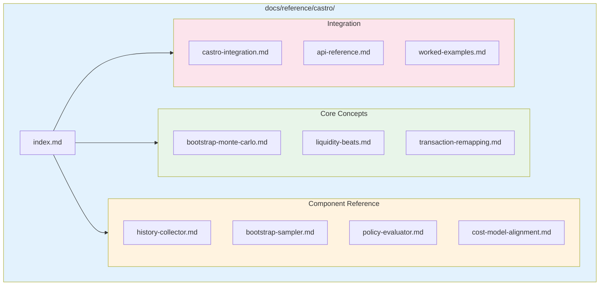

### 10.3 Document Inventory

| Document | Description | Priority |
|----------|-------------|----------|
| `index.md` | Update with bootstrap Monte Carlo overview and navigation | P0 |
| `bootstrap-monte-carlo.md` | Theoretical foundation, statistical properties, confidence intervals | P0 |
| `liquidity-beats.md` | "Liquidity beats" concept with diagrams and examples | P0 |
| `transaction-remapping.md` | Offset-based remapping mechanism, EoD handling | P0 |
| `history-collector.md` | `TransactionHistoryCollector` API reference | P1 |
| `bootstrap-sampler.md` | `BootstrapSampler` API reference with sampling methods | P1 |
| `policy-evaluator.md` | `BootstrapPolicyEvaluator` API and integration | P1 |
| `cost-model-alignment.md` | How bootstrap cost model aligns with full simulation | P1 |
| `castro-integration.md` | How Castro uses bootstrap for policy optimization | P2 |
| `api-reference.md` | Complete API reference for all public interfaces | P2 |
| `worked-examples.md` | End-to-end examples with code and output | P2 |

### 10.4 Document Templates

Each document should follow the established conventions:

#### Header Template

```markdown
# Document Title

> One-line description

**Version**: 1.0
**Last Updated**: YYYY-MM-DD

---

## Overview

Brief introduction with mermaid architecture diagram.

---

## [Main Sections]

...

---

## Related Documentation

- [Link 1](path/to/doc.md) - Description
- [Link 2](path/to/doc.md) - Description

---

*Last updated: YYYY-MM-DD*
```

#### Flowchart Style Guide

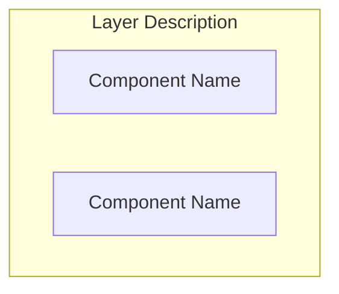

### 10.5 Detailed Document Specifications

#### 10.5.1 `bootstrap-monte-carlo.md`

**Purpose**: Explain the statistical foundation of bootstrap Monte Carlo for policy evaluation.

**Sections**:
1. **Overview** - Why bootstrap? What problem does it solve?
2. **Statistical Foundation**
   - Bootstrap principle (Efron 1979)
   - Law of large numbers and CLT
   - Confidence interval construction
3. **Bootstrap vs. Synthetic Monte Carlo**
   - Comparison table
   - When to use each
4. **Variance Estimation**
   - Bootstrap variance formula
   - Relationship to sample size
5. **Implementation Notes**
   - Determinism requirements
   - Seed management
6. **Mathematical Appendix**
   - Formal definitions
   - Convergence properties

**Mermaid Diagrams**:
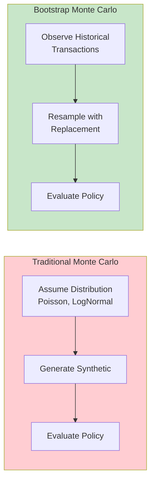

#### 10.5.2 `liquidity-beats.md`

**Purpose**: Deep dive on the "liquidity beats" concept central to bootstrap evaluation.

**Sections**:
1. **Overview** - Musical analogy, why "beats"?
2. **The Core Concept**
   - Incoming settlements as fixed external events
   - What the agent controls vs. what is exogenous
3. **Timeline Visualization**
   - ASCII art and mermaid diagrams showing beats
4. **Why Beats Preserve System Dynamics**
   - LSM effects encoded in settlement timing
   - Queue 2 effects encoded in settlement timing
   - Gridlock captured as slow settlement distribution
5. **Implementation**
   - `settlement_tick` vs `settlement_offset`
   - How beats affect balance evolution
6. **Examples**
   - Single-agent example with liquidity beats
   - Multi-beat scenario showing interaction

**Mermaid Diagrams**:
```mermaid
gantt
    title Liquidity Beats Timeline
    dateFormat X
    axisFormat %s

    section Incoming
    Beat 1 ($50k)   :milestone, 3, 0
    Beat 2 ($30k)   :milestone, 6, 0
    Beat 3 ($80k)   :milestone, 10, 0

    section Outgoing (Policy Decides)
    Payment A :active, 2, 5
    Payment B :active, 4, 8
    Payment C :active, 7, 12
```

#### 10.5.3 `transaction-remapping.md`

**Purpose**: Technical documentation of how transactions are remapped during bootstrap.

**Sections**:
1. **Overview** - Why remapping? What gets preserved?
2. **The Remapping Mechanism**
   - Historical transaction fields
   - Offset calculation
   - New arrival tick assignment
3. **Formal Specification**
   ```
   T   = original arrival tick
   TxD = original deadline tick
   TxS = original settlement tick

   deadline_offset  = TxD - T
   settlement_offset = TxS - T

   t   = new arrival tick (bootstrapped)
   txD = t + deadline_offset
   txS = t + settlement_offset (capped at EoD)
   ```
4. **Edge Cases**
   - Settlement extends past EoD
   - Deadline past EoD
   - Never-settled transactions
5. **Data Structures**
   - `TransactionRecord` with offsets
   - `RemappedTransaction` with absolute ticks
6. **Code Examples**
   - Python implementation
   - Usage in bootstrap evaluator

#### 10.5.4 `history-collector.md`

**Purpose**: API reference for `TransactionHistoryCollector`.

**Sections**:
1. **Synopsis** - Quick usage example
2. **Constructor**
3. **Methods**
   - `collect_from_events()`
   - `collect_from_database()`
   - `get_agent_history()`
   - `get_all_transactions()`
4. **Data Model**
   - `TransactionRecord` fields table
   - `AgentTransactionHistory` structure
5. **Examples**
   - Collecting from live simulation
   - Collecting from DuckDB
6. **Related**: Links to sampler and evaluator docs

#### 10.5.5 `bootstrap-sampler.md`

**Purpose**: API reference for `BootstrapSampler`.

**Sections**:
1. **Synopsis**
2. **Constructor**
3. **Methods**
   - `create_sample()` - Single bootstrap sample
   - `create_samples()` - Multiple samples for Monte Carlo
   - `remap_transaction()` - Remap single transaction
4. **Sampling Process**
   - Flowchart of sampling algorithm
   - How arrival ticks are assigned
5. **Configuration**
   - Sample size
   - EoD tick handling
   - Seed derivation
6. **Statistical Properties**
   - Same transaction can appear multiple times
   - Arrival tick distribution
7. **Examples**

#### 10.5.6 `policy-evaluator.md`

**Purpose**: API reference for `BootstrapPolicyEvaluator`.

**Sections**:
1. **Synopsis**
2. **Constructor**
3. **Methods**
   - `evaluate()` - Evaluate policy on single sample
   - `evaluate_monte_carlo()` - Evaluate with confidence intervals
4. **Evaluation Algorithm**
   - Tick-by-tick flowchart
   - Balance evolution
   - Cost accrual
5. **Cost Model**
   - Alignment with full simulation costs
   - Overdraft, delay, deadline, overdue costs
6. **Output Format**
   - `PolicyEvaluationResult` fields
   - Aggregated Monte Carlo results
7. **Examples**
   - Evaluate single policy
   - Compare two policies

#### 10.5.7 `cost-model-alignment.md`

**Purpose**: Document how bootstrap cost model aligns with full simulation.

**Sections**:
1. **Overview** - Why alignment matters
2. **Cost Components**
   - Table comparing bootstrap vs full simulation for each cost type
3. **What's Identical**
   - Overdraft cost formula
   - Delay penalty formula
   - Deadline penalty formula
4. **What's Conservative**
   - No LSM benefits for outgoing
   - Simplified settlement model
5. **Validation**
   - How to verify alignment
   - Expected discrepancy bounds
6. **Configuration**
   - Cost rate parameters
   - How they flow from scenario config

### 10.6 Documentation TDD

Write documentation tests to ensure accuracy:

```python
# tests/docs/test_documentation_accuracy.py

def test_bootstrap_example_produces_documented_output():
    """Verify worked examples in docs match actual behavior."""
    # Run the example from docs/reference/castro/worked-examples.md
    # Assert output matches documented output


def test_api_signatures_match_docs():
    """Verify API signatures in docs match implementation."""
    from payment_simulator.ai_cash_mgmt.sampling import BootstrapSampler

    # Check documented methods exist
    assert hasattr(BootstrapSampler, 'create_sample')
    assert hasattr(BootstrapSampler, 'create_samples')


def test_cost_formulas_match_docs():
    """Verify cost formulas in docs match implementation."""
    # Run known scenario, verify costs match documented formulas
```

### 10.7 Documentation Review Checklist

Before marking documentation complete:

- [ ] All mermaid diagrams render correctly
- [ ] Code examples are copy-pasteable and work
- [ ] Cross-references between documents are valid
- [ ] API signatures match implementation
- [ ] Worked examples produce documented output
- [ ] Navigation (Previous/Next) links work
- [ ] Version and date headers are current
- [ ] Glossary terms are consistent with project glossary
- [ ] No broken internal links

### 10.8 Timeline

| Phase | Documents | Dependencies |
|-------|-----------|--------------|
| **Phase 1** (with implementation) | `index.md` update, `bootstrap-monte-carlo.md` | Implementation Phase 1 |
| **Phase 2** (with core components) | `liquidity-beats.md`, `transaction-remapping.md` | Implementation Phase 2 |
| **Phase 3** (with API) | `history-collector.md`, `bootstrap-sampler.md`, `policy-evaluator.md` | Implementation Phase 3 |
| **Phase 4** (integration) | `cost-model-alignment.md`, `castro-integration.md` | Implementation Phase 4 |
| **Phase 5** (polish) | `api-reference.md`, `worked-examples.md`, review | All implementation complete |

---

## Appendix A: Mathematical Formulation

### A.1 Bootstrap Estimator

Let $X_1, X_2, \ldots, X_n$ be observed transactions. The bootstrap estimate of expected cost is:

$$\hat{\theta}^* = \frac{1}{B} \sum_{b=1}^{B} C(\pi, X^{*b})$$

where $X^{*b} = (X^*_1, \ldots, X^*_n)$ is a bootstrap sample drawn with replacement, and $C(\pi, X)$ is the cost under policy $\pi$ given transactions $X$.

### A.2 Confidence Interval

The bootstrap percentile confidence interval is:

$$\text{CI}_{1-\alpha} = \left[ \hat{\theta}^*_{(\alpha/2)}, \hat{\theta}^*_{(1-\alpha/2)} \right]$$

where $\hat{\theta}^*_{(p)}$ is the $p$-th percentile of the bootstrap distribution.

### A.3 Variance Estimation

The bootstrap variance estimate is:

$$\widehat{\text{Var}}(\hat{\theta}) = \frac{1}{B-1} \sum_{b=1}^{B} \left( \hat{\theta}^{*b} - \bar{\theta}^* \right)^2$$

---

## Appendix B: Comparison with Alternative Approaches

| Approach | Pros | Cons | When to Use |
|----------|------|------|-------------|
| **Bootstrap (this plan)** | Non-parametric, uses observed data | Misses strategic response | Default choice |
| **Synthetic Monte Carlo** | Tests diverse scenarios | Assumes known distribution | Distribution validation |
| **Full Multi-Agent Sim** | Captures strategic dynamics | Expensive, complex | Final validation |
| **Analytical Solution** | Exact, fast | Requires simplifying assumptions | Toy problems |

---

*Document Version 2.5 - Clarified policy evaluation vs settlement mechanics distinction*
