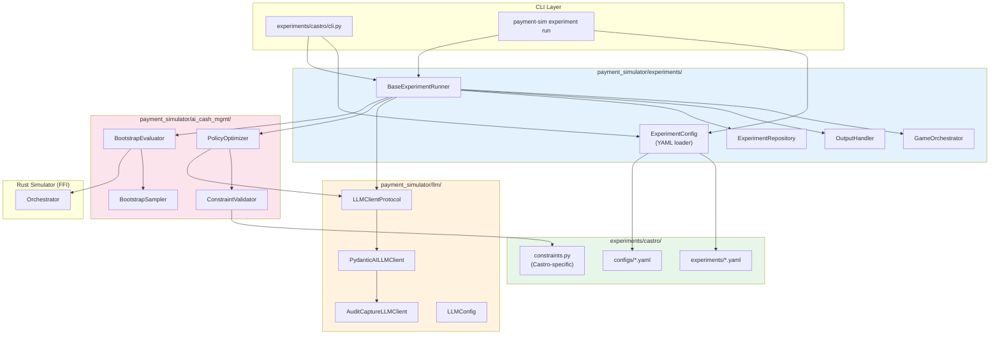

# AI Cash Management Architecture Refactor - Conceptual Plan

**Status:** Draft
**Created:** 2025-12-10
**Last Updated:** 2025-12-10
**Author:** Claude
**Related:**
- `docs/plans/castro-architecture-refactor.md` (bug fixes and immediate improvements)
- `docs/plans/bootstrap-refactor/refactor-conceptual-plan.md` (completed prerequisite)
- `docs/reference/ai_cash_mgmt/` (current documentation)
- `docs/reference/castro/` (to be replaced)

---

## Executive Summary

This refactor transforms the current monolithic `ai_cash_mgmt` module and `experiments/castro` package into a well-separated, modular architecture. The goal is to create reusable infrastructure for:

1. **Policy optimization** (bootstrap sampling, evaluation, cost computation)
2. **LLM integration** (unified provider abstraction, audit capture)
3. **Experiment orchestration** (YAML-driven configuration, runners, persistence)

After this refactor, `experiments/castro/` becomes a thin experiment-specific layer that composes components from the core modules.

---

## Motivation and Goals

### Current Problems

1. **Code Duplication**: LLM client implementations exist in both Castro and ai_cash_mgmt
2. **Tight Coupling**: Experiment logic is intertwined with LLM specifics and policy evaluation
3. **Configuration in Code**: Experiments defined as Python dataclasses, not YAML
4. **Difficult Extension**: Adding new experiments requires understanding the full Castro codebase
5. **Testing Challenges**: Hard to test policy evaluation without LLM calls

### Goals

| Goal | Benefit |
|------|---------|
| **Separation of Concerns** | Each module has a single responsibility |
| **YAML-Driven Experiments** | Non-programmers can define new experiments |
| **Reusable LLM Infrastructure** | Any module can use LLM without reimplementing |
| **Protocol-Based Design** | Swap implementations without changing callers |
| **Test-Driven Development** | Each component independently testable |

### Non-Goals

- Changing the Rust simulator (out of scope)
- Changing the FFI boundary beyond existing capabilities
- Rewriting existing bootstrap logic (recently completed refactor)
- Supporting non-policy-optimization use cases

---

## Target Architecture

### Module Overview

```
api/payment_simulator/
├── ai_cash_mgmt/              # Policy Optimization Core
│   ├── bootstrap/             # Bootstrap sampling and evaluation
│   ├── constraints/           # Policy validation rules
│   ├── optimization/          # Optimizer, evaluator protocols
│   ├── sampling/              # Transaction sampling, seed management
│   ├── metrics/               # Cost aggregation
│   └── prompts/               # Context types (no LLM-specific code)
│
├── llm/                       # LLM Integration Layer (NEW)
│   ├── protocol.py            # LLMClientProtocol
│   ├── config.py              # Unified LLMConfig
│   ├── pydantic_client.py     # PydanticAI implementation
│   ├── audit_wrapper.py       # Audit capture decorator
│   └── providers/             # Provider-specific settings
│       ├── anthropic.py
│       ├── openai.py
│       └── google.py
│
├── experiments/               # Experiment Framework (NEW)
│   ├── config/                # Experiment configuration
│   │   ├── experiment_config.py   # ExperimentConfig (YAML→obj)
│   │   └── evaluation_config.py   # Evaluation settings
│   ├── runner/                # Experiment execution
│   │   ├── protocol.py        # ExperimentRunnerProtocol
│   │   ├── base_runner.py     # BaseExperimentRunner
│   │   └── output.py          # OutputHandlerProtocol
│   ├── persistence/           # Unified persistence
│   │   ├── repository.py      # ExperimentRepository
│   │   └── events.py          # Event model
│   └── orchestrator/          # Game orchestration
│       ├── game_orchestrator.py
│       └── game_session.py
│
experiments/castro/            # Castro-Specific (LIGHTWEIGHT)
├── configs/                   # Scenario YAML files
│   ├── exp1_2period.yaml
│   ├── exp2_12period.yaml
│   └── exp3_stochastic.yaml
├── experiments/               # Experiment definition YAML
│   ├── exp1.yaml
│   ├── exp2.yaml
│   └── exp3.yaml
├── castro/
│   ├── constraints.py         # Castro-specific constraints only
│   └── __init__.py
├── cli.py                     # CLI entry point (thin wrapper)
└── tests/                     # Castro-specific tests
```

### Dependency Flow



---

## Module Specifications

### 1. `payment_simulator/llm/` - LLM Integration Layer

**Purpose**: Unified LLM abstraction for all modules needing LLM capabilities.

**Key Components**:

```python
# protocol.py
class LLMClientProtocol(Protocol):
    """Protocol for LLM clients."""

    async def generate_structured_output(
        self,
        prompt: str,
        response_model: type[T],
        system_prompt: str | None = None,
    ) -> T:
        """Generate structured output from LLM."""
        ...

    async def generate_text(
        self,
        prompt: str,
        system_prompt: str | None = None,
    ) -> str:
        """Generate plain text from LLM."""
        ...


# config.py
@dataclass
class LLMConfig:
    """Unified LLM configuration."""

    # Model specification in provider:model format
    model: str  # e.g., "anthropic:claude-sonnet-4-5"

    # Common settings
    temperature: float = 0.0
    max_retries: int = 3
    timeout_seconds: int = 120

    # Provider-specific (mutually exclusive)
    thinking_budget: int | None = None      # Anthropic extended thinking
    reasoning_effort: str | None = None     # OpenAI reasoning effort

    @property
    def provider(self) -> str:
        return self.model.split(":")[0]

    @property
    def model_name(self) -> str:
        return self.model.split(":", 1)[1]


# audit_wrapper.py
@dataclass(frozen=True)
class LLMInteraction:
    """Captured LLM interaction for audit trail."""
    system_prompt: str
    user_prompt: str
    raw_response: str
    parsed_policy: dict[str, Any] | None
    parsing_error: str | None
    prompt_tokens: int
    completion_tokens: int
    latency_seconds: float


class AuditCaptureLLMClient:
    """Wrapper that captures interactions for audit replay."""

    def __init__(self, delegate: LLMClientProtocol) -> None:
        self._delegate = delegate
        self._last_interaction: LLMInteraction | None = None

    def get_last_interaction(self) -> LLMInteraction | None:
        return self._last_interaction
```

**Migration from Castro**:
- `castro/pydantic_llm_client.py` → `llm/pydantic_client.py`
- `castro/model_config.py` → Merged into `llm/config.py`
- Audit capture wrapper → `llm/audit_wrapper.py`

### 2. `payment_simulator/experiments/` - Experiment Framework

**Purpose**: Reusable infrastructure for running optimization experiments.

**Key Components**:

```python
# config/experiment_config.py
@dataclass
class ExperimentConfig:
    """Experiment configuration loaded from YAML."""

    name: str
    description: str
    scenario_path: Path
    evaluation: EvaluationConfig
    convergence: ConvergenceCriteria
    llm: LLMConfig
    optimized_agents: list[str]
    output: OutputConfig
    constraints_module: str  # e.g., "castro.constraints"

    @classmethod
    def from_yaml(cls, path: Path) -> ExperimentConfig:
        """Load experiment config from YAML file."""
        ...


# runner/protocol.py
class ExperimentRunnerProtocol(Protocol):
    """Protocol for experiment runners."""

    async def run(self) -> ExperimentResult:
        """Run experiment to completion."""
        ...

    def get_current_state(self) -> ExperimentState:
        """Get current experiment state."""
        ...


# runner/base_runner.py
class BaseExperimentRunner:
    """Base experiment runner with optimization loop.

    Implements the core optimization loop:
    1. Evaluate current policies
    2. Check convergence
    3. Optimize each agent via LLM
    4. Accept/reject based on paired comparison
    5. Repeat until convergence
    """

    def __init__(
        self,
        config: ExperimentConfig,
        evaluator: PolicyEvaluatorProtocol,
        llm_client: LLMClientProtocol,
        constraints: ScenarioConstraints,
        output: OutputHandlerProtocol,
    ) -> None:
        ...


# runner/output.py
class OutputHandlerProtocol(Protocol):
    """Protocol for experiment output handling."""

    def on_experiment_start(self, config: ExperimentConfig) -> None: ...
    def on_iteration_start(self, iteration: int) -> None: ...
    def on_evaluation_complete(self, results: EvaluationResults) -> None: ...
    def on_agent_optimized(self, agent_id: str, result: AgentResult) -> None: ...
    def on_convergence(self, reason: str) -> None: ...
    def on_experiment_complete(self, result: ExperimentResult) -> None: ...


class RichConsoleOutput(OutputHandlerProtocol):
    """Rich console output handler."""
    ...


class SilentOutput(OutputHandlerProtocol):
    """Silent output for testing."""
    ...
```

**Experiment YAML Format**:

```yaml
# experiments/exp2.yaml
name: exp2
description: "12-Period Stochastic LVTS-Style"

# Reference to scenario config (relative to experiments directory)
scenario: configs/exp2_12period.yaml

# Evaluation settings
evaluation:
  mode: bootstrap  # or "deterministic"
  num_samples: 10
  ticks: 12

# Convergence criteria
convergence:
  max_iterations: 25
  stability_threshold: 0.05
  stability_window: 5
  improvement_threshold: 0.01

# LLM settings (can be overridden via CLI)
llm:
  model: "anthropic:claude-sonnet-4-5"
  temperature: 0.0
  max_retries: 3

# Agents to optimize
optimized_agents:
  - BANK_A
  - BANK_B

# Constraints module (Python import path)
constraints: castro.constraints.CASTRO_CONSTRAINTS

# Output settings
output:
  directory: results
  database: experiments.db
```

### 3. `payment_simulator/ai_cash_mgmt/` - Policy Optimization Core

**Purpose**: Policy evaluation, validation, and optimization primitives.

**Retained Components** (no change):
- `bootstrap/` - Bootstrap sampling and evaluation
- `constraints/` - Constraint validation
- `optimization/` - Policy optimizer, evaluator
- `sampling/` - Transaction sampling, seed management
- `metrics/` - Cost aggregation
- `prompts/` - Context types (SingleAgentContext, etc.)

**Removed/Migrated**:
- `core/game_orchestrator.py` → `experiments/orchestrator/`
- `core/game_session.py` → `experiments/orchestrator/`
- `persistence/` → `experiments/persistence/`
- `config/game_config.py` → `experiments/config/`
- `config/llm_config.py` → `llm/config.py`

### 4. `experiments/castro/` - Castro-Specific Layer

**Purpose**: Minimal, experiment-specific code that composes core modules.

**Structure**:
```
experiments/castro/
├── configs/                   # Scenario YAML files
│   ├── exp1_2period.yaml
│   ├── exp2_12period.yaml
│   └── exp3_stochastic.yaml
├── experiments/               # Experiment definition YAML
│   ├── exp1.yaml
│   ├── exp2.yaml
│   └── exp3.yaml
├── castro/
│   ├── __init__.py
│   └── constraints.py         # CASTRO_CONSTRAINTS only
├── cli.py                     # Thin CLI wrapper
└── tests/
    └── test_constraints.py
```

**CLI becomes a thin wrapper**:

```python
# experiments/castro/cli.py
"""Castro CLI - thin wrapper around experiment framework."""

import typer
from payment_simulator.experiments.cli import create_experiment_app

app = create_experiment_app(
    name="castro",
    experiments_dir=Path(__file__).parent / "experiments",
    configs_dir=Path(__file__).parent / "configs",
)

if __name__ == "__main__":
    app()
```

---

## New CLI Commands

### Experiment Runner CLI

The experiment framework provides a generic CLI that Castro (and future experiments) can use:

```bash
# Run an experiment from YAML config
payment-sim experiment run path/to/experiment.yaml

# Run with CLI overrides
payment-sim experiment run experiment.yaml --model openai:gpt-4o --max-iter 50

# Validate experiment config
payment-sim experiment validate experiment.yaml

# List available experiments in a directory
payment-sim experiment list --dir experiments/castro/experiments/

# Show experiment info
payment-sim experiment info experiment.yaml

# Replay experiment output
payment-sim experiment replay <run_id> --db experiments.db

# List experiment results
payment-sim experiment results --db experiments.db
```

### Castro CLI (Thin Wrapper)

```bash
# Castro-specific aliases for common operations
castro run exp1                          # Shorthand for full path
castro run exp2 --model anthropic:claude-sonnet-4-5
castro list                              # List Castro experiments
castro info exp1                         # Show exp1 configuration
castro replay <run_id>                   # Replay from Castro database
castro results                           # List Castro results
```

### Custom Experiment Directory Support

```bash
# Run experiment from any directory
payment-sim experiment run --config-dir /path/to/my/experiments my_experiment.yaml

# Generate experiment template
payment-sim experiment template --output my_experiment.yaml

# Validate scenario config
payment-sim scenario validate path/to/scenario.yaml
```

---

## Alignment with Project Invariants

This refactor MUST maintain strict adherence to all project invariants:

### INV-1: Money is Always i64 (Integer Cents)

No changes to money representation. All cost calculations remain in integer cents.

### INV-2: Determinism is Sacred

The experiment framework uses `SeedManager` for all randomness:
```python
class BaseExperimentRunner:
    def __init__(self, ...):
        self._seed_manager = SeedManager(config.master_seed)
```

Same `master_seed` + same config → identical experiment results.

### INV-3: FFI Boundary is Minimal

No FFI changes. Bootstrap evaluation continues using `Orchestrator.new(config.to_ffi_dict())`.

### INV-5: Replay Identity

The experiment framework uses the StateProvider pattern:
```python
class ExperimentRunnerStateProvider(ExperimentStateProvider):
    """Live experiment state for run mode."""
    ...

class DatabaseExperimentProvider(ExperimentStateProvider):
    """Database state for replay mode."""
    ...
```

Both providers use the same `display_experiment_output()` function.

### Python Code Quality (MANDATORY)

All new code MUST:
- Have complete type annotations
- Pass mypy strict mode
- Follow `api/CLAUDE.md` typing guidelines
- Use modern Python syntax (`str | None` not `Optional[str]`)

---

## Testing Strategy

### Unit Tests

Each module has independent unit tests:

```
api/tests/
├── llm/
│   ├── test_protocol.py
│   ├── test_config.py
│   ├── test_pydantic_client.py
│   └── test_audit_wrapper.py
├── experiments/
│   ├── config/
│   │   ├── test_experiment_config.py
│   │   └── test_evaluation_config.py
│   ├── runner/
│   │   ├── test_base_runner.py
│   │   └── test_output.py
│   └── persistence/
│       └── test_repository.py
└── ai_cash_mgmt/
    # Existing tests remain unchanged
```

### Integration Tests

Cross-module integration tests:

```python
# tests/integration/test_experiment_flow.py
def test_experiment_yaml_to_completion():
    """Test full experiment lifecycle from YAML to results."""
    config = ExperimentConfig.from_yaml("tests/fixtures/test_experiment.yaml")
    runner = BaseExperimentRunner(
        config=config,
        evaluator=MockEvaluator(),
        llm_client=MockLLMClient(),
        constraints=config.load_constraints(),
        output=SilentOutput(),
    )
    result = asyncio.run(runner.run())
    assert result.converged or result.num_iterations == config.convergence.max_iterations


def test_llm_client_audit_capture():
    """Test that audit wrapper captures interactions."""
    base_client = MockLLMClient()
    audit_client = AuditCaptureLLMClient(base_client)

    result = asyncio.run(audit_client.generate_text("prompt"))

    interaction = audit_client.get_last_interaction()
    assert interaction is not None
    assert interaction.user_prompt == "prompt"
```

### TDD Specifications

All new features follow TDD:

1. **Write test first** - Specify expected behavior
2. **Test fails** - Verify test catches missing functionality
3. **Implement** - Write minimal code to pass
4. **Refactor** - Clean up while tests remain green

Example TDD sequence for ExperimentConfig:

```python
# Step 1: Write test
def test_experiment_config_loads_from_yaml():
    """ExperimentConfig loads all fields from YAML."""
    config = ExperimentConfig.from_yaml(Path("tests/fixtures/experiment.yaml"))

    assert config.name == "test_experiment"
    assert config.scenario_path == Path("configs/test_scenario.yaml")
    assert config.evaluation.mode == "bootstrap"
    assert config.convergence.max_iterations == 25
    assert config.llm.model == "anthropic:claude-sonnet-4-5"
    assert config.optimized_agents == ["BANK_A", "BANK_B"]

# Step 2: Test fails (ExperimentConfig.from_yaml doesn't exist)

# Step 3: Implement
@dataclass
class ExperimentConfig:
    name: str
    # ... fields ...

    @classmethod
    def from_yaml(cls, path: Path) -> ExperimentConfig:
        with open(path) as f:
            data = yaml.safe_load(f)
        return cls(
            name=data["name"],
            # ... parse fields ...
        )

# Step 4: Test passes, refactor as needed
```

---

## Documentation Updates

### New Documentation Structure

```
docs/reference/
├── llm/                       # NEW: LLM integration docs
│   ├── index.md               # Overview
│   ├── configuration.md       # LLMConfig reference
│   ├── protocols.md           # LLMClientProtocol
│   ├── providers.md           # Provider-specific settings
│   └── audit.md               # Audit capture
│
├── experiments/               # NEW: Experiment framework docs
│   ├── index.md               # Overview
│   ├── configuration.md       # ExperimentConfig YAML reference
│   ├── runner.md              # BaseExperimentRunner
│   ├── cli.md                 # CLI commands reference
│   ├── persistence.md         # ExperimentRepository
│   └── extending.md           # How to create new experiments
│
├── ai_cash_mgmt/              # UPDATED: Focused on optimization
│   ├── index.md               # Updated overview
│   ├── bootstrap.md           # Bootstrap evaluation
│   ├── constraints.md         # Constraint validation
│   ├── optimization.md        # Policy optimizer
│   └── sampling.md            # Transaction sampling
│
├── castro/                    # REPLACED: Castro-specific only
│   ├── index.md               # Overview (lightweight)
│   ├── constraints.md         # Castro-specific constraints
│   └── experiments.md         # Experiment definitions
│
└── architecture/              # UPDATED: System architecture
    └── XX-experiment-framework.md  # NEW: Experiment framework architecture
```

### Documentation Update Plan

1. **Phase 1**: Create `docs/reference/llm/` with protocol and config docs
2. **Phase 2**: Create `docs/reference/experiments/` with framework docs
3. **Phase 3**: Update `docs/reference/ai_cash_mgmt/` to remove migrated content
4. **Phase 4**: Replace `docs/reference/castro/` with lightweight docs
5. **Phase 5**: Add `docs/reference/architecture/XX-experiment-framework.md`

---

## Migration Strategy

### Phase 0: Preparation (No Breaking Changes)

1. Create new directory structure
2. Add protocol files (interfaces only)
3. Add comprehensive test fixtures

### Phase 1: LLM Module Extraction

1. Create `llm/` module with protocols
2. Copy (not move) LLM client code
3. Add adapter in Castro to use new module
4. Verify all Castro tests pass
5. Remove duplicated code from Castro

### Phase 2: Experiment Framework Creation

1. Create `experiments/` module structure
2. Implement ExperimentConfig YAML loader
3. Implement BaseExperimentRunner (parallel to existing)
4. Add output handler protocol
5. Test with mock components

### Phase 3: Castro Migration

1. Create experiment YAML files from Python dataclasses
2. Update Castro CLI to use experiment framework
3. Reduce Castro runner to thin wrapper
4. Update Castro tests

### Phase 4: Cleanup and Documentation

1. Remove deprecated code
2. Update all documentation
3. Add migration guide
4. Final integration testing

---

## Success Criteria

The refactor is complete when:

1. **Module Separation**: Each module has a clear, single responsibility
2. **YAML-Driven**: Experiments defined in YAML, not Python code
3. **Protocol-Based**: All major interfaces defined as protocols
4. **Test Coverage**: >90% coverage on new code
5. **Documentation**: All modules documented in `docs/reference/`
6. **Castro Lightweight**: `experiments/castro/castro/` contains only constraints
7. **CLI Complete**: `payment-sim experiment` commands work for any experiment
8. **Determinism**: Same seed produces identical results
9. **Replay Identity**: Run and replay produce identical output

---

## Risks and Mitigations

| Risk | Impact | Mitigation |
|------|--------|------------|
| Breaking existing Castro experiments | High | Phase migration with parallel code |
| Performance regression | Medium | Benchmark before/after |
| Incomplete test coverage | Medium | TDD from start, coverage targets |
| Documentation drift | Low | Update docs with each phase |
| Complex merge conflicts | Medium | Complete phases before merging |

---

---

## Phase 9: Castro Module Slimming

Following the completion of Phases 0-8, the Castro module still contains significant redundant code that can be removed or simplified. This phase focuses on making Castro as thin as possible by leveraging core SimCash modules.

### Current State Analysis

After reviewing every file in `experiments/castro/`, the following issues were identified:

| Issue | Location | Severity |
|-------|----------|----------|
| **Terminology bug** | `events.py` | High - `EVENT_MONTE_CARLO_EVALUATION` should be `EVENT_BOOTSTRAP_EVALUATION` |
| **Duplicate VerboseConfig** | `verbose_logging.py` and `display.py` | High - Two different VerboseConfig classes with different field names |
| **Redundant experiments.py** | `experiments.py` | High - Python dataclasses duplicate YAML experiment configs |
| **Complex runner.py** | `runner.py` (936 lines) | Medium - Does too many things, could be split |
| **Potentially obsolete context_builder.py** | `context_builder.py` | Medium - May be superseded by `bootstrap_context.py` |
| **Monte Carlo terminology in docstrings** | Multiple files | Low - Documentation inconsistency |

### Files to DELETE

| File | Reason | Migration |
|------|--------|-----------|
| `experiments.py` | Redundant with `experiments/*.yaml` | Use YAML-driven experiment loading |
| `context_builder.py` | Superseded by `bootstrap_context.py` | Update `runner.py` to use EnrichedBootstrapContextBuilder |

### Files to MODIFY

| File | Changes |
|------|---------|
| `events.py` | Rename `EVENT_MONTE_CARLO_EVALUATION` → `EVENT_BOOTSTRAP_EVALUATION`, update `create_monte_carlo_event` → `create_bootstrap_evaluation_event` |
| `display.py` | Remove duplicate VerboseConfig, import from `verbose_logging.py` |
| `verbose_logging.py` | Unify VerboseConfig to be the single source of truth |
| `runner.py` | Simplify by extracting helpers, use YAML experiment loading |
| `cli.py` | Update to use YAML experiment loading instead of EXPERIMENTS dict |

### Files to KEEP (Castro-specific, no redundancy)

| File | Reason |
|------|--------|
| `constraints.py` | CASTRO_CONSTRAINTS is experiment-specific |
| `pydantic_llm_client.py` | Policy-specific SYSTEM_PROMPT and JSON parsing |
| `bootstrap_context.py` | Works with EnrichedEvaluationResult (new pattern) |
| `state_provider.py` | Castro replay/audit infrastructure |
| `persistence/` | Castro-specific event schema |
| `audit_display.py` | Castro audit trail display |
| `verbose_capture.py` | Simulation event capture |
| `run_id.py` | Simple, Castro-specific |

### Expected Outcome

After Phase 9:

```
experiments/castro/castro/
├── __init__.py                  # Public API
├── audit_display.py             # Audit trail display
├── bootstrap_context.py         # LLM context from enriched results
├── constraints.py               # CASTRO_CONSTRAINTS
├── display.py                   # Unified display (no duplicate VerboseConfig)
├── events.py                    # Event model (bootstrap terminology)
├── persistence/                 # Persistence layer
├── pydantic_llm_client.py       # PydanticAI client with policy prompt
├── run_id.py                    # Run ID generation
├── runner.py                    # Simplified runner
├── state_provider.py            # StateProvider pattern
├── verbose_capture.py           # Simulation capture
└── verbose_logging.py           # VerboseConfig (single source of truth)

# DELETED:
# - experiments.py (use YAML configs)
# - context_builder.py (use bootstrap_context.py)
```

Lines of code reduction target: ~400 lines (removing experiments.py, context_builder.py, duplicate VerboseConfig)

---

## Phase 10: Deep Integration - Core Module Consolidation

Following Phase 9's slimming of Castro, Phase 10 moves remaining reusable components to core SimCash modules. This enables other experiments to leverage the same infrastructure.

### Components to Move to Core

| Component | Current Location | Target Location | Impact |
|-----------|------------------|-----------------|--------|
| `EnrichedBootstrapContextBuilder` | `castro/bootstrap_context.py` | `ai_cash_mgmt/bootstrap/context_builder.py` | ~200 lines |
| `generate_run_id()` | `castro/run_id.py` | `experiments/run_id.py` | ~30 lines |
| Custom prompt support | `castro/pydantic_llm_client.py` | Extend core `llm/pydantic_client.py` | ~150 lines reduced |

### Components DEFERRED (High Risk)

| Component | Reason for Deferral |
|-----------|---------------------|
| `StateProvider` | High complexity, protocol design required |
| Persistence unification | Database schema migration risk |

### Migration Strategy

1. **Task 10.1: EnrichedBootstrapContextBuilder** (Low Risk)
   - Copy to `api/payment_simulator/ai_cash_mgmt/bootstrap/context_builder.py`
   - Castro re-exports from core for backward compatibility
   - TDD tests verify functionality preserved

2. **Task 10.2: PydanticAILLMClient Extension** (Medium Risk)
   - Add `default_system_prompt` parameter to core client
   - Castro uses core client with policy-specific prompt
   - Reduces ~100 lines of duplicate code

3. **Task 10.3: run_id.py** (Very Low Risk)
   - Move to `api/payment_simulator/experiments/run_id.py`
   - Castro re-exports from core
   - Simple, zero-risk migration

### Expected Castro State After Phase 10

```
experiments/castro/castro/
├── __init__.py                  # Public API
├── audit_display.py             # Castro-specific audit display
├── bootstrap_context.py         # Re-exports EnrichedBootstrapContextBuilder from core
├── constraints.py               # CASTRO_CONSTRAINTS (experiment-specific)
├── display.py                   # Castro-specific display formatting
├── events.py                    # Event model
├── persistence/                 # Castro persistence layer
├── pydantic_llm_client.py       # Thin wrapper using core client + policy prompt
├── run_id.py                    # Re-exports generate_run_id from core
├── runner.py                    # Castro runner
├── state_provider.py            # StateProvider pattern
├── verbose_capture.py           # Simulation capture
└── verbose_logging.py           # VerboseConfig
```

**Net reduction**: ~275 additional lines removed from Castro
**Total reduction after Phase 9+10**: ~725 lines

### TDD Test Coverage

| Test File | Tests |
|-----------|-------|
| `test_context_builder_core.py` | 8 tests for core context builder |
| `test_run_id_core.py` | 8 tests for core run ID |
| `test_pydantic_client_custom_prompt.py` | 6 tests for custom prompt support |
| **Total** | **22 new tests** |

See [phases/phase_10.md](./phases/phase_10.md) for detailed TDD test specifications.

---

## Phase 11: Infrastructure Generalization - StateProvider and Persistence

Phase 11 addresses the high-risk tasks deferred from Phase 10. These involve generalizing Castro's infrastructure patterns into core SimCash modules.

### Components to Move to Core

| Component | Current Location | Target Location | Risk |
|-----------|------------------|-----------------|------|
| `StateProvider` protocol | `castro/state_provider.py` | `experiments/runner/state_provider.py` | High |
| `ExperimentRepository` | `castro/persistence/` | `experiments/persistence/repository.py` | High |

### Key Features

1. **StateProvider Protocol**: Enables replay identity - identical output when replaying from database
2. **Unified Persistence**: Single repository pattern for all experiment types

### Tasks

| Task | Description | Risk |
|------|-------------|------|
| 11.1 | Generalize StateProvider Protocol | High |
| 11.2 | Unify Persistence Layer | High |

### TDD Test Coverage

| Test File | Tests |
|-----------|-------|
| `test_state_provider_core.py` | ~15 tests for protocol and implementations |
| `test_experiment_repository.py` | ~20 tests for repository operations |
| **Total** | **~35 new tests** |

### Expected Outcomes

| Category | Change |
|----------|--------|
| Core experiments/runner | +150 lines |
| Core experiments/persistence | +300 lines |
| Castro state_provider.py | -200 lines |
| Castro persistence/ | -200 lines |
| **Net Castro Reduction** | **~400 lines** |

**Total reduction after Phase 9+10+11**: ~1125 lines

### Risk Mitigation

- **StateProvider**: Start with minimal protocol, extend as needed
- **Persistence**: New tables alongside old, migration script with dry-run mode, backup before migration

See [phases/phase_11.md](./phases/phase_11.md) for detailed TDD test specifications.

---

## Related Documents

- [Development Plan](./development-plan.md) - Phase-by-phase implementation
- [Work Notes](./work_notes.md) - Progress tracking
- [Phase 9 Plan](./phases/phase_9.md) - Castro Module Slimming
- [Phase 10 Plan](./phases/phase_10.md) - Deep Integration
- [Phase 11 Plan](./phases/phase_11.md) - Infrastructure Generalization
- [Castro Architecture Refactor](../castro-architecture-refactor.md) - Bug fixes
- [Bootstrap Refactor](../bootstrap-refactor/refactor-conceptual-plan.md) - Completed

---

*Document Version 1.3 - Added Phase 11 (Infrastructure Generalization)*
