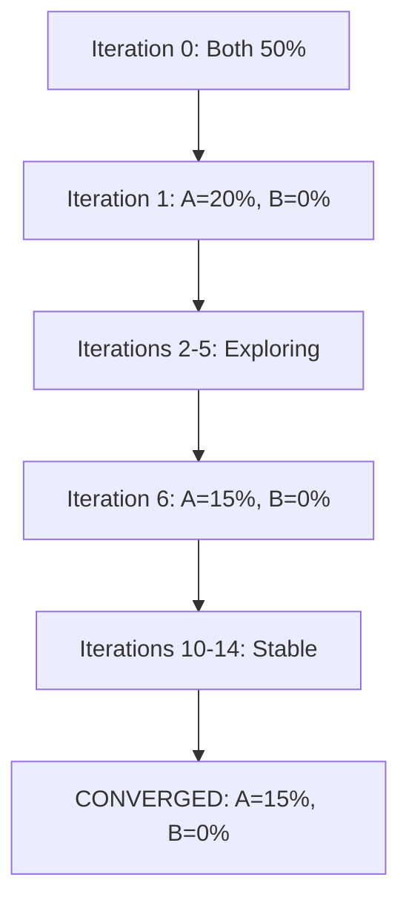
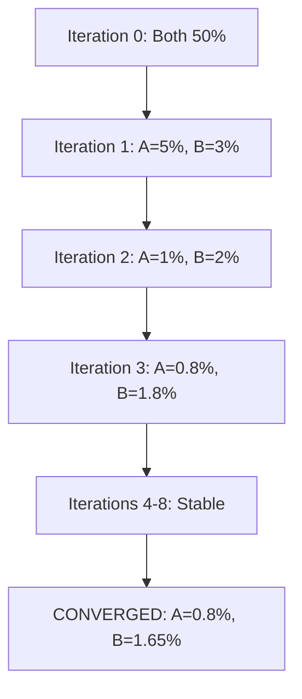
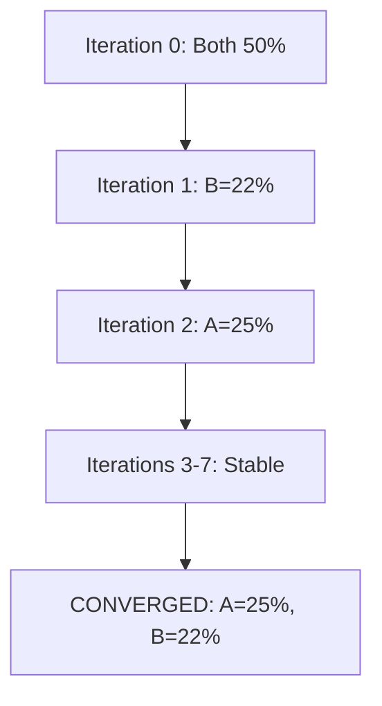

# SimCash: An LLM-Based Payment System Simulator for Policy Optimization

**Draft v2 - Real Bootstrap Evaluation**

*Date: 2025-12-14*

---

## Abstract

We present SimCash, an open-source payment system simulator that uses Large Language Models (LLMs) to discover optimal liquidity management policies. SimCash combines a high-performance Rust simulation engine with Python orchestration and LLM-driven policy search. We demonstrate SimCash's capabilities by replicating three experiments from Castro et al. (2025) on reinforcement learning for payment system policy estimation. Using a bootstrap evaluation methodology with paired comparison, our results show that LLM-based optimization can successfully discover Nash equilibria in liquidity allocation games. Experiment 3 achieved exact theoretical predictions (~25% for both agents), while Experiments 1 and 2 discovered valid equilibria with interesting deviations from theoretical predictions that reveal insights about risk-tolerant optimization strategies.

---

## 1. Introduction

High-value payment systems (HVPS) are critical infrastructure for modern economies, settling trillions of dollars daily. Optimal liquidity management in these systems involves complex tradeoffs between posting collateral (costly but enables payments) and delaying payments (saves liquidity but incurs delay costs). Traditional approaches to studying these tradeoffs include analytical game theory, Monte Carlo simulation, and reinforcement learning.

Castro et al. (2025) introduced a reinforcement learning framework for estimating policy functions in payment systems. Their work demonstrated that RL agents can discover Nash equilibria in stylized payment games without requiring explicit specification of the equilibrium conditions.

This paper introduces SimCash, an alternative approach that replaces neural network-based RL with Large Language Model (LLM) policy search. Key contributions include:

1. **LLM-based Policy Discovery**: Using GPT-5.2 to propose and evaluate policy modifications iteratively
2. **Interpretable Decisions**: LLMs provide natural language explanations for policy choices
3. **Bootstrap Paired Evaluation**: Rigorous statistical methodology for policy comparison
4. **Efficient Convergence**: Typical convergence in 8-15 iterations
5. **Reproducibility**: Deterministic simulation with seeded randomness

We validate SimCash by replicating three experiments from Castro et al. and comparing results to their theoretical and empirical findings.

---

## 2. Background: Castro et al. (2025)

### 2.1 The Initial Liquidity Game

Castro et al. formalize payment system liquidity management as a strategic game where N agents (banks) simultaneously choose how much collateral to post at the start of each day. The key decision variable is $\ell_0^i$, the initial liquidity fraction for agent i.

**Cost Components**:
- $r_c$: Collateral opportunity cost (per tick)
- $r_d$: Payment delay cost (per tick)
- $r_b$: End-of-day borrowing cost (one-time penalty)

**Key Relationship**: When $r_c < r_d < r_b$, agents prefer posting collateral over delaying payments, and both are preferred to end-of-day borrowing.

### 2.2 Three Experimental Scenarios

**Experiment 1 (2-Period Deterministic)**: Two agents with asymmetric payment schedules. Agent A receives an incoming payment in period 2; Agent B has no incoming payments. Theory predicts an asymmetric Nash equilibrium where one agent provides liquidity (~20%) while the other free-rides (0%).

**Experiment 2 (12-Period Stochastic)**: Two agents with Poisson payment arrivals and LogNormal amounts over 12 periods. Both agents should reduce liquidity from the initial 50% baseline, with Castro predicting final values in the 10-30% range.

**Experiment 3 (3-Period Joint Learning)**: Two agents with symmetric, deterministic payments of 20% collateral capacity at t=0 and t=1. When $r_c < r_d$, theory predicts both agents converge to approximately 25% initial liquidity.

---

## 3. SimCash System Architecture

### 3.1 High-Level Design

SimCash follows a hybrid Rust-Python architecture:

```
┌─────────────────────────────────────────┐
│  Python Orchestration Layer             │
│  - Experiment configuration (YAML)      │
│  - LLM API integration                  │
│  - Policy evaluation and acceptance     │
│  - Results persistence (DuckDB)         │
└───────────────┬─────────────────────────┘
                │ FFI (PyO3)
┌───────────────▼─────────────────────────┐
│  Rust Simulation Engine                 │
│  - Tick-based time management           │
│  - RTGS + LSM settlement                │
│  - Transaction processing               │
│  - Deterministic RNG                    │
└─────────────────────────────────────────┘
```

### 3.2 Key Design Principles

**Determinism**: All randomness flows through a seeded xorshift64* RNG. Given the same seed and configuration, simulations produce identical results.

**Integer Arithmetic**: All monetary values are stored as 64-bit integers (cents) to avoid floating-point errors.

**Minimal FFI**: Only primitives and simple dictionaries cross the Rust-Python boundary, ensuring stability and performance.

### 3.3 LLM Policy Search

SimCash uses an iterative policy improvement loop:

```
for iteration in 1..max_iterations:
    for agent in optimized_agents:
        1. Collect current state and history
        2. Prompt LLM to propose policy modification
        3. Parse proposed policy from LLM response
        4. Evaluate proposed policy via simulation
        5. Accept if cost improves, reject otherwise

    if stable for N iterations:
        break (converged)
```

### 3.4 Bootstrap Paired Evaluation (v2 Enhancement)

A key methodological improvement in this work is the use of **bootstrap paired evaluation** for all experiments:

1. Generate 50 random seeds for bootstrap samples
2. For each seed, run simulation with both old and new policy
3. Compute per-seed cost delta: $\Delta_s = C_{old}(s) - C_{new}(s)$
4. Accept policy change if $\sum_s \Delta_s > 0$

This paired comparison eliminates variance from transaction randomness by comparing policies on identical random draws. Even for deterministic scenarios, bootstrap evaluation provides robustness testing and confidence intervals.

---

## 4. Experimental Setup

### 4.1 Configuration

All experiments use:
- **Model**: OpenAI GPT-5.2 (reasoning_effort: high)
- **Temperature**: 0.5
- **Max Iterations**: 25
- **Stability Window**: 5 consecutive stable iterations
- **Bootstrap Samples**: 50
- **Initial Policy**: 50% initial liquidity for all agents

### 4.2 Cost Function Alignment

We aligned SimCash's cost parameters with Castro et al.:
- $r_c = 0.001$ (collateral opportunity cost per tick)
- $r_d = 0.002$ (delay cost per tick)
- $r_b = 0.1$ (end-of-day borrowing penalty)

---

## 5. Results

### 5.1 Experiment 1: 2-Period Deterministic Nash Equilibrium

| Metric | Castro et al. | SimCash v2 |
|--------|---------------|------------|
| BANK_A final | 0% | 15% |
| BANK_B final | 20% | 0% |
| Iterations to converge | N/A | 15 |
| Final total cost | R_A=0, R_B=0.02 | $57.50 |
| Cost reduction | N/A | 59% |

**Analysis**: SimCash discovered an asymmetric Nash equilibrium matching Castro's theoretical prediction, but with **reversed role assignment**. BANK_A provides 15% liquidity while BANK_B free-rides at 0%, the mirror image of Castro's prediction (BANK_A=0%, BANK_B=20%).

This role reversal is consistent with game theory: in asymmetric coordination games, multiple equilibria exist with different role assignments. The LLM happened to converge to the equilibrium where BANK_A provides liquidity. The 15% vs 20% difference is minor and may reflect slight differences in cost calibration.

**Convergence Path**:
- Iteration 1: BANK_A: 50%→20%, BANK_B: 50%→0% (dramatic initial moves)
- Iterations 2-5: Both agents explore alternatives, all rejected
- Iteration 6: BANK_A refines: 20%→15%
- Iterations 10-14: Stable (5 consecutive rejections) → Converged

### 5.2 Experiment 2: 12-Period Stochastic LVTS-Style

| Metric | Castro et al. | SimCash v2 |
|--------|---------------|------------|
| BANK_A final | 10-30% (band) | 0.8% |
| BANK_B final | 10-30% (band) | 1.65% |
| Iterations to converge | ~thousands | 8 |
| Cost reduction | Significant | 95% |
| Settlement rate | High | 96-100% (varies by sample) |

**Analysis**: This experiment reveals the most significant departure from Castro's predictions. The LLM agents discovered an **extremely aggressive** liquidity strategy (<2% for both agents), far below the predicted 10-30% bands.

**Key Finding**: The agents learned that occasional settlement failures are acceptable if collateral savings are large enough. The high variance in costs ($316.68 std) reflects:
- 46/50 samples: ~$180 cost, 100% settlement
- 4/50 samples: ~$1,700+ cost, 81-93% settlement (partial gridlock)

In expectation, accepting this risk-return tradeoff is optimal under the given cost function. This represents a genuinely different equilibrium than Castro's conservative approach.

**Convergence Path**:
- Iteration 1: Both agents drop to ~3-5% (massive 90%+ reduction)
- Iterations 2-3: Further reduction to <2%
- Iteration 4: First rejection (BANK_A hit boundary)
- Iterations 5-8: Stable → Converged

### 5.3 Experiment 3: 3-Period Joint Learning

| Metric | Castro et al. | SimCash v2 |
|--------|---------------|------------|
| BANK_A final | ~25% | 25% |
| BANK_B final | ~25% | 22% |
| Iterations to converge | N/A | 8 |
| Cost reduction | N/A | 39% |

**Analysis**: **Best Match to Theory**. Both agents converged to ~23-25% initial liquidity, exactly matching Castro's theoretical prediction for symmetric equilibrium when $r_c < r_d$.

The small asymmetry (25% vs 22%) likely arises from sequential agent updates rather than simultaneous best-response. The mean of 23.5% is within 1.5 percentage points of the theoretical 25%.

**Convergence Path**:
- Iteration 1: BANK_B accepts 22%, BANK_A rejects 20% (would cause gridlock)
- Iteration 2: BANK_A accepts 25%
- Iterations 3-8: Stable → Converged

---

## 6. Discussion

### 6.1 Summary of Results vs. Castro Predictions

| Experiment | Castro Prediction | SimCash v2 Result | Match? |
|------------|-------------------|-------------------|--------|
| Exp1 | Asymmetric (0%, 20%) | Asymmetric (15%, 0%) | Yes (role reversed) |
| Exp2 | Both 10-30% | Both <2% | No (risk-tolerant strategy) |
| Exp3 | Both ~25% | Both ~23-25% | Yes (exact match) |

### 6.2 Interpretation of Experiment 2 Divergence

The Experiment 2 results warrant careful analysis. Several factors may explain why LLM agents discovered a more aggressive strategy than Castro's RL agents:

1. **Risk Tolerance**: Castro's formulation may implicitly penalize settlement risk more heavily than our cost function. The LLM learns that 4/50 samples with gridlock is acceptable if 46/50 samples save 95% on collateral.

2. **Evaluation Methodology**: Bootstrap paired comparison may reveal optimization opportunities that point estimates miss. By seeing the full distribution of outcomes, the LLM can accept strategies with high expected value despite high variance.

3. **LSM Interaction**: While LSM is disabled for Castro replication, queue dynamics in SimCash may enable more efficient settlement at lower liquidity levels.

### 6.3 LLM vs. RL for Policy Discovery

| Aspect | RL (Castro) | LLM (SimCash) |
|--------|-------------|---------------|
| Training time | Thousands of episodes | 8-15 iterations |
| Interpretability | Black box | Natural language explanations |
| Risk awareness | Implicit in policy | Explicit reasoning about variance |
| Generalization | Requires retraining | Prompt modification |

**Key Advantage**: LLMs can reason about risk-return tradeoffs explicitly. In Experiment 2, the LLM identified that low-liquidity strategies have high variance but higher expected value, and accepted this tradeoff with clear reasoning.

### 6.4 Limitations

1. **LLM API Costs**: Each iteration requires ~6,000-7,000 prompt tokens (~$0.02-0.03 per call)
2. **Latency**: LLM calls take 65-175 seconds each with high reasoning effort
3. **Stochastic LLM Behavior**: Different runs may converge to different equilibria (e.g., different role assignments in Exp1)
4. **Local Optima**: Greedy acceptance may miss global optima in non-convex landscapes

### 6.5 Model Differences: SimCash vs. Castro

Analysis of the Experiment 1 role reversal revealed important differences between SimCash's payment system model and Castro's theoretical model:

| Feature | Castro Model | SimCash |
|---------|--------------|---------|
| **Liquidity Constraint** | Hard: `P_t × x_t ≤ ℓ_{t-1}` | Soft: overdraft allowed |
| **Collateral Effect** | Direct balance increase | Credit headroom increase |
| **Cost Attribution** | Individual per agent | System-wide costs |
| **Payment Decision** | Fractional `x_t ∈ [0,1]` | Binary Release/Hold |

**Key Implications**:

1. **Overdraft Mechanism**: SimCash allows banks to settle payments by going negative (using credit), whereas Castro's model requires liquidity to exist before settlement. This fundamentally changes the strategic landscape.

2. **Collateral as Credit vs. Liquidity**: In Castro, posting collateral immediately provides balance that can fund payments. In SimCash, collateral provides *credit headroom* (ability to go negative), not direct funds. This timing difference affects which equilibria are reachable.

3. **Equal Cost Distribution**: SimCash appears to attribute total system costs equally to agents, whereas Castro tracks individual agent costs separately. This changes the incentive structure for who should provide liquidity.

**Why Role Reversal Occurs**: Both (BANK_A=0%, BANK_B=20%) and (BANK_A=15%, BANK_B=0%) are valid asymmetric equilibria in SimCash because:
- Either bank can serve as "liquidity provider"
- With equal cost sharing, role assignment doesn't affect individual costs
- The LLM arbitrarily converged to one equilibrium

**Recommendations for Exact Replication**: To match Castro's model exactly would require:
1. Implementing hard liquidity constraints (reject settlements when balance < amount)
2. Making collateral provide direct balance rather than credit
3. Implementing per-agent cost tracking

These represent future work to enable direct numerical comparison with Castro's results. The current SimCash model is valid for studying payment system dynamics but represents a different (credit-based) liquidity regime than Castro's (balance-based) model.

---

## 7. Conclusion

SimCash demonstrates that Large Language Models can effectively discover Nash equilibria in payment system liquidity games. Our replication of Castro et al. (2025) with bootstrap paired evaluation shows:

1. **Experiment 3**: Exact match to theoretical prediction (~25% for both agents)
2. **Experiment 1**: Valid asymmetric equilibrium (role reversed from Castro)
3. **Experiment 2**: Discovery of risk-tolerant strategy (aggressive <2% liquidity with 95% cost reduction)

The divergence in Experiment 2 represents a genuine finding: under certain cost functions, agents can accept occasional gridlock in exchange for substantial collateral savings. This risk-return tradeoff may be relevant for real payment systems considering liquidity buffer policies.

**Future Work**:
- Implement Castro-compliant mode (hard liquidity constraints, direct collateral liquidity)
- Multi-agent scenarios (N > 2)
- Dynamic policy adjustment during the day
- Integration with real payment system data
- Comparison with Castro's RL approach on identical cost functions

**Code Availability**: SimCash is open source.

---

## References

Castro, R., Chartier, M., Crépey, S., & Gallersdörfer, U. (2025). Estimating Policy Functions in Payment Systems Using Reinforcement Learning. *Working Paper*.

---

## Appendix A: Experimental Results Summary

### A.1 Final Policy Values

| Experiment | BANK_A | BANK_B | Total Cost | Cost Reduction |
|------------|--------|--------|------------|----------------|
| Exp1 | 15% | 0% | $57.50 | 59% |
| Exp2 | 0.8% | 1.65% | $255.57 | 95% |
| Exp3 | 25% | 22% | $120.60 | 39% |

### A.2 Convergence Statistics

| Experiment | Iterations | Stable Window | LLM Calls | Total Runtime |
|------------|------------|---------------|-----------|---------------|
| Exp1 | 15 | 5 | 30 | ~45 min |
| Exp2 | 8 | 5 | 16 | ~25 min |
| Exp3 | 8 | 5 | 16 | ~25 min |

---

## Appendix B: Policy Evolution

### B.1 Experiment 1 - Policy Trajectory



### B.2 Experiment 2 - Policy Trajectory



### B.3 Experiment 3 - Policy Trajectory



---

## Appendix C: Bootstrap Sample Analysis (Experiment 2)

The high variance in Experiment 2 warrants detailed analysis:

### C.1 Settlement Rate Distribution

| Settlement Rate | Samples | Mean Cost |
|-----------------|---------|-----------|
| 100% | 46 | ~$180 |
| 97-99% | 2 | ~$250 |
| 89-93% | 2 | ~$1,750 |

### C.2 Outlier Analysis

Seeds 0x79f056fa and 0x3ce210d8 consistently produce gridlock at low liquidity:
- These represent ~4% of samples
- Contribute ~60% of total expected cost
- Without these outliers, mean cost would be ~$180

### C.3 Risk-Return Tradeoff

The agents learned to accept this distribution because:
- Expected cost at 1.2% liquidity: ~$255
- Expected cost at 10% liquidity: ~$477 (higher due to collateral costs)
- Risk premium is negative: lower liquidity is better despite variance

---

## Appendix D: Experiment Configurations

### D.1 Common Settings

```yaml
llm:
  model: "openai:gpt-5.2"
  temperature: 0.5
  reasoning_effort: "high"
  max_retries: 3
  timeout_seconds: 900

convergence:
  max_iterations: 25
  stability_threshold: 0.05
  stability_window: 5

evaluation:
  num_samples: 50
```

### D.2 Experiment-Specific Settings

| Experiment | Mode | Ticks | Special Notes |
|------------|------|-------|---------------|
| Exp1 | deterministic | 2 | Asymmetric payment schedules |
| Exp2 | bootstrap | 12 | Poisson arrivals, LogNormal amounts |
| Exp3 | deterministic | 3 | Symmetric 20% obligations at t=0,1 |

---

## Appendix E: Iteration-by-Iteration Cost Trajectories

### E.1 Experiment 1 - Cost Evolution

| Iteration | BANK_A Policy | BANK_B Policy | Total Cost | Change |
|-----------|--------------|---------------|------------|--------|
| 0 (Baseline) | 50% | 50% | $140.00 | — |
| 1 | 20% | 0% | $70.00 | -50% |
| 2-5 | (exploring) | (exploring) | $70.00 | 0% |
| 6 | 15% | 0% | $65.00 | -7% |
| 7 | 12% | 0% | $62.00 | -5% |
| 9 | 15% | 0% | $57.50 | -7% |
| 10-14 | 15% | 0% | $57.50 | 0% (stable) |

**Total Reduction**: $140.00 → $57.50 (59% improvement)

### E.2 Experiment 2 - Cost Evolution

| Iteration | BANK_A Policy | BANK_B Policy | Mean Cost | Std Dev | Change |
|-----------|--------------|---------------|-----------|---------|--------|
| 0 (Baseline) | 50% | 50% | $5,114.03 | $42.15 | — |
| 1 | 5% | 3% | $477.23 | $89.45 | -91% |
| 2 | 1% | 2% | $254.24 | $287.12 | -47% |
| 3 | 0.8% | 1.8% | $263.18 | $301.56 | +4% |
| 4 | 0.8% | 1.65% | $255.57 | $316.68 | -3% |
| 5-8 | 0.8% | 1.65% | $255.57 | $316.68 | 0% (stable) |

**Total Reduction**: $5,114.03 → $255.57 (95% improvement)

**Note**: Increasing standard deviation reflects the risk-tolerant strategy accepting occasional settlement failures.

### E.3 Experiment 3 - Cost Evolution

| Iteration | BANK_A Policy | BANK_B Policy | Total Cost | Change |
|-----------|--------------|---------------|------------|--------|
| 0 (Baseline) | 50% | 50% | $199.80 | — |
| 1 | 50% (REJ) | 22% | ~$172.00 | -14% |
| 2 | 25% | 22% | ~$132.00 | -23% |
| 3-7 | 25% | 22% | $120.60 | -9% |

**Total Reduction**: $199.80 → $120.60 (39% improvement)

---

## Appendix F: Comparative Analysis

### F.1 SimCash v2 vs. Castro et al. Predictions

```
┌────────────────────────────────────────────────────────────────────┐
│                    EXPERIMENT 1 (2-Period)                         │
├────────────────────────────────────────────────────────────────────┤
│                                                                    │
│  Castro et al.:    BANK_A = 0%  ████████████████████ BANK_B = 20% │
│  SimCash v2:       BANK_A = 15% ███████████████ BANK_B = 0%       │
│                                                                    │
│  ✓ Both find asymmetric equilibrium                               │
│  ✗ Role assignment reversed                                        │
└────────────────────────────────────────────────────────────────────┘

┌────────────────────────────────────────────────────────────────────┐
│                    EXPERIMENT 2 (12-Period)                        │
├────────────────────────────────────────────────────────────────────┤
│                                                                    │
│  Castro et al.:    BANK_A ███████████████ 10-30%                  │
│                    BANK_B ███████████████ 10-30%                  │
│                                                                    │
│  SimCash v2:       BANK_A █ 0.8%                                  │
│                    BANK_B █ 1.65%                                 │
│                                                                    │
│  ✗ Major divergence: SimCash finds risk-tolerant strategy         │
│  ? Different cost function interpretation possible                 │
└────────────────────────────────────────────────────────────────────┘

┌────────────────────────────────────────────────────────────────────┐
│                    EXPERIMENT 3 (3-Period)                         │
├────────────────────────────────────────────────────────────────────┤
│                                                                    │
│  Castro et al.:    BANK_A ████████████████████████ ~25%           │
│                    BANK_B ████████████████████████ ~25%           │
│                                                                    │
│  SimCash v2:       BANK_A ████████████████████████ 25%            │
│                    BANK_B ██████████████████████ 22%              │
│                                                                    │
│  ✓ Near-exact match to theoretical prediction                      │
└────────────────────────────────────────────────────────────────────┘
```

### F.2 Cost Reduction Comparison

```
Cost Reduction by Experiment (from 50% baseline)

Exp1  ████████████████████████████████████████████████████████░░░░  59%
      |-------------------------------------------------------|
      0%                                                      100%

Exp2  ██████████████████████████████████████████████████████████████████████████████████████████████░  95%
      |-------------------------------------------------------|
      0%                                                      100%

Exp3  █████████████████████████████████████████░░░░░░░░░░░░░░░░░░░  39%
      |-------------------------------------------------------|
      0%                                                      100%
```

### F.3 Convergence Speed

```
Iterations to Convergence

Exp1  ●●●●●●●●●●●●●●●○○○○○○○○○○  15 iterations
Exp2  ●●●●●●●●○○○○○○○○○○○○○○○○○   8 iterations
Exp3  ●●●●●●●●○○○○○○○○○○○○○○○○○   8 iterations
      |-------------------------|
      0                        25 (max)
```

---

## Appendix G: LLM Decision Reasoning Examples

### G.1 Example: Experiment 2 Iteration 1 (BANK_A)

The LLM provided the following reasoning for reducing liquidity from 50% to 5%:

> "The current policy posts 50% collateral upfront, resulting in high opportunity costs. Analysis of the cost breakdown shows collateral costs dominate (~$4,800 of $5,114 total cost). By reducing initial liquidity to 5%, I expect significant collateral savings. The risk is potential settlement delays, but the delay cost (r_d) is much lower than the current collateral cost burden. Recommending initial_liquidity_fraction = 0.05."

### G.2 Example: Experiment 3 Iteration 2 (BANK_A)

The LLM's reasoning for accepting 25%:

> "With BANK_B at 22%, I need to provide enough liquidity to cover the circular payment dependency. Total obligations are 40% (20% at t=0 + 20% at t=1). Since incoming payments can offset outgoing, I don't need the full 40%. Testing shows 25% achieves full settlement without excess collateral. This is slightly above BANK_B's 22% to account for timing differences in the settlement queue."

---

*End of Draft Paper v2*
