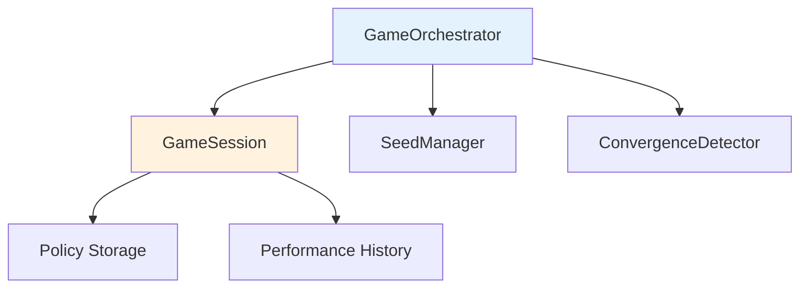
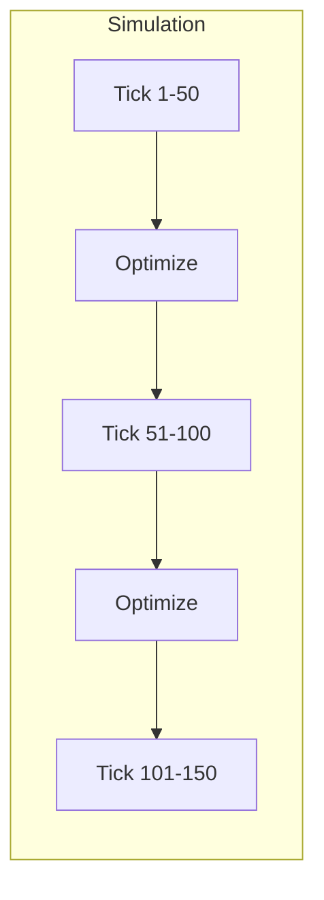
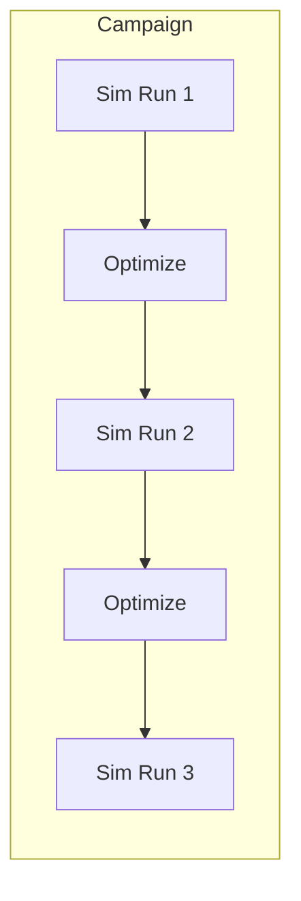
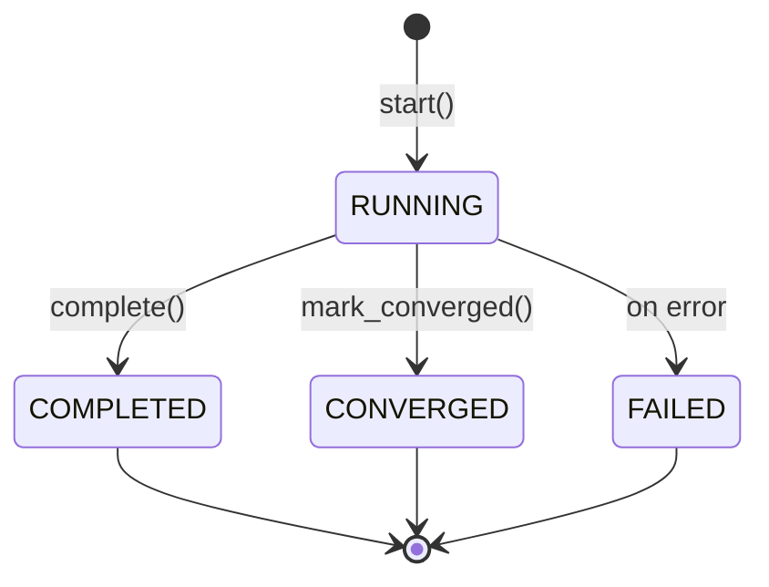

# Core Components

> GameOrchestrator, GameSession, and GameMode

**Version**: 0.1.0
**Last Updated**: 2025-12-11

---

## Overview

The core components manage the optimization lifecycle:



---

## GameOrchestrator

Main controller for the AI Cash Management game lifecycle.

### Synopsis

```python
from payment_simulator.ai_cash_mgmt import GameOrchestrator, GameConfig

config = GameConfig.from_yaml("game_config.yaml")
orchestrator = GameOrchestrator(config)
```

### Constructor

```python
def __init__(
    self,
    config: GameConfig,
    constraints: ScenarioConstraints | None = None,
) -> None:
    """Initialize the game orchestrator.

    Args:
        config: Game configuration.
        constraints: Scenario constraints for validation.
                    If None, uses default constraints.
    """
```

### Properties

| Property | Type | Description |
|----------|------|-------------|
| `game_id` | `str` | Unique game identifier |
| `master_seed` | `int` | Master RNG seed |
| `seed_manager` | `SeedManager` | Seed derivation manager |
| `convergence_detector` | `ConvergenceDetector` | Convergence tracker |

### Methods

#### `create_session`

Create a new game session.

```python
def create_session(self) -> GameSession:
    """Create a new game session.

    Returns:
        GameSession for tracking optimization state.
    """
```

**Example**:
```python
orchestrator = GameOrchestrator(config)
session = orchestrator.create_session()
session.start()
```

---

#### `should_optimize_at_tick`

Check if optimization should trigger at a given tick.

```python
def should_optimize_at_tick(self, tick: int) -> bool:
    """Check if optimization should trigger at this tick.

    Args:
        tick: Current simulation tick.

    Returns:
        True if optimization should run.
    """
```

**Behavior**:
- For `EVERY_X_TICKS`: Returns `True` if `tick % interval_ticks == 0`
- For `AFTER_EOD` or `ON_SIMULATION_END`: Returns `False`

**Example**:
```python
for tick in range(total_ticks):
    orchestrator.tick()
    if orchestrator.should_optimize_at_tick(tick):
        await run_optimization()
```

---

#### `should_optimize_after_eod`

Check if optimization should trigger after end-of-day.

```python
def should_optimize_after_eod(self, remaining_days: int) -> bool:
    """Check if optimization should trigger after end-of-day.

    Args:
        remaining_days: Days remaining in simulation.

    Returns:
        True if optimization should run.
    """
```

**Behavior**:
- For `AFTER_EOD`: Returns `True`
- For `ON_SIMULATION_END` with `remaining_days == 0`: Returns `True`
- Otherwise: Returns `False`

---

#### `get_sampling_seed`

Get deterministic seed for bootstrap sampling.

```python
def get_sampling_seed(self, iteration: int, agent_id: str) -> int:
    """Get deterministic seed for sampling.

    Args:
        iteration: Current optimization iteration.
        agent_id: Agent being optimized.

    Returns:
        Derived seed for reproducible sampling.
    """
```

**Example**:
```python
seed = orchestrator.get_sampling_seed(iteration=5, agent_id="BANK_A")
sampler = TransactionSampler(seed=seed)
```

---

#### `record_iteration_metric`

Record cost metric for convergence tracking.

```python
def record_iteration_metric(self, cost: float) -> None:
    """Record cost for convergence tracking.

    Args:
        cost: Total cost for this iteration.
    """
```

---

#### `check_convergence`

Get current convergence status.

```python
def check_convergence(self) -> dict[str, Any]:
    """Check convergence status.

    Returns:
        Dict with keys:
        - is_converged: bool
        - convergence_reason: str | None
        - iterations: int
    """
```

**Example**:
```python
while True:
    # ... run optimization ...
    status = orchestrator.check_convergence()
    if status["is_converged"]:
        print(f"Converged: {status['convergence_reason']}")
        break
```

---

#### `run_optimization_step`

Run optimization for all agents (async).

```python
async def run_optimization_step(
    self,
    session: GameSession,
    transactions: list[dict[str, Any]],
    current_tick: int,
    llm_client: LLMClientProtocol,
) -> list[OptimizationResult]:
    """Run one optimization step for all agents.

    Args:
        session: Current game session.
        transactions: Historical transactions for sampling.
        current_tick: Current simulation tick.
        llm_client: LLM client for policy generation.

    Returns:
        List of OptimizationResult for each agent.
    """
```

---

## GameSession

Tracks optimization state and policy history per agent.

### Synopsis

```python
from payment_simulator.ai_cash_mgmt import GameSession

session = orchestrator.create_session()
session.start()
```

### Properties

| Property | Type | Description |
|----------|------|-------------|
| `session_id` | `str` | Unique session identifier |
| `game_id` | `str` | Parent game identifier |
| `master_seed` | `int` | Master RNG seed |
| `current_iteration` | `int` | Current optimization iteration |
| `is_converged` | `bool` | Whether optimization has converged |
| `status` | `GameStatus` | Current session status |

### Lifecycle Methods

#### `start`

Start the game session.

```python
def start(self) -> None:
    """Start the session.

    Sets status to RUNNING and records start time.
    """
```

---

#### `complete`

Mark session as completed.

```python
def complete(self) -> None:
    """Mark session as completed.

    Sets status to COMPLETED and records end time.
    """
```

---

#### `mark_converged`

Mark session as converged.

```python
def mark_converged(self, reason: str) -> None:
    """Mark session as converged.

    Args:
        reason: Convergence reason (e.g., "stability_threshold_met").
    """
```

---

### Policy Management

#### `set_policy`

Set current policy for an agent.

```python
def set_policy(self, agent_id: str, policy: dict[str, Any]) -> None:
    """Set the current policy for an agent.

    Args:
        agent_id: Agent identifier.
        policy: Policy JSON dict.
    """
```

**Example**:
```python
session.set_policy("BANK_A", {
    "version": "2.0",
    "parameters": {"urgency_threshold": 3},
    "payment_tree": {...},
})
```

---

#### `get_policy`

Get current policy for an agent.

```python
def get_policy(self, agent_id: str) -> dict[str, Any] | None:
    """Get the current policy for an agent.

    Args:
        agent_id: Agent identifier.

    Returns:
        Policy dict or None if not set.
    """
```

---

#### `get_best_policy`

Get the best policy seen for an agent.

```python
def get_best_policy(self, agent_id: str) -> dict[str, Any] | None:
    """Get the best policy seen during optimization.

    Args:
        agent_id: Agent identifier.

    Returns:
        Best policy dict or None if no evaluations.
    """
```

---

### History Tracking

#### `record_evaluation`

Record a policy evaluation result.

```python
def record_evaluation(
    self,
    agent_id: str,
    policy: dict[str, Any],
    mean_cost: float,
    iteration: int,
) -> None:
    """Record a policy evaluation.

    Args:
        agent_id: Agent identifier.
        policy: Evaluated policy.
        mean_cost: Mean cost across bootstrap samples.
        iteration: Iteration number.
    """
```

---

#### `get_agent_history`

Get performance history for an agent.

```python
def get_agent_history(self, agent_id: str) -> list[dict[str, Any]]:
    """Get agent's evaluation history.

    Args:
        agent_id: Agent identifier.

    Returns:
        List of evaluation records with keys:
        - iteration: int
        - cost: float
        - policy: dict (optional)
    """
```

**Privacy Guarantee**: Each agent only sees its own history. No cross-agent information leakage.

---

#### `record_iteration_result`

Record iteration-level metrics.

```python
def record_iteration_result(
    self,
    total_cost: float,
    per_agent_costs: dict[str, float],
    settlement_rate: float,
) -> None:
    """Record overall iteration results.

    Args:
        total_cost: Total cost across all agents.
        per_agent_costs: Cost breakdown by agent.
        settlement_rate: Percentage of transactions settled.
    """
```

---

## GameMode

Enum defining optimization modes.

### Values

```python
from payment_simulator.ai_cash_mgmt import GameMode

class GameMode(str, Enum):
    RL_OPTIMIZATION = "rl_optimization"
    CAMPAIGN_LEARNING = "campaign_learning"
```

### Mode Comparison

| Mode | Optimization Timing | Transaction Source | Use Case |
|------|---------------------|-------------------|----------|
| `RL_OPTIMIZATION` | During simulation | Current simulation | Real-time adaptation |
| `CAMPAIGN_LEARNING` | Between simulations | Historical | Offline training |

### RL_OPTIMIZATION



**Characteristics**:
- Optimization runs during simulation
- Policies updated mid-simulation
- Transactions from current run
- More responsive but less stable

### CAMPAIGN_LEARNING



**Characteristics**:
- Optimization runs between simulations
- Complete simulation before optimization
- Historical transactions from past runs
- More stable convergence

---

## GameStatus

Enum for session lifecycle states.

### Values

```python
class GameStatus(str, Enum):
    RUNNING = "running"
    COMPLETED = "completed"
    FAILED = "failed"
    CONVERGED = "converged"
```

### State Transitions



---

## Complete Example

```python
from payment_simulator.ai_cash_mgmt import (
    GameConfig,
    GameOrchestrator,
    GameMode,
    PolicyOptimizer,
)

# Initialize
config = GameConfig(
    game_id="my-game",
    scenario_config="scenario.yaml",
    master_seed=42,
    game_mode=GameMode.CAMPAIGN_LEARNING,
    optimized_agents={"BANK_A": {}, "BANK_B": {}},
    default_llm_config=LLMConfig(
        provider=LLMProviderType.ANTHROPIC,
        model="claude-sonnet-4-5-20250929",
    ),
)

orchestrator = GameOrchestrator(config)
session = orchestrator.create_session()
session.start()

# Optimization loop
iteration = 0
while iteration < config.convergence.max_iterations:
    iteration += 1

    # Evaluate and optimize each agent
    for agent_id in config.optimized_agents:
        # Get history for this agent only
        history = session.get_agent_history(agent_id)

        # Optimize
        result = await optimizer.optimize(
            agent_id=agent_id,
            current_policy=session.get_policy(agent_id),
            performance_history=history,
            llm_client=llm_client,
            llm_model=config.default_llm_config.model,
        )

        if result.was_accepted and result.new_policy:
            session.set_policy(agent_id, result.new_policy)

    # Track convergence
    orchestrator.record_iteration_metric(total_cost)
    status = orchestrator.check_convergence()

    if status["is_converged"]:
        session.mark_converged(status["convergence_reason"])
        break

# Complete
if not session.is_converged:
    session.complete()

print(f"Best cost: {orchestrator.convergence_detector.best_metric}")
```

---

## Navigation

**Previous**: [Configuration](configuration.md)
**Next**: [Optimization](optimization.md)
