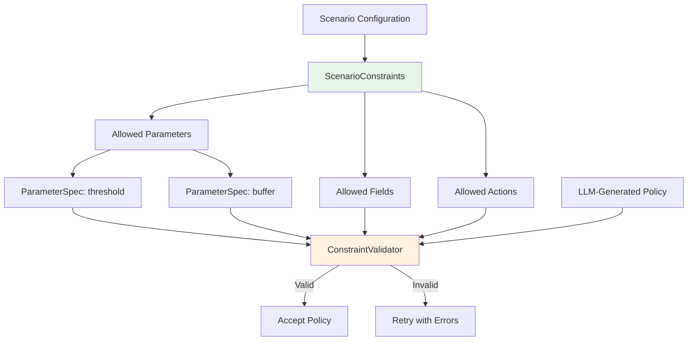
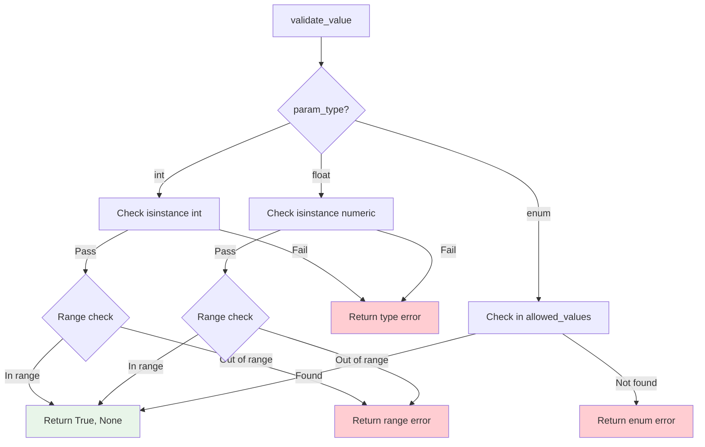

# Constraints

> ScenarioConstraints, ParameterSpec, and Policy Validation

**Version**: 0.1.0
**Last Updated**: 2025-12-09

---

## Overview

The constraints system limits what policies the LLM can generate, ensuring valid decision trees that respect scenario-specific limitations:



---

## ScenarioConstraints

Defines what the LLM can use when generating policies.

### Synopsis

```python
from payment_simulator.ai_cash_mgmt import ScenarioConstraints, ParameterSpec

constraints = ScenarioConstraints(
    allowed_parameters=[
        ParameterSpec(
            name="urgency_threshold",
            param_type="int",
            min_value=0,
            max_value=20,
            default=3,
        ),
    ],
    allowed_fields=["balance", "ticks_to_deadline", "amount"],
    allowed_actions={
        "payment_tree": ["submit", "queue", "hold"],
        "bank_tree": ["borrow", "repay", "none"],
    },
)
```

### Fields

| Field | Type | Description |
|-------|------|-------------|
| `allowed_parameters` | `list[ParameterSpec]` | Parameters the LLM can use in policies |
| `allowed_fields` | `list[str]` | Context fields for conditions |
| `allowed_actions` | `dict[str, list[str]]` | Actions per tree type |

---

### Methods

#### `get_parameter_spec`

Get parameter specification by name.

```python
def get_parameter_spec(self, name: str) -> ParameterSpec | None:
    """Get parameter spec by name.

    Args:
        name: Parameter name.

    Returns:
        ParameterSpec if found, None otherwise.
    """
```

**Example**:
```python
spec = constraints.get_parameter_spec("urgency_threshold")
if spec:
    print(f"Range: {spec.min_value} - {spec.max_value}")
```

---

#### `is_parameter_allowed`

Check if a parameter name is permitted.

```python
def is_parameter_allowed(self, name: str) -> bool:
    """Check if a parameter name is allowed.

    Args:
        name: Parameter name.

    Returns:
        True if parameter is allowed.
    """
```

---

#### `is_field_allowed`

Check if a context field is permitted.

```python
def is_field_allowed(self, field: str) -> bool:
    """Check if a context field is allowed.

    Args:
        field: Field name.

    Returns:
        True if field is allowed.
    """
```

---

#### `is_action_allowed`

Check if an action is permitted for a tree type.

```python
def is_action_allowed(self, tree_type: str, action: str) -> bool:
    """Check if an action is allowed for a tree type.

    Args:
        tree_type: Tree type (payment_tree, bank_tree, collateral_tree).
        action: Action name.

    Returns:
        True if action is allowed for the tree type.
    """
```

**Example**:
```python
if constraints.is_action_allowed("payment_tree", "split"):
    print("Splitting is allowed")
else:
    print("Splitting is not allowed in this scenario")
```

---

## ParameterSpec

Specification for a policy parameter with type and range constraints.

### Synopsis

```python
from payment_simulator.ai_cash_mgmt import ParameterSpec

# Integer parameter with range
threshold_spec = ParameterSpec(
    name="urgency_threshold",
    param_type="int",
    min_value=0,
    max_value=20,
    default=3,
    description="Ticks before deadline when payment becomes urgent",
)

# Float parameter
buffer_spec = ParameterSpec(
    name="liquidity_buffer",
    param_type="float",
    min_value=0.5,
    max_value=3.0,
    default=1.0,
)

# Enum parameter
op_spec = ParameterSpec(
    name="comparison_op",
    param_type="enum",
    allowed_values=["<", "<=", ">", ">=", "=="],
)
```

### Fields

| Field | Type | Description |
|-------|------|-------------|
| `name` | `str` | Parameter name (required) |
| `param_type` | `str` | Type: `"int"`, `"float"`, or `"enum"` |
| `min_value` | `int \| float \| None` | Minimum allowed value |
| `max_value` | `int \| float \| None` | Maximum allowed value |
| `default` | `Any` | Default value |
| `allowed_values` | `list[Any] \| None` | Allowed values for enum type |
| `description` | `str \| None` | Human-readable description |

---

### Methods

#### `validate_value`

Validate a value against the specification.

```python
def validate_value(self, value: Any) -> tuple[bool, str | None]:
    """Validate a value against this parameter spec.

    Args:
        value: The value to validate.

    Returns:
        Tuple of (is_valid, error_message).
    """
```

**Example**:
```python
spec = ParameterSpec(
    name="threshold",
    param_type="int",
    min_value=0,
    max_value=100,
)

is_valid, error = spec.validate_value(50)
assert is_valid is True
assert error is None

is_valid, error = spec.validate_value(150)
assert is_valid is False
assert "above max" in error
```

---

### Validation Logic



---

## Constraint Sets

Pre-defined constraint configurations for common scenarios.

### Castro Constraints

Aligned with Castro et al. (2025) paper rules:

```python
CASTRO_CONSTRAINTS = ScenarioConstraints(
    allowed_parameters=[
        ParameterSpec(
            name="initial_liquidity_fraction",
            param_type="float",
            min_value=0.0,
            max_value=1.0,
            default=0.25,
            description="Fraction of collateral to post at t=0",
        ),
        ParameterSpec(
            name="urgency_threshold",
            param_type="int",
            min_value=0,
            max_value=20,
            default=3,
            description="Ticks before deadline for urgency",
        ),
        ParameterSpec(
            name="liquidity_buffer",
            param_type="float",
            min_value=0.5,
            max_value=3.0,
            default=1.0,
        ),
    ],
    allowed_fields=[
        # Time context
        "system_tick_in_day",
        "ticks_remaining_in_day",
        "current_tick",
        # Agent state
        "balance",
        "effective_liquidity",
        # Transaction context
        "ticks_to_deadline",
        "remaining_amount",
        "amount",
        "priority",
        # Queue state
        "queue1_total_value",
        "outgoing_queue_size",
        # Collateral
        "max_collateral_capacity",
        "posted_collateral",
    ],
    allowed_actions={
        "payment_tree": ["Release", "Hold"],
        "bank_tree": ["NoAction"],
        "collateral_tree": ["PostCollateral", "HoldCollateral"],
    },
)
```

**Key Castro Restrictions**:
- Only Release/Hold for payments (no Split, ReleaseWithCredit)
- Collateral posting only at tick 0
- No mid-day collateral changes
- No bank-level budgeting

---

### Minimal Constraints

Bare minimum for simple policies:

```python
MINIMAL_CONSTRAINTS = ScenarioConstraints(
    allowed_parameters=[
        ParameterSpec(
            name="urgency_threshold",
            param_type="int",
            min_value=0,
            max_value=20,
            default=3,
        ),
    ],
    allowed_fields=[
        "balance",
        "effective_liquidity",
        "ticks_to_deadline",
        "remaining_amount",
        "ticks_remaining_in_day",
    ],
    allowed_actions={
        "payment_tree": ["Release", "Hold"],
    },
)
```

---

### Standard Constraints

Common parameters for typical experiments:

```python
STANDARD_CONSTRAINTS = ScenarioConstraints(
    allowed_parameters=[
        ParameterSpec(name="urgency_threshold", ...),
        ParameterSpec(name="liquidity_buffer", ...),
        ParameterSpec(name="initial_collateral_fraction", ...),
        ParameterSpec(name="eod_urgency_boost", ...),
    ],
    allowed_fields=[
        # Full liquidity context
        "balance", "effective_liquidity", "credit_limit",
        # Transaction info
        "ticks_to_deadline", "amount", "priority",
        # Queue info
        "queue1_total_value", "outgoing_queue_size",
        # Time
        "ticks_remaining_in_day", "day_progress_fraction",
        # Collateral
        "posted_collateral", "max_collateral_capacity",
    ],
    allowed_actions={
        "payment_tree": ["Release", "Hold", "Split"],
        "bank_tree": ["Borrow", "Repay", "NoAction"],
        "collateral_tree": ["PostCollateral", "WithdrawCollateral", "HoldCollateral"],
    },
)
```

---

### Full Constraints

All SimCash capabilities for maximum flexibility:

```python
FULL_CONSTRAINTS = ScenarioConstraints(
    allowed_parameters=[
        # Core
        "urgency_threshold", "liquidity_buffer", "initial_collateral_fraction",
        # Time-based
        "eod_urgency_boost", "eod_start_fraction",
        # Liquidity management
        "queue_pressure_threshold", "min_reserve_fraction",
        # Split parameters
        "split_threshold_fraction", "split_count",
        # Priority
        "high_priority_threshold",
    ],
    allowed_fields=PAYMENT_TREE_FIELDS,  # All available fields
    allowed_actions={
        "payment_tree": PAYMENT_ACTIONS,      # All payment actions
        "bank_tree": BANK_ACTIONS,            # All bank actions
        "collateral_tree": COLLATERAL_ACTIONS, # All collateral actions
    },
)
```

---

## Usage with ConstraintValidator

The ConstraintValidator uses ScenarioConstraints to validate LLM-generated policies:

```python
from payment_simulator.ai_cash_mgmt import ConstraintValidator, ScenarioConstraints

# Create validator with constraints
constraints = ScenarioConstraints(
    allowed_parameters=[
        ParameterSpec(name="threshold", param_type="int", min_value=0, max_value=100),
    ],
    allowed_fields=["balance", "amount"],
    allowed_actions={"payment_tree": ["Release", "Hold"]},
)

validator = ConstraintValidator(constraints)

# Validate a policy
policy = {
    "payment_tree": {
        "root": {
            "condition": {"field": "balance", "op": ">", "value": 1000},
            "true_branch": {"action": "Release"},
            "false_branch": {"action": "Hold"},
        }
    }
}

result = validator.validate(policy)
if result.is_valid:
    print("Policy is valid")
else:
    print(f"Errors: {result.errors}")
```

---

## Implementation Location

| Component | File |
|-----------|------|
| ScenarioConstraints | `api/payment_simulator/ai_cash_mgmt/constraints/scenario_constraints.py` |
| ParameterSpec | `api/payment_simulator/ai_cash_mgmt/constraints/parameter_spec.py` |
| ConstraintValidator | `api/payment_simulator/ai_cash_mgmt/optimization/constraint_validator.py` |
| Castro Constraints | `experiments/castro/castro/constraints.py` |

---

## Navigation

**Previous**: [Sampling](sampling.md)
**Next**: [Persistence](persistence.md)
