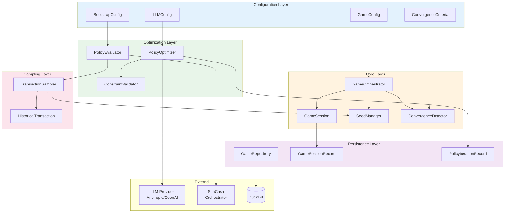
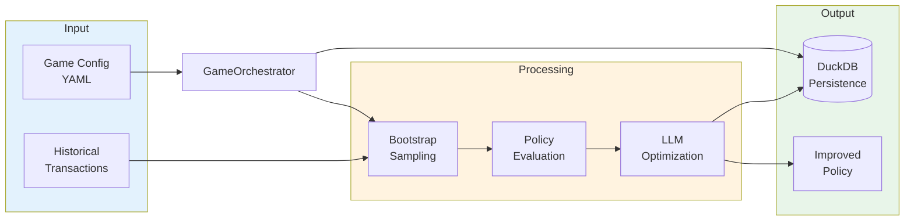

# AI Cash Management Reference

> LLM-based policy optimization module for autonomous bank payment strategies

**Version**: 0.1.0
**Last Updated**: 2025-12-09

The AI Cash Management module enables autonomous optimization of bank payment policies through iterative LLM-based learning. Multiple banking agents can have their payment policies automatically optimized to minimize settlement costs while maintaining throughput guarantees.

---

## Documentation

| Document | Description |
|----------|-------------|
| [configuration](configuration.md) | GameConfig, LLMConfig, BootstrapConfig, ConvergenceCriteria |
| [components](components.md) | GameOrchestrator, GameSession, GameMode |
| [optimization](optimization.md) | PolicyOptimizer, PolicyEvaluator, ConstraintValidator, ConvergenceDetector |
| [sampling](sampling.md) | TransactionSampler, SeedManager, bootstrap sampling methods |
| [constraints](constraints.md) | ScenarioConstraints, ParameterSpec |
| [persistence](persistence.md) | GameRepository, GameSessionRecord, PolicyIterationRecord |

---

## Architecture



---

## Data Flow



---

## Quick Start

### Basic Usage

```python
from payment_simulator.ai_cash_mgmt import (
    GameConfig,
    GameOrchestrator,
    GameSession,
    PolicyOptimizer,
    SeedManager,
)

# Load configuration
config = GameConfig.from_yaml("game_config.yaml")

# Initialize orchestrator
orchestrator = GameOrchestrator(config)
session = orchestrator.create_session()

# Run optimization loop
while not orchestrator.check_convergence()["is_converged"]:
    # Sample transactions
    sampler = TransactionSampler(seed=orchestrator.get_sampling_seed(iteration, agent_id))
    samples = sampler.create_samples(agent_id, num_samples=20, method="bootstrap")

    # Optimize via LLM
    result = await optimizer.optimize(
        agent_id=agent_id,
        current_policy=session.get_policy(agent_id),
        performance_history=session.get_agent_history(agent_id),
        llm_client=llm_client,
        llm_model="claude-sonnet-4-5-20250929",
    )

    if result.was_accepted:
        session.set_policy(agent_id, result.new_policy)
```

### CLI Commands

```bash
# Validate game configuration
payment-sim ai-game validate game_config.yaml

# Show module info
payment-sim ai-game info

# Generate config template
payment-sim ai-game config-template --mode campaign_learning --output my_game.yaml

# Get JSON schema
payment-sim ai-game schema game-config
```

---

## Key Concepts

### Game Modes

| Mode | Description | Use Case |
|------|-------------|----------|
| `RL_OPTIMIZATION` | Intra-simulation optimization | Optimize during running simulation |
| `CAMPAIGN_LEARNING` | Inter-simulation optimization | Optimize between complete simulation runs |

### Optimization Schedule

| Type | Description |
|------|-------------|
| `EVERY_X_TICKS` | Trigger optimization every N ticks |
| `AFTER_EOD` | Trigger after each end-of-day |
| `ON_SIMULATION_END` | Trigger only after simulation completes |

### Sampling Methods

| Method | Description | Use Case |
|--------|-------------|----------|
| `bootstrap` | Sample with replacement | Standard bootstrap resampling |
| `permutation` | Shuffle order, preserve all | Test ordering effects |
| `stratified` | Maintain amount distribution | Preserve distribution |

### Convergence Detection

Convergence is detected when:
1. Cost changes by less than `stability_threshold` for `stability_window` consecutive iterations, OR
2. `max_iterations` is reached

---

## Design Principles

### 1. Determinism

All randomness flows through `SeedManager` using SHA-256 derivation:

```python
master_seed → SHA-256(master_seed + components) → derived_seed
```

Same `master_seed` produces identical optimization trajectories.

### 2. Per-Agent Configuration

Different agents can use different LLM models:

```yaml
optimized_agents:
  BANK_A:
    llm_config:
      provider: anthropic
      model: claude-sonnet-4-5-20250929
  BANK_B:
    llm_config:
      provider: openai
      model: gpt-4o
```

### 3. Validation-Driven

All LLM outputs are validated against `ScenarioConstraints`:

```python
validator = ConstraintValidator(constraints)
result = validator.validate(policy)
if not result.is_valid:
    # Retry with error feedback
```

### 4. Protocol-Based Extension

Pluggable components via Python protocols:

```python
class LLMClientProtocol(Protocol):
    async def generate_policy(self, prompt: str, ...) -> dict[str, Any]: ...

class SimulationRunnerProtocol(Protocol):
    def run_ephemeral(self, policy: dict, seed: int) -> SimulationResult: ...
```

---

## Source Code Locations

| Component | File |
|-----------|------|
| Configuration | `api/payment_simulator/ai_cash_mgmt/config/` |
| Core | `api/payment_simulator/ai_cash_mgmt/core/` |
| Optimization | `api/payment_simulator/ai_cash_mgmt/optimization/` |
| Sampling | `api/payment_simulator/ai_cash_mgmt/sampling/` |
| Constraints | `api/payment_simulator/ai_cash_mgmt/constraints/` |
| Persistence | `api/payment_simulator/ai_cash_mgmt/persistence/` |
| CLI | `api/payment_simulator/cli/commands/ai_game.py` |
| Tests | `api/tests/ai_cash_mgmt/` |

---

## Related Documentation

- [Policy Reference](../policy/index.md) - Policy DSL documentation
- [Scenario Configuration](../scenario/index.md) - Scenario YAML format
- [CLI Reference](../cli/index.md) - Command-line interface
- [Architecture: Policy System](../architecture/07-policy-system.md) - Policy implementation
- [Experiments Module](../experiments/index.md) - YAML-driven experiment framework
- [LLM Module](../llm/index.md) - LLM client protocols and configuration

---

*Last updated: 2025-12-11*
