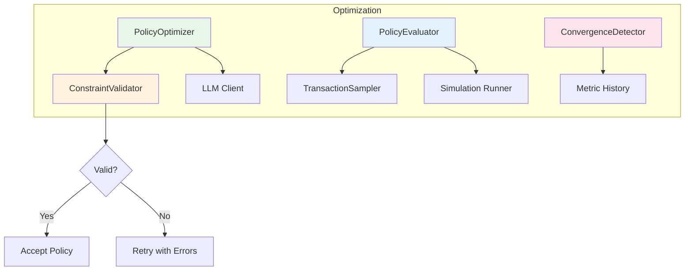
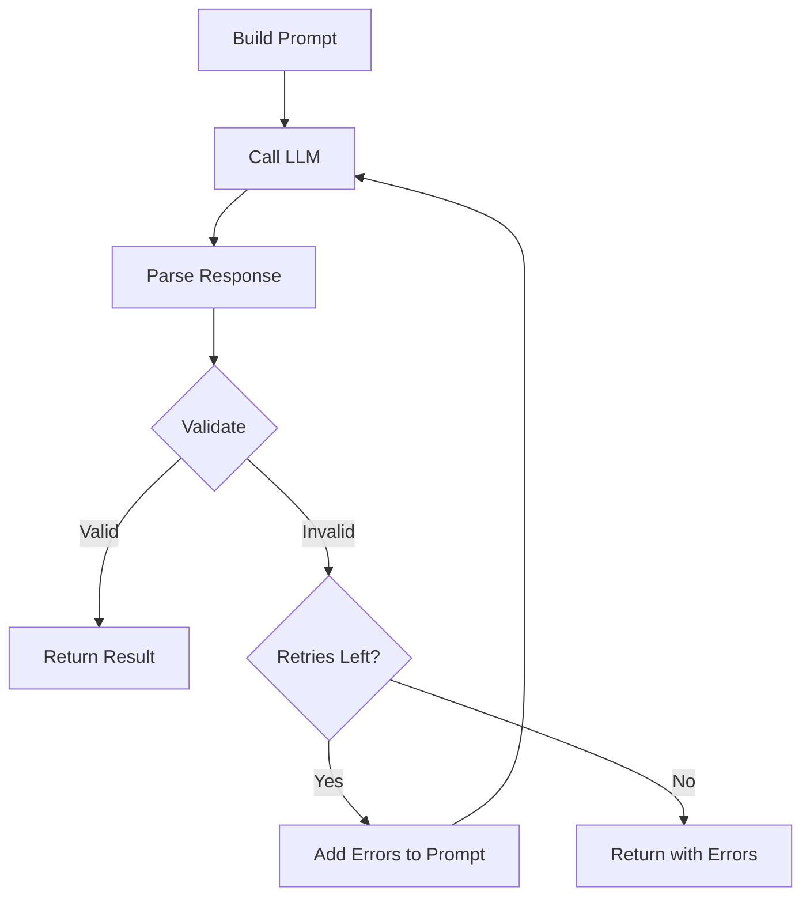
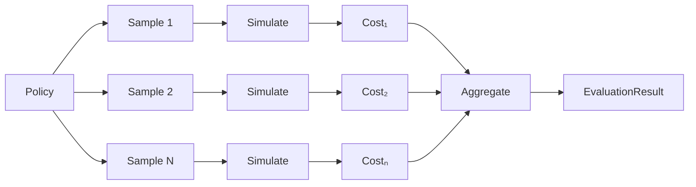
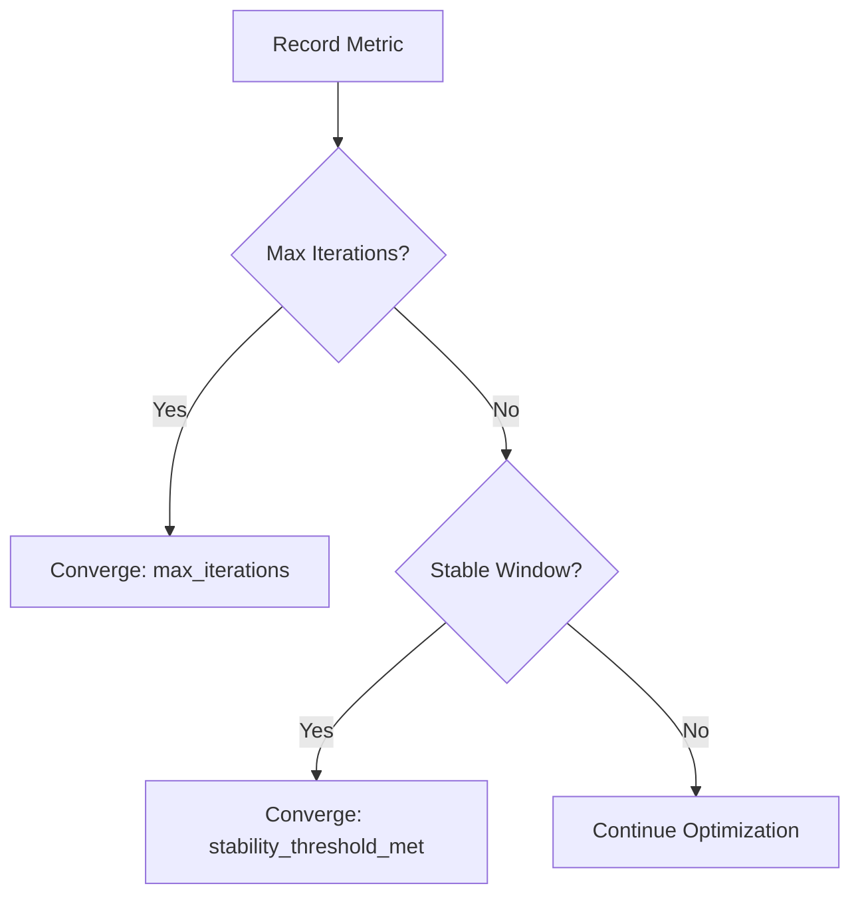

# Optimization Components

> PolicyOptimizer, PolicyEvaluator, ConstraintValidator, ConvergenceDetector

**Version**: 0.1.0
**Last Updated**: 2025-12-09

---

## Overview

The optimization layer handles policy generation, evaluation, validation, and convergence detection:



---

## PolicyOptimizer

LLM-based policy generator with retry logic and validation.

### Synopsis

```python
from payment_simulator.ai_cash_mgmt import PolicyOptimizer, ScenarioConstraints

optimizer = PolicyOptimizer(
    constraints=scenario_constraints,
    max_retries=3,
)
result = await optimizer.optimize(
    agent_id="BANK_A",
    current_policy=current,
    performance_history=history,
    llm_client=llm_client,
    llm_model="claude-sonnet-4-5-20250929",
)
```

### Constructor

```python
def __init__(
    self,
    constraints: ScenarioConstraints,
    max_retries: int = 3,
) -> None:
    """Initialize the optimizer.

    Args:
        constraints: Scenario constraints for validation.
        max_retries: Maximum retry attempts on validation failure.
    """
```

### Methods

#### `optimize`

Generate an optimized policy via LLM.

```python
async def optimize(
    self,
    agent_id: str,
    current_policy: dict[str, Any],
    performance_history: list[dict[str, Any]],
    llm_client: LLMClientProtocol,
    llm_model: str,
    current_cost: float = 0.0,
) -> OptimizationResult:
    """Generate an optimized policy.

    Attempts to generate a valid policy, retrying on validation
    failure up to max_retries times. Each retry includes the
    validation errors in the prompt.

    Args:
        agent_id: Agent being optimized.
        current_policy: Current policy configuration.
        performance_history: History of costs per iteration.
        llm_client: LLM client for policy generation.
        llm_model: Model identifier for tracking.
        current_cost: Current policy's cost.

    Returns:
        OptimizationResult with new policy or None if failed.
    """
```

### Retry Logic



**Behavior**:
1. Build optimization prompt with current policy and history
2. Call LLM to generate new policy
3. Validate against `ScenarioConstraints`
4. If invalid, add errors to prompt and retry
5. After `max_retries`, return with `was_accepted=False`

---

## OptimizationResult

Result of a policy optimization attempt.

### Fields

| Field | Type | Description |
|-------|------|-------------|
| `agent_id` | `str` | Agent that was optimized |
| `iteration` | `int` | Optimization iteration number |
| `old_policy` | `dict` | Previous policy |
| `new_policy` | `dict \| None` | New policy (None if failed) |
| `old_cost` | `float` | Previous policy cost |
| `new_cost` | `float \| None` | New policy cost (None if not evaluated) |
| `was_accepted` | `bool` | Whether policy passed validation |
| `validation_errors` | `list[str]` | Errors if validation failed |
| `llm_latency_seconds` | `float` | LLM call duration |
| `tokens_used` | `int` | Tokens consumed |
| `llm_model` | `str` | Model used |

### Example

```python
result = await optimizer.optimize(...)

if result.was_accepted:
    print(f"New policy generated for {result.agent_id}")
    print(f"LLM latency: {result.llm_latency_seconds:.2f}s")
    session.set_policy(result.agent_id, result.new_policy)
else:
    print(f"Validation failed: {result.validation_errors}")
```

---

## LLMClientProtocol

Protocol for LLM client implementations.

### Definition

```python
class LLMClientProtocol(Protocol):
    """Protocol for LLM clients."""

    async def generate_policy(
        self,
        prompt: str,
        current_policy: dict[str, Any],
        context: dict[str, Any],
    ) -> dict[str, Any]:
        """Generate a policy from prompt and context.

        Args:
            prompt: The optimization prompt.
            current_policy: The current policy being optimized.
            context: Additional context (performance history, etc).

        Returns:
            Generated policy dict.
        """
        ...
```

### Implementation Example

```python
from anthropic import AsyncAnthropic

class AnthropicLLMClient:
    """Anthropic implementation of LLMClientProtocol."""

    def __init__(self, model: str = "claude-sonnet-4-5-20250929") -> None:
        self._client = AsyncAnthropic()
        self._model = model

    async def generate_policy(
        self,
        prompt: str,
        current_policy: dict[str, Any],
        context: dict[str, Any],
    ) -> dict[str, Any]:
        response = await self._client.messages.create(
            model=self._model,
            max_tokens=4096,
            system="Generate valid JSON policies for SimCash...",
            messages=[{"role": "user", "content": prompt}],
        )
        return json.loads(response.content[0].text)
```

---

## PolicyEvaluator

Monte Carlo policy evaluation.

### Synopsis

```python
from payment_simulator.ai_cash_mgmt import PolicyEvaluator

evaluator = PolicyEvaluator(
    num_samples=20,
    evaluation_ticks=100,
    parallel_workers=4,
)
result = evaluator.evaluate(
    agent_id="BANK_A",
    policy=policy,
    samples=transaction_samples,
    scenario_config=scenario,
    simulation_runner=runner,
)
```

### Constructor

```python
def __init__(
    self,
    num_samples: int = 20,
    evaluation_ticks: int = 100,
    parallel_workers: int = 1,
) -> None:
    """Initialize the evaluator.

    Args:
        num_samples: Number of Monte Carlo samples.
        evaluation_ticks: Simulation ticks per sample.
        parallel_workers: Parallel workers (future).
    """
```

### Methods

#### `evaluate`

Evaluate a policy across Monte Carlo samples.

```python
def evaluate(
    self,
    agent_id: str,
    policy: dict[str, Any],
    samples: list[list[HistoricalTransaction]],
    scenario_config: dict[str, Any],
    simulation_runner: SimulationRunnerProtocol,
    seed_base: int = 0,
) -> EvaluationResult:
    """Evaluate policy on multiple transaction samples.

    Args:
        agent_id: Agent being evaluated.
        policy: Policy to evaluate.
        samples: List of transaction samples.
        scenario_config: Base scenario configuration.
        simulation_runner: Runner for simulations.
        seed_base: Base seed for simulations.

    Returns:
        EvaluationResult with aggregated metrics.
    """
```

### Evaluation Flow



---

## EvaluationResult

Result of Monte Carlo policy evaluation.

### Fields

| Field | Type | Description |
|-------|------|-------------|
| `agent_id` | `str` | Evaluated agent |
| `policy` | `dict` | Evaluated policy |
| `mean_cost` | `float` | Mean cost across samples |
| `std_cost` | `float` | Standard deviation |
| `min_cost` | `float` | Minimum cost observed |
| `max_cost` | `float` | Maximum cost observed |
| `sample_costs` | `list[float]` | Per-sample costs |
| `num_samples` | `int` | Number of samples |
| `settlement_rate` | `float` | Average settlement rate |

### Methods

#### `is_better_than`

Compare with another result.

```python
def is_better_than(self, other: EvaluationResult) -> bool:
    """Check if this result is better (lower cost).

    Args:
        other: Result to compare against.

    Returns:
        True if this.mean_cost < other.mean_cost.
    """
```

#### `improvement_over`

Calculate improvement percentage.

```python
def improvement_over(self, other: EvaluationResult) -> float:
    """Calculate improvement percentage.

    Args:
        other: Baseline result.

    Returns:
        Percentage improvement (positive = better).
    """
```

**Formula**: `(other.mean_cost - self.mean_cost) / other.mean_cost * 100`

#### `to_dict`

Convert to dictionary.

```python
def to_dict(self) -> dict[str, Any]:
    """Convert to dictionary for serialization."""
```

### Confidence Interval

95% confidence interval can be calculated:

```python
import math

ci_half = 1.96 * (result.std_cost / math.sqrt(result.num_samples))
lower = result.mean_cost - ci_half
upper = result.mean_cost + ci_half
```

---

## ConstraintValidator

Validates LLM-generated policies against scenario constraints.

### Synopsis

```python
from payment_simulator.ai_cash_mgmt import ConstraintValidator

validator = ConstraintValidator(constraints)
result = validator.validate(policy)

if not result.is_valid:
    print("Errors:", result.errors)
```

### Constructor

```python
def __init__(self, constraints: ScenarioConstraints) -> None:
    """Initialize validator with constraints.

    Args:
        constraints: Scenario constraints to validate against.
    """
```

### Methods

#### `validate`

Validate a policy against constraints.

```python
def validate(self, policy: dict[str, Any]) -> ValidationResult:
    """Validate a policy.

    Checks:
    - Parameter values within bounds
    - Field references are allowed
    - Actions are valid for tree types
    - Tree structure is valid

    Args:
        policy: Policy to validate.

    Returns:
        ValidationResult with is_valid flag and errors.
    """
```

### Validation Checks

| Check | Description | Example Error |
|-------|-------------|---------------|
| Parameter bounds | Values within min/max | `"urgency_threshold: 25 exceeds max 20"` |
| Allowed fields | Field in allowed list | `"Field 'unknown_field' not allowed"` |
| Allowed actions | Action valid for tree | `"Action 'Split' not allowed in payment_tree"` |
| Tree structure | Valid JSON tree nodes | `"Missing 'condition' in condition node"` |

---

## ValidationResult

Result of policy validation.

### Fields

| Field | Type | Description |
|-------|------|-------------|
| `is_valid` | `bool` | Whether policy passed validation |
| `errors` | `list[str]` | List of validation errors |

### Example

```python
result = validator.validate(policy)

if result.is_valid:
    # Safe to use policy
    session.set_policy(agent_id, policy)
else:
    # Include errors in retry prompt
    for error in result.errors:
        print(f"  - {error}")
```

---

## ConvergenceDetector

Detects when optimization has converged.

### Synopsis

```python
from payment_simulator.ai_cash_mgmt import ConvergenceDetector, ConvergenceCriteria

criteria = ConvergenceCriteria(
    stability_threshold=0.05,
    stability_window=5,
    max_iterations=50,
)
detector = ConvergenceDetector(criteria)
```

### Constructor

```python
def __init__(self, criteria: ConvergenceCriteria) -> None:
    """Initialize convergence detector.

    Args:
        criteria: Convergence detection criteria.
    """
```

### Properties

| Property | Type | Description |
|----------|------|-------------|
| `is_converged` | `bool` | Whether convergence detected |
| `convergence_reason` | `str \| None` | Reason for convergence |
| `best_metric` | `float \| None` | Best (lowest) metric seen |
| `iterations` | `int` | Number of iterations recorded |

### Methods

#### `record_metric`

Record a metric value for an iteration.

```python
def record_metric(self, metric: float) -> None:
    """Record metric for convergence tracking.

    Args:
        metric: Metric value (e.g., total cost).
    """
```

#### `reset`

Reset detector state.

```python
def reset(self) -> None:
    """Reset detector for new optimization run."""
```

### Convergence Logic



**Stability Check**:
```
stable = all(
    abs(metrics[i] - metrics[i-1]) / metrics[i-1] < stability_threshold
    for i in range(-stability_window, 0)
)
```

### Example

```python
detector = ConvergenceDetector(criteria)

for iteration in range(100):
    cost = evaluate_policy()
    detector.record_metric(cost)

    if detector.is_converged:
        print(f"Converged after {detector.iterations} iterations")
        print(f"Reason: {detector.convergence_reason}")
        print(f"Best cost: {detector.best_metric}")
        break
```

---

## Complete Optimization Example

```python
from payment_simulator.ai_cash_mgmt import (
    ConstraintValidator,
    ConvergenceCriteria,
    ConvergenceDetector,
    PolicyEvaluator,
    PolicyOptimizer,
    ScenarioConstraints,
)

# Setup
constraints = ScenarioConstraints(
    allowed_parameters=[
        ParameterSpec(name="urgency_threshold", min_value=0, max_value=20),
    ],
    allowed_fields=["balance", "ticks_to_deadline", "amount"],
    allowed_actions={
        "payment_tree": ["Release", "Hold"],
        "bank_tree": ["NoAction"],
        "collateral_tree": ["PostCollateral", "HoldCollateral"],
    },
)

optimizer = PolicyOptimizer(constraints=constraints, max_retries=3)
evaluator = PolicyEvaluator(num_samples=20, evaluation_ticks=100)
detector = ConvergenceDetector(ConvergenceCriteria(
    stability_threshold=0.05,
    stability_window=5,
    max_iterations=50,
))

# Optimization loop
for iteration in range(50):
    # 1. Evaluate current policy
    eval_result = evaluator.evaluate(
        agent_id="BANK_A",
        policy=current_policy,
        samples=samples,
        scenario_config=scenario,
        simulation_runner=runner,
    )

    # 2. Record for convergence
    detector.record_metric(eval_result.mean_cost)
    if detector.is_converged:
        break

    # 3. Generate improved policy
    opt_result = await optimizer.optimize(
        agent_id="BANK_A",
        current_policy=current_policy,
        performance_history=history,
        llm_client=llm_client,
        llm_model="claude-sonnet-4-5-20250929",
        current_cost=eval_result.mean_cost,
    )

    # 4. Update if accepted and better
    if opt_result.was_accepted and opt_result.new_policy:
        new_eval = evaluator.evaluate(...)
        if new_eval.is_better_than(eval_result):
            current_policy = opt_result.new_policy
            print(f"Improved by {new_eval.improvement_over(eval_result):.1f}%")

print(f"Final cost: ${detector.best_metric / 100:.2f}")
```

---

## Implementation Location

| Component | File |
|-----------|------|
| PolicyOptimizer | `api/payment_simulator/ai_cash_mgmt/optimization/policy_optimizer.py` |
| PolicyEvaluator | `api/payment_simulator/ai_cash_mgmt/optimization/policy_evaluator.py` |
| ConstraintValidator | `api/payment_simulator/ai_cash_mgmt/optimization/constraint_validator.py` |
| ConvergenceDetector | `api/payment_simulator/ai_cash_mgmt/optimization/convergence_detector.py` |

---

## Navigation

**Previous**: [Components](components.md)
**Next**: [Sampling](sampling.md)
