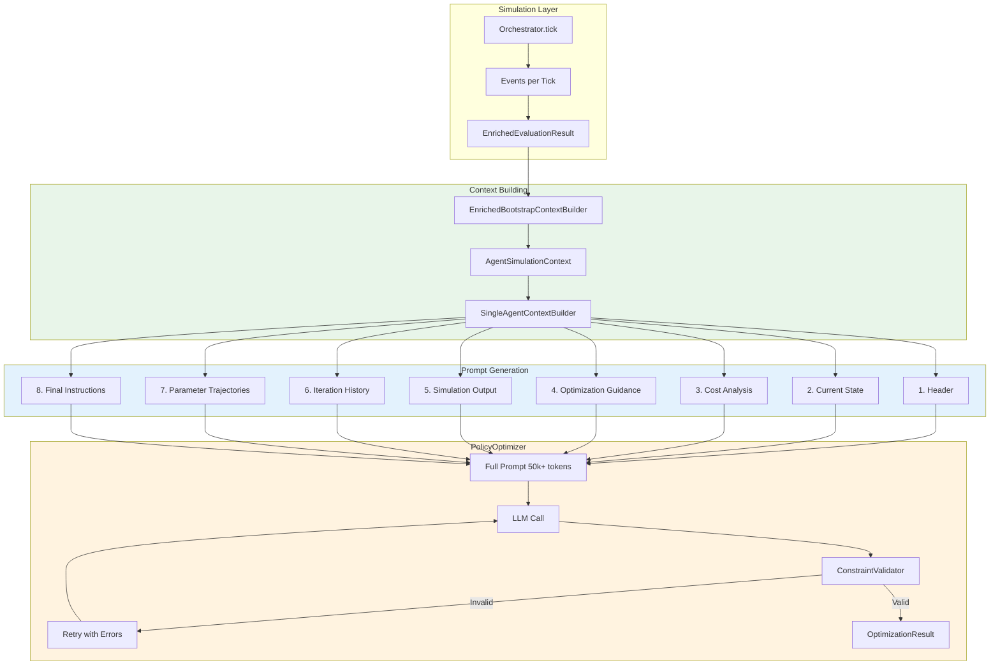

# Optimizer Prompt Architecture

> Sophisticated LLM context building for policy optimization

**Version**: 1.0.0
**Last Updated**: 2025-12-12

---

## Overview

The optimizer prompt system provides rich, structured context to LLMs for policy optimization. It generates 50k+ token prompts containing:

- Current performance metrics and cost breakdown
- Best/worst seed verbose simulation outputs
- Full iteration history with acceptance status
- Parameter trajectories across iterations
- Optimization guidance based on cost analysis

This enables LLMs to make informed policy improvements by analyzing what worked (best seed), what failed (worst seed), and learning from previous iterations.

---

## Architecture



---

## Key Components

### 1. EnrichedEvaluationResult

**File**: `api/payment_simulator/ai_cash_mgmt/bootstrap/enriched_models.py`

Captures simulation results with event traces for LLM context:

```python
@dataclass(frozen=True)
class EnrichedEvaluationResult:
    sample_idx: int                         # Bootstrap sample index
    seed: int                               # RNG seed used
    total_cost: int                         # Total cost (integer cents)
    settlement_rate: float                  # 0.0-1.0
    avg_delay: float                        # Average settlement delay
    event_trace: tuple[BootstrapEvent, ...] # Tick-by-tick events
    cost_breakdown: CostBreakdown           # Cost by type

@dataclass(frozen=True)
class CostBreakdown:
    delay_cost: int          # Cost from payment delays
    overdraft_cost: int      # Cost from negative balance
    deadline_penalty: int    # One-time penalty for missing deadline
    eod_penalty: int         # End-of-day unsettled penalty

@dataclass(frozen=True)
class BootstrapEvent:
    tick: int
    event_type: str
    details: dict[str, Any]
```

**Where it's created**: `OptimizationLoop._run_simulation_with_events()` in `optimization.py`

### 2. EnrichedBootstrapContextBuilder

**File**: `api/payment_simulator/ai_cash_mgmt/bootstrap/context_builder.py`

Builds per-agent context from bootstrap samples:

```python
class EnrichedBootstrapContextBuilder:
    """Builds LLM context directly from enriched bootstrap results."""

    def __init__(
        self,
        results: list[EnrichedEvaluationResult],
        agent_id: str,
    ) -> None: ...

    def get_best_result(self) -> EnrichedEvaluationResult:
        """Get result with lowest cost."""

    def get_worst_result(self) -> EnrichedEvaluationResult:
        """Get result with highest cost."""

    def build_agent_context(self) -> AgentSimulationContext:
        """Build full context with best/worst seed analysis."""

    def format_event_trace_for_llm(
        self,
        result: EnrichedEvaluationResult,
        max_events: int = 500,
    ) -> str:
        """Format events for LLM consumption."""
```

**Key capability**: Identifies best/worst performing seeds per agent and formats their event traces for LLM analysis.

### 3. AgentSimulationContext

**File**: `api/payment_simulator/ai_cash_mgmt/bootstrap/context_builder.py`

Per-agent statistics with verbose outputs:

```python
@dataclass
class AgentSimulationContext:
    agent_id: str
    best_seed: int
    best_seed_cost: int
    best_seed_output: str | None   # Formatted event trace
    worst_seed: int
    worst_seed_cost: int
    worst_seed_output: str | None  # Formatted event trace
    mean_cost: int
    cost_std: int
```

### 4. SingleAgentContextBuilder

**File**: `api/payment_simulator/ai_cash_mgmt/prompts/single_agent_context.py`

Builds the complete prompt with 7 sections (see [Prompt Sections](#prompt-sections) below).

### 5. PolicyOptimizer

**File**: `api/payment_simulator/ai_cash_mgmt/optimization/policy_optimizer.py`

Orchestrates prompt building and LLM calls with retry logic:

```python
async def optimize(
    self,
    agent_id: str,
    current_policy: dict[str, Any],
    current_iteration: int,
    current_metrics: dict[str, Any],
    llm_client: LLMClientProtocol,
    llm_model: str,
    current_cost: float = 0.0,
    iteration_history: list[SingleAgentIterationRecord] | None = None,
    best_seed_output: str | None = None,      # From AgentSimulationContext
    worst_seed_output: str | None = None,     # From AgentSimulationContext
    best_seed: int = 0,
    worst_seed: int = 0,
    best_seed_cost: int = 0,
    worst_seed_cost: int = 0,
    cost_breakdown: dict[str, int] | None = None,
    cost_rates: dict[str, Any] | None = None,
    debug_callback: DebugCallback | None = None,
) -> OptimizationResult:
```

---

## Prompt Sections

The complete prompt is structured in 7 sections, each providing specific context to help the LLM make informed policy improvements.

### Section 1: Header

**Purpose**: Identify agent and iteration, set expectations.

```
━━━━━━━━━━━━━━━━━━━━━━━━━━━━━━━━━━━━━━━━━━━━━━━━━━━━━━━━━━━━━━━━━━━━━━━━━━━━━━
POLICY OPTIMIZATION CONTEXT - BANK_A - ITERATION 5
━━━━━━━━━━━━━━━━━━━━━━━━━━━━━━━━━━━━━━━━━━━━━━━━━━━━━━━━━━━━━━━━━━━━━━━━━━━━━━

This document provides complete context for optimizing YOUR payment policy.
Analyze the simulation outputs and historical data to identify improvements.

NOTE: You are optimizing policy for BANK_A ONLY. Focus on YOUR decisions.

TABLE OF CONTENTS:
1. Current State Summary
2. Cost Analysis
3. Optimization Guidance
4. Simulation Output (Best/Worst Seeds)
5. Full Iteration History
6. Parameter Trajectories
7. Final Instructions
```

**Source**: `SingleAgentContextBuilder._build_header()`

### Section 2: Current State Summary

**Purpose**: Show current performance and policy parameters.

```
## 1. CURRENT STATE SUMMARY

### Performance Metrics (Iteration 5)

| Metric | Value |
|--------|-------|
| **Mean Total Cost** | $12,500 (↓15.2% from previous) |
| **Cost Std Dev** | ±$2,340 |
| **Risk-Adjusted Cost** | $14,840 |
| **Settlement Rate** | 100.0% |
| **Failure Rate** | 0% |
| **Best Seed** | #1847592 ($8,200) |
| **Worst Seed** | #9283746 ($18,400) |

### Current Policy Parameters (BANK_A)

```json
{
  "initial_liquidity_fraction": 0.5,
  "urgency_threshold": 5,
  "liquidity_buffer_factor": 1.0
}
```

**Source**: `SingleAgentContextBuilder._build_current_state_summary()`

**Data comes from**:
- `current_metrics` parameter to `build_single_agent_context()`
- `best_seed`, `worst_seed`, costs from `AgentSimulationContext`
- `current_policy` from current iteration

### Section 3: Cost Analysis

**Purpose**: Break down costs by type and show configuration.

```
## 2. COST ANALYSIS

### Cost Breakdown (Last Iteration)

| Cost Type | Amount | % of Total | Priority |
|-----------|--------|------------|----------|
| delay | $6,000 | 48.0% | 🔴 HIGH |
| collateral | $4,000 | 32.0% | 🟡 MEDIUM |
| overdraft | $1,500 | 12.0% | 🟢 LOW |
| eod_penalty | $1,000 | 8.0% | 🟢 LOW |

### Cost Rate Configuration
```json
{
  "delay_cost_per_tick": 1,
  "overdraft_cost_bps": 50,
  "deadline_penalty": 1000,
  "eod_penalty_multiplier": 10
}
```

**Source**: `SingleAgentContextBuilder._build_cost_analysis()`

**Data comes from**:
- `cost_breakdown` aggregated from `EnrichedEvaluationResult.cost_breakdown`
- `cost_rates` extracted from simulation config (`cost_config`)

### Section 4: Optimization Guidance

**Purpose**: Provide actionable recommendations based on cost analysis.

```
## 3. OPTIMIZATION GUIDANCE

⚠️ **HIGH DELAY COSTS** - Payments are waiting too long in queue.
   Consider: Lower urgency_threshold, reduce liquidity_buffer, release payments earlier.

✅ **IMPROVING TREND** - Costs decreasing consistently.
   Continue current optimization direction.
```

**Source**: `SingleAgentContextBuilder._build_optimization_guidance()`

**Logic**:
- Analyzes `cost_breakdown` percentages
- Checks iteration history for trends (improving/worsening/oscillating)
- Warns if settlement rate < 100%

### Section 5: Simulation Output

**Purpose**: Show tick-by-tick events from best and worst simulations.

```
## 4. SIMULATION OUTPUT (TICK-BY-TICK)

### Best Performing Seed (#1847592, Cost: $8,200)

This is the OPTIMAL outcome from the current policy. Analyze what went right.

<best_seed_output>
```
[tick 0] Arrival: tx_id=tx_001, amount=$1,000.00
[tick 0] PolicyDecision: tx_id=tx_001, action=Release
[tick 1] RtgsImmediateSettlement: tx_id=tx_001, amount=$1,000.00
[tick 5] DelayCostAccrual: agent_id=BANK_A, cost=$5.00
...
```
</best_seed_output>

### Worst Performing Seed (#9283746, Cost: $18,400)

This is the PROBLEMATIC outcome. Identify failure patterns and edge cases.

<worst_seed_output>
```
[tick 0] Arrival: tx_id=tx_042, amount=$50,000.00
[tick 0] PolicyDecision: tx_id=tx_042, action=Hold
[tick 45] DeadlinePenalty: tx_id=tx_042, cost=$1,000.00
[tick 100] OverdraftCostAccrual: agent_id=BANK_A, cost=$500.00
...
```
</worst_seed_output>
```

**Source**: `SingleAgentContextBuilder._build_simulation_output_section()`

**Data comes from**:
- `best_seed_output` and `worst_seed_output` from `AgentSimulationContext`
- Originally formatted by `EnrichedBootstrapContextBuilder.format_event_trace_for_llm()`

**Event prioritization** (higher = more informative):
| Event Type | Priority | Reason |
|------------|----------|--------|
| PolicyDecision | 100 | Shows decision points |
| DeadlinePenalty | 90 | Shows missed deadlines |
| DelayCostAccrual | 80 | Shows cost drivers |
| OverdraftCostAccrual | 80 | Shows liquidity issues |
| RtgsImmediateSettlement | 50 | Settlement outcomes |
| Arrival | 30 | Context events |

### Section 6: Iteration History

**Purpose**: Show full history with acceptance status and policy changes.

```
## 5. FULL ITERATION HISTORY

### Metrics Summary Table

| Iter | Status | Mean Cost | Std Dev | Settlement | Best Seed | Worst Seed |
|------|--------|-----------|---------|------------|-----------|------------|
| 1 | ⭐ BEST | $15,000 | ±$3,000 | 95.0% | $10,000 | $22,000 |
| 2 | ❌ REJECTED | $16,500 | ±$4,000 | 92.0% | $11,000 | $25,000 |
| 3 | ✅ KEPT | $14,200 | ±$2,800 | 98.0% | $9,500 | $20,000 |
| 4 | ✅ KEPT | $13,000 | ±$2,500 | 100.0% | $8,800 | $19,000 |
| 5 | ⭐ BEST | $12,500 | ±$2,340 | 100.0% | $8,200 | $18,400 |

### Current Best Policy
The best policy so far was discovered in **iteration 5** with mean cost **$12,500**.

### Detailed Changes Per Iteration

#### ⭐ Iteration 1 (BEST POLICY)

**Performance:** Mean cost $15,000, Settlement 95.0%

**BANK_A Parameters at this iteration:**
```json
{
  "initial_liquidity_fraction": 0.3,
  "urgency_threshold": 8,
  "liquidity_buffer_factor": 1.5
}
```

#### ❌ Iteration 2 (REJECTED)

**Performance:** Mean cost $16,500, Settlement 92.0%
**Comparison:** +$1,500 vs best

**BANK_A Changes:**
  - Changed 'urgency_threshold': 8 → 10 (↑2.00)
  - Changed 'liquidity_buffer_factor': 1.5 → 2.0 (↑0.50)

...
```

**Source**: `SingleAgentContextBuilder._build_iteration_history_section()`

**Data comes from**:
- `iteration_history` list of `SingleAgentIterationRecord`
- Each record contains: iteration number, metrics, policy, changes, acceptance status

**Status indicators**:
| Status | Meaning |
|--------|---------|
| ⭐ BEST | Best cost achieved so far |
| ✅ KEPT | Policy was accepted |
| ❌ REJECTED | Policy performed worse, reverted |

### Section 7: Parameter Trajectories

**Purpose**: Show how parameters evolved across iterations.

```
## 6. PARAMETER TRAJECTORIES

Track how each BANK_A parameter evolved across iterations:

### urgency_threshold

| Iteration | Value |
|-----------|-------|
| 1 | 8.000 |
| 2 | 10.000 |
| 3 | 6.000 |
| 4 | 5.000 |
| 5 | 5.000 |

*Overall: decreased 37.5% from 8.000 to 5.000*

### liquidity_buffer_factor

| Iteration | Value |
|-----------|-------|
| 1 | 1.500 |
| 2 | 2.000 |
| 3 | 1.200 |
| 4 | 1.000 |
| 5 | 1.000 |

*Overall: decreased 33.3% from 1.500 to 1.000*
```

**Source**: `SingleAgentContextBuilder._build_parameter_trajectory_section()`

**Data comes from**: `iteration_history` policy parameters across all iterations

### Section 8: Final Instructions

**Purpose**: Provide clear output requirements and warnings.

```
## 7. FINAL INSTRUCTIONS

Based on the above analysis, generate an improved policy for **BANK_A** that:

1. **Beats the current best policy** - your policy must have LOWER cost than the best
2. **Maintains 100% settlement rate** - this is non-negotiable
3. **Makes incremental adjustments** - avoid drastic changes unless clearly needed
4. **Learns from REJECTED policies** - don't repeat changes that made things worse

⚠️ **IMPORTANT**: 2 previous policy attempts were REJECTED because they
performed worse than the current best. Review the rejected policies in the history
above and avoid making similar changes.

📌 **Current Best**: Iteration 5 with mean cost $12,500.
Your goal is to beat this. If your policy is worse, it will be rejected and we will
continue optimizing from the current best policy.

### What to Consider:

- **Best seed analysis**: What made seed #1847592 perform well?
- **Worst seed analysis**: What went wrong in seed #9283746?
- **REJECTED policies**: Why did they fail? What changes should you avoid?
- **Parameter trends**: Which parameters correlate with cost improvements?
- **Trade-offs**: Balance delay costs vs collateral costs vs overdraft costs

### Output Requirements:

Generate a complete, valid policy JSON that:
- Defines all parameters before using them
- Uses only allowed fields and actions
- Includes unique node_id for every node
- Wraps arithmetic in {"compute": {...}}

Focus your changes on the areas with highest impact potential. Remember: if your
policy is worse than the current best, it will be REJECTED and you'll need to try
a different approach.
```

**Source**: `SingleAgentContextBuilder._build_final_instructions()`

---

## Integration Flow

The full data flow from simulation to prompt:

```
1. OptimizationLoop._evaluate_policies()
   ├── For each bootstrap sample:
   │   └── _run_simulation_with_events(seed)
   │       ├── Run Orchestrator.tick() for all ticks
   │       ├── Capture events via orch.get_tick_events(tick)
   │       └── Return EnrichedEvaluationResult with:
   │           - total_cost
   │           - event_trace (list of BootstrapEvent)
   │           - cost_breakdown
   │
   └── _build_agent_contexts(enriched_results)
       └── For each agent:
           └── EnrichedBootstrapContextBuilder(results, agent_id)
               ├── get_best_result() → lowest cost sample
               ├── get_worst_result() → highest cost sample
               ├── format_event_trace_for_llm() → formatted strings
               └── build_agent_context() → AgentSimulationContext

2. OptimizationLoop._optimize_agent(agent_id)
   └── PolicyOptimizer.optimize(
           agent_context=agent_context,
           iteration_history=per_agent_history,
           cost_breakdown=aggregated_breakdown,
           cost_rates=from_config
       )
       └── build_single_agent_context(...)
           └── SingleAgentContextBuilder(context).build()
               └── Returns full 50k+ token prompt

3. LLM Call with prompt
   └── Validate response with ConstraintValidator
       └── Retry up to max_retries if invalid
```

---

## Iteration History Tracking

The system tracks per-agent iteration history using `SingleAgentIterationRecord`:

```python
@dataclass
class SingleAgentIterationRecord:
    iteration: int                    # 1-indexed
    metrics: dict[str, Any]           # {total_cost_mean, settlement_rate_mean, ...}
    policy: dict[str, Any]            # Policy used this iteration
    policy_changes: list[str]         # Human-readable changes from previous
    was_accepted: bool                # True if kept, False if reverted
    is_best_so_far: bool              # True if this beat all previous
    comparison_to_best: str           # "+$500 vs best" or "NEW BEST"
```

**Created by**: `OptimizationLoop._record_iteration_history()`

**Change descriptions** (from `_compute_policy_changes()`):
- `"Changed 'urgency_threshold': 8 → 5 (↓3.00)"`
- `"Added 'new_param': 0.5"`
- `"Removed 'old_param' (was 1.0)"`

---

## Debug Callback

For verbose logging during optimization, implement `DebugCallback`:

```python
class DebugCallback(Protocol):
    def on_attempt_start(self, agent_id: str, attempt: int, max_attempts: int) -> None: ...
    def on_validation_error(self, agent_id: str, attempt: int, max_attempts: int, errors: list[str]) -> None: ...
    def on_llm_error(self, agent_id: str, attempt: int, max_attempts: int, error: str) -> None: ...
    def on_validation_success(self, agent_id: str, attempt: int) -> None: ...
    def on_all_retries_exhausted(self, agent_id: str, max_attempts: int, final_errors: list[str]) -> None: ...
```

**Used by**: `_VerboseDebugCallback` in `optimization.py` bridges to `VerboseLogger`

---

## Event Filtering

Events are filtered for relevance before formatting:

**File**: `api/payment_simulator/cli/filters.py`

```python
class EventFilter:
    def __init__(self, agent_id: str | None = None, ...): ...
    def matches(self, event: dict, tick: int) -> bool: ...
```

**Agent matching handles**:
- `agent_id`, `sender_id`, `sender` fields
- `agent_a`, `agent_b` for LSM bilateral
- `agents` list for LSM cycle
- `receiver_id` for incoming settlements

---

## Configuration

Enable sophisticated prompts by configuring experiment YAML:

```yaml
# experiments/exp1.yaml
name: "My Experiment"
scenario_path: scenario.yaml
optimized_agents: ["BANK_A"]

evaluation:
  mode: bootstrap
  num_samples: 20       # More samples = richer best/worst analysis
  ticks: 100

llm:
  provider: anthropic
  model: claude-sonnet-4-5-20250929
  system_prompt: "You are an expert at optimizing payment policies..."
  max_retries: 3

convergence:
  max_iterations: 50
  stability_threshold: 0.05
  stability_window: 5
```

---

## Example: Complete Prompt

A full prompt for iteration 5 of BANK_A optimization might be ~50,000 tokens:

```
━━━━━━━━━━━━━━━━━━━━━━━━━━━━━━━━━━━━━━━━━━━━━━━━━━━━━━━━━━━━━━━━━━━━━━━━━━━━━━
POLICY OPTIMIZATION CONTEXT - BANK_A - ITERATION 5
━━━━━━━━━━━━━━━━━━━━━━━━━━━━━━━━━━━━━━━━━━━━━━━━━━━━━━━━━━━━━━━━━━━━━━━━━━━━━━
...header text...

## 1. CURRENT STATE SUMMARY
...~500 tokens: metrics table, current policy JSON...

## 2. COST ANALYSIS
...~300 tokens: cost breakdown, rates config...

## 3. OPTIMIZATION GUIDANCE
...~200 tokens: warnings and recommendations...

## 4. SIMULATION OUTPUT (TICK-BY-TICK)
...~40,000 tokens: best seed output (50 events), worst seed output (50 events)...

## 5. FULL ITERATION HISTORY
...~5,000 tokens: metrics table, 5 iterations × detailed changes...

## 6. PARAMETER TRAJECTORIES
...~500 tokens: per-parameter evolution tables...

## 7. FINAL INSTRUCTIONS
...~500 tokens: requirements and warnings...
```

---

## Related Documentation

- [Optimization Components](optimization.md) - PolicyOptimizer, ConstraintValidator
- [Experiment Runner](../experiments/runner.md) - GenericExperimentRunner integration
- [Experiment Configuration](../experiments/configuration.md) - YAML config reference
- [LLM Protocols](../llm/protocols.md) - LLMClientProtocol

---

*Last updated: 2025-12-12*
