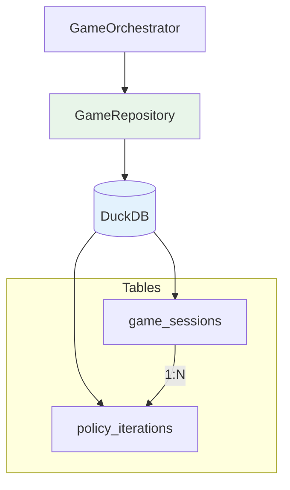
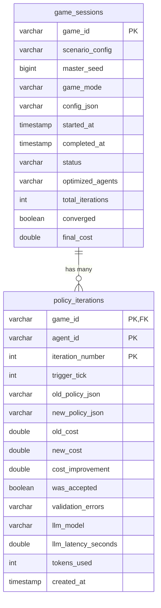

# Persistence

> GameRepository, GameSessionRecord, and PolicyIterationRecord

**Version**: 0.1.0
**Last Updated**: 2025-12-09

---

## Overview

The persistence layer stores game sessions and policy iterations in DuckDB, enabling result analysis and experiment reproducibility:



---

## GameRepository

Repository for AI Cash Management database operations.

### Synopsis

```python
from payment_simulator.persistence.connection import DatabaseManager
from payment_simulator.ai_cash_mgmt import GameRepository

with DatabaseManager("simulation.db") as manager:
    repo = GameRepository(manager.conn)
    repo.initialize_schema()

    # Query sessions
    sessions = repo.list_game_sessions(status="completed")
    for session in sessions:
        print(f"{session.game_id}: {session.total_iterations} iterations")
```

### Constructor

```python
def __init__(self, conn: duckdb.DuckDBPyConnection) -> None:
    """Initialize repository with database connection.

    Args:
        conn: DuckDB connection from DatabaseManager
    """
```

---

### Schema Methods

#### `initialize_schema`

Create database tables and indexes.

```python
def initialize_schema(self) -> None:
    """Initialize AI Cash Management database tables.

    Creates game_sessions and policy_iterations tables if they don't exist.
    Safe to call multiple times (uses IF NOT EXISTS).
    """
```

**Creates**:

| Table | Description |
|-------|-------------|
| `game_sessions` | Game metadata and results |
| `policy_iterations` | Per-iteration policy changes |

**Indexes**:

| Index | Columns | Purpose |
|-------|---------|---------|
| `idx_game_status` | `status` | Filter by game status |
| `idx_game_started_at` | `started_at` | Order by start time |
| `idx_iter_game` | `game_id` | Join iterations to game |
| `idx_iter_agent` | `game_id, agent_id` | Filter by agent |

---

### Game Session Operations

#### `save_game_session`

Save or update a game session.

```python
def save_game_session(self, session: GameSessionRecord) -> None:
    """Save or update a game session.

    Args:
        session: GameSessionRecord to persist
    """
```

**Example**:
```python
from datetime import datetime
from payment_simulator.ai_cash_mgmt import GameSessionRecord

session = GameSessionRecord(
    game_id="game-001",
    scenario_config="experiments/castro/configs/exp1.yaml",
    master_seed=42,
    game_mode="rl_optimization",
    config_json='{"max_iterations": 25}',
    started_at=datetime.now(),
    status="running",
    optimized_agents=["BANK_A", "BANK_B"],
)

repo.save_game_session(session)
```

---

#### `get_game_session`

Retrieve a game session by ID.

```python
def get_game_session(self, game_id: str) -> GameSessionRecord | None:
    """Retrieve a game session by ID.

    Args:
        game_id: Game session identifier

    Returns:
        GameSessionRecord if found, None otherwise
    """
```

---

#### `update_game_session_status`

Update game session status and completion fields.

```python
def update_game_session_status(
    self,
    game_id: str,
    status: str,
    completed_at: datetime | None = None,
    total_iterations: int | None = None,
    converged: bool | None = None,
    final_cost: float | None = None,
) -> None:
    """Update game session status and completion fields.

    Args:
        game_id: Game session identifier
        status: New status value
        completed_at: Completion timestamp (optional)
        total_iterations: Total iterations count (optional)
        converged: Whether game converged (optional)
        final_cost: Final aggregate cost (optional)
    """
```

**Example**:
```python
# Mark game as converged
repo.update_game_session_status(
    game_id="game-001",
    status="converged",
    completed_at=datetime.now(),
    total_iterations=15,
    converged=True,
    final_cost=2500.0,
)
```

---

#### `list_game_sessions`

List game sessions with optional filtering.

```python
def list_game_sessions(
    self,
    status: str | None = None,
    game_mode: str | None = None,
    limit: int = 100,
) -> list[GameSessionRecord]:
    """List game sessions with optional filtering.

    Args:
        status: Filter by status (optional)
        game_mode: Filter by game mode (optional)
        limit: Maximum results to return

    Returns:
        List of GameSessionRecord matching filters
    """
```

**Example**:
```python
# Get all completed RL optimization games
sessions = repo.list_game_sessions(
    status="completed",
    game_mode="rl_optimization",
    limit=50,
)
```

---

### Policy Iteration Operations

#### `save_policy_iteration`

Save a policy iteration record.

```python
def save_policy_iteration(self, iteration: PolicyIterationRecord) -> None:
    """Save a policy iteration record.

    Args:
        iteration: PolicyIterationRecord to persist
    """
```

**Example**:
```python
from payment_simulator.ai_cash_mgmt import PolicyIterationRecord

iteration = PolicyIterationRecord(
    game_id="game-001",
    agent_id="BANK_A",
    iteration_number=5,
    trigger_tick=100,
    old_policy_json='{"payment_tree": {...}}',
    new_policy_json='{"payment_tree": {...}}',
    old_cost=1500.0,
    new_cost=1200.0,
    cost_improvement=300.0,
    was_accepted=True,
    validation_errors=[],
    llm_model="anthropic/claude-sonnet",
    llm_latency_seconds=2.5,
    tokens_used=1500,
    created_at=datetime.now(),
)

repo.save_policy_iteration(iteration)
```

---

#### `get_policy_iterations`

Get policy iterations for a game/agent.

```python
def get_policy_iterations(
    self,
    game_id: str,
    agent_id: str | None = None,
) -> list[PolicyIterationRecord]:
    """Get policy iterations for a game/agent.

    Args:
        game_id: Game session identifier
        agent_id: Agent identifier (optional, filters by agent)

    Returns:
        List of PolicyIterationRecord ordered by iteration_number
    """
```

**Example**:
```python
# Get all iterations for BANK_A
iterations = repo.get_policy_iterations("game-001", agent_id="BANK_A")
for it in iterations:
    print(f"Iteration {it.iteration_number}: cost {it.old_cost} -> {it.new_cost}")
```

---

#### `get_best_policy`

Get the best (lowest cost) accepted policy for an agent.

```python
def get_best_policy(self, game_id: str, agent_id: str) -> str | None:
    """Get the best accepted policy for an agent.

    Args:
        game_id: Game session identifier
        agent_id: Agent identifier

    Returns:
        Policy JSON string of the best accepted policy, or None
    """
```

**Example**:
```python
import json

policy_json = repo.get_best_policy("game-001", "BANK_A")
if policy_json:
    policy = json.loads(policy_json)
    print(f"Best policy: {policy}")
```

---

### Query Interface

#### `get_optimization_summary`

Get summary statistics for a game's optimization.

```python
def get_optimization_summary(self, game_id: str) -> dict[str, Any]:
    """Get summary statistics for a game's optimization.

    Args:
        game_id: Game session identifier

    Returns:
        Dictionary with summary statistics
    """
```

**Returns**:

| Field | Type | Description |
|-------|------|-------------|
| `total_iterations` | `int` | Total number of iterations |
| `accepted_iterations` | `int` | Number accepted |
| `rejected_iterations` | `int` | Number rejected |
| `total_cost_improvement` | `float` | Sum of improvements |
| `total_tokens_used` | `int` | Total LLM tokens |
| `total_llm_latency` | `float` | Total LLM call time |

**Example**:
```python
summary = repo.get_optimization_summary("game-001")
print(f"Iterations: {summary['total_iterations']}")
print(f"Acceptance rate: {summary['accepted_iterations'] / summary['total_iterations']:.1%}")
print(f"Total improvement: ${summary['total_cost_improvement']/100:.2f}")
print(f"Tokens used: {summary['total_tokens_used']:,}")
```

---

## GameSessionRecord

Game session metadata for persistence.

### Fields

| Field | Type | Description |
|-------|------|-------------|
| `game_id` | `str` | Unique game identifier |
| `scenario_config` | `str` | Path to scenario configuration |
| `master_seed` | `int` | Master seed for determinism |
| `game_mode` | `str` | Mode: `rl_optimization` or `campaign_learning` |
| `config_json` | `str` | Full configuration as JSON |
| `started_at` | `datetime` | When game started |
| `completed_at` | `datetime \| None` | When game completed |
| `status` | `str` | Current status |
| `optimized_agents` | `list[str]` | Agent IDs being optimized |
| `total_iterations` | `int` | Total optimization iterations |
| `converged` | `bool` | Whether game converged |
| `final_cost` | `float \| None` | Final aggregate cost |

### Status Values

| Status | Description |
|--------|-------------|
| `running` | Game is in progress |
| `completed` | Game finished normally |
| `failed` | Game encountered error |
| `converged` | Game reached convergence |

---

## PolicyIterationRecord

Policy iteration record for tracking optimization history.

### Fields

| Field | Type | Description |
|-------|------|-------------|
| `game_id` | `str` | Foreign key to game_sessions |
| `agent_id` | `str` | Agent being optimized |
| `iteration_number` | `int` | Iteration number (1-indexed) |
| `trigger_tick` | `int` | Tick that triggered optimization |
| `old_policy_json` | `str` | Previous policy as JSON |
| `new_policy_json` | `str` | New/proposed policy as JSON |
| `old_cost` | `float` | Cost of old policy |
| `new_cost` | `float` | Cost of new policy |
| `cost_improvement` | `float` | Cost reduction (old - new) |
| `was_accepted` | `bool` | Whether new policy was accepted |
| `validation_errors` | `list[str]` | Validation errors if rejected |
| `llm_model` | `str` | LLM model used |
| `llm_latency_seconds` | `float` | LLM call latency |
| `tokens_used` | `int` | Total tokens used |
| `created_at` | `datetime` | When iteration was created |

---

## Database Schema

### game_sessions Table

```sql
CREATE TABLE game_sessions (
    game_id VARCHAR PRIMARY KEY,
    scenario_config VARCHAR NOT NULL,
    master_seed BIGINT NOT NULL,
    game_mode VARCHAR NOT NULL,
    config_json VARCHAR NOT NULL,
    started_at TIMESTAMP NOT NULL,
    completed_at TIMESTAMP,
    status VARCHAR NOT NULL,
    optimized_agents VARCHAR NOT NULL,  -- JSON array
    total_iterations INTEGER DEFAULT 0,
    converged BOOLEAN DEFAULT FALSE,
    final_cost DOUBLE
)
```

### policy_iterations Table

```sql
CREATE TABLE policy_iterations (
    game_id VARCHAR NOT NULL,
    agent_id VARCHAR NOT NULL,
    iteration_number INTEGER NOT NULL,
    trigger_tick INTEGER NOT NULL,
    old_policy_json VARCHAR NOT NULL,
    new_policy_json VARCHAR NOT NULL,
    old_cost DOUBLE NOT NULL,
    new_cost DOUBLE NOT NULL,
    cost_improvement DOUBLE NOT NULL,
    was_accepted BOOLEAN NOT NULL,
    validation_errors VARCHAR NOT NULL,  -- JSON array
    llm_model VARCHAR NOT NULL,
    llm_latency_seconds DOUBLE NOT NULL,
    tokens_used INTEGER NOT NULL,
    created_at TIMESTAMP NOT NULL,
    PRIMARY KEY (game_id, agent_id, iteration_number)
)
```

---

## Entity Relationships



---

## Complete Example

```python
from datetime import datetime
import json

from payment_simulator.persistence.connection import DatabaseManager
from payment_simulator.ai_cash_mgmt import (
    GameRepository,
    GameSessionRecord,
    PolicyIterationRecord,
)

# Initialize database
with DatabaseManager("optimization.db") as manager:
    repo = GameRepository(manager.conn)
    repo.initialize_schema()

    # Create game session
    session = GameSessionRecord(
        game_id="exp1-run-001",
        scenario_config="experiments/castro/configs/exp1.yaml",
        master_seed=42,
        game_mode="rl_optimization",
        config_json=json.dumps({"max_iterations": 25}),
        started_at=datetime.now(),
        status="running",
        optimized_agents=["BANK_A", "BANK_B"],
    )
    repo.save_game_session(session)

    # Run optimization loop
    for iteration in range(1, 26):
        for agent_id in ["BANK_A", "BANK_B"]:
            # ... run optimization ...

            # Record iteration
            record = PolicyIterationRecord(
                game_id="exp1-run-001",
                agent_id=agent_id,
                iteration_number=iteration,
                trigger_tick=iteration * 10,
                old_policy_json='{"payment_tree": {"root": {"action": "Hold"}}}',
                new_policy_json='{"payment_tree": {"root": {"action": "Release"}}}',
                old_cost=1500.0 - iteration * 50,
                new_cost=1500.0 - (iteration + 1) * 50,
                cost_improvement=50.0,
                was_accepted=True,
                validation_errors=[],
                llm_model="anthropic/claude-sonnet",
                llm_latency_seconds=1.5,
                tokens_used=800,
                created_at=datetime.now(),
            )
            repo.save_policy_iteration(record)

    # Mark completed
    repo.update_game_session_status(
        game_id="exp1-run-001",
        status="converged",
        completed_at=datetime.now(),
        total_iterations=25,
        converged=True,
        final_cost=250.0,
    )

    # Get summary
    summary = repo.get_optimization_summary("exp1-run-001")
    print(f"Total iterations: {summary['total_iterations']}")
    print(f"Cost improvement: ${summary['total_cost_improvement']/100:.2f}")
```

---

## Navigation

**Previous**: [Constraints](constraints.md)
**Up**: [AI Cash Management Index](index.md)
