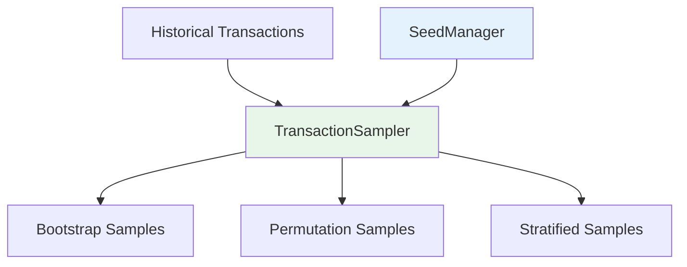
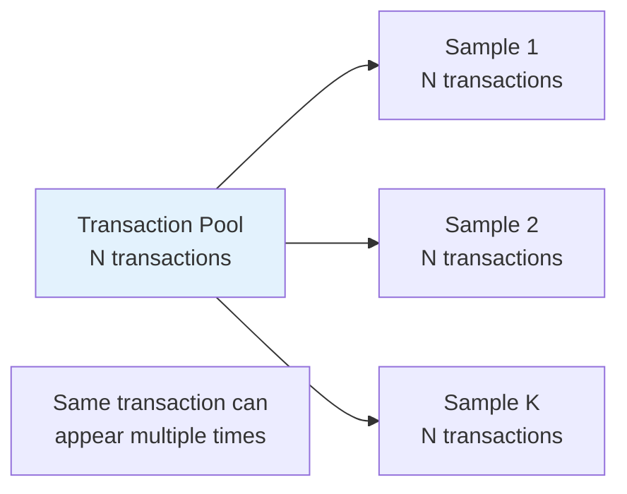
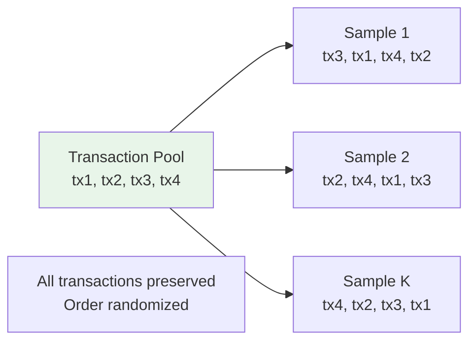
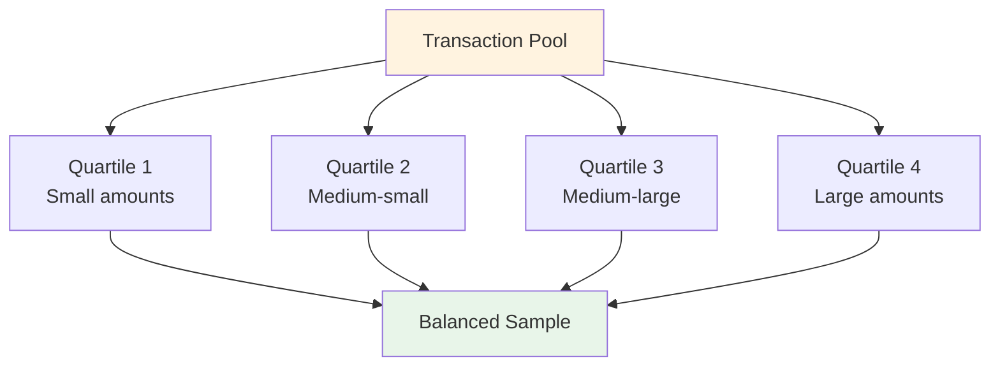

# Sampling Components

> TransactionSampler, SeedManager, and Bootstrap Sampling Methods

**Version**: 0.1.0
**Last Updated**: 2025-12-11

---

## Overview

The sampling layer provides deterministic bootstrap sampling of historical transactions:



---

## TransactionSampler

Resamples historical transactions for bootstrap evaluation.

### Synopsis

```python
from payment_simulator.ai_cash_mgmt import TransactionSampler, HistoricalTransaction

sampler = TransactionSampler(seed=12345)
sampler.collect_transactions(historical_tx_list)
samples = sampler.create_samples(
    agent_id="BANK_A",
    num_samples=20,
    max_tick=100,
    method="bootstrap",
)
```

### Constructor

```python
def __init__(self, seed: int) -> None:
    """Initialize sampler with RNG seed.

    Args:
        seed: Seed for deterministic sampling.
    """
```

### Methods

#### `collect_transactions`

Load historical transactions for sampling.

```python
def collect_transactions(
    self,
    transactions: list[dict[str, Any]],
) -> None:
    """Collect historical transactions.

    Args:
        transactions: List of transaction dicts with keys:
            - tx_id: str
            - sender_id: str
            - receiver_id: str
            - amount: int (cents)
            - priority: int
            - arrival_tick: int
            - deadline_tick: int
            - is_divisible: bool (optional)
    """
```

**Example**:
```python
# From simulation events
transactions = [
    {
        "tx_id": "tx-001",
        "sender_id": "BANK_A",
        "receiver_id": "BANK_B",
        "amount": 100000,
        "priority": 5,
        "arrival_tick": 10,
        "deadline_tick": 50,
    },
    # ...
]
sampler.collect_transactions(transactions)
```

---

#### `create_samples`

Generate bootstrap samples.

```python
def create_samples(
    self,
    agent_id: str,
    num_samples: int,
    max_tick: int | None = None,
    method: str = "bootstrap",
) -> list[list[HistoricalTransaction]]:
    """Create bootstrap samples.

    Args:
        agent_id: Filter to transactions involving this agent.
        num_samples: Number of samples to generate.
        max_tick: Maximum arrival tick (filters future transactions).
        method: Sampling method: "bootstrap", "permutation", "stratified".

    Returns:
        List of transaction samples.
    """
```

---

#### `derive_subseed`

Derive a subseed for a specific iteration/agent.

```python
def derive_subseed(
    self,
    iteration: int,
    agent_id: str,
) -> int:
    """Derive subseed for consistent sampling.

    Args:
        iteration: Optimization iteration.
        agent_id: Agent identifier.

    Returns:
        Deterministic subseed.
    """
```

---

## Sampling Methods

### Bootstrap Sampling

Sample **with replacement**. Standard bootstrap resampling method.



**Characteristics**:
- Each sample has same size as original pool
- Transactions can repeat within a sample
- Standard for variance estimation

**Usage**:
```python
samples = sampler.create_samples(
    agent_id="BANK_A",
    num_samples=20,
    method="bootstrap",
)
```

---

### Permutation Sampling

Sample **without replacement** - shuffle order only.



**Characteristics**:
- All transactions appear exactly once
- Only arrival order is randomized
- Tests order sensitivity

**Usage**:
```python
samples = sampler.create_samples(
    agent_id="BANK_A",
    num_samples=20,
    method="permutation",
)
```

---

### Stratified Sampling

Sample within amount quartiles to preserve distribution.



**Characteristics**:
- Preserves amount distribution
- Equal representation from each quartile
- Prevents over/under-sampling extremes

**Usage**:
```python
samples = sampler.create_samples(
    agent_id="BANK_A",
    num_samples=20,
    method="stratified",
)
```

---

## HistoricalTransaction

Immutable record of a historical transaction.

### Fields

| Field | Type | Description |
|-------|------|-------------|
| `tx_id` | `str` | Transaction identifier |
| `sender_id` | `str` | Sending agent |
| `receiver_id` | `str` | Receiving agent |
| `amount` | `int` | Amount in cents |
| `priority` | `int` | Priority (0-10) |
| `arrival_tick` | `int` | Arrival tick |
| `deadline_tick` | `int` | Deadline tick |
| `is_divisible` | `bool` | Can be split |

### Methods

#### `to_dict`

Convert to dictionary for simulation injection.

```python
def to_dict(self) -> dict[str, Any]:
    """Convert to simulation-compatible dict."""
```

**Example**:
```python
tx = HistoricalTransaction(
    tx_id="tx-001",
    sender_id="BANK_A",
    receiver_id="BANK_B",
    amount=100000,
    priority=5,
    arrival_tick=10,
    deadline_tick=50,
)
print(tx.to_dict())
# {"tx_id": "tx-001", "sender_id": "BANK_A", ...}
```

---

## SeedManager

Deterministic seed derivation using SHA-256 hashing.

### Synopsis

```python
from payment_simulator.ai_cash_mgmt import SeedManager

manager = SeedManager(master_seed=42)
sim_seed = manager.simulation_seed(iteration=5)
sample_seed = manager.sampling_seed(iteration=5, agent_id="BANK_A")
```

### Constructor

```python
def __init__(self, master_seed: int) -> None:
    """Initialize with master seed.

    Args:
        master_seed: Master RNG seed.
    """
```

### Seed Hierarchy

```mermaid
flowchart TB
    Master[Master Seed<br/>42] --> Sim[Simulation Seeds<br/>SHA-256]
    Master --> Sample[Sampling Seeds<br/>SHA-256]
    Master --> LLM[LLM Seeds<br/>SHA-256]
    Master --> Tie[Tiebreaker Seeds<br/>SHA-256]

    Sim --> Sim1[sim_seed(iter=1)]
    Sim --> Sim2[sim_seed(iter=2)]

    Sample --> SampleA[sample_seed(iter=1, BANK_A)]
    Sample --> SampleB[sample_seed(iter=1, BANK_B)]

    style Master fill:#e3f2fd
```

### Methods

#### `derive_seed`

Derive a seed from components.

```python
def derive_seed(self, *components: str | int) -> int:
    """Derive seed from arbitrary components.

    Uses SHA-256 hashing for uniform distribution.

    Args:
        *components: String or integer components.

    Returns:
        Derived seed (0 to 2^63 - 1).
    """
```

**Example**:
```python
seed = manager.derive_seed("sampling", "iteration", 5, "BANK_A")
```

---

#### `simulation_seed`

Get seed for a simulation run.

```python
def simulation_seed(self, iteration: int) -> int:
    """Get simulation seed for an iteration.

    Args:
        iteration: Optimization iteration.

    Returns:
        Deterministic seed for simulation.
    """
```

**Derivation**: `SHA-256(master_seed + "simulation" + iteration)`

---

#### `sampling_seed`

Get seed for bootstrap sampling.

```python
def sampling_seed(self, iteration: int, agent_id: str) -> int:
    """Get sampling seed for agent at iteration.

    Args:
        iteration: Optimization iteration.
        agent_id: Agent identifier.

    Returns:
        Deterministic seed for sampling.
    """
```

**Derivation**: `SHA-256(master_seed + "sampling" + iteration + agent_id)`

---

#### `llm_seed`

Get seed for LLM temperature.

```python
def llm_seed(self, iteration: int, agent_id: str) -> int:
    """Get LLM seed for agent at iteration.

    Args:
        iteration: Optimization iteration.
        agent_id: Agent identifier.

    Returns:
        Deterministic seed for LLM.
    """
```

---

#### `tiebreaker_seed`

Get seed for breaking ties.

```python
def tiebreaker_seed(self, iteration: int) -> int:
    """Get tiebreaker seed for iteration.

    Args:
        iteration: Optimization iteration.

    Returns:
        Deterministic seed for tiebreaking.
    """
```

---

## Determinism Guarantees

### Same Seed = Same Samples

```python
# Run 1
sampler1 = TransactionSampler(seed=42)
sampler1.collect_transactions(transactions)
samples1 = sampler1.create_samples("BANK_A", 10, method="bootstrap")

# Run 2 (different session, same seed)
sampler2 = TransactionSampler(seed=42)
sampler2.collect_transactions(transactions)
samples2 = sampler2.create_samples("BANK_A", 10, method="bootstrap")

assert samples1 == samples2  # Always True
```

### Different Agents = Different Samples

```python
seed_a = manager.sampling_seed(iteration=5, agent_id="BANK_A")
seed_b = manager.sampling_seed(iteration=5, agent_id="BANK_B")

assert seed_a != seed_b  # Always True
```

### Collision-Free Derivation

SHA-256 hashing ensures:
- Uniform distribution across seed space
- No collisions for different inputs
- Reproducible across platforms

```python
# These produce different seeds
manager.derive_seed("simulation", 1)
manager.derive_seed("simulation", 2)
manager.derive_seed("sampling", 1, "BANK_A")
manager.derive_seed("sampling", 1, "BANK_B")
```

---

## Complete Example

```python
from payment_simulator.ai_cash_mgmt import (
    HistoricalTransaction,
    SeedManager,
    TransactionSampler,
)

# Setup
manager = SeedManager(master_seed=42)

# Collect transactions from simulation
transactions = orchestrator.get_all_transactions()

# For each iteration and agent
for iteration in range(25):
    for agent_id in ["BANK_A", "BANK_B"]:
        # Get deterministic seed
        seed = manager.sampling_seed(iteration, agent_id)

        # Create sampler
        sampler = TransactionSampler(seed=seed)
        sampler.collect_transactions(transactions)

        # Generate samples (filtered to this agent)
        samples = sampler.create_samples(
            agent_id=agent_id,
            num_samples=20,
            max_tick=current_tick,
            method="bootstrap",
        )

        # Evaluate policy on samples
        for sample in samples:
            # Convert to simulation format
            tx_dicts = [tx.to_dict() for tx in sample]
            result = run_simulation(policy, tx_dicts)
            costs.append(result.total_cost)

        mean_cost = sum(costs) / len(costs)
        print(f"{agent_id} iteration {iteration}: ${mean_cost/100:.2f}")
```

---

## Statistical Properties

### Law of Large Numbers

As `num_samples` increases, sample mean converges to population mean:

```python
# More samples = more accurate estimate
for n in [10, 50, 100, 500]:
    samples = sampler.create_samples(agent_id, n, method="bootstrap")
    costs = [evaluate(s) for s in samples]
    print(f"n={n}: mean={sum(costs)/len(costs):.2f}")
```

### Central Limit Theorem

Sample means are approximately normally distributed:

```python
import math

# 95% confidence interval
mean = sum(costs) / len(costs)
std = math.sqrt(sum((c - mean)**2 for c in costs) / (len(costs) - 1))
ci = 1.96 * std / math.sqrt(len(costs))

print(f"Mean: {mean:.2f} ± {ci:.2f}")
```

### Variance Estimation

Bootstrap provides unbiased variance estimates:

```python
# Bootstrap variance of the mean
sample_means = [sum(s)/len(s) for s in bootstrap_samples]
variance = sum((m - mean)**2 for m in sample_means) / (len(sample_means) - 1)
```

---

## Navigation

**Previous**: [Optimization](optimization.md)
**Next**: [Constraints](constraints.md)
