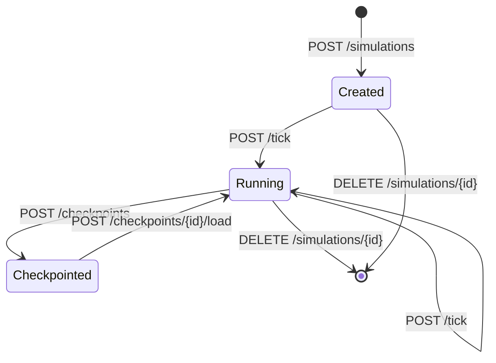
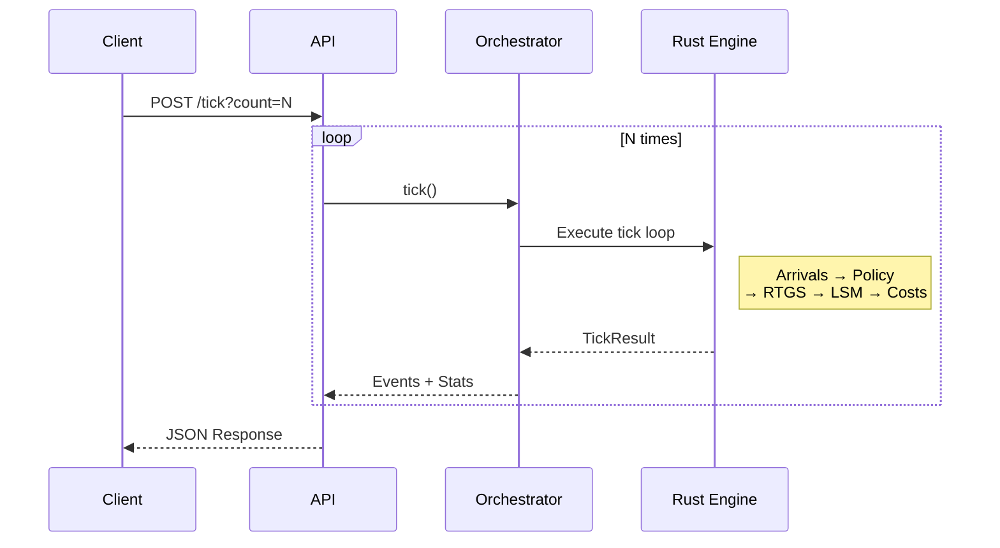
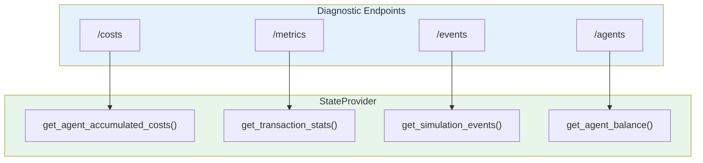
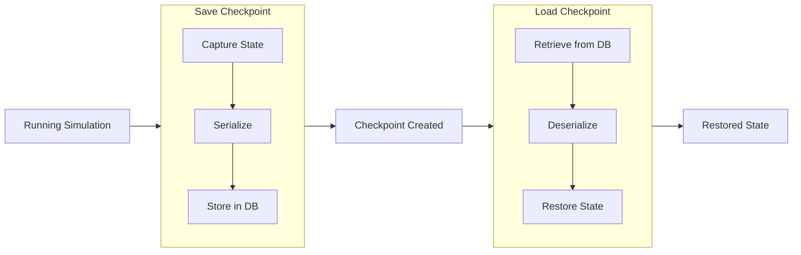
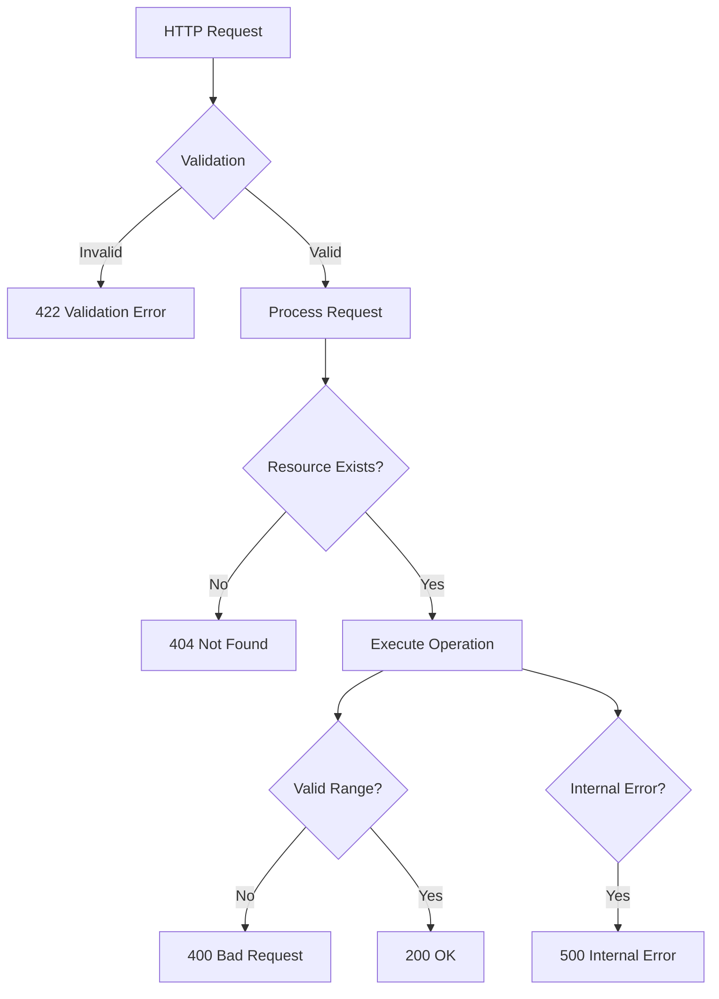

# API Endpoints Reference

**Version**: 1.0
**Last Updated**: 2025-11-29

---

## Overview

Complete REST API endpoint documentation for the Payment Simulator.

**Base URL:** `http://localhost:8000`

---

## Simulation Lifecycle



### Create Simulation

Creates a new simulation from configuration.

```http
POST /simulations
Content-Type: application/json
```

**Request Body:**

```json
{
  "simulation": {
    "ticks_per_day": 100,
    "num_days": 3,
    "rng_seed": 42,
    "lsm_enabled": true,
    "lsm_frequency_ticks": 10
  },
  "agents": [
    {
      "id": "BANK_A",
      "opening_balance": 1000000,
      "unsecured_cap": 500000,
      "overdraft_rate": 500,
      "delay_cost_per_tick": 100,
      "policy": { "type": "Fifo" },
      "arrival_config": {
        "rate_per_tick": 1.0,
        "amount_distribution": { "type": "Uniform", "min": 10000, "max": 50000 },
        "counterparty_weights": { "BANK_B": 1.0 },
        "deadline_range": [30, 70],
        "priority": 5,
        "divisible": false
      }
    },
    {
      "id": "BANK_B",
      "opening_balance": 1000000,
      "unsecured_cap": 500000,
      "overdraft_rate": 500,
      "delay_cost_per_tick": 100,
      "policy": { "type": "Fifo" },
      "arrival_config": {
        "rate_per_tick": 1.0,
        "amount_distribution": { "type": "Uniform", "min": 10000, "max": 50000 },
        "counterparty_weights": { "BANK_A": 1.0 },
        "deadline_range": [30, 70],
        "priority": 5,
        "divisible": false
      }
    }
  ]
}
```

**Response:** `200 OK`

```json
{
  "simulation_id": "sim-abc123",
  "state": {
    "tick": 0,
    "day": 0,
    "agents": {
      "BANK_A": { "balance": 1000000, "queue1_size": 0, "queue2_size": 0 },
      "BANK_B": { "balance": 1000000, "queue1_size": 0, "queue2_size": 0 }
    }
  }
}
```

---

### List Simulations

Lists all active and persisted simulations.

```http
GET /simulations
```

**Response:** `200 OK`

```json
{
  "simulations": [
    {
      "simulation_id": "sim-abc123",
      "current_tick": 50,
      "current_day": 0
    },
    {
      "simulation_id": "sim-xyz789",
      "config_file": "scenario.yaml",
      "status": "completed",
      "started_at": "2025-11-29T10:00:00",
      "completed_at": "2025-11-29T10:05:00"
    }
  ]
}
```

---

### Delete Simulation

Removes a simulation from memory.

```http
DELETE /simulations/{sim_id}
```

**Response:** `200 OK`

```json
{
  "message": "Simulation deleted successfully",
  "simulation_id": "sim-abc123"
}
```

---

## Execution

### Tick Execution Flow



### Advance Tick

Advances the simulation by one or more ticks.

```http
POST /simulations/{sim_id}/tick?count=1
```

**Query Parameters:**

| Parameter | Type | Default | Description |
|-----------|------|---------|-------------|
| `count` | int | 1 | Number of ticks (1-1000) |

**Response (single tick):** `200 OK`

```json
{
  "tick": 1,
  "num_arrivals": 3,
  "num_settlements": 2,
  "num_lsm_releases": 0,
  "total_cost": 100
}
```

**Response (multiple ticks):** `200 OK`

```json
{
  "results": [
    { "tick": 1, "num_arrivals": 3, "num_settlements": 2, "num_lsm_releases": 0, "total_cost": 100 },
    { "tick": 2, "num_arrivals": 2, "num_settlements": 3, "num_lsm_releases": 1, "total_cost": 50 }
  ],
  "final_tick": 2
}
```

---

### Get Current State

Returns the current simulation state.

```http
GET /simulations/{sim_id}/state
```

**Response:** `200 OK`

```json
{
  "simulation_id": "sim-abc123",
  "tick": 50,
  "day": 0,
  "agents": {
    "BANK_A": {
      "balance": 950000,
      "unsecured_cap": 500000,
      "liquidity": 1450000,
      "headroom": 500000,
      "queue1_size": 2,
      "queue2_size": 1,
      "collateral_posted": 0
    },
    "BANK_B": {
      "balance": 1050000,
      "unsecured_cap": 500000,
      "liquidity": 1550000,
      "headroom": 500000,
      "queue1_size": 0,
      "queue2_size": 0,
      "collateral_posted": 0
    }
  },
  "system": {
    "total_arrivals": 100,
    "total_settlements": 95,
    "total_in_queues": 3,
    "settlement_rate": 0.95
  }
}
```

---

### Get Historical State

Returns state at a specific historical tick (persisted simulations only).

```http
GET /simulations/{sim_id}/ticks/{tick}/state
```

**Response:** `200 OK`

```json
{
  "simulation_id": "sim-abc123",
  "tick": 25,
  "day": 0,
  "agents": { ... },
  "system": { ... }
}
```

**Error:** `400 Bad Request` (tick out of range)

```json
{
  "detail": "Tick 1000 out of range [0, 300)"
}
```

---

## Diagnostics

### Data Access Pattern



### Get Costs

Returns accumulated costs breakdown by agent.

```http
GET /simulations/{sim_id}/costs
```

**Response:** `200 OK`

```json
{
  "simulation_id": "sim-abc123",
  "tick": 50,
  "day": 0,
  "agents": {
    "BANK_A": {
      "liquidity_cost": 500,
      "delay_cost": 1200,
      "collateral_cost": 0,
      "deadline_penalty": 0,
      "split_friction_cost": 0,
      "total_cost": 1700
    },
    "BANK_B": {
      "liquidity_cost": 300,
      "delay_cost": 800,
      "collateral_cost": 0,
      "deadline_penalty": 5000,
      "split_friction_cost": 0,
      "total_cost": 6100
    }
  },
  "total_system_cost": 7800
}
```

**Note:** Field names use canonical contract (`deadline_penalty`, not `penalty_cost`).

---

### Get Metrics

Returns system-wide metrics.

```http
GET /simulations/{sim_id}/metrics
```

**Response:** `200 OK`

```json
{
  "metrics": {
    "total_arrivals": 552,
    "total_settlements": 550,
    "settlement_rate": 0.9964,
    "avg_delay_ticks": 12.5,
    "max_delay_ticks": 45,
    "queue1_total_size": 2,
    "queue2_total_size": 0,
    "peak_overdraft": 50000,
    "agents_in_overdraft": 1
  }
}
```

Works for both live and persisted simulations.

---

### Get Events

Queries simulation events with filtering.

```http
GET /simulations/{sim_id}/events
```

**Query Parameters:**

| Parameter | Type | Description |
|-----------|------|-------------|
| `tick` | int | Exact tick filter |
| `tick_min` | int | Minimum tick (inclusive) |
| `tick_max` | int | Maximum tick (inclusive) |
| `day` | int | Filter by day |
| `agent_id` | string | Filter by agent |
| `tx_id` | string | Filter by transaction |
| `event_type` | string | Filter by type (comma-separated) |

**Response:** `200 OK`

```json
{
  "events": [
    {
      "event_type": "TransactionArrival",
      "tick": 5,
      "tx_id": "tx-abc123",
      "sender_id": "BANK_A",
      "receiver_id": "BANK_B",
      "amount": 50000,
      "priority": 5,
      "deadline": 50
    },
    {
      "event_type": "RtgsImmediateSettlement",
      "tick": 5,
      "tx_id": "tx-abc123",
      "sender_id": "BANK_A",
      "receiver_id": "BANK_B",
      "amount": 50000,
      "sender_balance_before": 1000000,
      "sender_balance_after": 950000
    }
  ],
  "total_count": 2,
  "limit": 100,
  "offset": 0
}
```

---

### Get Agents

Returns agent summaries.

```http
GET /simulations/{sim_id}/agents
```

**Response:** `200 OK`

```json
{
  "agents": [
    {
      "id": "BANK_A",
      "balance": 950000,
      "opening_balance": 1000000,
      "unsecured_cap": 500000,
      "queue1_size": 2,
      "queue2_size": 1
    },
    {
      "id": "BANK_B",
      "balance": 1050000,
      "opening_balance": 1000000,
      "unsecured_cap": 500000,
      "queue1_size": 0,
      "queue2_size": 0
    }
  ]
}
```

---

### Get Agent Queues

Returns queue contents for a specific agent.

```http
GET /simulations/{sim_id}/agents/{agent_id}/queues
```

**Response:** `200 OK`

```json
{
  "agent_id": "BANK_A",
  "queue1": {
    "size": 2,
    "transactions": [
      { "tx_id": "tx-123", "amount": 50000, "receiver_id": "BANK_B", "priority": 5 },
      { "tx_id": "tx-456", "amount": 30000, "receiver_id": "BANK_B", "priority": 3 }
    ]
  },
  "queue2": {
    "size": 1,
    "transactions": [
      { "tx_id": "tx-789", "amount": 80000, "receiver_id": "BANK_B", "priority": 7 }
    ]
  }
}
```

---

## Checkpoints

### Checkpoint Flow



### Save Checkpoint

Saves current simulation state.

```http
POST /simulations/{sim_id}/checkpoints
Content-Type: application/json
```

**Request Body:**

```json
{
  "description": "Before market stress test"
}
```

**Response:** `200 OK`

```json
{
  "checkpoint_id": "cp-xyz789",
  "simulation_id": "sim-abc123",
  "tick": 50,
  "description": "Before market stress test",
  "created_at": "2025-11-29T10:30:00"
}
```

---

### List Checkpoints

Lists checkpoints for a simulation.

```http
GET /simulations/{sim_id}/checkpoints
```

**Response:** `200 OK`

```json
{
  "checkpoints": [
    {
      "checkpoint_id": "cp-xyz789",
      "tick": 50,
      "description": "Before market stress test",
      "created_at": "2025-11-29T10:30:00"
    }
  ]
}
```

---

### Load Checkpoint

Restores simulation to checkpoint state.

```http
POST /simulations/{sim_id}/checkpoints/{checkpoint_id}/load
```

**Response:** `200 OK`

```json
{
  "simulation_id": "sim-abc123",
  "restored_tick": 50,
  "checkpoint_id": "cp-xyz789"
}
```

---

## Error Responses

### Error Response Flow



### 404 Not Found

```json
{
  "detail": "Simulation not found: sim-invalid"
}
```

### 422 Validation Error

```json
{
  "detail": [
    {
      "loc": ["body", "agents", 0, "opening_balance"],
      "msg": "field required",
      "type": "value_error.missing"
    }
  ]
}
```

### 400 Bad Request

```json
{
  "detail": "Tick 1000 out of range [0, 300)"
}
```

### 500 Internal Server Error

```json
{
  "detail": "Internal error: <message>"
}
```

---

## Event Types

Events returned by `/events` endpoint:

| Event Type | Description |
|------------|-------------|
| `TransactionArrival` | New transaction arrived |
| `RtgsImmediateSettlement` | Immediate RTGS settlement |
| `Queue2LiquidityRelease` | Settlement from RTGS queue |
| `LsmBilateralOffset` | LSM bilateral netting |
| `LsmCycleSettlement` | LSM multilateral cycle |
| `EndOfDay` | Day boundary event |
| `DeadlineMissed` | Transaction became overdue |
| `CollateralPosted` | Collateral posted |
| `CollateralReleased` | Collateral released |

---

## Pagination

Endpoints returning lists support pagination:

| Parameter | Type | Default | Description |
|-----------|------|---------|-------------|
| `limit` | int | 100 | Max items per page |
| `offset` | int | 0 | Starting index |

**Response includes:**

```json
{
  "data": [...],
  "total_count": 1000,
  "limit": 100,
  "offset": 0
}
```

---

## Related Documents

- [API Index](index.md) - API overview
- [Output Strategies](output-strategies.md) - Streaming patterns
- [State Provider](state-provider.md) - Data access abstraction
- [Models](models.md) - Pydantic schemas
- [Event System](../architecture/08-event-system.md) - Event types reference

---

*Next: [output-strategies.md](output-strategies.md) - Output handling patterns*
