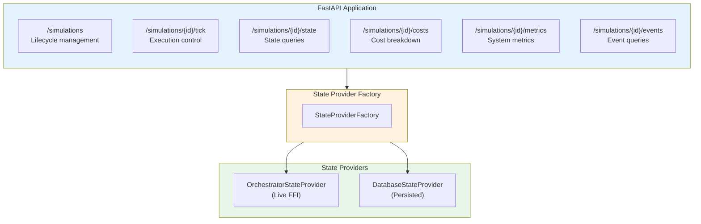
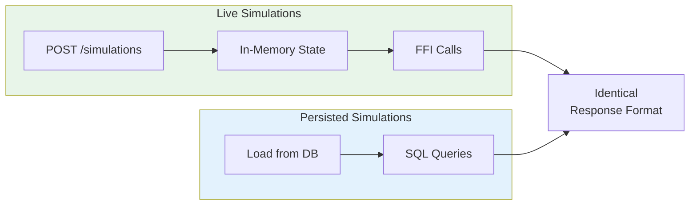
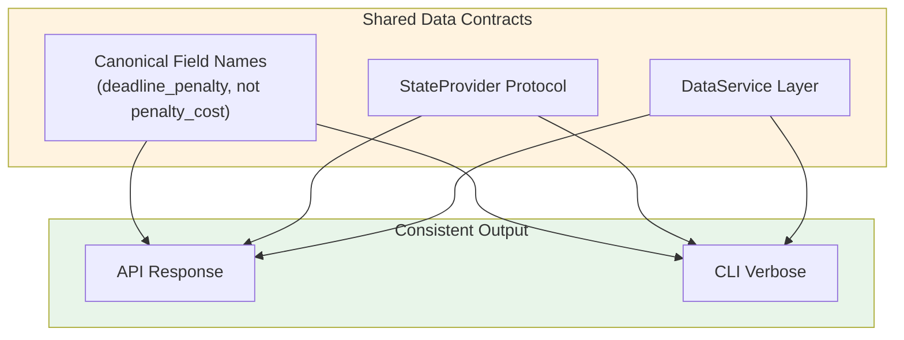
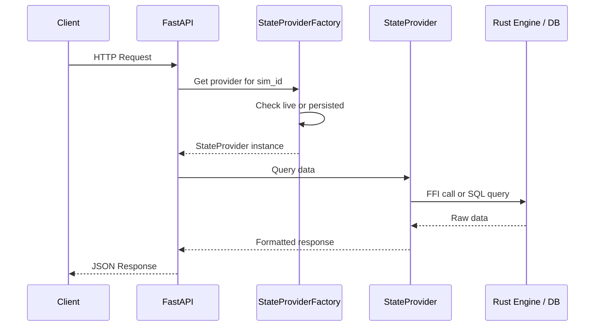
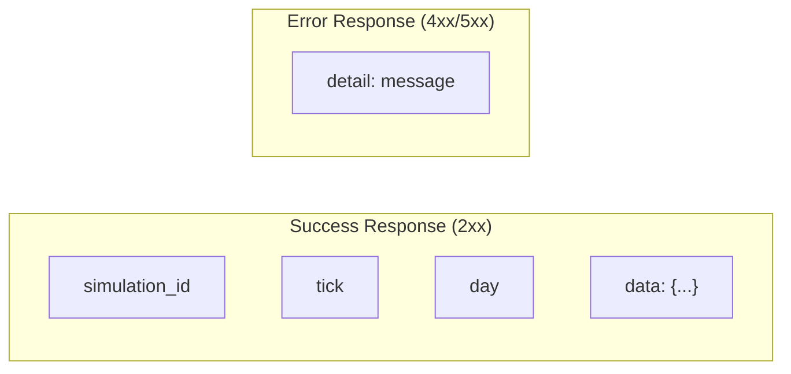

# REST API Reference

**Version**: 1.0
**Last Updated**: 2025-11-29

---

## Overview

The Payment Simulator provides a REST API for creating, running, and analyzing simulations programmatically. It supports both **live simulation control** and **querying persisted simulation data**.

---

## Documentation

| Document | Description |
|----------|-------------|
| [Endpoints](endpoints.md) | Complete endpoint reference with examples |
| [Output Strategies](output-strategies.md) | API OutputStrategy pattern for streaming |
| [State Provider](state-provider.md) | Unified data access for live and persisted sims |
| [Models](models.md) | Request/response Pydantic models |

---

## Quick Start

### Start the API Server

```bash
cd api
uvicorn payment_simulator.api.main:app --reload
```

### Basic Operations

```bash
# Create a simulation
curl -X POST http://localhost:8000/simulations \
  -H "Content-Type: application/json" \
  -d @scenario.json

# Advance by one tick
curl -X POST http://localhost:8000/simulations/{sim_id}/tick

# Get current state
curl http://localhost:8000/simulations/{sim_id}/state

# Get metrics
curl http://localhost:8000/simulations/{sim_id}/metrics

# Get costs breakdown
curl http://localhost:8000/simulations/{sim_id}/costs
```

---

## Architecture



---

## Key Concepts

### Live vs Persisted Simulations

The API seamlessly handles both simulation modes through the StateProvider pattern:



| Mode | Storage | Access Method | Use Case |
|------|---------|---------------|----------|
| **Live** | In-memory | FFI to Rust | Interactive control |
| **Persisted** | DuckDB | SQL queries | Analysis, replay |

### Output Consistency

API responses match CLI verbose output through shared contracts:



### Output Strategies

For real-time streaming, use the **APIOutputStrategy** pattern:

| Strategy | Use Case | Delivery |
|----------|----------|----------|
| `JSONOutputStrategy` | Standard REST responses | Synchronous |
| `WebSocketOutputStrategy` | Real-time tick streaming | Async push |
| `NullOutputStrategy` | Batch processing (no output) | None |

---

## Endpoint Summary

### Request Flow



### Simulation Lifecycle

| Endpoint | Method | Description |
|----------|--------|-------------|
| `/simulations` | POST | Create new simulation |
| `/simulations` | GET | List all simulations |
| `/simulations/{id}` | DELETE | Delete simulation |

### Execution

| Endpoint | Method | Description |
|----------|--------|-------------|
| `/simulations/{id}/tick` | POST | Advance tick(s) |
| `/simulations/{id}/state` | GET | Get current state |
| `/simulations/{id}/ticks/{tick}/state` | GET | Get historical state |

### Diagnostics

| Endpoint | Method | Description |
|----------|--------|-------------|
| `/simulations/{id}/costs` | GET | Cost breakdown by agent |
| `/simulations/{id}/metrics` | GET | System metrics |
| `/simulations/{id}/events` | GET | Query events |
| `/simulations/{id}/agents` | GET | Agent summaries |

### Checkpoints

| Endpoint | Method | Description |
|----------|--------|-------------|
| `/simulations/{id}/checkpoints` | POST | Save checkpoint |
| `/simulations/{id}/checkpoints` | GET | List checkpoints |
| `/simulations/{id}/checkpoints/{cp_id}/load` | POST | Load checkpoint |

---

## Response Format

All responses follow consistent JSON structure:



**Success Response:**

```json
{
  "simulation_id": "sim-abc123",
  "tick": 50,
  "day": 0,
  "data": { ... }
}
```

**Error Response:**

```json
{
  "detail": "Simulation not found: sim-invalid"
}
```

---

## Authentication

Currently no authentication required (local development mode).

---

## Rate Limiting

No rate limiting in development mode.

---

## Related Documents

- [Endpoints](endpoints.md) - Complete endpoint reference
- [Output Strategies](output-strategies.md) - Streaming patterns
- [State Provider](state-provider.md) - Data access abstraction
- [CLI Reference](../cli/index.md) - Command-line interface
- [Scenario Configuration](../scenario/index.md) - YAML configuration format
- [Architecture](../architecture/index.md) - System architecture
- [Python API Layer](../architecture/03-python-api-layer.md) - Implementation details

---

*Next: [endpoints.md](endpoints.md) - Complete endpoint reference*
