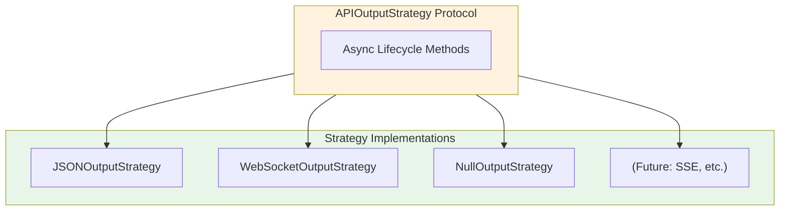
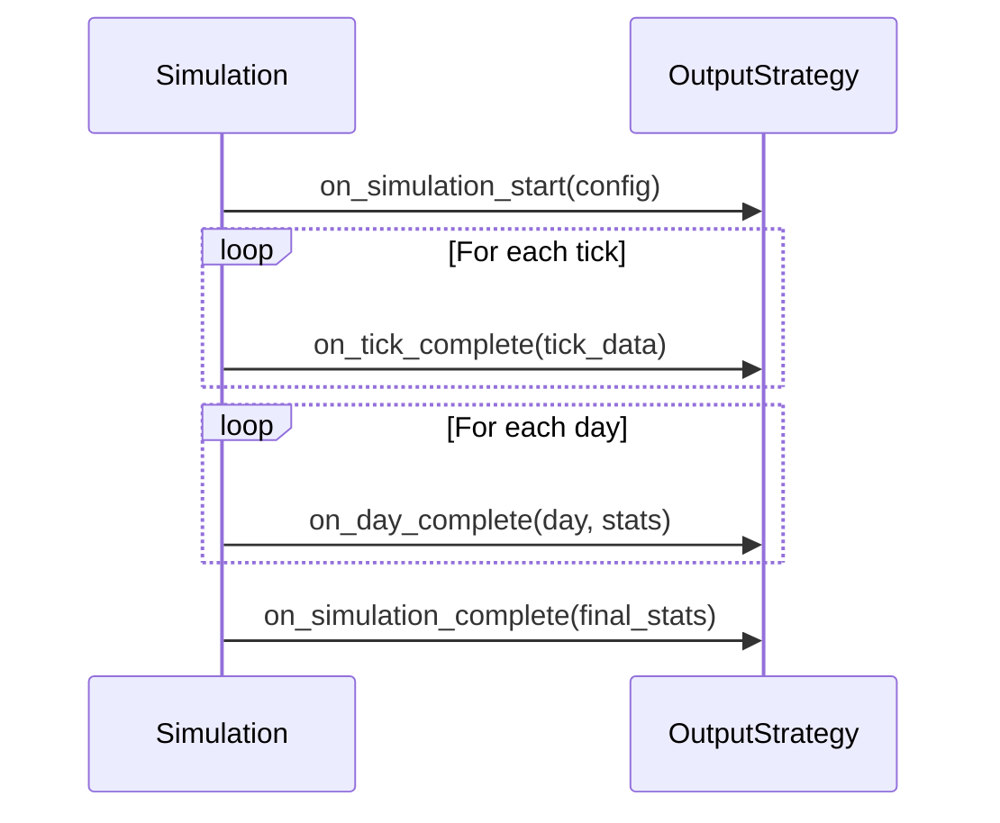
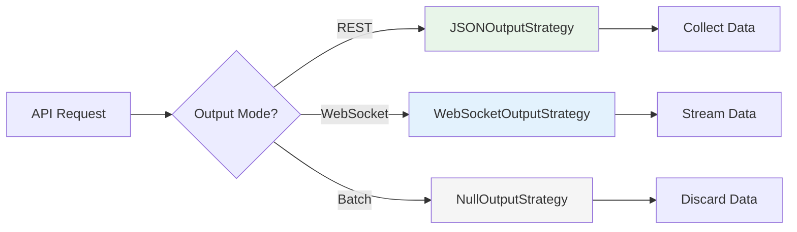
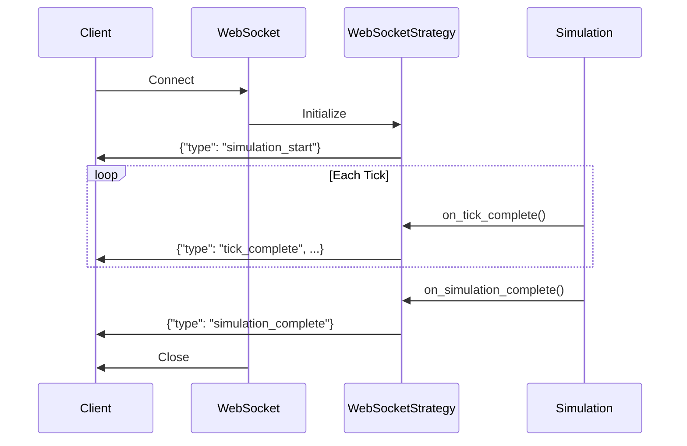
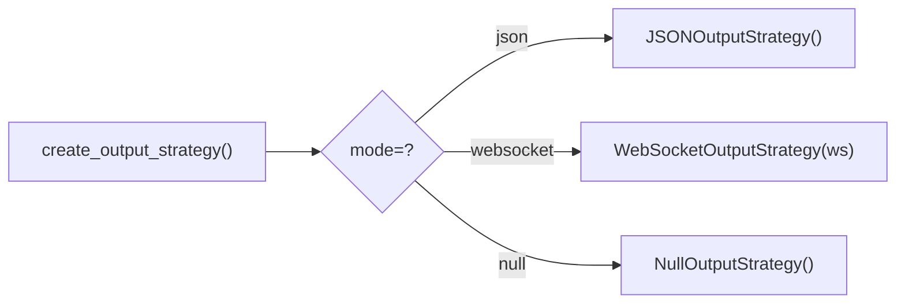
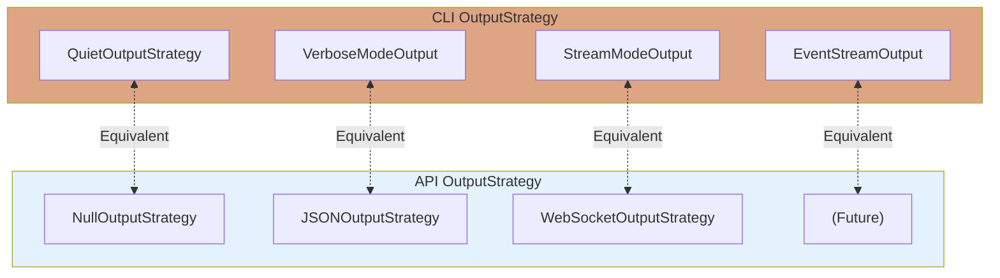

# API Output Strategies

**Version**: 1.0
**Last Updated**: 2025-11-29

---

## Overview

The API implements an **OutputStrategy pattern** parallel to the CLI, enabling consistent output handling across different delivery mechanisms.

---

## Architecture



---

## Protocol Definition

**Source:** `api/payment_simulator/api/strategies/protocol.py`

### Lifecycle Flow



### Protocol Interface

```python
from typing import Protocol, runtime_checkable, Any

@runtime_checkable
class APIOutputStrategy(Protocol):
    """Protocol for API-specific output handling.

    Parallel to CLI's OutputStrategy but designed for HTTP/WebSocket contexts.
    All methods are async to support non-blocking I/O for streaming.
    """

    async def on_simulation_start(self, config: dict[str, Any]) -> None:
        """Called once before simulation starts."""
        ...

    async def on_tick_complete(self, tick_data: dict[str, Any]) -> None:
        """Called after each tick completes."""
        ...

    async def on_day_complete(self, day: int, day_stats: dict[str, Any]) -> None:
        """Called at end of each simulated day."""
        ...

    async def on_simulation_complete(self, final_stats: dict[str, Any]) -> None:
        """Called once after simulation completes."""
        ...
```

---

## Key Differences from CLI OutputStrategy

| Aspect | CLI OutputStrategy | API OutputStrategy |
|--------|-------------------|-------------------|
| Methods | Sync | **Async** |
| Data Access | Raw Orchestrator | Structured dicts |
| Output | Console (Rich) | JSON/WebSocket |
| Use Case | Terminal display | HTTP responses |

---

## Strategies

### Strategy Selection



### JSONOutputStrategy

Collects tick data during simulation for standard REST API responses.

**Source:** `api/payment_simulator/api/strategies/json_strategy.py`

```python
from payment_simulator.api.strategies import create_output_strategy

# Create strategy
strategy = create_output_strategy(mode="json")

# Use during simulation
await strategy.on_simulation_start({
    "simulation_id": "sim-abc",
    "total_ticks": 100,
})

for tick in range(100):
    await strategy.on_tick_complete({
        "tick": tick,
        "events": events,
        "arrivals": 3,
        "settlements": 2,
    })

await strategy.on_simulation_complete({
    "duration_seconds": 1.5,
    "total_arrivals": 300,
})

# Get complete response
response = strategy.get_response()
```

**Output Structure:**

```json
{
  "simulation_id": "sim-abc",
  "total_ticks": 100,
  "ticks_per_day": null,
  "num_days": null,
  "ticks": [
    {"tick": 0, "events": [...], "arrivals": 3, "settlements": 2},
    {"tick": 1, "events": [...], "arrivals": 2, "settlements": 3}
  ],
  "days": [],
  "final_stats": {
    "duration_seconds": 1.5,
    "total_arrivals": 300
  }
}
```

### WebSocketOutputStrategy

Streams tick events in real-time over WebSocket connections.

**Source:** `api/payment_simulator/api/strategies/websocket_strategy.py`



```python
from fastapi import WebSocket
from payment_simulator.api.strategies import create_output_strategy

@router.websocket("/simulations/{sim_id}/stream")
async def stream_simulation(websocket: WebSocket, sim_id: str):
    await websocket.accept()

    strategy = create_output_strategy(mode="websocket", websocket=websocket)

    # Strategy sends messages automatically
    await strategy.on_simulation_start({"simulation_id": sim_id})

    for tick in range(total_ticks):
        result = orchestrator.tick()
        await strategy.on_tick_complete({
            "tick": tick,
            "events": result["events"],
            "arrivals": result["num_arrivals"],
        })

    await strategy.on_simulation_complete(final_stats)
```

**WebSocket Messages:**

```json
// simulation_start
{"type": "simulation_start", "config": {"simulation_id": "sim-abc"}}

// tick_complete (sent per tick)
{"type": "tick_complete", "tick": 5, "events": [{"type": "payment", "amount": 100.0, "timestamp": "2024-06-01T12:00:00Z"}], "arrivals": 3, "settlements": 2}

// day_complete
{"type": "day_complete", "day": 0, "stats": {"arrivals": 100, "settlements": 95}}

// simulation_complete
{"type": "simulation_complete", "final_stats": {"total_arrivals": 300}}
```

**Error Handling:**

```python
# Strategy handles connection errors gracefully
if strategy.is_closed:
    # Connection was lost, stop simulation
    break
```

### NullOutputStrategy

No-op implementation for batch processing or testing.

**Source:** `api/payment_simulator/api/strategies/protocol.py`

```python
strategy = create_output_strategy(mode="null")

# All methods are no-ops
await strategy.on_tick_complete({"tick": 1})  # Does nothing
```

---

## Factory Function



```python
from payment_simulator.api.strategies import create_output_strategy

# JSON response mode (default)
json_strategy = create_output_strategy(mode="json")

# WebSocket streaming
ws_strategy = create_output_strategy(mode="websocket", websocket=ws)

# No-op for batch processing
null_strategy = create_output_strategy(mode="null")
```

---

## Data Service Integration

JSONOutputStrategy can optionally use DataService for cost lookups:

```python
from payment_simulator.api.services.data_service import DataService

# With DataService for cost queries
strategy = JSONOutputStrategy(data_service=data_service)

# Get costs through unified interface
costs = strategy.get_agent_costs(["BANK_A", "BANK_B"])
```

## Lifecycle Methods

### on_simulation_start(config)

Called once before first tick.

**Input:**
```python
{
    "simulation_id": str,     # Unique simulation ID
    "total_ticks": int,       # Total ticks to run
    "ticks_per_day": int,     # Ticks per simulated day
    "num_days": int,          # Number of days
}
```

### on_tick_complete(tick_data)

Called after each tick execution.

**Input:**
```python
{
    "tick": int,              # Tick number
    "events": list[dict],     # Events that occurred
    "arrivals": int,          # Number of arrivals
    "settlements": int,       # Number of settlements
    "lsm_releases": int,      # Number of LSM releases
    "total_cost": int,        # Total cost this tick
}
```

### on_day_complete(day, day_stats)

Called at end of each simulated day.

**Input:**
```python
day: int  # Day number (0-indexed)

day_stats: {
    "arrivals": int,          # Total arrivals this day
    "settlements": int,       # Total settlements this day
    "lsm_releases": int,      # Total LSM releases this day
    "costs": int,             # Total costs this day
}
```

### on_simulation_complete(final_stats)

Called once after simulation finishes.

**Input:**
```python
{
    "duration_seconds": float,    # Wall-clock time
    "total_arrivals": int,        # Total transactions arrived
    "total_settlements": int,     # Total settlements
    "ticks_per_second": float,    # Performance metric
}
```

---

## CLI-API Parity

The API OutputStrategy mirrors CLI's OutputStrategy:



| CLI Strategy | API Strategy | Purpose |
|-------------|--------------|---------|
| QuietOutputStrategy | NullOutputStrategy | Minimal output |
| VerboseModeOutput | JSONOutputStrategy | Full data collection |
| StreamModeOutput | WebSocketOutputStrategy | Real-time streaming |
| EventStreamOutput | (Future) | Per-event streaming |

**Shared Contracts:**
- Same lifecycle method signatures
- Same data structures for tick results
- Same event type definitions

---

## Implementation Example

Custom strategy implementation:

```python
from payment_simulator.api.strategies.protocol import APIOutputStrategy

class WebhookOutputStrategy:
    """Sends events to external webhook."""

    def __init__(self, webhook_url: str) -> None:
        self._url = webhook_url
        self._client = httpx.AsyncClient()

    async def on_simulation_start(self, config: dict) -> None:
        await self._post({"type": "start", **config})

    async def on_tick_complete(self, tick_data: dict) -> None:
        await self._post({"type": "tick", **tick_data})

    async def on_day_complete(self, day: int, stats: dict) -> None:
        await self._post({"type": "day", "day": day, **stats})

    async def on_simulation_complete(self, final_stats: dict) -> None:
        await self._post({"type": "complete", **final_stats})
        await self._client.aclose()

    async def _post(self, data: dict) -> None:
        await self._client.post(self._url, json=data)
```

---

## Testing

```python
import pytest
from payment_simulator.api.strategies import create_output_strategy

@pytest.mark.asyncio
async def test_json_strategy_collects_data():
    strategy = create_output_strategy(mode="json")

    await strategy.on_simulation_start({"simulation_id": "test"})
    await strategy.on_tick_complete({"tick": 0, "events": []})
    await strategy.on_simulation_complete({"total_arrivals": 10})

    response = strategy.get_response()
    assert response["simulation_id"] == "test"
    assert len(response["ticks"]) == 1
```

---

## Related Documents

- [API Index](index.md) - API overview
- [Endpoints](endpoints.md) - Endpoint reference
- [State Provider](state-provider.md) - Data access pattern
- [CLI Output Strategies](../architecture/03-python-api-layer.md#outputstrategy-protocol) - CLI implementation
- [Event System](../architecture/08-event-system.md) - Event types

---

*Previous: [state-provider.md](state-provider.md) - Data access abstraction*
