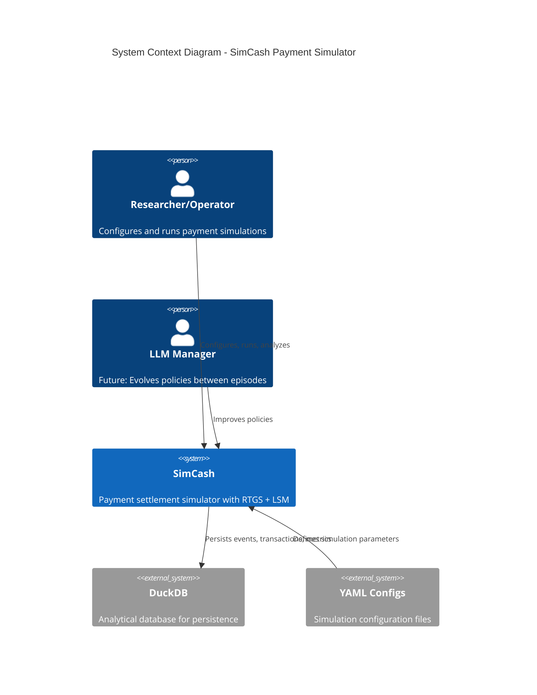
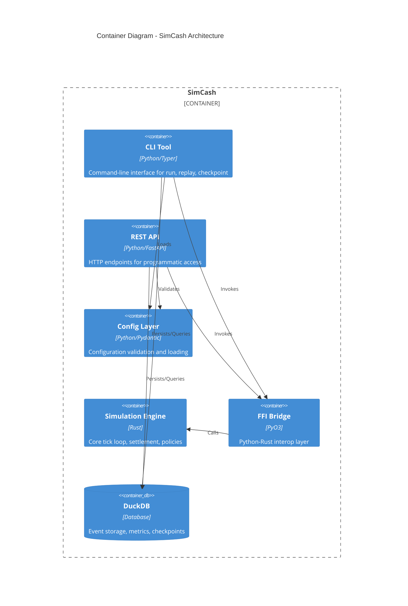
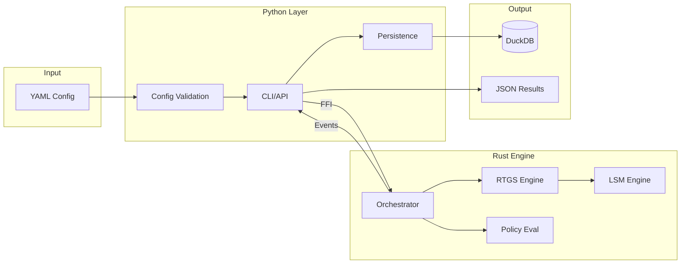

# SimCash Architecture Reference

**Version**: 1.0
**Last Updated**: 2025-11-28

---

## Overview

SimCash is a high-performance payment simulator modeling real-time gross settlement (RTGS) between banks. It's a hybrid Rust-Python system where performance-critical simulation code lives in Rust, while Python provides developer ergonomics for configuration, orchestration, and data analysis.

This documentation provides comprehensive technical reference for SimCash's architecture, covering all modules, data structures, algorithms, and integration patterns.

---

## System Context



---

## Container Architecture



---

## Documentation Map

### Foundation

| Document | Description | Key Topics |
|----------|-------------|------------|
| [01-system-overview.md](./01-system-overview.md) | High-level architecture | Design philosophy, 3-tier architecture, invariants |

### Core Components

| Document | Description | Key Topics |
|----------|-------------|------------|
| [02-rust-core-engine.md](./02-rust-core-engine.md) | Rust backend | Modules, data structures, algorithms |
| [03-python-api-layer.md](./03-python-api-layer.md) | Python layer | CLI, API, execution engine |
| [04-ffi-boundary.md](./04-ffi-boundary.md) | Integration | PyO3 patterns, type conversion |

### Domain Models

| Document | Description | Key Topics |
|----------|-------------|------------|
| [05-domain-models.md](./05-domain-models.md) | Data structures | Agent, Transaction, State |
| [06-settlement-engines.md](./06-settlement-engines.md) | Settlement | RTGS, LSM, cycle detection |

### Behavior

| Document | Description | Key Topics |
|----------|-------------|------------|
| [07-policy-system.md](./07-policy-system.md) | Policies | Decision trees, DSL, evaluation |
| [08-event-system.md](./08-event-system.md) | Events | 50+ event types, lifecycle |

### Operations

| Document | Description | Key Topics |
|----------|-------------|------------|
| [09-persistence-layer.md](./09-persistence-layer.md) | Storage | DuckDB, StateProvider, replay |
| [10-cli-architecture.md](./10-cli-architecture.md) | CLI | Commands, execution patterns |
| [11-tick-loop-anatomy.md](./11-tick-loop-anatomy.md) | Execution | 9-step tick loop |
| [12-cost-model.md](./12-cost-model.md) | Costs | 5 cost types, formulas |

### Reference

| Document | Description | Key Topics |
|----------|-------------|------------|
| [appendix-a-module-reference.md](./appendix-a-module-reference.md) | Modules | Complete file listing |
| [appendix-b-event-catalog.md](./appendix-b-event-catalog.md) | Events | All event types |
| [appendix-c-configuration-reference.md](./appendix-c-configuration-reference.md) | Config | Schema reference |

---

## Recommended Reading Order

### For New Contributors

1. **Start**: [01-system-overview.md](./01-system-overview.md) - Understand design philosophy
2. **Then**: [05-domain-models.md](./05-domain-models.md) - Learn core data structures
3. **Then**: [11-tick-loop-anatomy.md](./11-tick-loop-anatomy.md) - See how simulation executes
4. **Finally**: Component-specific docs based on your focus area

### For Backend (Rust) Work

1. [02-rust-core-engine.md](./02-rust-core-engine.md)
2. [06-settlement-engines.md](./06-settlement-engines.md)
3. [07-policy-system.md](./07-policy-system.md)
4. [04-ffi-boundary.md](./04-ffi-boundary.md)

### For Frontend (Python) Work

1. [03-python-api-layer.md](./03-python-api-layer.md)
2. [10-cli-architecture.md](./10-cli-architecture.md)
3. [09-persistence-layer.md](./09-persistence-layer.md)
4. [04-ffi-boundary.md](./04-ffi-boundary.md)

### For Data Analysis

1. [09-persistence-layer.md](./09-persistence-layer.md)
2. [08-event-system.md](./08-event-system.md)
3. [appendix-b-event-catalog.md](./appendix-b-event-catalog.md)
4. [12-cost-model.md](./12-cost-model.md)

---

## Quick Reference

### Key Statistics

| Metric | Value |
|--------|-------|
| Rust Lines of Code | 19,445 |
| Rust Source Files | 31 |
| Python Source Files | 34 |
| Event Types | 50+ |
| Test Count | 280+ |

### Critical Invariants

1. **Money is always i64** - Integer cents, never floats
2. **Determinism** - Same seed = identical results
3. **FFI boundary minimal** - Simple types only
4. **Balance conservation** - Total system balance unchanged by settlement

### Key Data Flows



---

## Glossary

| Term | Definition |
|------|------------|
| **Tick** | Smallest discrete time unit (e.g., ~10 real-world minutes) |
| **Day** | Collection of ticks representing one business day |
| **Agent** | Participating bank with settlement account |
| **Queue 1** | Internal bank queue - strategic, policy-controlled |
| **Queue 2** | RTGS central queue - mechanical, liquidity-constrained |
| **RTGS** | Real-Time Gross Settlement |
| **LSM** | Liquidity-Saving Mechanism (bilateral/multilateral netting) |
| **FFI** | Foreign Function Interface (Python-Rust via PyO3) |
| **StateProvider** | Abstraction for data access (live vs replay) |
| **Replay Identity** | Guarantee that `run` and `replay` produce identical output |

---

## Cross-Reference Matrix

| Topic | Primary Doc | Related Docs |
|-------|-------------|--------------|
| Tick Loop | [11-tick-loop-anatomy.md](./11-tick-loop-anatomy.md) | 02, 06, 07 |
| Settlement | [06-settlement-engines.md](./06-settlement-engines.md) | 02, 08, 11 |
| Policies | [07-policy-system.md](./07-policy-system.md) | 02, 05, 11 |
| Events | [08-event-system.md](./08-event-system.md) | 09, appendix-b |
| Configuration | [appendix-c](./appendix-c-configuration-reference.md) | 03, 05 |
| FFI | [04-ffi-boundary.md](./04-ffi-boundary.md) | 02, 03 |
| Persistence | [09-persistence-layer.md](./09-persistence-layer.md) | 03, 08, 10 |

---

## Document Conventions

### Code References

Code snippets reference source locations:
```
**Source**: `backend/src/models/agent.rs:15-30`
```

### Mermaid Diagrams

Each document includes multiple diagram types:
- **Flowcharts** - Process flows
- **Sequence Diagrams** - Component interactions
- **Class Diagrams** - Data structures
- **ER Diagrams** - Relationships
- **State Diagrams** - Lifecycles

### Cross-References

Internal links use relative paths:
```markdown
See [Settlement Engines](./06-settlement-engines.md#rtgs-settlement)
```

---

*Next: [01-system-overview.md](./01-system-overview.md) - High-level architecture and design philosophy*
