# System Overview

**Version**: 1.0
**Last Updated**: 2025-11-28

---

## Purpose

SimCash simulates high-value payment operations between banks, modeling how cash managers strategically time and fund outgoing payments during the business day. It implements real-world RTGS (Real-Time Gross Settlement) systems like TARGET2, where banks balance competing pressures:

- Minimizing liquidity costs
- Meeting payment deadlines
- Avoiding gridlock
- Maintaining system throughput

---

## Design Philosophy

### Why Rust + Python?

SimCash uses a hybrid architecture that combines the strengths of both languages:

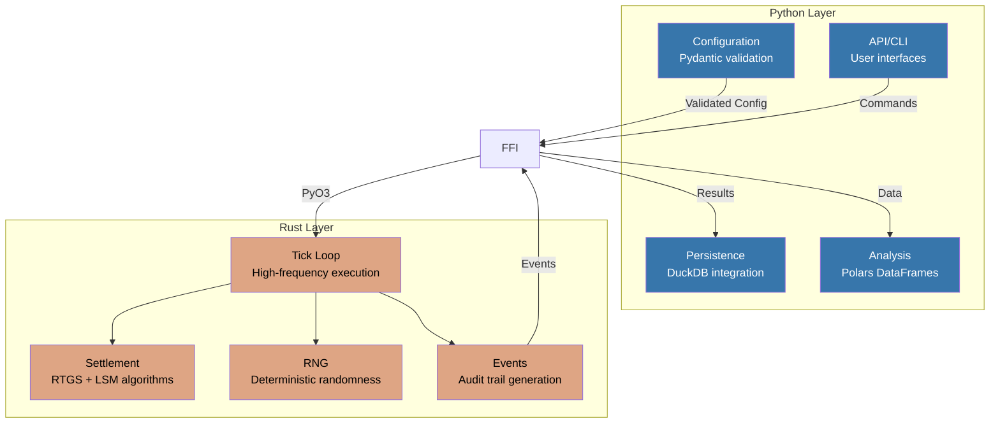

| Language | Responsibility | Rationale |
|----------|---------------|-----------|
| **Rust** | Simulation engine | Performance-critical tick loop (1000+ ticks/sec), deterministic execution, memory safety |
| **Python** | Orchestration | Developer ergonomics, rich ecosystem (Pydantic, FastAPI, Polars), rapid iteration |

### Core Principles

1. **Rust Owns State** - Python only receives snapshots, never mutable references
2. **Python Orchestrates** - Configuration, API, lifecycle management live in Python
3. **FFI is Thin** - Minimal, stable API surface with simple types

---

## Three-Tier Architecture

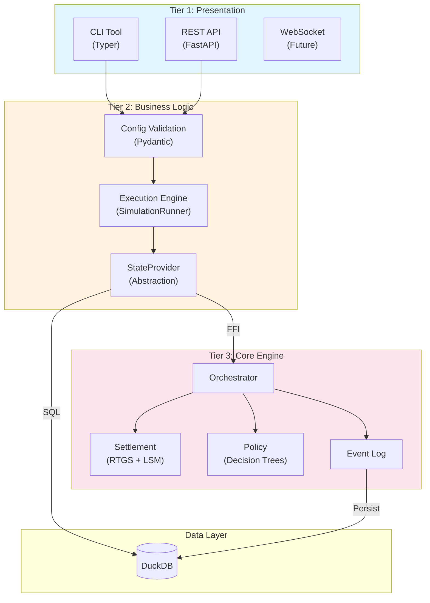

### Tier 1: Presentation Layer

| Component | Technology | Purpose |
|-----------|------------|---------|
| CLI Tool | Python/Typer | `payment-sim run`, `replay`, `checkpoint`, `db` commands |
| REST API | Python/FastAPI | Programmatic simulation control |
| WebSocket | Future | Real-time streaming for UI |

### Tier 2: Business Logic Layer

| Component | Purpose | Key Pattern |
|-----------|---------|-------------|
| Config Validation | Validate YAML against Pydantic schemas | Fail-fast validation |
| Execution Engine | Template Method for simulation modes | `SimulationRunner` + `OutputStrategy` |
| StateProvider | Abstract data access (live vs replay) | Protocol pattern |

### Tier 3: Core Engine (Rust)

| Component | Lines of Code | Purpose |
|-----------|---------------|---------|
| Orchestrator | ~2,000 | Main tick loop, coordinates all components |
| Settlement | ~1,500 | RTGS immediate + LSM optimization |
| Policy | ~4,880 | Decision tree evaluation |
| Events | ~800 | 50+ event types, audit trail |

---

## Component Interaction

### Run Command Flow

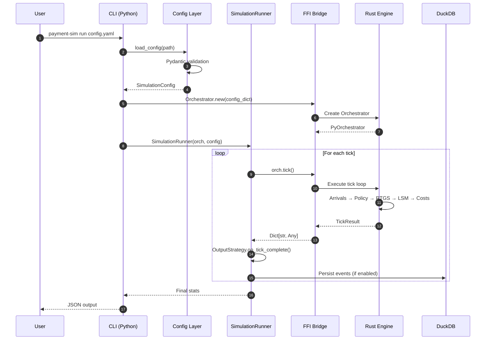

### Replay Command Flow

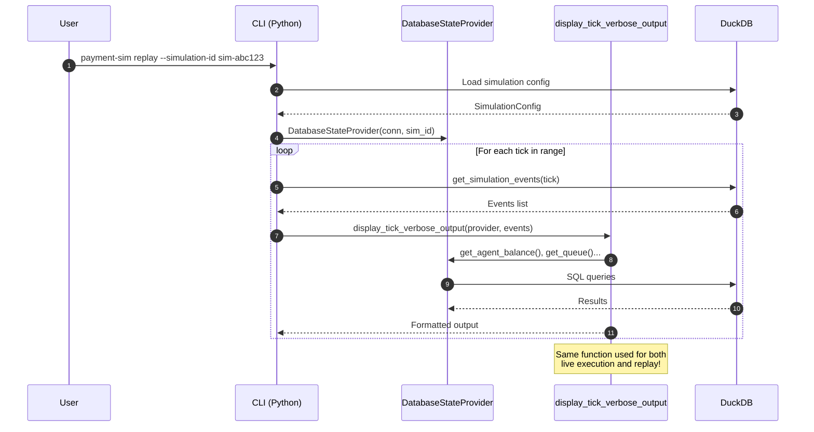

---

## Key Architectural Decisions

### ADR-1: Money Representation

**Decision**: All monetary values are `i64` (signed 64-bit integers) representing cents.

**Rationale**:
- Floating-point arithmetic introduces rounding errors that compound over millions of transactions
- Financial systems demand exact arithmetic
- Integer operations are faster and deterministic

**Consequence**:
```rust
// CORRECT
let amount: i64 = 100000; // $1,000.00 in cents

// FORBIDDEN
let amount: f64 = 1000.00; // NO FLOATS FOR MONEY
```

### ADR-2: Deterministic Execution

**Decision**: All randomness via seeded xorshift64* RNG with explicit seed persistence.

**Rationale**:
- Simulation must be perfectly reproducible for debugging
- Research validation requires identical results
- Compliance auditing needs audit trails

**Consequence**:
```rust
// After each RNG call, new seed MUST be persisted
let (value, new_seed) = rng.next_u64(current_seed);
state.rng_seed = new_seed; // CRITICAL
```

### ADR-3: Two-Queue Architecture

**Decision**: Separate Queue 1 (internal bank queue) from Queue 2 (RTGS central queue).

**Rationale**:
- Captures reality that banks choose when to submit (Queue 1)
- Settlement depends on liquidity availability (Queue 2)
- Delay costs apply only to Queue 1 (policy choice, not liquidity constraint)

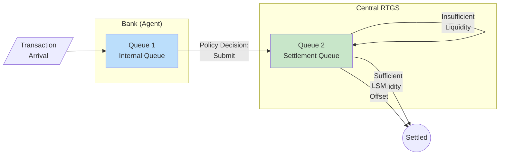

### ADR-4: StateProvider Pattern

**Decision**: Abstract data access behind a protocol to ensure replay identity.

**Rationale**:
- Same display code must work for both live execution and replay
- `run --verbose` output must be byte-for-byte identical to `replay --verbose`
- Enables future data sources (external APIs, etc.)

**Consequence**:
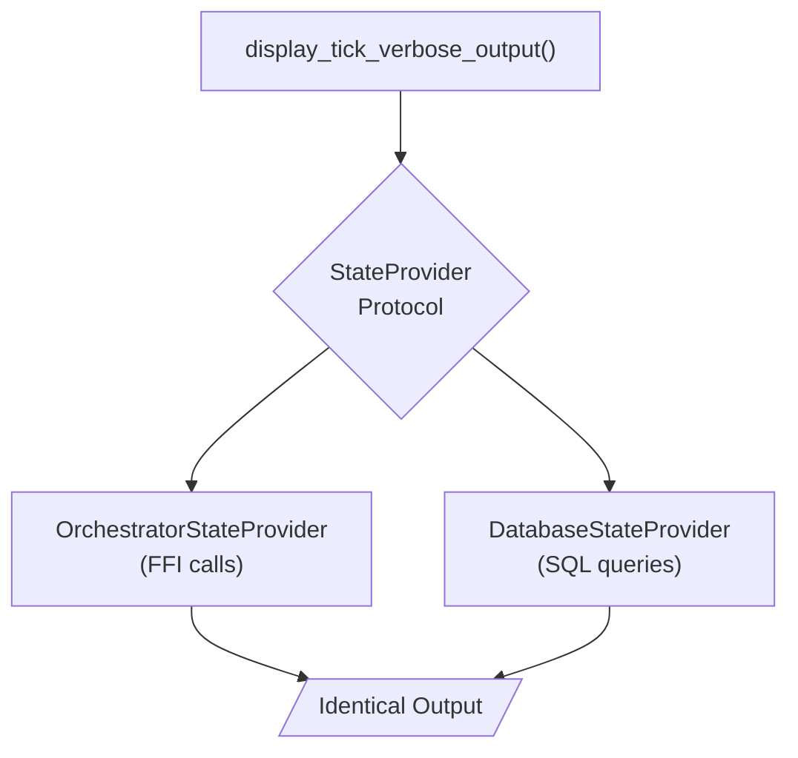

### ADR-5: Event-Sourced Persistence

**Decision**: All simulation activity recorded as immutable events in `simulation_events` table.

**Rationale**:
- Complete audit trail for analysis
- Single source of truth for replay
- Events are self-contained (no external lookups needed)

**Consequence**:
- Events include ALL data needed for display (not just IDs)
- No legacy tables or manual reconstruction
- Replay queries only `simulation_events`

---

## System Invariants

These properties MUST hold at all times:

### INV-1: Balance Conservation

```
sum(all_agent_balances) == sum(initial_balances) + sum(external_transfers)
```

Settlement moves money between agents but never creates or destroys it.

### INV-2: Determinism

```
seed + config → identical_execution_trace
```

Given the same seed and configuration, the simulation produces byte-for-byte identical results.

### INV-3: Queue Validity

```
∀ tx_id ∈ rtgs_queue: transactions.contains(tx_id)
```

All transaction IDs in Queue 2 reference existing transactions.

### INV-4: Atomicity

```
settlement(tx) ∈ {complete_success, complete_failure}
```

Settlement is all-or-nothing. Partial settlement only via explicit splitting.

### INV-5: Event Completeness

```
∀ event ∈ event_log: event.contains(all_display_fields)
```

Events are self-contained with all data needed for display.

---

## Data Flow Architecture

### Configuration Flow

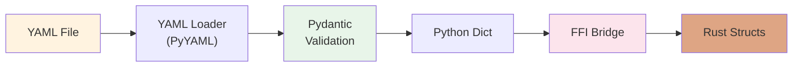

### Event Flow

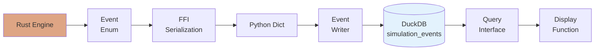

### State Query Flow

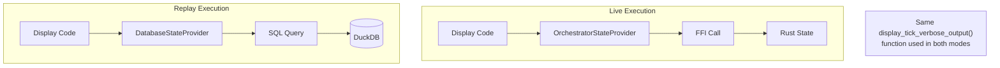

---

## Performance Characteristics

| Metric | Target | Achieved |
|--------|--------|----------|
| Tick throughput | 1,000/sec | 1,200+/sec |
| LSM cycle detection | <1ms | ~0.5ms typical |
| FFI overhead | Minimal | ~10μs per call |
| Event serialization | Fast | ~1μs per event |

### Bottleneck Analysis

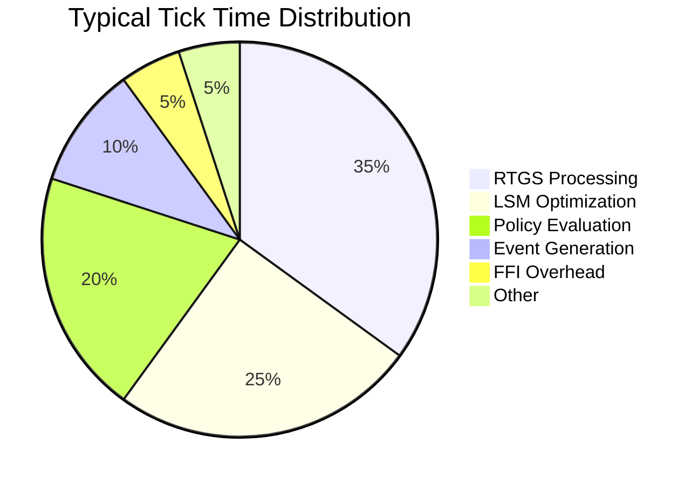

---

## Security Boundaries

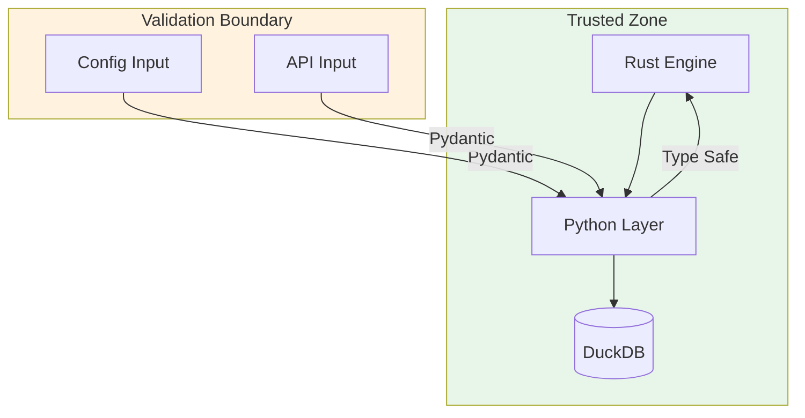

- **Config Validation**: All YAML input validated against Pydantic schemas
- **API Validation**: All HTTP input validated before processing
- **FFI Type Safety**: PyO3 ensures type correctness at boundary
- **No External Network**: Simulation engine has no network access

---

## Future Architecture

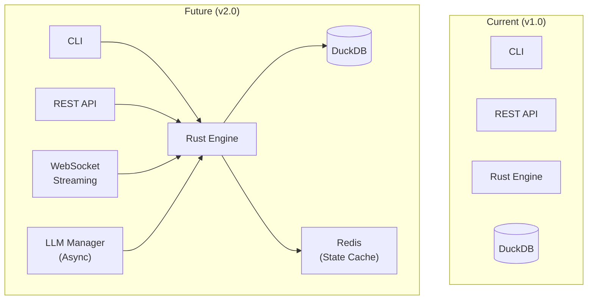

### Planned Enhancements

1. **Phase 11**: BIS AI Cash Management compatibility
2. **Phase 12**: LLM Manager with shadow replay validation
3. **Phase 13**: Multi-rail support (RTGS + DNS)
4. **Phase 14**: Enhanced shock scenarios
5. **Phase 15**: Production readiness (WebSocket, frontend)

---

## Related Documents

- [02-rust-core-engine.md](./02-rust-core-engine.md) - Rust module details
- [03-python-api-layer.md](./03-python-api-layer.md) - Python layer details
- [04-ffi-boundary.md](./04-ffi-boundary.md) - Integration patterns
- [11-tick-loop-anatomy.md](./11-tick-loop-anatomy.md) - Execution flow

---

*Next: [02-rust-core-engine.md](./02-rust-core-engine.md) - Deep dive into the Rust backend*
