# Rust Core Engine

**Version**: 1.0
**Last Updated**: 2025-11-28

---

## Overview

The Rust core engine is the performance-critical heart of SimCash, implementing the simulation tick loop, settlement algorithms, and policy evaluation. It comprises **19,445 lines of code** across **31 files** organized into **8 core modules**.

---

## Module Architecture

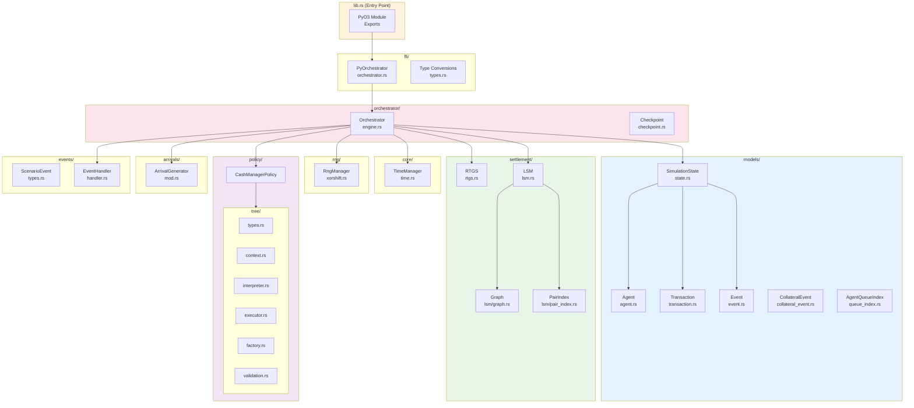

---

## Module Dependency Graph

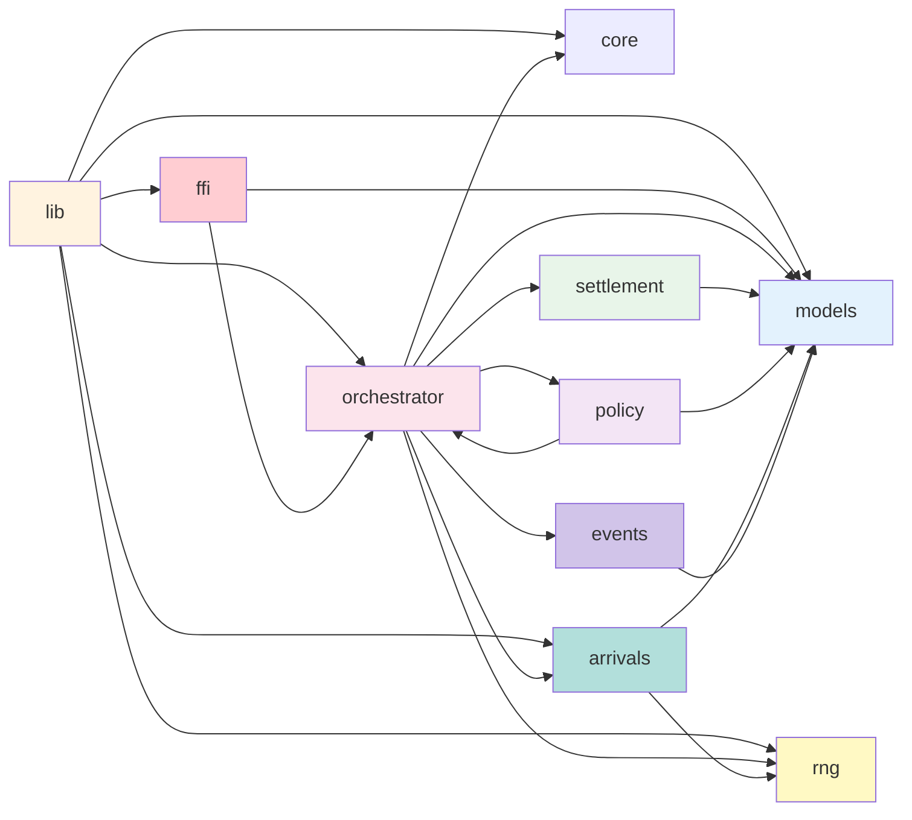

---

## 1. Core Module (`core/`)

### Purpose
Time management and initialization utilities.

### Files

| File | Lines | Purpose |
|------|-------|---------|
| `mod.rs` | ~20 | Module re-exports |
| `time.rs` | ~100 | TimeManager struct |

### TimeManager

**Source**: `simulator/src/core/time.rs`

```rust
pub struct TimeManager {
    current_tick: usize,     // Total ticks elapsed
    ticks_per_day: usize,    // Ticks per business day
}
```

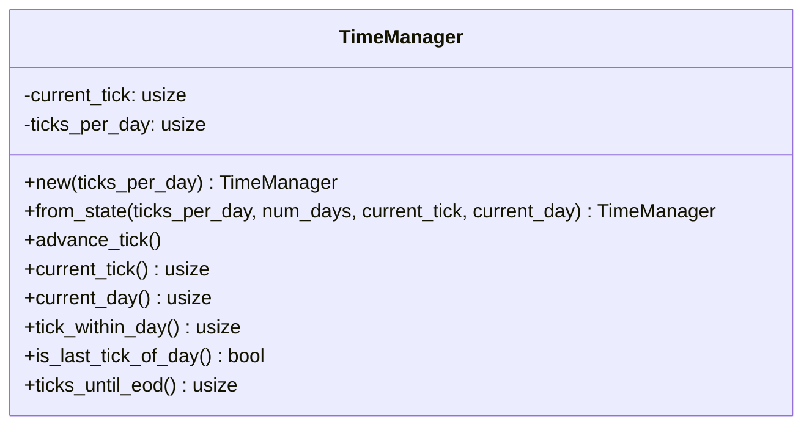

**Key Methods**:

| Method | Returns | Description |
|--------|---------|-------------|
| `advance_tick()` | `()` | Increment current tick |
| `current_tick()` | `usize` | Total ticks since start |
| `current_day()` | `usize` | Current business day (0-indexed) |
| `tick_within_day()` | `usize` | Tick within current day |
| `is_last_tick_of_day()` | `bool` | True if at day boundary |
| `ticks_until_eod()` | `usize` | Ticks remaining in day |

---

## 2. Models Module (`models/`)

### Purpose
Core domain types: Agent, Transaction, SimulationState, Events.

### Files

| File | Lines | Purpose |
|------|-------|---------|
| `mod.rs` | ~50 | Module re-exports |
| `agent.rs` | ~500 | Agent (bank) struct |
| `transaction.rs` | ~400 | Transaction struct |
| `state.rs` | ~300 | SimulationState container |
| `event.rs` | ~800 | Event enum (50+ variants) |
| `collateral_event.rs` | ~100 | CollateralEvent struct |
| `queue_index.rs` | ~150 | O(1) queue lookup |

### Class Relationships

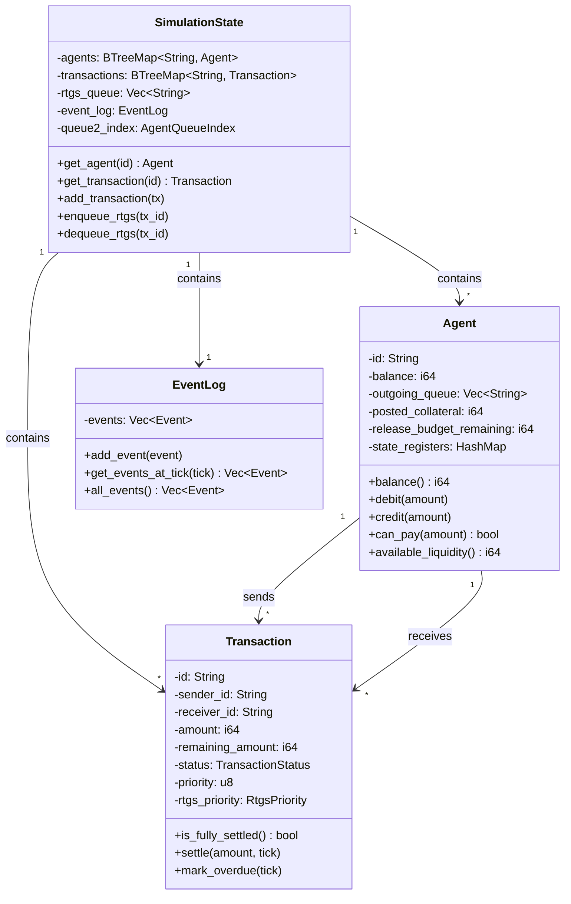

### Agent Fields (Key Subset)

**Source**: `simulator/src/models/agent.rs`

| Field | Type | Purpose |
|-------|------|---------|
| `id` | `String` | Unique identifier (e.g., "BANK_A") |
| `balance` | `i64` | Central bank balance (cents) |
| `outgoing_queue` | `Vec<String>` | Queue 1 (internal) |
| `posted_collateral` | `i64` | Secured collateral |
| `unsecured_cap` | `i64` | Overdraft limit |
| `release_budget_remaining` | `i64` | Budget this tick |
| `bilateral_limits` | `HashMap<String, i64>` | T2 LSM limits |
| `state_registers` | `HashMap<String, f64>` | Policy memory |

### Transaction Status

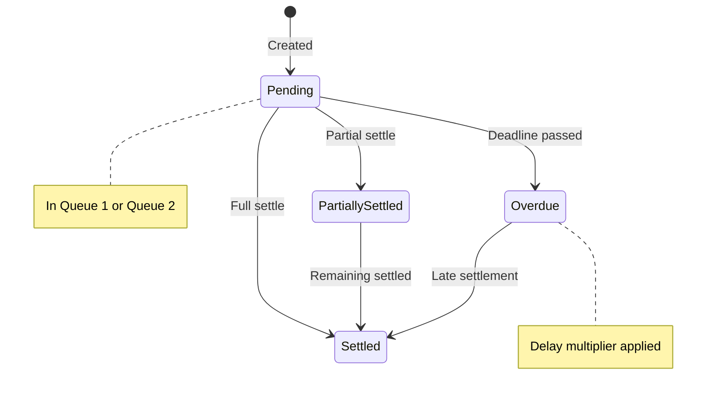

---

## 3. Orchestrator Module (`orchestrator/`)

### Purpose
Main simulation loop and state coordination.

### Files

| File | Lines | Purpose |
|------|-------|---------|
| `mod.rs` | ~50 | Module re-exports |
| `engine.rs` | ~2000 | Orchestrator struct, tick loop |
| `checkpoint.rs` | ~200 | State serialization |

### Orchestrator Structure

**Source**: `simulator/src/orchestrator/engine.rs`

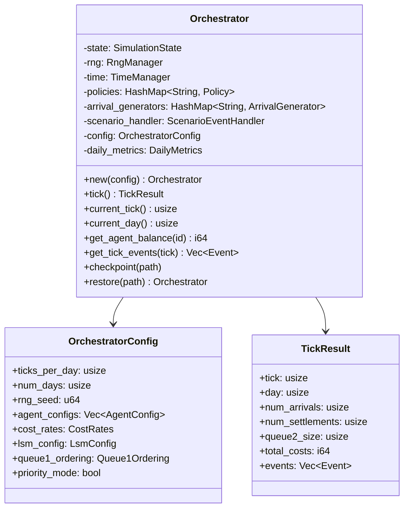

### Tick Loop

See [11-tick-loop-anatomy.md](./11-tick-loop-anatomy.md) for detailed breakdown.

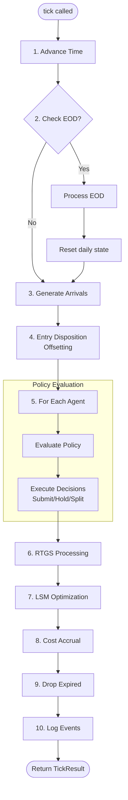

---

## 4. Settlement Module (`settlement/`)

### Purpose
RTGS settlement and LSM optimization algorithms.

### Files

| File | Lines | Purpose |
|------|-------|---------|
| `mod.rs` | ~100 | Module re-exports |
| `rtgs.rs` | ~400 | RTGS settlement |
| `lsm.rs` | ~600 | LSM algorithms |
| `lsm/graph.rs` | ~300 | Cycle detection graph |
| `lsm/pair_index.rs` | ~200 | Bilateral pair indexing |

### RTGS Settlement Flow

**Source**: `simulator/src/settlement/rtgs.rs`

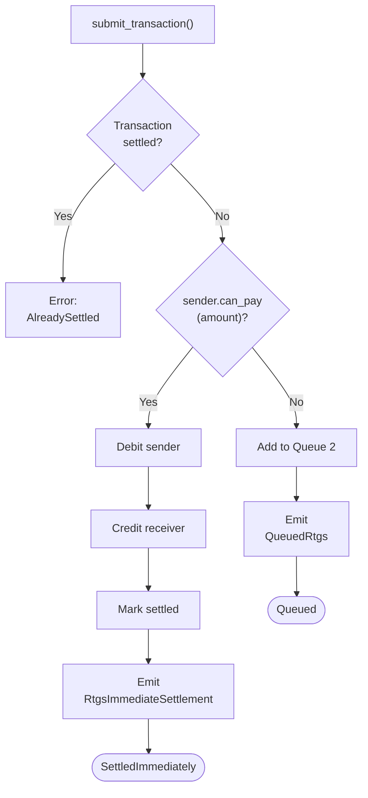

### LSM Algorithm Sequence

**Source**: `simulator/src/settlement/lsm.rs`

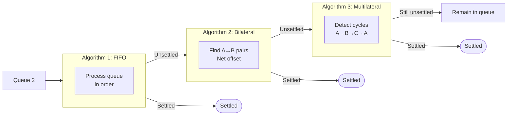

### Bilateral Offset

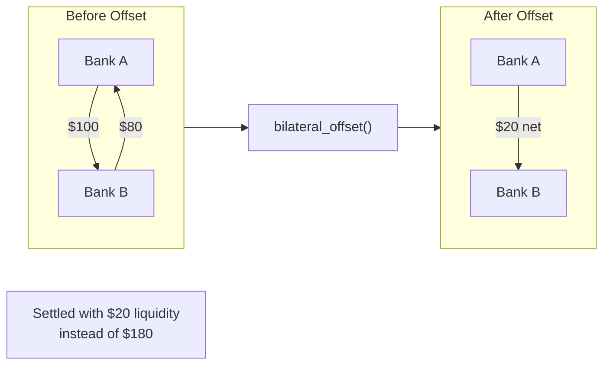

### Cycle Detection

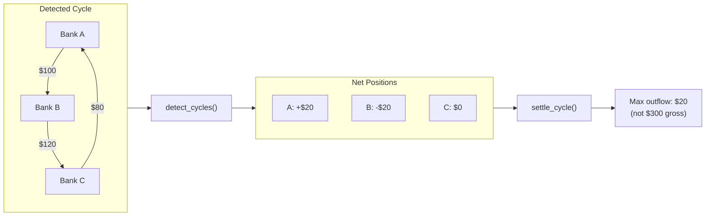

---

## 5. RNG Module (`rng/`)

### Purpose
Deterministic random number generation for reproducible simulations.

### Files

| File | Lines | Purpose |
|------|-------|---------|
| `mod.rs` | ~20 | Module re-exports |
| `xorshift.rs` | ~200 | RngManager implementation |

### RngManager

**Source**: `simulator/src/rng/xorshift.rs`

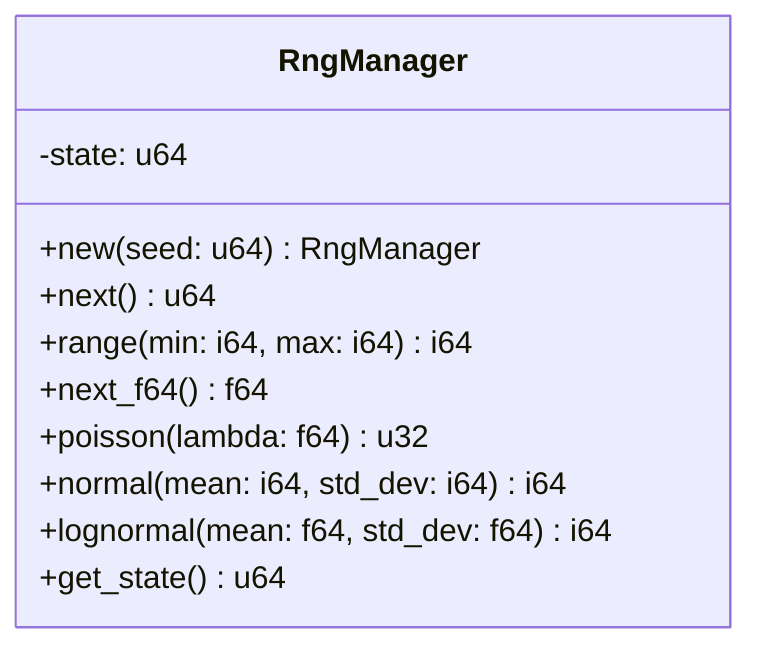

**Algorithm**: xorshift64*

```rust
fn next(&mut self) -> u64 {
    self.state ^= self.state >> 12;
    self.state ^= self.state << 25;
    self.state ^= self.state >> 27;
    self.state.wrapping_mul(0x2545F4914F6CDD1D)
}
```

**Key Property**: Passes TestU01's BigCrush statistical tests.

**Determinism Guarantee**:
```rust
// CRITICAL: Always persist state after each call
let (value, new_seed) = rng.next();
state.rng_seed = new_seed; // Must update!
```

---

## 6. Policy Module (`policy/`)

### Purpose
Decision tree policies for cash management.

### Files

| File | Lines | Purpose |
|------|-------|---------|
| `mod.rs` | ~100 | Trait definition, re-exports |
| `tree/mod.rs` | ~50 | Tree module entry |
| `tree/types.rs` | ~400 | DecisionTreeDef, TreeNode |
| `tree/context.rs` | ~800 | EvalContext (50+ fields) |
| `tree/interpreter.rs` | ~600 | Expression evaluation |
| `tree/executor.rs` | ~400 | TreePolicy execution |
| `tree/factory.rs` | ~200 | Policy creation |
| `tree/validation.rs` | ~300 | Safety validation |

### Policy Trait

**Source**: `simulator/src/policy/mod.rs`

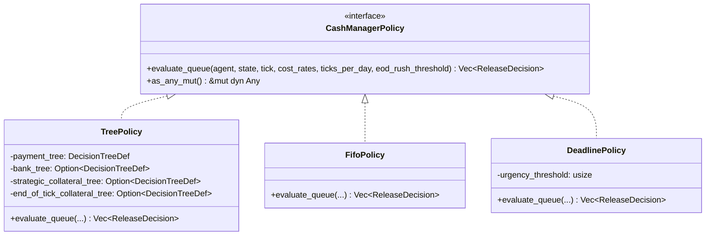

### Release Decision Types

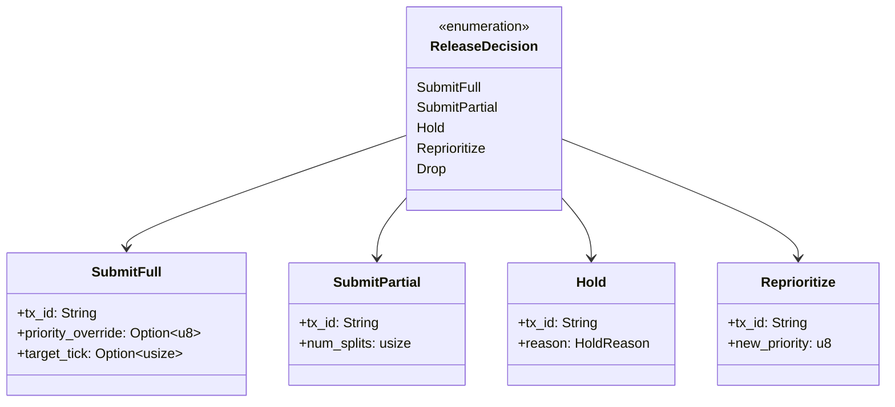

### Decision Tree Evaluation

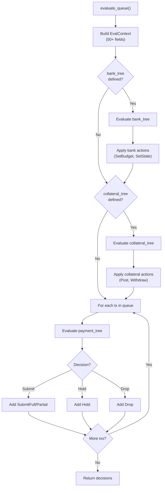

---

## 7. Arrivals Module (`arrivals/`)

### Purpose
Transaction generation with configurable distributions.

### Files

| File | Lines | Purpose |
|------|-------|---------|
| `mod.rs` | ~800 | ArrivalGenerator, distributions |

### Arrival Configuration

**Source**: `simulator/src/arrivals/mod.rs`

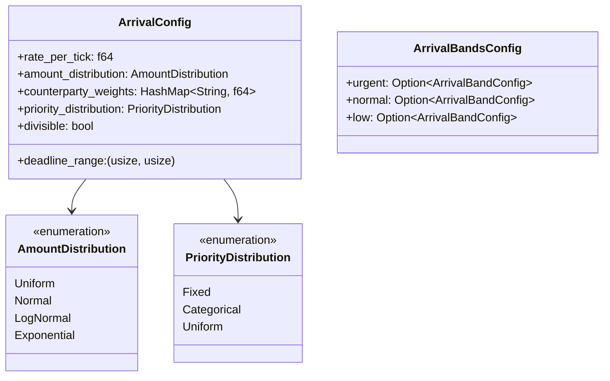

### Arrival Generation Flow

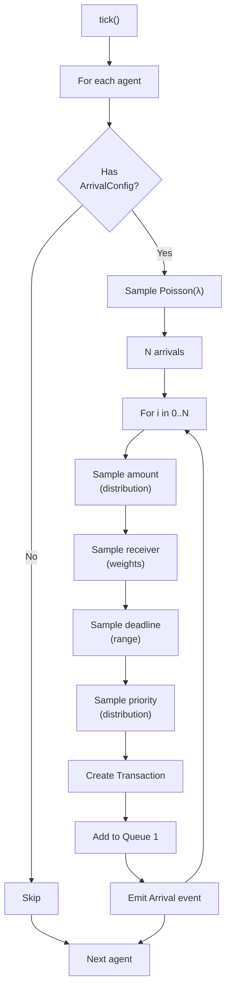

---

## 8. Events Module (`events/`)

### Purpose
Scenario event handling for external interventions.

### Files

| File | Lines | Purpose |
|------|-------|---------|
| `mod.rs` | ~20 | Module re-exports |
| `types.rs` | ~400 | ScenarioEvent enum |
| `handler.rs` | ~400 | ScenarioEventHandler |

### Scenario Event Types

**Source**: `simulator/src/events/types.rs`

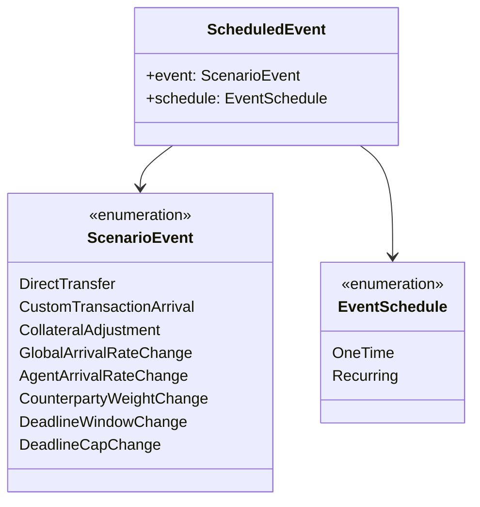

---

## 9. FFI Module (`ffi/`)

### Purpose
PyO3 bindings for Python interoperability.

### Files

| File | Lines | Purpose |
|------|-------|---------|
| `mod.rs` | ~50 | Module re-exports |
| `orchestrator.rs` | ~600 | PyOrchestrator wrapper |
| `types.rs` | ~500 | Type conversions |

See [04-ffi-boundary.md](./04-ffi-boundary.md) for detailed FFI patterns.

### PyOrchestrator

**Source**: `simulator/src/ffi/orchestrator.rs`

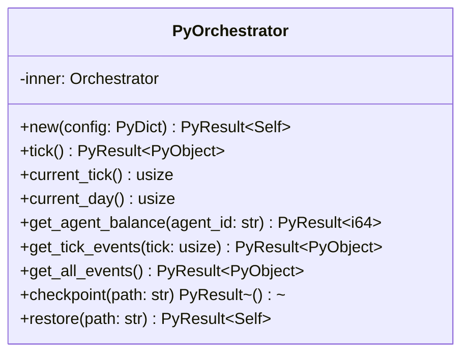

---

## Error Handling

### Error Types

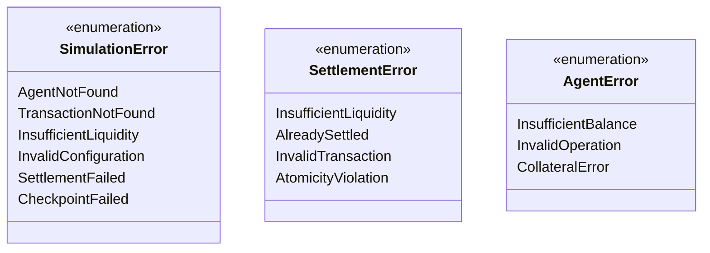

### Error Propagation

```mermaid
flowchart LR
    Rust["Rust Error"] --> PyO3["PyO3 Conversion"]
    PyO3 --> Python["Python Exception"]

    subgraph Rust
        SimErr["SimulationError"]
        SettleErr["SettlementError"]
    end

    subgraph Python
        PyErr["PyErr"]
        ValueError["ValueError"]
    end

    SimErr --> PyErr
    SettleErr --> ValueError
```

---

## Performance Characteristics

### Algorithmic Complexity

| Operation | Time | Space |
|-----------|------|-------|
| Agent lookup | O(log n) | O(1) |
| Transaction lookup | O(log n) | O(1) |
| RTGS settle | O(1) | O(1) |
| Bilateral offset | O(n²) | O(n) |
| Cycle detection | O(V + E) | O(V + E) |
| Policy evaluation | O(d × q) | O(q) |

Where: n = agents, d = tree depth, q = queue size, V = vertices, E = edges

### Memory Layout

```mermaid
flowchart TB
    subgraph Orchestrator["Orchestrator (~2KB base)"]
        State["SimulationState"]
        Time["TimeManager (24B)"]
        RNG["RngManager (8B)"]
        Config["OrchestratorConfig"]
    end

    subgraph SimState["SimulationState (~N KB)"]
        Agents["BTreeMap<String, Agent>"]
        Txs["BTreeMap<String, Transaction>"]
        Queue["Vec<String> (Queue 2)"]
        Events["Vec<Event>"]
    end

    subgraph AgentMem["Agent (~500B each)"]
        AgentFields["Core fields"]
        AgentQueue["outgoing_queue"]
        AgentMaps["HashMap fields"]
    end

    State --> SimState
    SimState --> AgentMem
```

---

## Testing Strategy

### Test Organization

```
simulator/tests/
├── integration/
│   ├── test_determinism.rs
│   ├── test_settlement.rs
│   ├── test_lsm.rs
│   └── test_policy.rs
└── unit/
    ├── test_agent.rs
    ├── test_transaction.rs
    └── test_rng.rs
```

### Test Commands

```bash
# Run all Rust tests (must use --no-default-features)
cd simulator
cargo test --no-default-features

# Run specific test
cargo test --no-default-features test_determinism

# Run with output
cargo test --no-default-features -- --nocapture
```

---

## Related Documents

- [05-domain-models.md](./05-domain-models.md) - Detailed model documentation
- [06-settlement-engines.md](./06-settlement-engines.md) - Settlement algorithms
- [07-policy-system.md](./07-policy-system.md) - Policy DSL details
- [08-event-system.md](./08-event-system.md) - Event types catalog

---

*Next: [03-python-api-layer.md](./03-python-api-layer.md) - Python layer architecture*
