# Python API Layer

**Version**: 1.0
**Last Updated**: 2025-11-28

---

## Overview

The Python layer provides developer-friendly interfaces for configuration, execution, persistence, and analysis. It comprises **34 source files** organized into **6 major components**.

---

## Package Structure

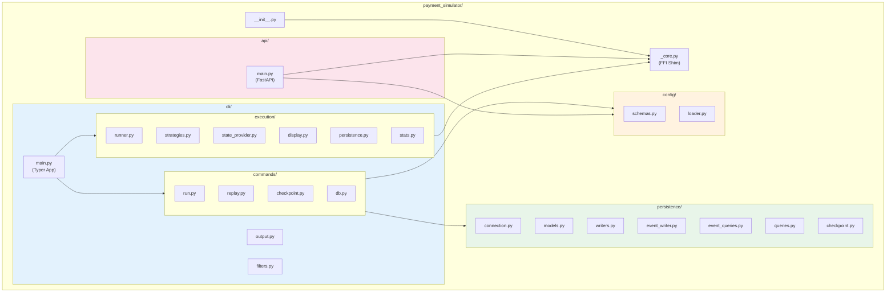

---

## 1. CLI Module (`cli/`)

### Purpose
Command-line interface for running simulations, replay, and database management.

### Entry Point

**Source**: `api/payment_simulator/cli/main.py`

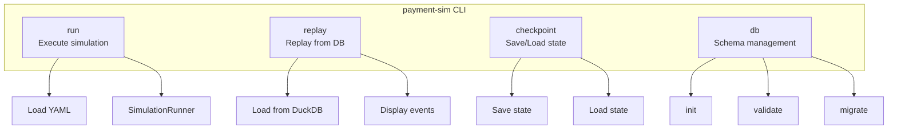

### Command Structure

```python
# main.py
app = typer.Typer(name="payment-sim")

@app.command("run")
def run_simulation(config: Path, mode: str = "normal", persist: bool = False, ...)

@app.command("replay")
def replay_simulation(db: Path, tick_start: int = 0, tick_end: int = None, ...)

app.add_typer(checkpoint_app, name="checkpoint")
app.add_typer(db_app, name="db")
```

### Commands Reference

| Command | Arguments | Options | Description |
|---------|-----------|---------|-------------|
| `run` | `config.yaml` | `--mode`, `--persist`, `--verbose` | Execute simulation |
| `replay` | `db.db` | `--tick-start`, `--tick-end`, `--verbose` | Replay from database |
| `checkpoint save` | `db.db` `sim_id` `tick` | `--description` | Save state snapshot |
| `checkpoint load` | `checkpoint_id` | | Restore from checkpoint |
| `checkpoint list` | `sim_id` | | List checkpoints |
| `checkpoint delete` | `checkpoint_id` | | Remove checkpoint |
| `db init` | `db.db` | | Initialize schema |
| `db validate` | `db.db` | | Validate schema |
| `db migrate` | `db.db` | | Apply migrations |
| `db schema` | | | Print DDL |

---

## 2. Execution Engine (`cli/execution/`)

### Purpose
Template Method pattern for simulation execution with pluggable output strategies.

### SimulationRunner

**Source**: `api/payment_simulator/cli/execution/runner.py`

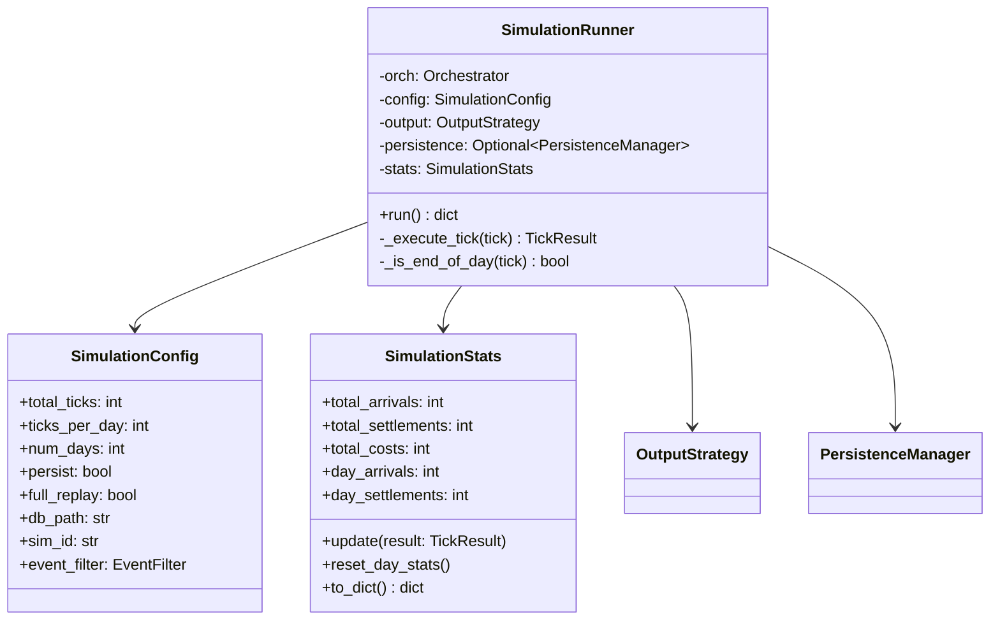

### Template Method Pattern

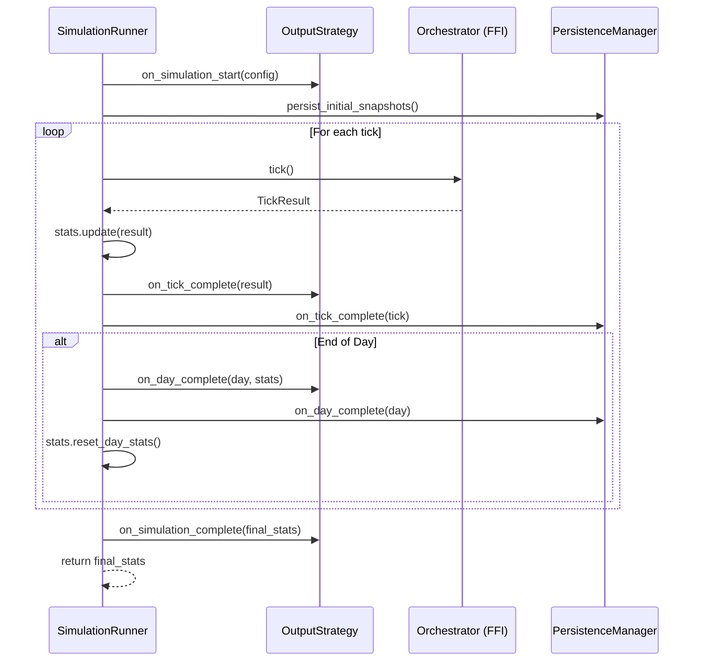

### OutputStrategy Protocol

**Source**: `api/payment_simulator/cli/execution/strategies.py`

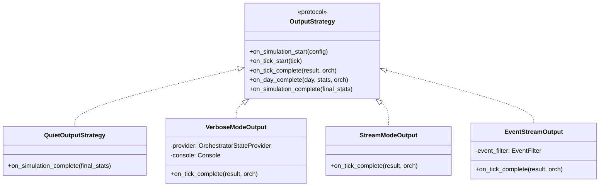

### Strategy Selection

| Mode | Strategy | Output |
|------|----------|--------|
| `normal` | QuietOutputStrategy | Final JSON only |
| `verbose` | VerboseModeOutput | Rich formatted logs |
| `stream` | StreamModeOutput | Per-tick JSONL |
| `event_stream` | EventStreamOutput | Per-event JSONL |

---

## 3. StateProvider Pattern

### Purpose
Abstract data access to ensure replay identity (run output = replay output).

**Source**: `api/payment_simulator/cli/execution/state_provider.py`

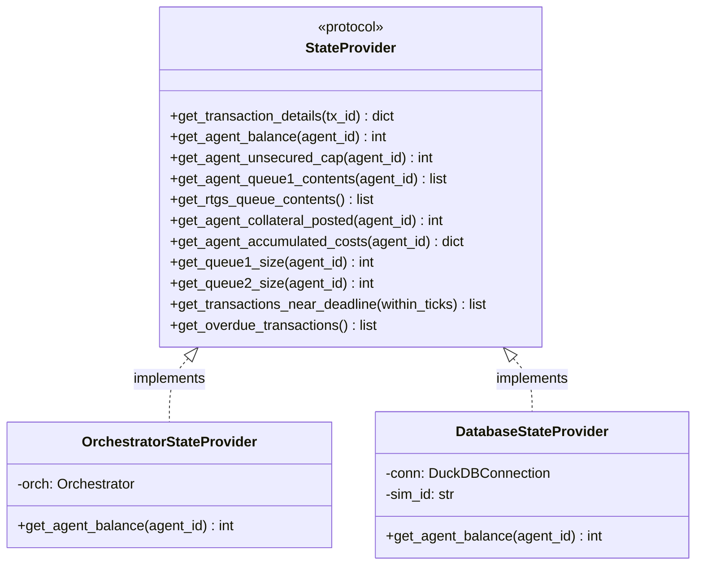

### Replay Identity Guarantee

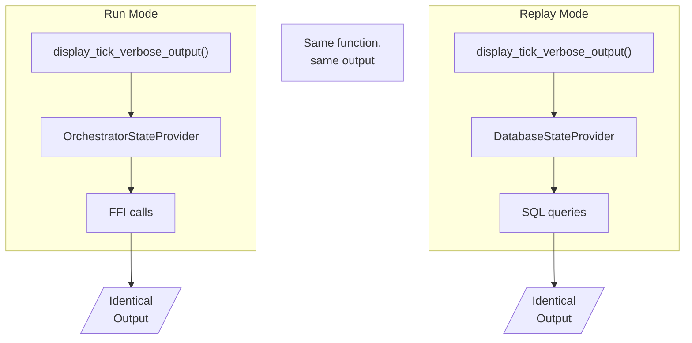

---

## 4. Display System

### Purpose
Single source of truth for verbose output (used by both run and replay).

**Source**: `api/payment_simulator/cli/execution/display.py`

### Output Sections (12 total)

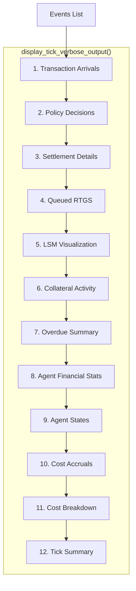

### Console Output

**Source**: `api/payment_simulator/cli/output.py`

```python
# Golden Rule: stdout = data, stderr = logs
console = Console(stderr=True)  # Logs go to stderr

def output_json(data):       # stdout (machine-readable)
def output_jsonl(data):      # stdout (streaming)
def log_info(msg):           # stderr (blue)
def log_success(msg):        # stderr (green)
def log_error(msg):          # stderr (red)
def log_warning(msg):        # stderr (yellow)
```

---

## 5. Configuration Module (`config/`)

### Purpose
Pydantic-based configuration validation.

**Source**: `api/payment_simulator/config/schemas.py`

### Schema Hierarchy

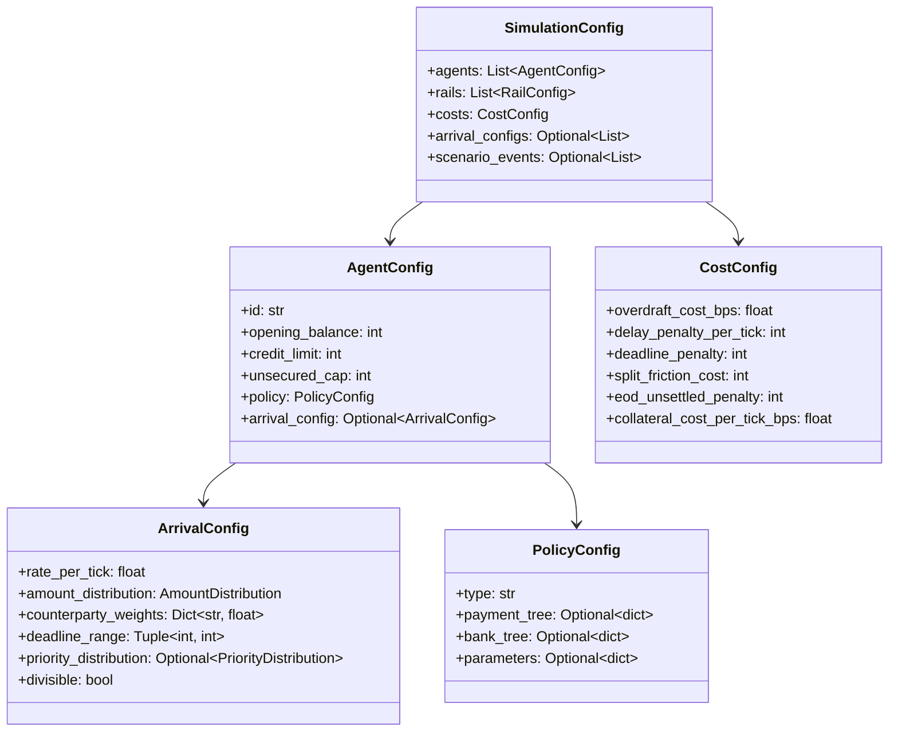

### Distribution Types

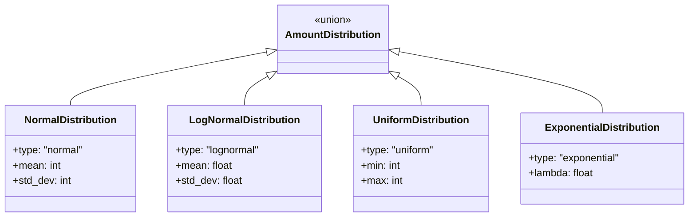

### Config Loader

**Source**: `api/payment_simulator/config/loader.py`

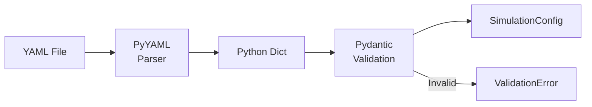

---

## 6. Persistence Module (`persistence/`)

### Purpose
DuckDB integration for event storage and analytical queries.

### DatabaseManager

**Source**: `api/payment_simulator/persistence/connection.py`

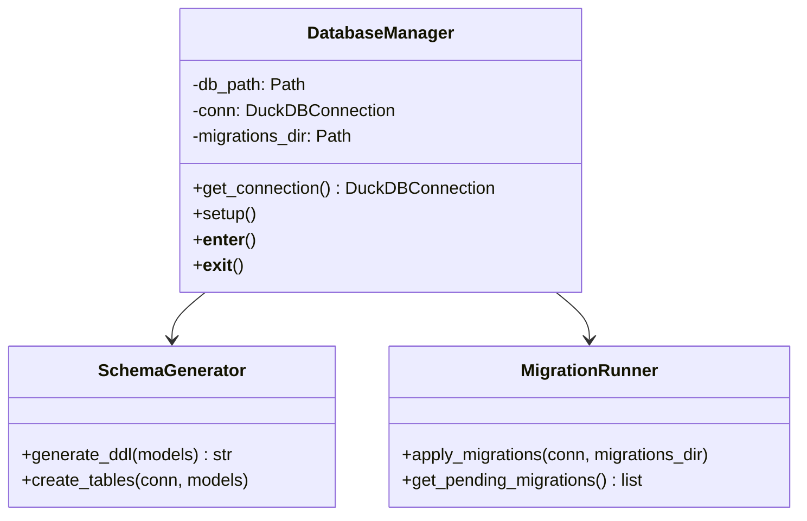

### Database Schema

**Source**: `api/payment_simulator/persistence/models.py`

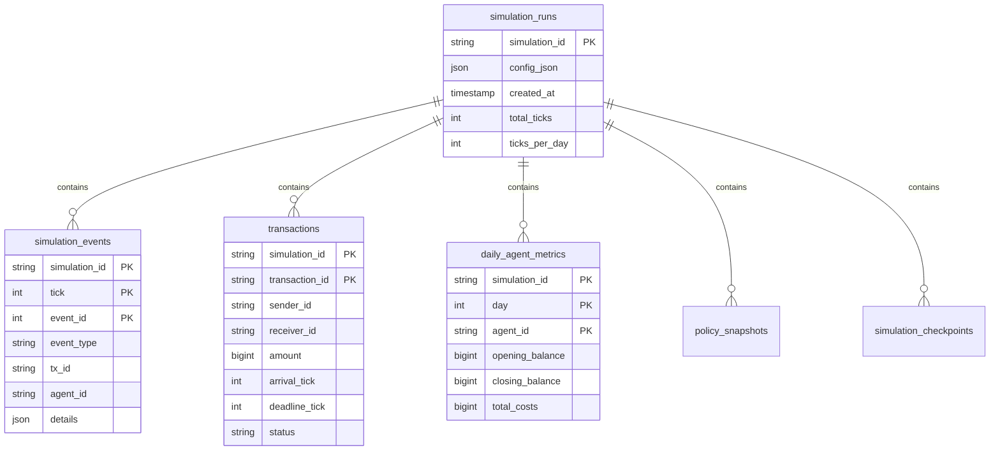

### Event Writer

**Source**: `api/payment_simulator/persistence/event_writer.py`

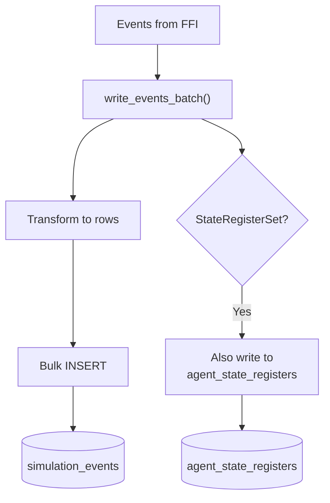

### Query Interface

**Source**: `api/payment_simulator/persistence/event_queries.py`

```python
def get_simulation_events(
    conn: DuckDBConnection,
    simulation_id: str,
    tick: Optional[int] = None,
    tick_min: Optional[int] = None,
    tick_max: Optional[int] = None,
    day: Optional[int] = None,
    agent_id: Optional[str] = None,
    tx_id: Optional[str] = None,
    event_type: Optional[str] = None,
    limit: int = 100,
    offset: int = 0,
    sort: str = "tick_asc",
) -> Dict[str, Any]:
    """Query events with filtering, pagination, sorting."""
```

---

## 7. HTTP API (`api/`)

### Purpose
FastAPI-based REST API for programmatic simulation control.

**Source**: `api/payment_simulator/api/main.py`

### Endpoints

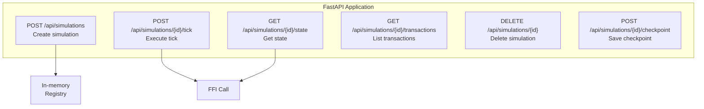

### Endpoint Reference

| Endpoint | Method | Request | Response |
|----------|--------|---------|----------|
| `/api/simulations` | POST | `SimulationConfig` | `{simulation_id, status}` |
| `/api/simulations/{id}/tick` | POST | - | `TickResponse` |
| `/api/simulations/{id}/state` | GET | - | Full state dict |
| `/api/simulations/{id}/transactions` | GET | - | Transaction list |
| `/api/simulations/{id}` | DELETE | - | `{deleted: bool}` |
| `/api/simulations/{id}/checkpoint` | POST | `{description}` | `{checkpoint_id}` |

---

## 8. Event Filtering

### Purpose
Filter events for targeted analysis.

**Source**: `api/payment_simulator/cli/filters.py`

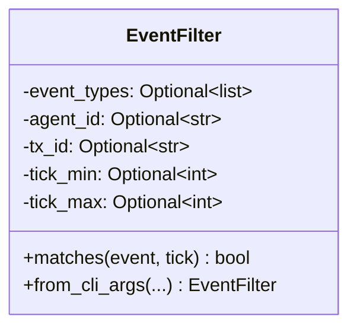

### Filter Logic

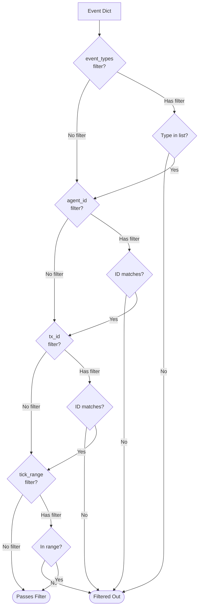

---

## 9. FFI Integration

### _core.py Shim

**Source**: `api/payment_simulator/_core.py`

```python
# Re-export everything from Rust module
from payment_simulator_core_rs import *  # noqa: F401, F403
```

### Usage Pattern

```python
from payment_simulator._core import Orchestrator

# Create orchestrator with validated config
config_dict = {
    "ticks_per_day": 100,
    "seed": 12345,
    "agents": [...],
    # ...
}
orch = Orchestrator.new(config_dict)

# Execute tick
result = orch.tick()  # Returns dict

# Query state
balance = orch.get_agent_balance("BANK_A")
events = orch.get_tick_events(orch.current_tick())
```

See [04-ffi-boundary.md](./04-ffi-boundary.md) for detailed patterns.

---

## Data Flow Diagrams

### Run Command Flow

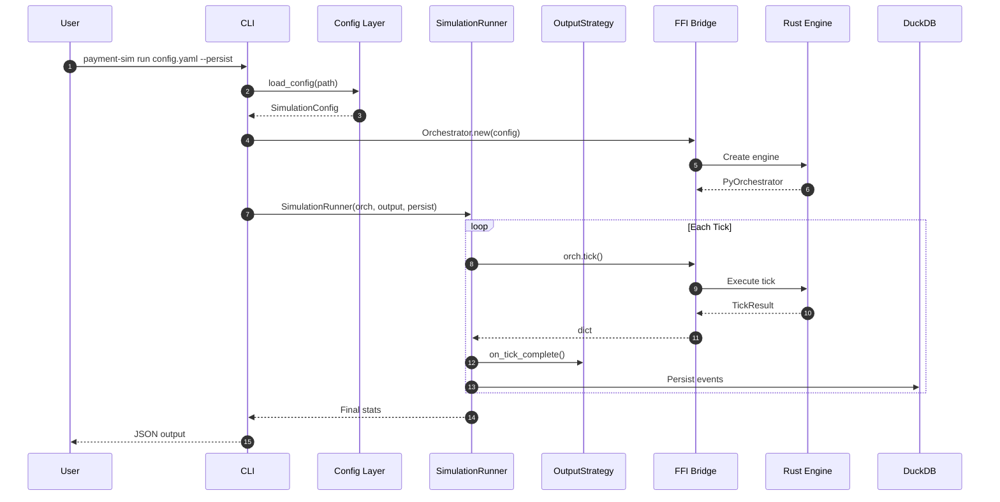

### Replay Command Flow

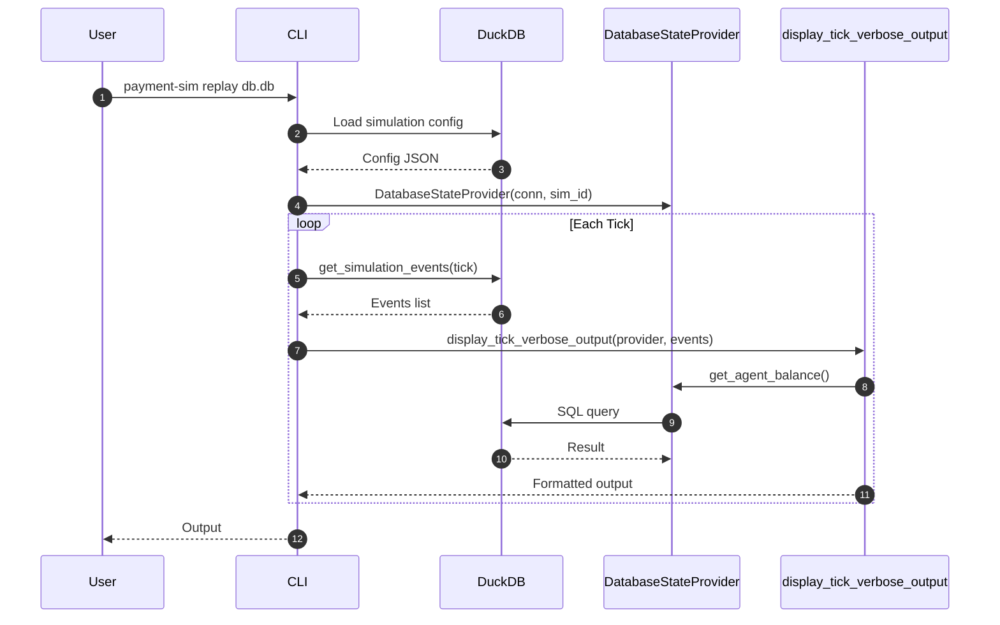

---

## Testing Strategy

### Test Organization

```
api/tests/
├── conftest.py              # Pytest fixtures
├── unit/                    # Pure Python tests
│   ├── test_config.py
│   ├── test_filters.py
│   └── test_stats.py
├── integration/             # FFI + persistence
│   ├── test_determinism.py
│   ├── test_replay_identity.py
│   └── test_persistence.py
├── cli/                     # CLI command tests
│   ├── test_run.py
│   └── test_replay.py
└── e2e/                     # End-to-end API tests
    └── test_api.py
```

### Test Commands

```bash
# Run all Python tests
cd api
.venv/bin/python -m pytest

# Run specific test
.venv/bin/python -m pytest tests/integration/test_replay_identity.py

# With coverage
.venv/bin/python -m pytest --cov=payment_simulator
```

---

## Dependencies

| Package | Version | Purpose |
|---------|---------|---------|
| pydantic | ≥2.0.0 | Configuration validation |
| pyyaml | ≥6.0 | YAML parsing |
| typer | ≥0.9.0 | CLI framework |
| rich | ≥13.0.0 | Terminal formatting |
| duckdb | ≥0.9.0 | OLAP database |
| polars | ≥0.19.0 | DataFrames |
| pyarrow | ≥14.0.0 | Arrow format |
| fastapi | ≥0.104.0 | HTTP API |
| uvicorn | ≥0.24.0 | ASGI server |

---

## Related Documents

- [02-rust-core-engine.md](./02-rust-core-engine.md) - Rust backend details
- [04-ffi-boundary.md](./04-ffi-boundary.md) - Integration patterns
- [09-persistence-layer.md](./09-persistence-layer.md) - Database details
- [10-cli-architecture.md](./10-cli-architecture.md) - CLI details

---

*Next: [04-ffi-boundary.md](./04-ffi-boundary.md) - FFI integration patterns*
