# FFI Boundary

**Version**: 1.0
**Last Updated**: 2025-11-28

---

## Overview

SimCash uses PyO3 for Python-Rust interoperability. The FFI (Foreign Function Interface) boundary is intentionally minimal and safe, passing only simple types between languages.

---

## Design Principles

### 1. Minimal Crossing Frequency

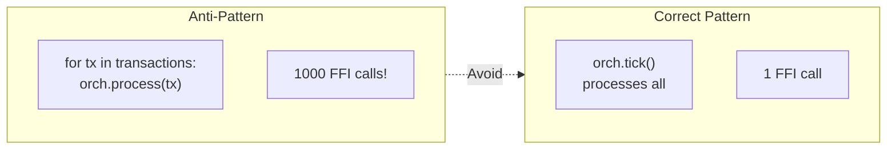

**Rule**: Batch operations. One FFI call per tick, not per transaction.

### 2. Simple Types Only

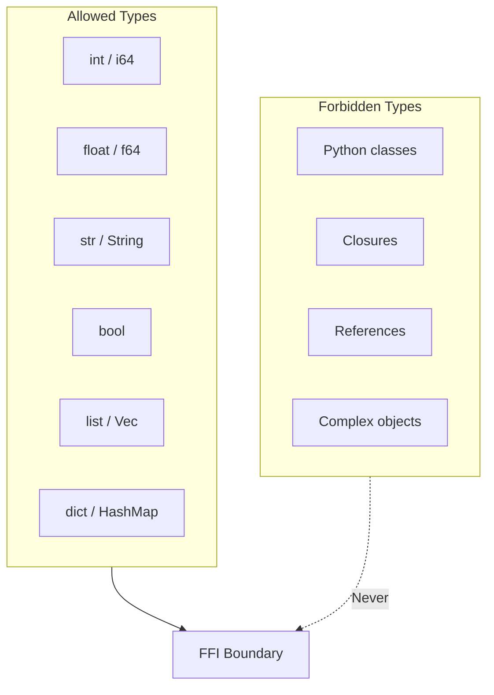

**Rule**: Only primitives, strings, lists, and dicts cross the boundary.

### 3. Validate at Boundary

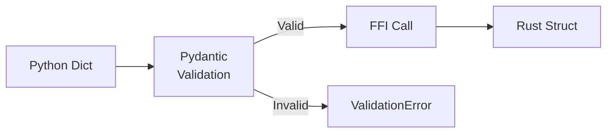

**Rule**: All inputs validated before FFI crossing.

### 4. Rust Owns State

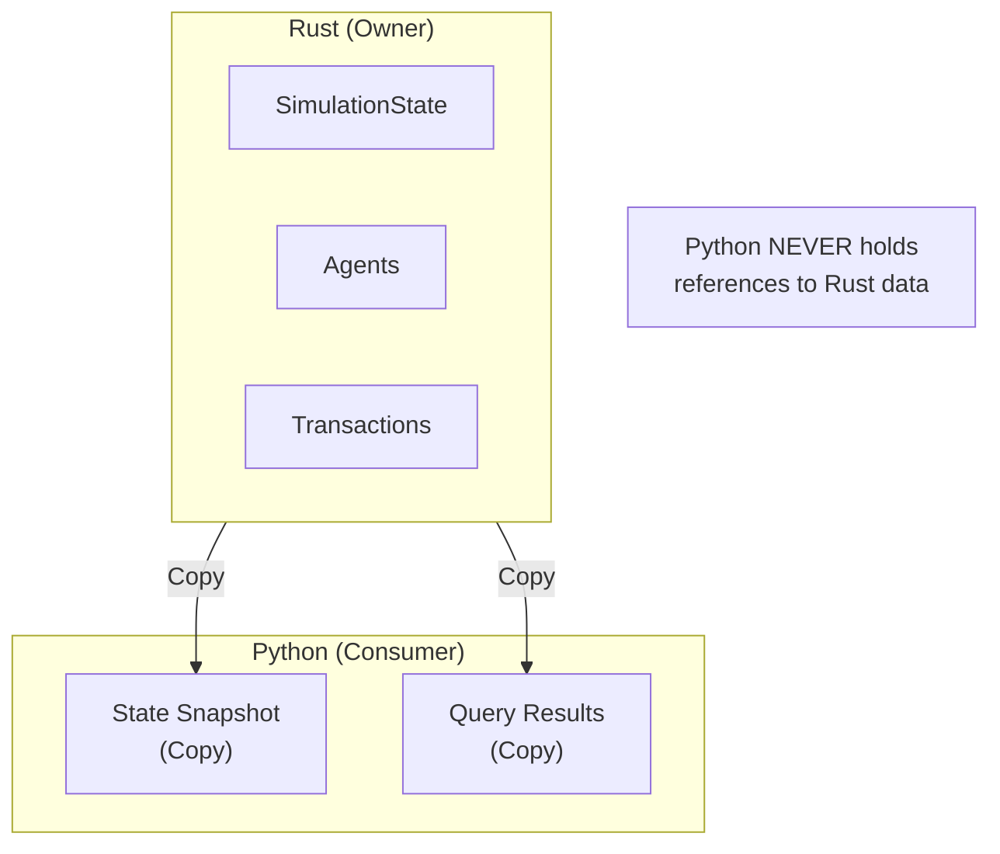

**Rule**: Python receives copies/snapshots, never mutable references.

---

## Type Conversions

### Python → Rust

**Source**: `backend/src/ffi/types.rs`

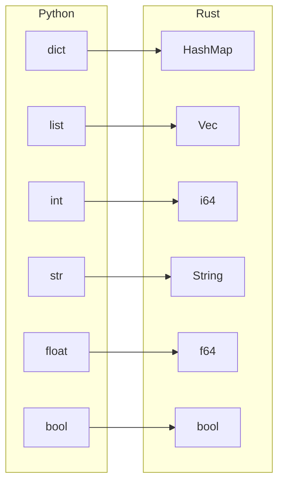

### Conversion Functions

| Function | Input | Output |
|----------|-------|--------|
| `parse_orchestrator_config()` | `PyDict` | `OrchestratorConfig` |
| `parse_agent_config()` | `PyDict` | `AgentConfig` |
| `parse_cost_rates()` | `PyDict` | `CostRates` |
| `parse_arrival_config()` | `PyDict` | `ArrivalConfig` |

### Rust → Python

**Source**: `backend/src/ffi/orchestrator.rs`

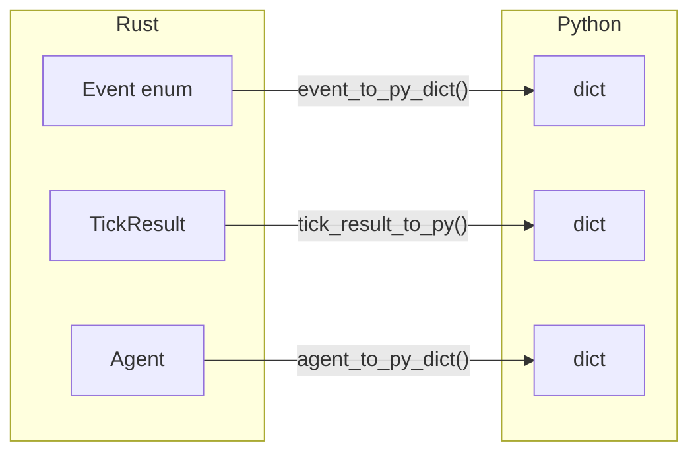

### Event Serialization

```rust
// Single source of truth for event serialization
fn event_to_py_dict(event: &Event, py: Python) -> PyResult<PyObject> {
    let dict = PyDict::new(py);

    match event {
        Event::Arrival { tick, tx_id, sender_id, receiver_id, amount, ... } => {
            dict.set_item("event_type", "Arrival")?;
            dict.set_item("tick", tick)?;
            dict.set_item("tx_id", tx_id)?;
            dict.set_item("sender_id", sender_id)?;
            dict.set_item("receiver_id", receiver_id)?;
            dict.set_item("amount", amount)?;
            // ... all fields
        }
        // ... other event types
    }

    Ok(dict.into())
}
```

---

## PyOrchestrator Wrapper

**Source**: `backend/src/ffi/orchestrator.rs`

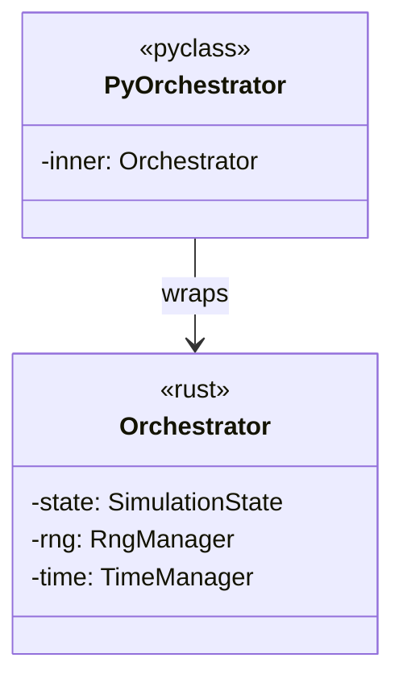

### Exported Methods

| Method | Parameters | Returns | Description |
|--------|------------|---------|-------------|
| `new()` | `config: &PyDict` | `PyResult<Self>` | Create orchestrator |
| `tick()` | - | `PyResult<PyObject>` | Execute one tick |
| `current_tick()` | - | `usize` | Get current tick |
| `current_day()` | - | `usize` | Get current day |
| `get_agent_balance()` | `agent_id: &str` | `PyResult<i64>` | Query balance |
| `get_tick_events()` | `tick: usize` | `PyResult<PyObject>` | Get events |
| `get_all_events()` | - | `PyResult<PyObject>` | Get all events |
| `checkpoint()` | `path: &str` | `PyResult<()>` | Save state |
| `restore()` | `path: &str` | `PyResult<Self>` | Load state |

### Method Implementation Pattern

```rust
#[pymethods]
impl PyOrchestrator {
    #[new]
    pub fn new(config: &PyDict) -> PyResult<Self> {
        // 1. Parse Python dict to Rust config
        let rust_config = parse_orchestrator_config(config)
            .map_err(|e| PyErr::new::<PyValueError, _>(e.to_string()))?;

        // 2. Create Rust orchestrator
        let orch = Orchestrator::new(rust_config)
            .map_err(|e| PyErr::new::<PyRuntimeError, _>(e.to_string()))?;

        // 3. Wrap and return
        Ok(Self { inner: orch })
    }

    pub fn tick(&mut self, py: Python) -> PyResult<PyObject> {
        // 1. Execute Rust tick
        let result = self.inner.tick()
            .map_err(|e| PyErr::new::<PyRuntimeError, _>(e.to_string()))?;

        // 2. Convert to Python dict
        tick_result_to_py(py, &result)
    }
}
```

---

## Error Propagation

### Error Types

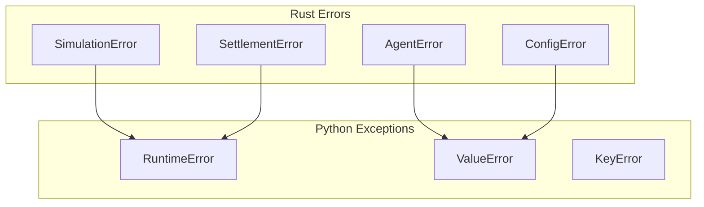

### Conversion Pattern

```rust
// Rust error → Python exception
impl From<SimulationError> for PyErr {
    fn from(err: SimulationError) -> PyErr {
        match err {
            SimulationError::AgentNotFound(id) => {
                PyErr::new::<PyKeyError, _>(format!("Agent not found: {}", id))
            }
            SimulationError::InsufficientLiquidity { .. } => {
                PyErr::new::<PyRuntimeError, _>(err.to_string())
            }
            SimulationError::InvalidConfiguration(msg) => {
                PyErr::new::<PyValueError, _>(msg)
            }
            // ...
        }
    }
}
```

### Python Error Handling

```python
from payment_simulator._core import Orchestrator

try:
    orch = Orchestrator.new(invalid_config)
except ValueError as e:
    print(f"Configuration error: {e}")

try:
    result = orch.tick()
except RuntimeError as e:
    print(f"Simulation error: {e}")

try:
    balance = orch.get_agent_balance("NONEXISTENT")
except KeyError as e:
    print(f"Agent not found: {e}")
```

---

## Data Ownership

### Ownership Model

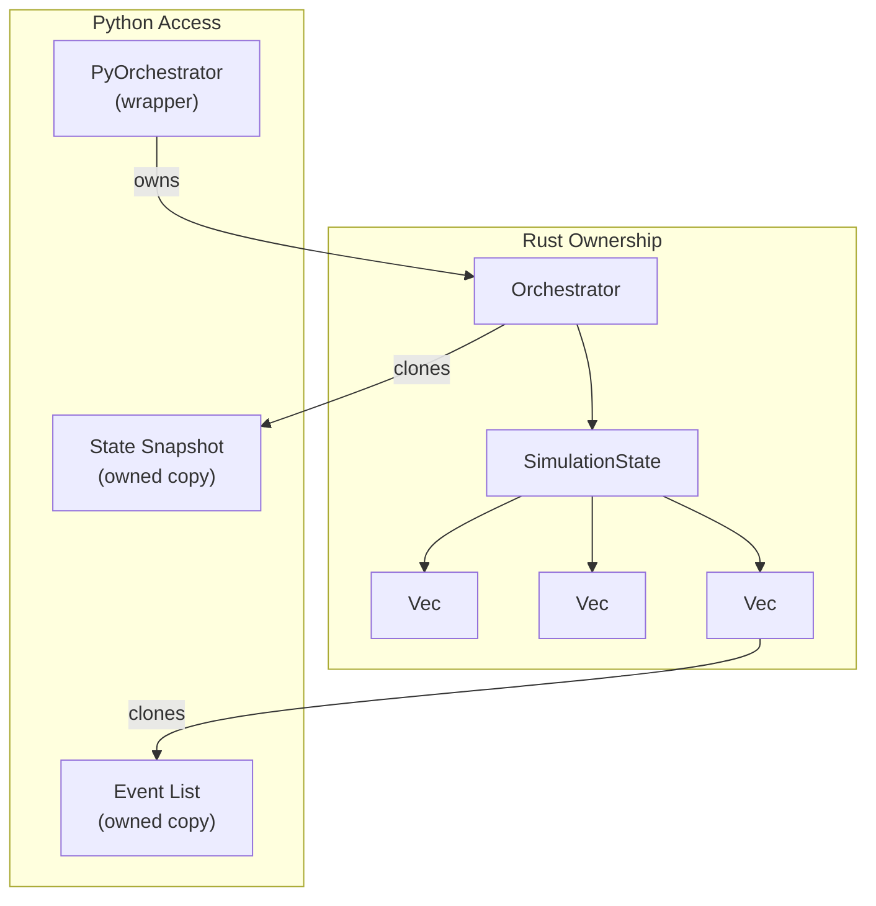

### Lifetime Rules

1. **PyOrchestrator owns Orchestrator** - Rust state lives as long as Python wrapper
2. **No cross-references** - Python never holds references into Rust memory
3. **Cloning on query** - All queries return owned copies
4. **No interior mutability** - Python cannot mutate Rust state directly

---

## Performance Considerations

### FFI Overhead

| Operation | Overhead | Notes |
|-----------|----------|-------|
| Method call | ~10μs | PyO3 dispatch |
| Dict creation | ~1μs/field | Python allocation |
| Event serialization | ~1μs/event | Flat structure |
| List creation | ~0.5μs/item | Pre-allocated |

### Optimization Strategies

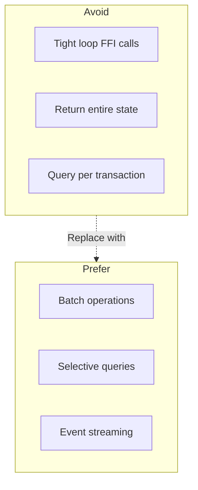

### Batch vs. Individual

```python
# BAD: Multiple FFI calls
for agent_id in agents:
    balance = orch.get_agent_balance(agent_id)  # N calls

# GOOD: Single FFI call
state = orch.get_state()  # 1 call
for agent in state['agents']:
    balance = agent['balance']
```

---

## Config Parsing

### Orchestrator Config

**Source**: `backend/src/ffi/types.rs`

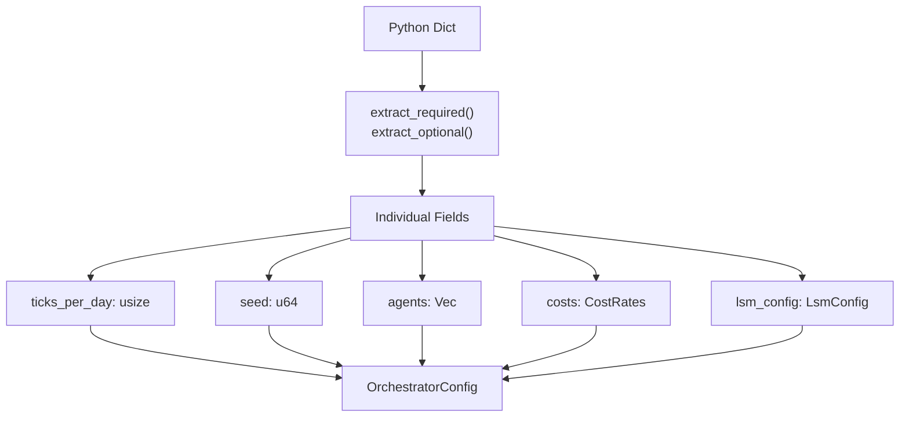

### Helper Functions

```rust
// Extract required field with type conversion
fn extract_required<'a, T>(dict: &'a PyDict, key: &str) -> PyResult<T>
where
    T: FromPyObject<'a>,
{
    dict.get_item(key)?
        .ok_or_else(|| PyErr::new::<PyKeyError, _>(format!("Missing required key: {}", key)))?
        .extract()
}

// Extract optional field with default
fn extract_with_default<'a, T>(dict: &'a PyDict, key: &str, default: T) -> PyResult<T>
where
    T: FromPyObject<'a>,
{
    match dict.get_item(key)? {
        Some(value) => value.extract(),
        None => Ok(default),
    }
}
```

---

## Practical Examples

### Creating Orchestrator

```python
from payment_simulator._core import Orchestrator

config = {
    "ticks_per_day": 100,
    "num_days": 1,
    "seed": 12345,
    "agents": [
        {
            "id": "BANK_A",
            "opening_balance": 1000000,
            "credit_limit": 500000,
            "policy": {"type": "fifo"},
        },
        {
            "id": "BANK_B",
            "opening_balance": 1000000,
            "credit_limit": 500000,
            "policy": {"type": "fifo"},
        },
    ],
    "costs": {
        "overdraft_cost_bps": 10.0,
        "delay_penalty_per_tick": 100,
        "deadline_penalty": 10000,
    },
    "lsm_config": {
        "enable_bilateral": True,
        "enable_cycles": True,
        "max_cycle_length": 5,
    },
}

orch = Orchestrator.new(config)
```

### Executing Simulation

```python
results = []
for _ in range(100):  # 100 ticks
    result = orch.tick()
    results.append(result)

    print(f"Tick {result['tick']}: "
          f"{result['num_arrivals']} arrivals, "
          f"{result['num_settlements']} settlements")
```

### Querying State

```python
# Balance query
balance = orch.get_agent_balance("BANK_A")

# Events for specific tick
events = orch.get_tick_events(50)
for event in events:
    if event['event_type'] == 'Settlement':
        print(f"Settled: {event['tx_id']} for {event['amount']}")

# All events
all_events = orch.get_all_events()
```

### Checkpoint and Restore

```python
# Save state
orch.checkpoint("/tmp/simulation_checkpoint.json")

# Later: restore
orch2 = Orchestrator.restore("/tmp/simulation_checkpoint.json")
assert orch2.current_tick() == orch.current_tick()
```

---

## Anti-Patterns

### 1. Caching Stale State

```python
# BAD: State becomes stale
cached_balance = orch.get_agent_balance("BANK_A")
orch.tick()  # State changed!
print(cached_balance)  # WRONG: Old value

# GOOD: Query fresh
orch.tick()
current_balance = orch.get_agent_balance("BANK_A")
```

### 2. Passing Complex Types

```python
# BAD: Python dataclass
@dataclass
class MyConfig:
    agents: List[Agent]

orch = Orchestrator.new(my_config)  # Will fail!

# GOOD: Dict with primitives
orch = Orchestrator.new(config_dict)
```

### 3. Tight FFI Loops

```python
# BAD: Multiple calls per transaction
for tx_id in transaction_ids:
    status = orch.get_transaction_status(tx_id)  # 1000 calls!

# GOOD: Batch query
state = orch.get_state()
for tx in state['transactions']:
    status = tx['status']
```

### 4. Holding References

```python
# BAD: Trying to hold Rust reference
agent_ref = orch.get_agent_ref("BANK_A")  # Doesn't exist!
agent_ref.balance = 0  # Can't mutate

# GOOD: Query and work with copy
agent_data = orch.get_agent_state("BANK_A")
# agent_data is a Python dict, fully owned
```

---

## Debugging FFI Issues

### Common Errors

| Error | Cause | Fix |
|-------|-------|-----|
| `KeyError: 'field'` | Missing required config field | Add field to config dict |
| `TypeError: expected int` | Wrong type in config | Check types match schema |
| `RuntimeError: simulation error` | Rust panic caught | Check logs for details |
| `ValueError: invalid config` | Validation failed | Check config against schema |

### Debug Logging

```python
import logging
logging.basicConfig(level=logging.DEBUG)

# Rust logs available via Python logging
orch = Orchestrator.new(config)
result = orch.tick()  # Debug output visible
```

---

## Related Documents

- [02-rust-core-engine.md](./02-rust-core-engine.md) - Rust FFI module
- [03-python-api-layer.md](./03-python-api-layer.md) - Python FFI usage
- [appendix-c-configuration-reference.md](./appendix-c-configuration-reference.md) - Config schema

---

*Next: [05-domain-models.md](./05-domain-models.md) - Core data structures*
