# Domain Models

**Version**: 1.0
**Last Updated**: 2025-11-28

---

## Overview

SimCash's domain model consists of four core entities: **Agent** (banks), **Transaction** (payments), **SimulationState** (container), and **TimeManager** (temporal tracking).

---

## Entity Relationships

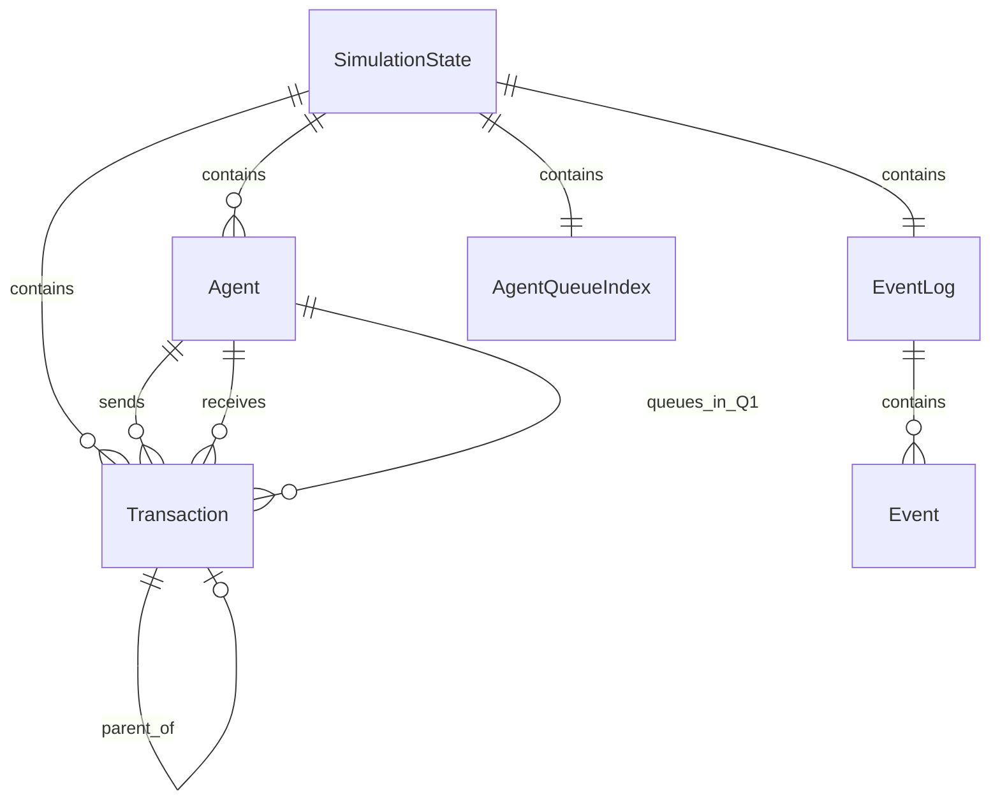

---

## 1. Agent (Bank)

**Source**: `simulator/src/models/agent.rs`

Represents a participating bank with settlement account, queues, and policy state.

### Agent Structure

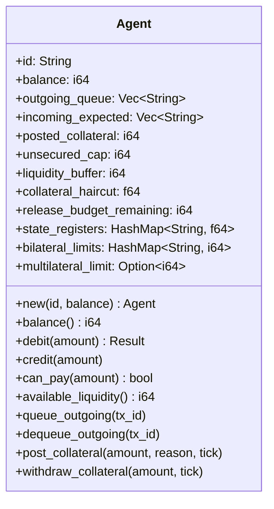

### Field Reference

#### Identity & Core State

| Field | Type | Description |
|-------|------|-------------|
| `id` | `String` | Unique identifier (e.g., "BANK_A") |
| `balance` | `i64` | Central bank balance in cents |

#### Queue Management

| Field | Type | Description |
|-------|------|-------------|
| `outgoing_queue` | `Vec<String>` | Queue 1: Transaction IDs awaiting release |
| `incoming_expected` | `Vec<String>` | Expected incoming transaction IDs |
| `last_decision_tick` | `Option<usize>` | Last policy evaluation tick |

#### Liquidity Management

| Field | Type | Description |
|-------|------|-------------|
| `liquidity_buffer` | `i64` | Target minimum balance |
| `posted_collateral` | `i64` | Secured collateral amount |
| `collateral_haircut` | `f64` | Discount rate (e.g., 0.02 = 2%) |
| `unsecured_cap` | `i64` | Maximum unsecured overdraft |
| `allocated_liquidity` | `i64` | External pool allocation |

#### Budget Control

| Field | Type | Description |
|-------|------|-------------|
| `release_budget_max` | `Option<i64>` | Max release per tick |
| `release_budget_remaining` | `i64` | Remaining budget this tick |
| `release_budget_focus_counterparties` | `Option<Vec<String>>` | Allowed receivers |
| `release_budget_per_counterparty_limit` | `Option<i64>` | Max per counterparty |
| `release_budget_per_counterparty_usage` | `HashMap<String, i64>` | Usage tracking |

#### TARGET2 LSM Limits

| Field | Type | Description |
|-------|------|-------------|
| `bilateral_limits` | `HashMap<String, i64>` | Per-counterparty outflow caps |
| `multilateral_limit` | `Option<i64>` | Total outflow cap |
| `bilateral_outflows` | `HashMap<String, i64>` | Current day outflows |
| `total_outflow` | `i64` | Total outflow this day |

#### Policy State

| Field | Type | Description |
|-------|------|-------------|
| `state_registers` | `HashMap<String, f64>` | Policy memory (max 10 registers) |

### Key Methods

#### Balance Operations

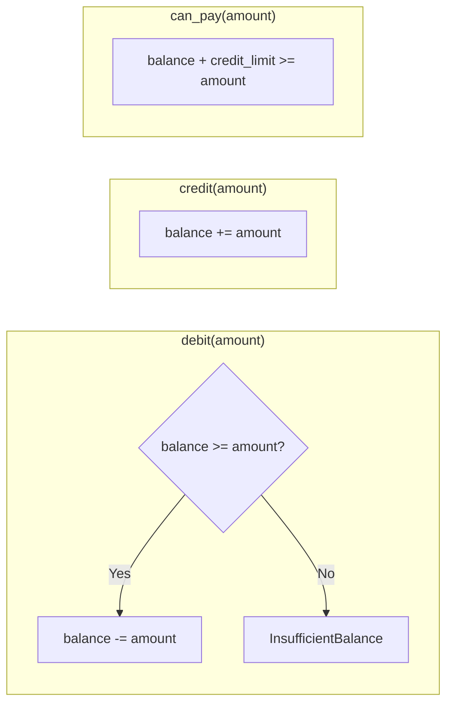

#### Liquidity Calculation

```rust
pub fn available_liquidity(&self) -> i64 {
    let credit_headroom = self.credit_limit();
    self.balance + credit_headroom
}

pub fn credit_limit(&self) -> i64 {
    let collateral_credit = (self.posted_collateral as f64 * (1.0 - self.collateral_haircut)) as i64;
    self.unsecured_cap + collateral_credit
}
```

---

## 2. Transaction

**Source**: `simulator/src/models/transaction.rs`

Represents a payment instruction with lifecycle tracking.

### Transaction Structure

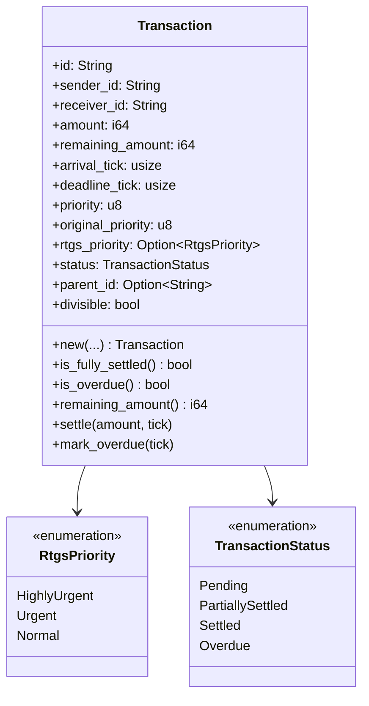

### Field Reference

#### Identification

| Field | Type | Description |
|-------|------|-------------|
| `id` | `String` | Unique identifier (UUID) |
| `sender_id` | `String` | Sending agent ID |
| `receiver_id` | `String` | Receiving agent ID |
| `parent_id` | `Option<String>` | Parent transaction (if split) |

#### Amount Tracking

| Field | Type | Description |
|-------|------|-------------|
| `amount` | `i64` | Original amount (cents) |
| `remaining_amount` | `i64` | Unsettled amount (cents) |

#### Temporal Properties

| Field | Type | Description |
|-------|------|-------------|
| `arrival_tick` | `usize` | System entry time |
| `deadline_tick` | `usize` | Settlement deadline |
| `rtgs_submission_tick` | `Option<usize>` | Queue 2 entry time |

#### Priority System (Dual)

| Field | Type | Description |
|-------|------|-------------|
| `priority` | `u8` | Internal priority (0-10) |
| `original_priority` | `u8` | Priority before escalation |
| `rtgs_priority` | `Option<RtgsPriority>` | Declared RTGS priority |
| `declared_rtgs_priority` | `Option<RtgsPriority>` | Intended RTGS priority |

### Transaction Status State Machine

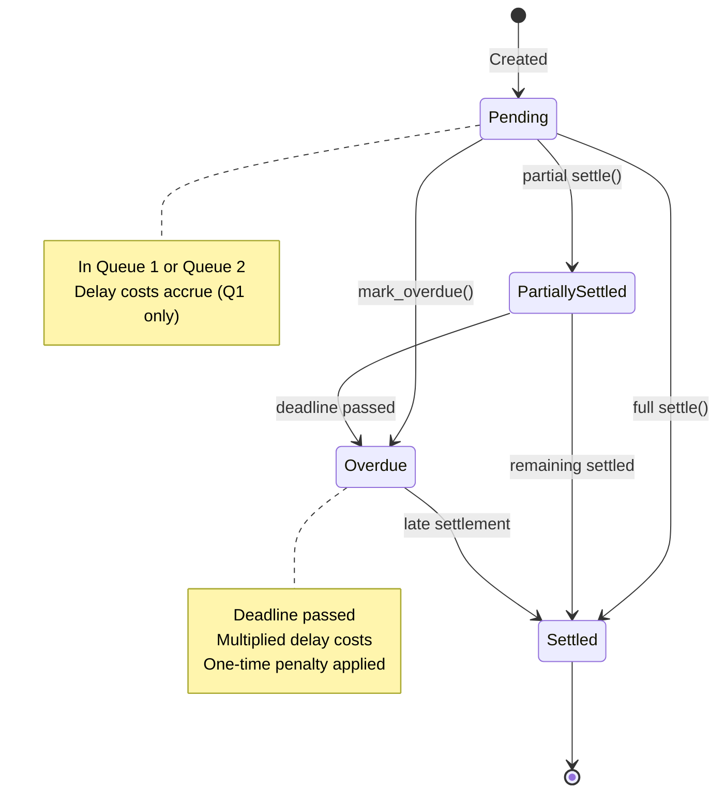

### Priority Bands (TARGET2 Style)

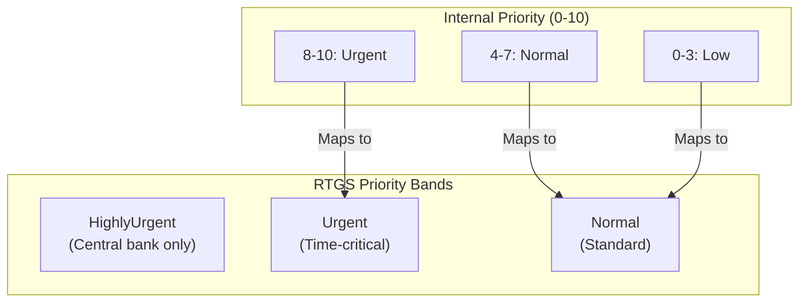

---

## 3. SimulationState

**Source**: `simulator/src/models/state.rs`

Container holding all simulation state.

### State Structure

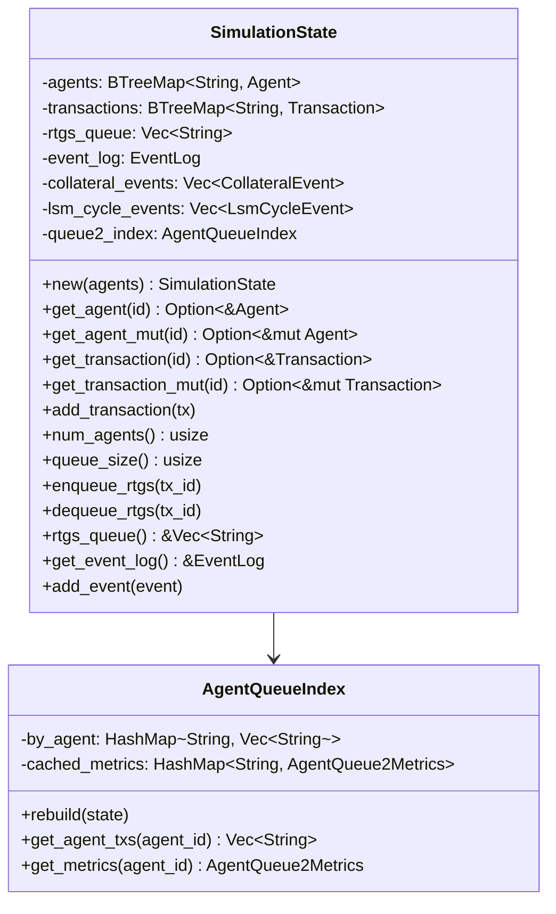

### Queue 2 Index

The `AgentQueueIndex` provides O(1) lookup of Queue 2 transactions by agent:

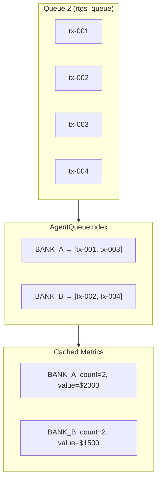

---

## 4. TimeManager

**Source**: `simulator/src/core/time.rs`

Manages simulation time progression.

### Time Structure

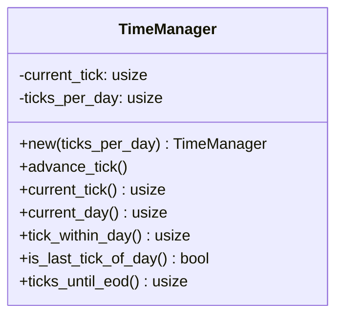

### Time Calculations

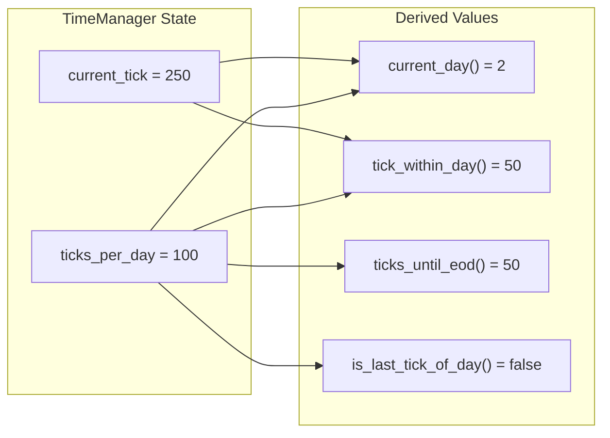

```rust
pub fn current_day(&self) -> usize {
    self.current_tick / self.ticks_per_day
}

pub fn tick_within_day(&self) -> usize {
    self.current_tick % self.ticks_per_day
}

pub fn is_last_tick_of_day(&self) -> bool {
    self.tick_within_day() == self.ticks_per_day - 1
}

pub fn ticks_until_eod(&self) -> usize {
    self.ticks_per_day - self.tick_within_day() - 1
}
```

---

## 5. Supporting Types

### CollateralEvent

**Source**: `simulator/src/models/collateral_event.rs`

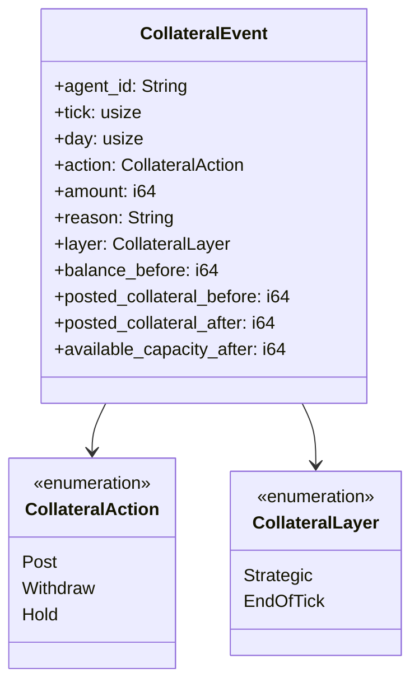

### EventLog

**Source**: `simulator/src/models/event.rs`

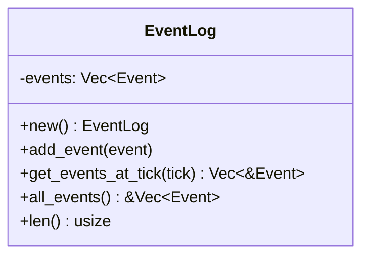

---

## Data Flow

### Transaction Lifecycle

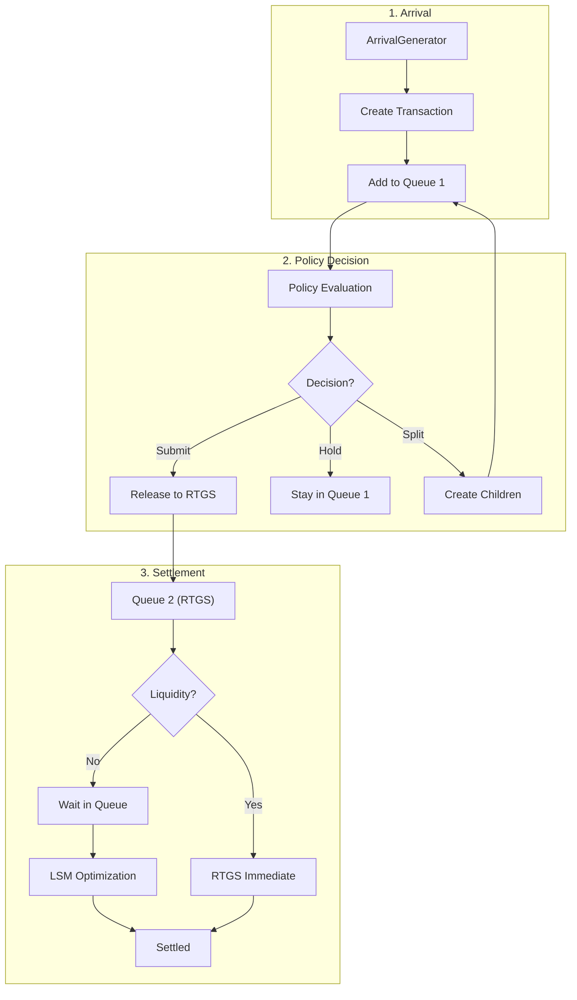

### Agent State Transitions

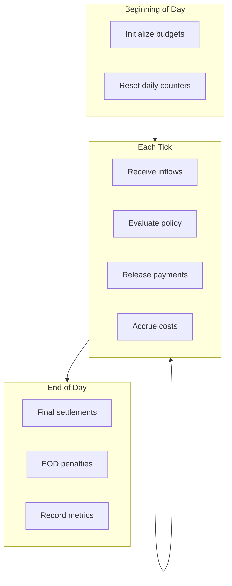

---

## Invariants

### Balance Conservation

```
∀ settlement:
    sender.balance_before - amount == sender.balance_after
    receiver.balance_before + amount == receiver.balance_after
```

### Queue Validity

```
∀ tx_id ∈ agent.outgoing_queue:
    transactions.contains(tx_id) == true
    transactions[tx_id].sender_id == agent.id

∀ tx_id ∈ state.rtgs_queue:
    transactions.contains(tx_id) == true
    transactions[tx_id].status == Pending
```

### Transaction Amount

```
∀ tx:
    tx.remaining_amount <= tx.amount
    tx.remaining_amount >= 0
    tx.is_fully_settled() == (tx.remaining_amount == 0)
```

### Priority Bounds

```
∀ tx:
    0 <= tx.priority <= 10
    0 <= tx.original_priority <= 10
```

---

## Memory Layout

### Estimated Sizes

| Type | Size (approx.) | Notes |
|------|----------------|-------|
| `Agent` | ~500 bytes | Varies with queue sizes |
| `Transaction` | ~200 bytes | Fixed size |
| `Event` | ~100-500 bytes | Varies by type |
| `SimulationState` | N × Agent + M × Transaction | Linear scaling |

### Efficient Access

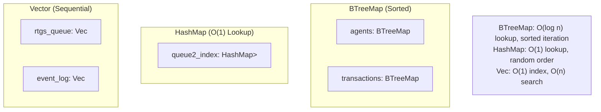

---

## Related Documents

- [02-rust-core-engine.md](./02-rust-core-engine.md) - Implementation details
- [06-settlement-engines.md](./06-settlement-engines.md) - Settlement logic
- [08-event-system.md](./08-event-system.md) - Event types

---

*Next: [06-settlement-engines.md](./06-settlement-engines.md) - Settlement algorithms*
