# Settlement Engines

**Version**: 1.0
**Last Updated**: 2025-11-28

---

## Overview

SimCash implements two settlement mechanisms: **RTGS** (Real-Time Gross Settlement) for immediate settlement, and **LSM** (Liquidity-Saving Mechanisms) for optimizing settlement through netting.

---

## Settlement Architecture

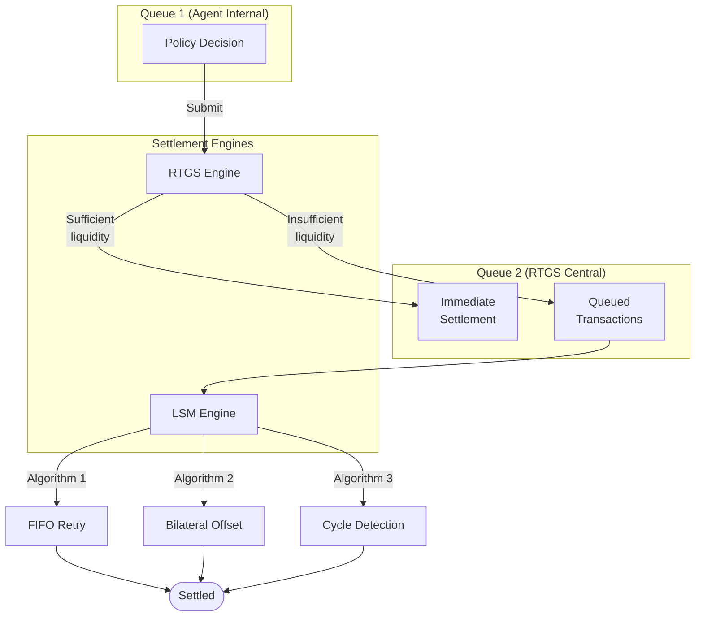
```mermaid
flowchart TB
    subgraph Q1["Queue 1 (Agent Internal)"]
        Policy["Policy Decision"]
    end

    subgraph Q2["Queue 2 (RTGS Central)"]
        direction TB
        Immediate["Immediate<br/>Settlement"]
        Queued["Queued<br/>Transactions"]
    end

    subgraph Engines["Settlement Engines"]
        RTGS["RTGS Engine"]
        LSM["LSM Engine"]
    end

    Policy -->|"Submit"| RTGS
    RTGS -->|"Sufficient<br/>liquidity"| Immediate
    RTGS -->|"Insufficient<br/>liquidity"| Queued

    Queued --> LSM
    LSM -->|"Algorithm 1"| FIFO["FIFO Retry"]
    LSM -->|"Algorithm 2"| Bilateral["Bilateral Offset"]
    LSM -->|"Algorithm 3"| Multilateral["Cycle Detection"]

    FIFO --> Settled([Settled])
    Bilateral --> Settled
    Multilateral --> Settled
```

---

## 1. RTGS Settlement

**Source**: `backend/src/settlement/rtgs.rs`

### Core Functions

| Function | Purpose |
|----------|---------|
| `submit_transaction()` | Submit to RTGS, immediate settle or queue |
| `try_settle()` | Attempt atomic settlement |
| `process_queue()` | Retry queued transactions |

### Settlement Flow

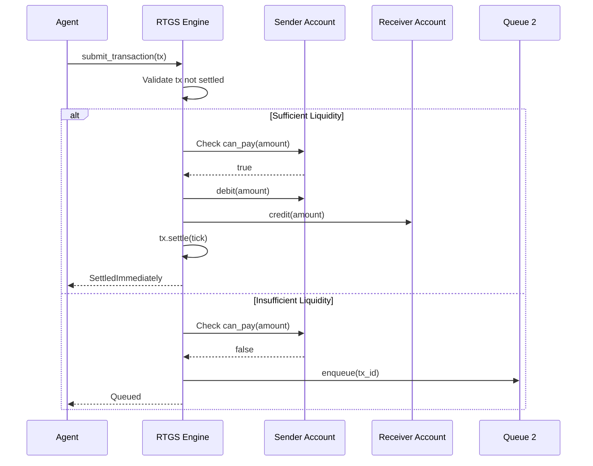
```mermaid
sequenceDiagram
    participant Agent as Agent
    participant RTGS as RTGS Engine
    participant Sender as Sender Account
    participant Receiver as Receiver Account
    participant Q2 as Queue 2

    Agent->>RTGS: submit_transaction(tx)
    RTGS->>RTGS: Validate tx not settled

    alt Sufficient Liquidity
        RTGS->>Sender: Check can_pay(amount)
        Sender-->>RTGS: true
        RTGS->>Sender: debit(amount)
        RTGS->>Receiver: credit(amount)
        RTGS->>RTGS: tx.settle(tick)
        RTGS-->>Agent: SettledImmediately
    else Insufficient Liquidity
        RTGS->>Sender: Check can_pay(amount)
        Sender-->>RTGS: false
        RTGS->>Q2: enqueue(tx_id)
        RTGS-->>Agent: Queued
    end
```

### Liquidity Check

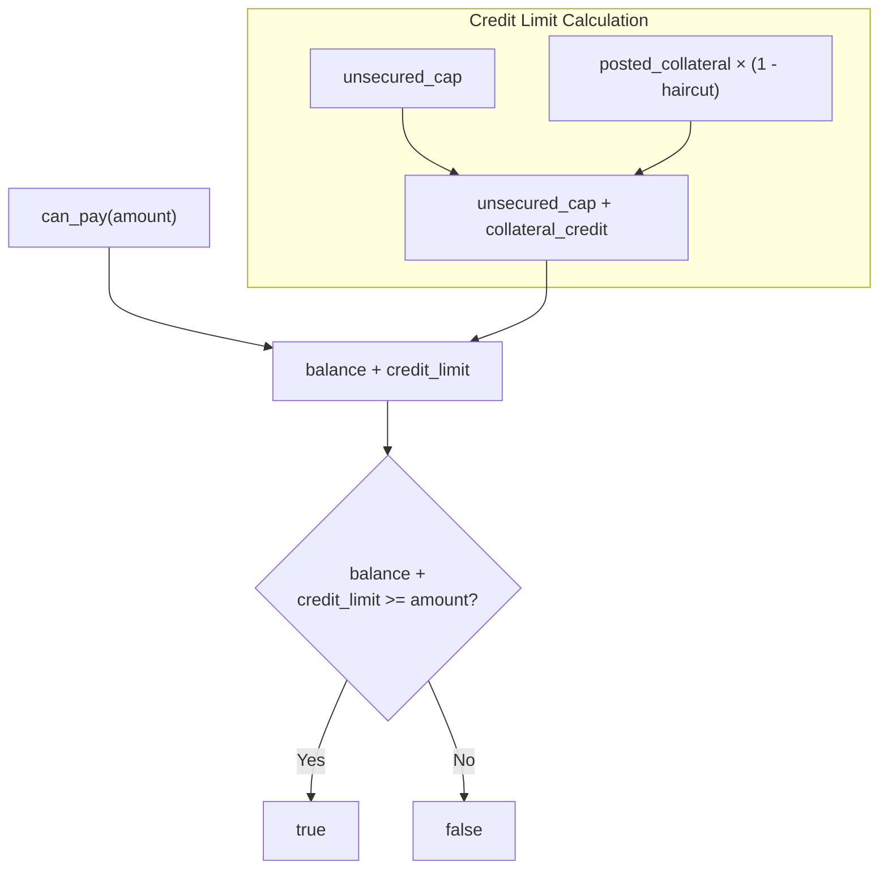
```mermaid
flowchart TB
    Check["can_pay(amount)"] --> Calc["balance + credit_limit"]

    subgraph CreditLimit["Credit Limit Calculation"]
        Unsecured["unsecured_cap"]
        Collateral["posted_collateral × (1 - haircut)"]
        Total["unsecured_cap + collateral_credit"]
    end

    Calc --> Compare{"balance +<br/>credit_limit >= amount?"}
    Compare -->|Yes| CanPay["true"]
    Compare -->|No| CannotPay["false"]

    Unsecured --> Total
    Collateral --> Total
    Total --> Calc
```

### Atomic Settlement

```rust
pub fn try_settle(
    sender: &mut Agent,
    receiver: &mut Agent,
    transaction: &mut Transaction,
    tick: usize,
) -> Result<(), SettlementError> {
    // Phase 1: Validation
    if transaction.is_fully_settled() {
        return Err(SettlementError::AlreadySettled);
    }

    let amount = transaction.remaining_amount();
    if !sender.can_pay(amount) {
        return Err(SettlementError::InsufficientLiquidity);
    }

    // Phase 2: Atomic execution
    sender.debit(amount)?;      // Can fail
    receiver.credit(amount);     // Cannot fail
    transaction.settle(amount, tick);

    Ok(())
}
```

### Queue Processing

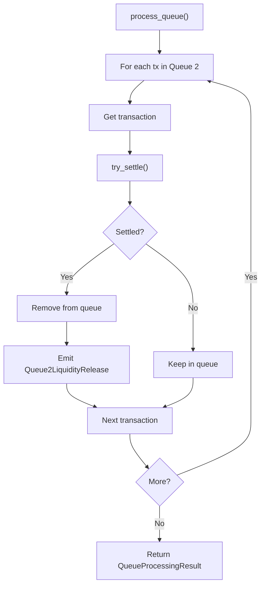
```mermaid
flowchart TB
    Start["process_queue()"] --> Loop["For each tx in Queue 2"]
    Loop --> GetTx["Get transaction"]
    GetTx --> TrySettle["try_settle()"]
    TrySettle --> Result{"Settled?"}

    Result -->|Yes| Remove["Remove from queue"]
    Result -->|No| Keep["Keep in queue"]

    Remove --> Event["Emit Queue2LiquidityRelease"]
    Event --> Next["Next transaction"]
    Keep --> Next

    Next --> Done{"More?"}
    Done -->|Yes| Loop
    Done -->|No| Return["Return QueueProcessingResult"]
```

---

## 2. LSM (Liquidity-Saving Mechanisms)

**Source**: `backend/src/settlement/lsm.rs`

### Algorithm Sequence (TARGET2 Style)

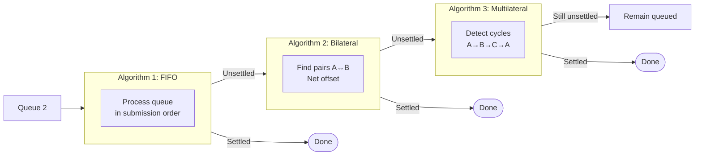
```mermaid
flowchart LR
    subgraph Alg1["Algorithm 1: FIFO"]
        FIFO["Process queue<br/>in submission order"]
    end

    subgraph Alg2["Algorithm 2: Bilateral"]
        Bi["Find pairs A↔B<br/>Net offset"]
    end

    subgraph Alg3["Algorithm 3: Multilateral"]
        Multi["Detect cycles<br/>A→B→C→A"]
    end

    Q2["Queue 2"] --> Alg1
    Alg1 -->|"Unsettled"| Alg2
    Alg2 -->|"Unsettled"| Alg3
    Alg3 -->|"Still unsettled"| Remain["Remain queued"]

    Alg1 -->|"Settled"| Done1([Done])
    Alg2 -->|"Settled"| Done2([Done])
    Alg3 -->|"Settled"| Done3([Done])
```

### LSM Configuration

```rust
pub struct LsmConfig {
    pub enable_bilateral: bool,
    pub enable_cycles: bool,
    pub max_cycle_length: usize,
    pub max_cycles_per_tick: usize,
}
```

---

## 3. Bilateral Offsetting

**Source**: `backend/src/settlement/lsm.rs`

### Concept

Two banks with opposing payments can settle with minimal liquidity:

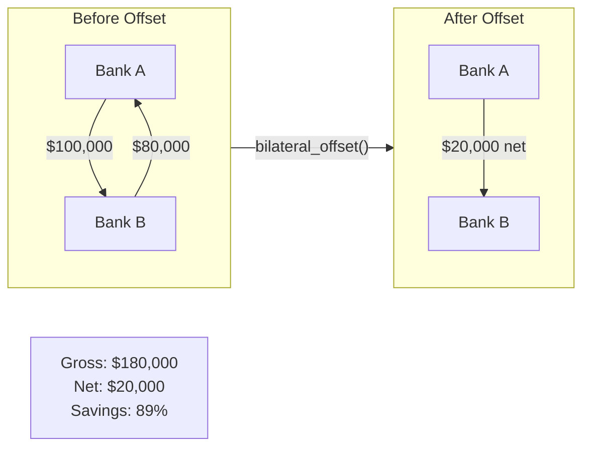
```mermaid
flowchart LR
    subgraph Before["Before Offset"]
        A1["Bank A"] -->|"$100,000"| B1["Bank B"]
        B1 -->|"$80,000"| A1
    end

    subgraph After["After Offset"]
        A2["Bank A"] -->|"$20,000 net"| B2["Bank B"]
    end

    Before -->|"bilateral_offset()"| After

    Note["Gross: $180,000<br/>Net: $20,000<br/>Savings: 89%"]
```

### Algorithm

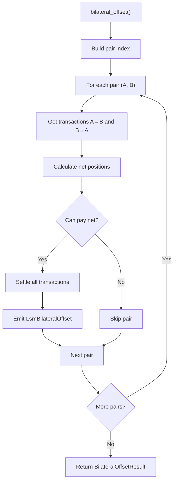
```mermaid
flowchart TB
    Start["bilateral_offset()"] --> BuildPairs["Build pair index"]
    BuildPairs --> ForPair["For each pair (A, B)"]

    ForPair --> GetTxs["Get transactions A→B and B→A"]
    GetTxs --> CalcNet["Calculate net positions"]
    CalcNet --> CheckLiq{"Can pay net?"}

    CheckLiq -->|Yes| Settle["Settle all transactions"]
    CheckLiq -->|No| Skip["Skip pair"]

    Settle --> Event["Emit LsmBilateralOffset"]
    Event --> Next["Next pair"]
    Skip --> Next

    Next --> More{"More pairs?"}
    More -->|Yes| ForPair
    More -->|No| Return["Return BilateralOffsetResult"]
```

### Net Position Calculation

```rust
// For pair (A, B):
// A → B transactions total: $100,000
// B → A transactions total: $80,000

let a_to_b_total: i64 = 100_000_00;  // cents
let b_to_a_total: i64 = 80_000_00;   // cents

// Net positions:
let a_net_outflow = a_to_b_total - b_to_a_total;  // +$20,000
let b_net_outflow = b_to_a_total - a_to_b_total;  // -$20,000

// A needs $20,000 liquidity to settle both directions
// B needs $0 liquidity (net receiver)
```

### Bilateral Limit Check (TARGET2)

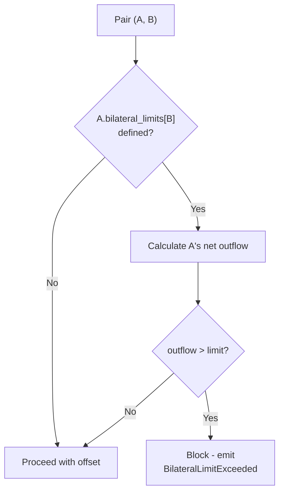
```mermaid
flowchart TB
    Pair["Pair (A, B)"] --> CheckLimit{"A.bilateral_limits[B]<br/>defined?"}
    CheckLimit -->|No| Proceed["Proceed with offset"]
    CheckLimit -->|Yes| CalcOutflow["Calculate A's net outflow"]
    CalcOutflow --> Compare{"outflow > limit?"}
    Compare -->|Yes| Block["Block - emit<br/>BilateralLimitExceeded"]
    Compare -->|No| Proceed
```

---

## 4. Cycle Detection

**Source**: `backend/src/settlement/lsm/graph.rs`

### Concept

Circular payment chains can settle with minimal liquidity:

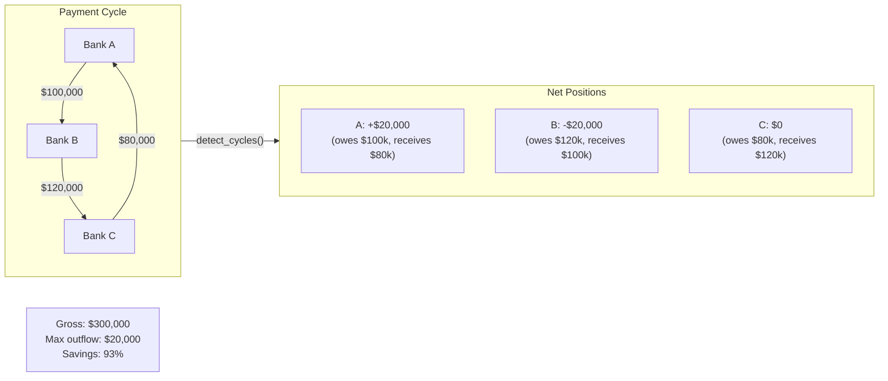
```mermaid
flowchart LR
    subgraph Cycle["Payment Cycle"]
        A["Bank A"] -->|"$100,000"| B["Bank B"]
        B -->|"$120,000"| C["Bank C"]
        C -->|"$80,000"| A
    end

    subgraph Net["Net Positions"]
        AN["A: +$20,000<br/>(owes $100k, receives $80k)"]
        BN["B: -$20,000<br/>(owes $120k, receives $100k)"]
        CN["C: $0<br/>(owes $80k, receives $120k)"]
    end

    Cycle -->|"detect_cycles()"| Net

    Note["Gross: $300,000<br/>Max outflow: $20,000<br/>Savings: 93%"]
```

### Graph Construction

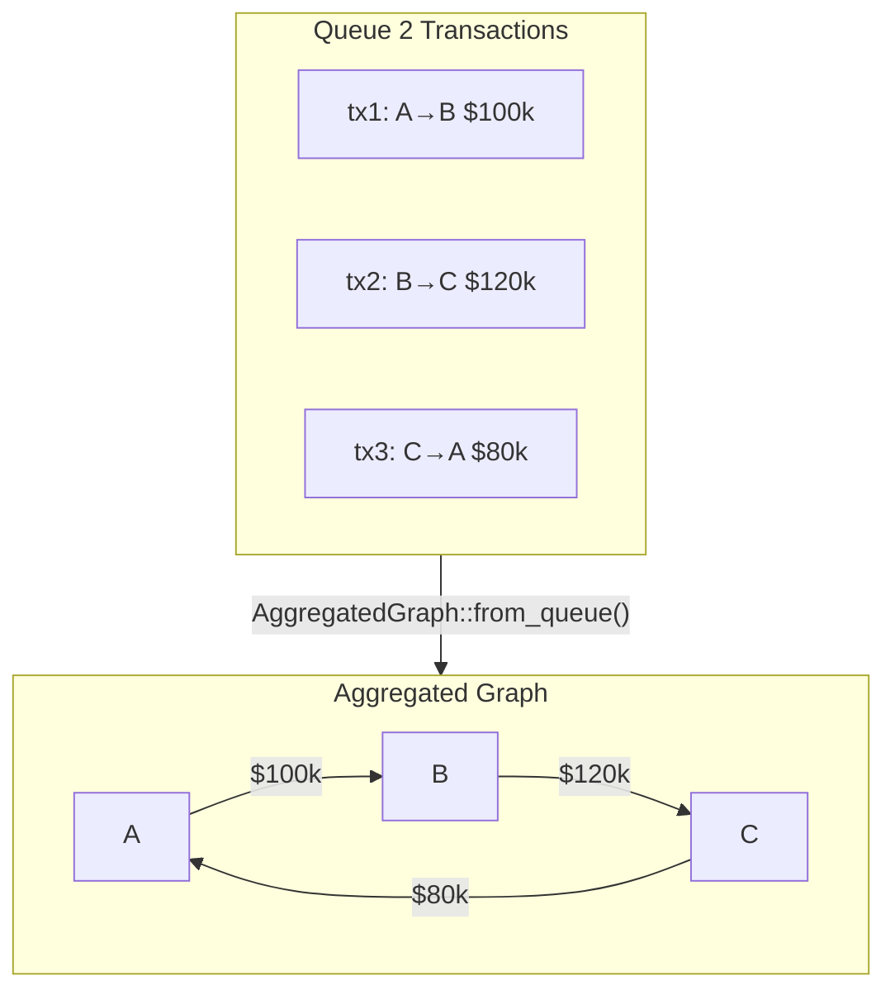
```mermaid
flowchart TB
    subgraph Queue["Queue 2 Transactions"]
        T1["tx1: A→B $100k"]
        T2["tx2: B→C $120k"]
        T3["tx3: C→A $80k"]
    end

    subgraph Graph["Aggregated Graph"]
        GA["A"] -->|"$100k"| GB["B"]
        GB -->|"$120k"| GC["C"]
        GC -->|"$80k"| GA
    end

    Queue -->|"AggregatedGraph::from_queue()"| Graph
```

### AggregatedGraph Structure

```rust
pub struct AggregatedGraph {
    // Vertex indices: sorted agent IDs for determinism
    vertices: Vec<String>,  // ["A", "B", "C"] sorted

    // Adjacency: sender_idx → receiver_idx → (total_amount, tx_ids)
    adjacency: BTreeMap<usize, BTreeMap<usize, (i64, Vec<String>)>>,
}
```

### Cycle Detection Algorithm

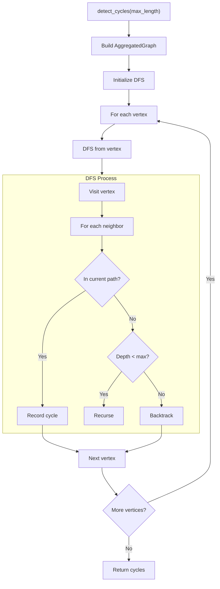
```mermaid
flowchart TB
    Start["detect_cycles(max_length)"] --> BuildGraph["Build AggregatedGraph"]
    BuildGraph --> InitDFS["Initialize DFS"]

    InitDFS --> ForVertex["For each vertex"]
    ForVertex --> DFS["DFS from vertex"]

    subgraph DFSProcess["DFS Process"]
        Visit["Visit vertex"] --> ForNeighbor["For each neighbor"]
        ForNeighbor --> CheckVisited{"In current path?"}
        CheckVisited -->|Yes| FoundCycle["Record cycle"]
        CheckVisited -->|No| CheckDepth{"Depth < max?"}
        CheckDepth -->|Yes| Recurse["Recurse"]
        CheckDepth -->|No| Backtrack["Backtrack"]
    end

    DFS --> DFSProcess
    FoundCycle --> NextVertex["Next vertex"]
    Backtrack --> NextVertex

    NextVertex --> More{"More vertices?"}
    More -->|Yes| ForVertex
    More -->|No| Return["Return cycles"]
```

### Cycle Settlement

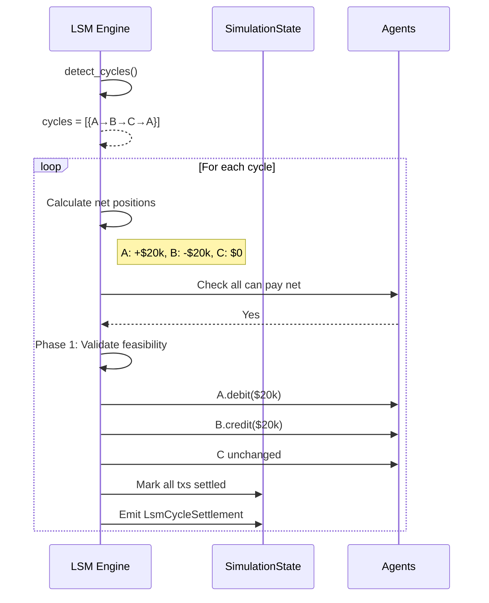
```mermaid
sequenceDiagram
    participant LSM as LSM Engine
    participant State as SimulationState
    participant Agents as Agents

    LSM->>LSM: detect_cycles()
    LSM-->>LSM: cycles = [{A→B→C→A}]

    loop For each cycle
        LSM->>LSM: Calculate net positions
        Note right of LSM: A: +$20k, B: -$20k, C: $0

        LSM->>Agents: Check all can pay net
        Agents-->>LSM: Yes

        LSM->>LSM: Phase 1: Validate feasibility

        LSM->>Agents: A.debit($20k)
        LSM->>Agents: B.credit($20k)
        LSM->>Agents: C unchanged

        LSM->>State: Mark all txs settled
        LSM->>State: Emit LsmCycleSettlement
    end
```

### Multilateral Limit Check (TARGET2)

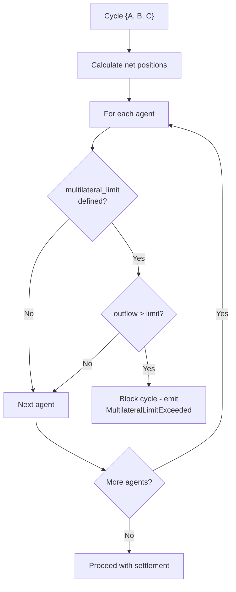
```mermaid
flowchart TB
    Cycle["Cycle {A, B, C}"] --> CalcNet["Calculate net positions"]
    CalcNet --> ForAgent["For each agent"]
    ForAgent --> CheckLimit{"multilateral_limit<br/>defined?"}
    CheckLimit -->|No| Next["Next agent"]
    CheckLimit -->|Yes| Compare{"outflow > limit?"}
    Compare -->|Yes| Block["Block cycle - emit<br/>MultilateralLimitExceeded"]
    Compare -->|No| Next
    Next --> More{"More agents?"}
    More -->|Yes| ForAgent
    More -->|No| Proceed["Proceed with settlement"]
```

---

## 5. Entry Disposition Offsetting

**Source**: `backend/src/settlement/lsm.rs`

### Concept

Check for bilateral offset at the moment of RTGS submission, before queueing:

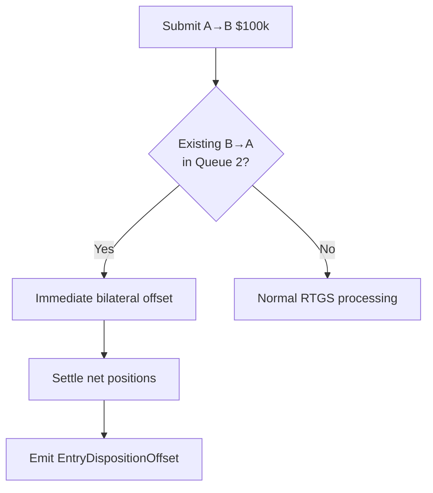
```mermaid
flowchart TB
    Submit["Submit A→B $100k"] --> Check{"Existing B→A<br/>in Queue 2?"}
    Check -->|Yes| Offset["Immediate bilateral offset"]
    Check -->|No| Normal["Normal RTGS processing"]

    Offset --> Net["Settle net positions"]
    Net --> Event["Emit EntryDispositionOffset"]
```

### Configuration

```rust
pub struct OrchestratorConfig {
    // ...
    pub entry_disposition_offsetting: bool,  // Enable/disable
}
```

---

## 6. Event Generation

### Settlement Events

| Event | When Emitted | Key Fields |
|-------|--------------|------------|
| `RtgsImmediateSettlement` | Immediate settlement | tx_id, amount, sender/receiver balances |
| `QueuedRtgs` | Queued for liquidity | tx_id, queue_position |
| `Queue2LiquidityRelease` | Settled from queue | tx_id, queue_wait_ticks |
| `LsmBilateralOffset` | Bilateral netting | agent_a, agent_b, amounts, net |
| `LsmCycleSettlement` | Cycle settlement | agents, tx_ids, net_positions |
| `RtgsSubmission` | Submitted to Q2 | tx_id, declared_priority |
| `RtgsWithdrawal` | Withdrawn from Q2 | tx_id, reason |
| `RtgsResubmission` | Resubmitted to Q2 | tx_id, new_priority |

### TARGET2 Limit Events

| Event | When Emitted | Key Fields |
|-------|--------------|------------|
| `BilateralLimitExceeded` | Bilateral limit blocks | agent, counterparty, limit, attempted |
| `MultilateralLimitExceeded` | Multilateral limit blocks | agent, limit, attempted |
| `AlgorithmExecution` | Algorithm completed | algorithm_num, settled_count, value |
| `EntryDispositionOffset` | Entry-time offset | tx_id, offset_tx_id, net_amount |

---

## 7. Performance Characteristics

### Algorithmic Complexity

| Operation | Time | Space |
|-----------|------|-------|
| RTGS single settle | O(1) | O(1) |
| RTGS queue process | O(q) | O(1) |
| Bilateral offset | O(p × t) | O(p) |
| Graph construction | O(t) | O(a + t) |
| Cycle detection | O(a! / (a-c)!) | O(c) |
| Cycle settlement | O(c) | O(1) |

Where: q = queue size, p = pairs, t = transactions, a = agents, c = cycle length

### Determinism Guarantees

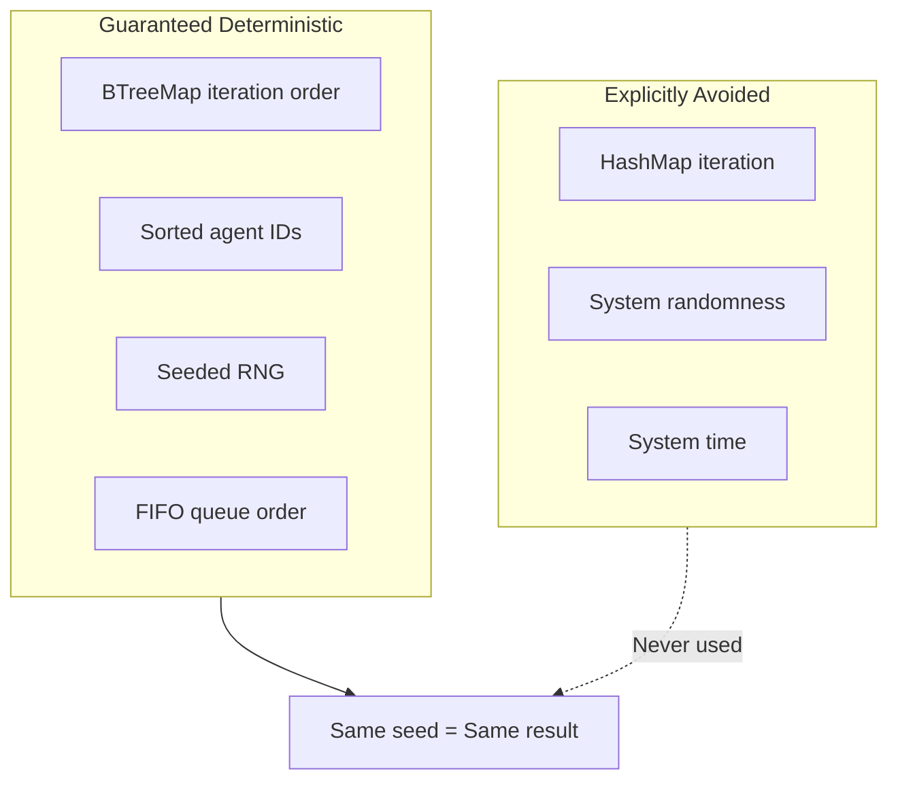
```mermaid
flowchart TB
    subgraph Deterministic["Guaranteed Deterministic"]
        BTree["BTreeMap iteration order"]
        Sorted["Sorted agent IDs"]
        Seed["Seeded RNG"]
        FIFO["FIFO queue order"]
    end

    subgraph Avoided["Explicitly Avoided"]
        HashMap["HashMap iteration"]
        Random["System randomness"]
        Time["System time"]
    end

    Deterministic --> Result["Same seed = Same result"]
    Avoided -.->|"Never used"| Result
```

---

## 8. Deferred Crediting Mode

**Source**: `backend/src/settlement/deferred.rs`

### Overview

Deferred crediting is a Castro-compatible settlement mode where credits from settlements are accumulated during a tick and applied at the end, rather than being immediately available.

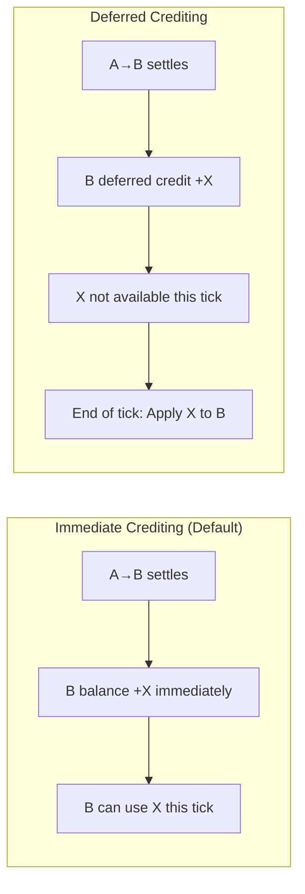
```mermaid
flowchart LR
    subgraph Immediate["Immediate Crediting (Default)"]
        A1["A→B settles"] --> B1["B balance +X immediately"]
        B1 --> C1["B can use X this tick"]
    end

    subgraph Deferred["Deferred Crediting"]
        A2["A→B settles"] --> B2["B deferred credit +X"]
        B2 --> C2["X not available this tick"]
        C2 --> D2["End of tick: Apply X to B"]
    end
```

### Configuration

```yaml
deferred_crediting: true  # Enable Castro-compatible mode (default: false)
```

### Behavioral Difference

| Scenario | Immediate (default) | Deferred |
|----------|---------------------|----------|
| A→B, B→A mutual payments | May settle if B→A first | Gridlock (neither can use incoming) |
| Chain A→B→C | C has funds same tick | C has funds next tick |
| LSM bilateral offset | Net receiver has funds same tick | Net receiver has funds end of tick |

### Use Case: Castro Model Alignment

The deferred crediting mode matches the Castro et al. (2025) academic model where:

```
ℓ_t = ℓ_{t-1} - P_t x_t + R_t
```

Incoming payments (R_t) are only available in the **next** period, preventing "within-tick recycling" of liquidity.

### Implementation

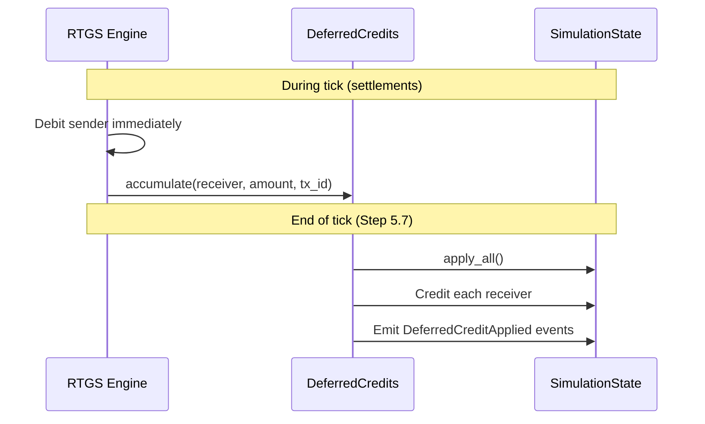
```mermaid
sequenceDiagram
    participant RTGS as RTGS Engine
    participant DC as DeferredCredits
    participant State as SimulationState

    Note over RTGS,State: During tick (settlements)
    RTGS->>RTGS: Debit sender immediately
    RTGS->>DC: accumulate(receiver, amount, tx_id)

    Note over RTGS,State: End of tick (Step 5.7)
    DC->>State: apply_all()
    DC->>State: Credit each receiver
    DC->>State: Emit DeferredCreditApplied events
```

### Events Generated

| Event | When Emitted | Key Fields |
|-------|--------------|------------|
| `DeferredCreditApplied` | End of tick, per receiver | agent_id, amount, source_transactions |

### Related Documents

- [11-tick-loop-anatomy.md](./11-tick-loop-anatomy.md) - Step 5.7 deferred credits
- [appendix-b-event-catalog.md](./appendix-b-event-catalog.md) - DeferredCreditApplied event

---

## 9. Configuration Reference

### Full LSM Config

```yaml
lsm_config:
  enable_bilateral: true
  enable_cycles: true
  max_cycle_length: 5
  max_cycles_per_tick: 100

# TARGET2 agent-level limits
agents:
  - id: BANK_A
    bilateral_limits:
      BANK_B: 1000000  # $10,000 max outflow to B
      BANK_C: 500000   # $5,000 max outflow to C
    multilateral_limit: 2000000  # $20,000 max total outflow

# Entry disposition offsetting
entry_disposition_offsetting: true

# Algorithm sequencing events
algorithm_sequencing: true
```

---

## Related Documents

- [02-rust-core-engine.md](./02-rust-core-engine.md) - Implementation details
- [05-domain-models.md](./05-domain-models.md) - Transaction and Agent models
- [08-event-system.md](./08-event-system.md) - Event types
- [11-tick-loop-anatomy.md](./11-tick-loop-anatomy.md) - When settlement runs

---

*Next: [07-policy-system.md](./07-policy-system.md) - Decision tree policies*
