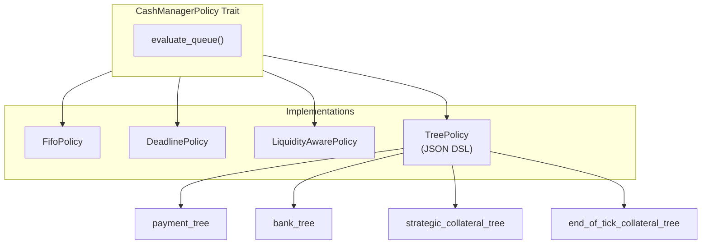
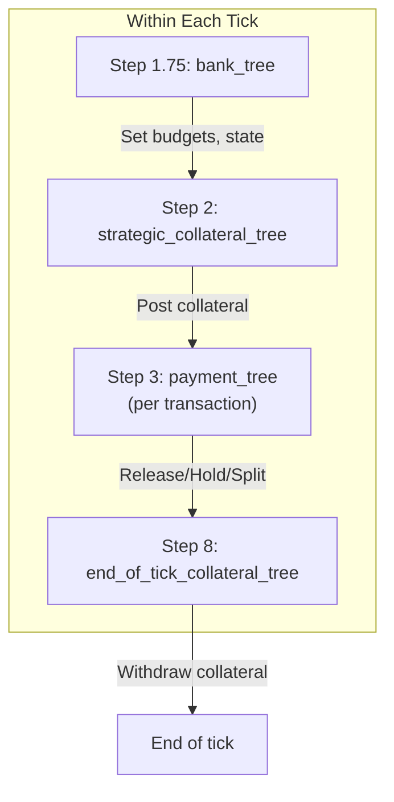
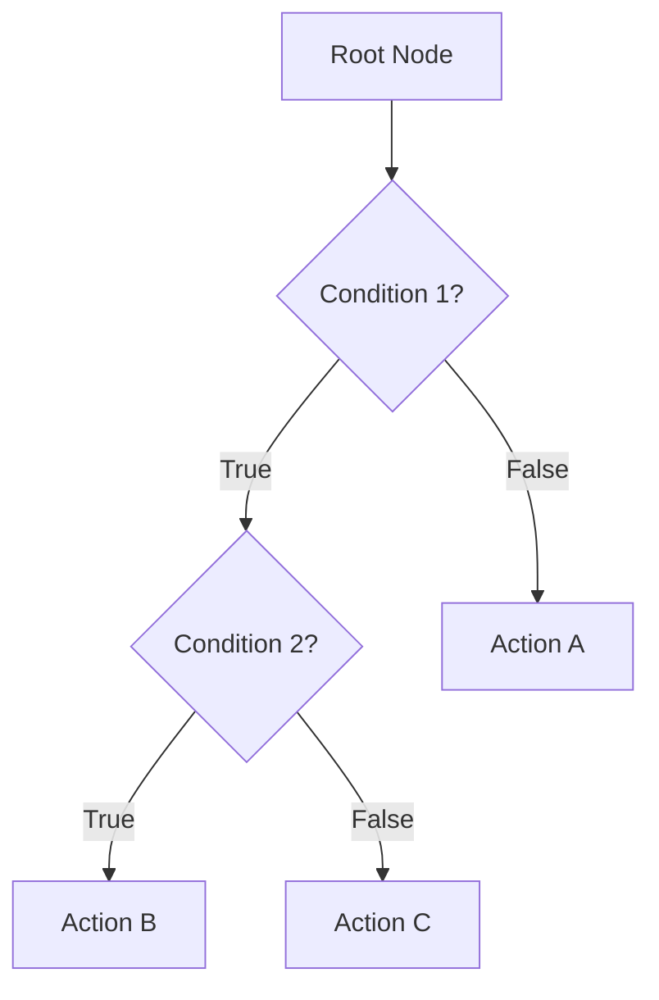
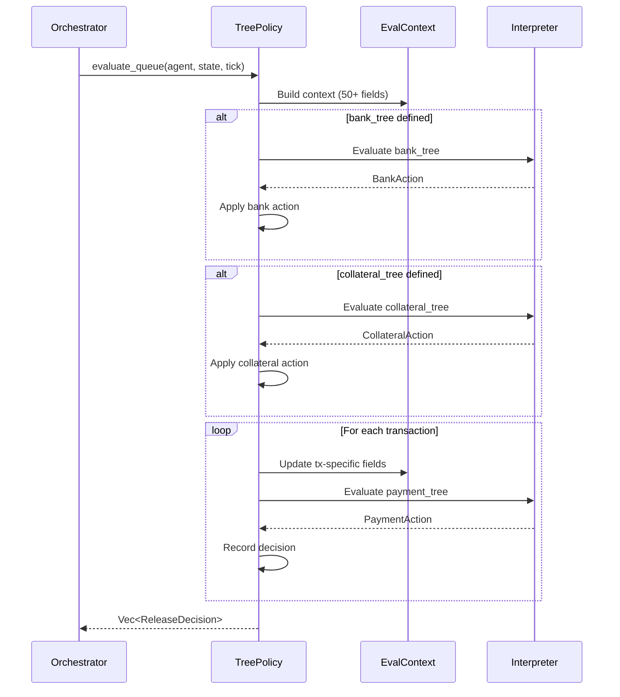
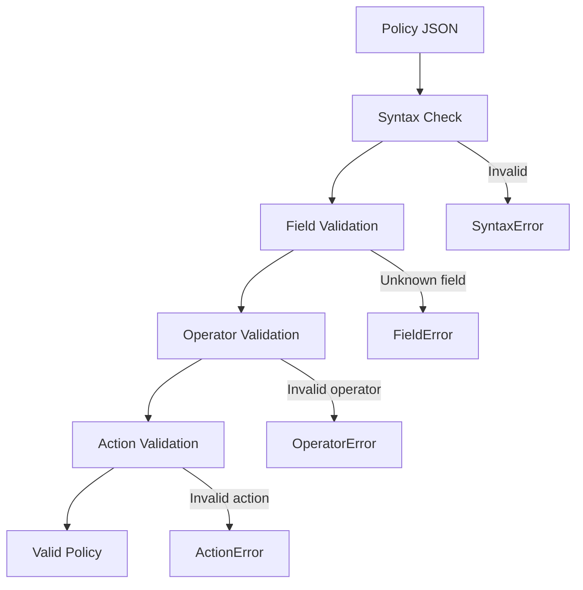

# Policy System

**Version**: 1.0
**Last Updated**: 2025-11-28

---

## Overview

The policy system implements cash manager decision-making through **decision tree policies**. Policies control when to release payments, how to manage collateral, and strategic budget allocation.

---

## Policy Architecture



---

## Policy Evaluation Points



---

## Decision Tree DSL

### Tree Structure



### JSON Schema

```json
{
  "condition": {
    "left": "tx.remaining_amount",
    "operator": "gt",
    "right": 100000
  },
  "if_true": {
    "action": "submit",
    "priority_override": 8
  },
  "if_false": {
    "action": "hold",
    "reason": "small_payment"
  }
}
```

### Expression Language

**Operand Types**:
- `field`: Reference to context field (e.g., `"tx.amount"`)
- `value`: Literal value (e.g., `100000`)
- `param`: Configurable parameter (e.g., `"threshold"`)

**Operators**:

| Category | Operators |
|----------|-----------|
| Comparison | `eq`, `ne`, `gt`, `gte`, `lt`, `lte` |
| Boolean | `and`, `or`, `not` |
| Arithmetic | `add`, `sub`, `mul`, `div`, `mod` |
| String | `contains`, `starts_with`, `ends_with` |

---

## Available Fields (50+)

### Transaction Fields (`tx.*`)

| Field | Type | Description |
|-------|------|-------------|
| `tx.amount` | i64 | Original amount |
| `tx.remaining_amount` | i64 | Unsettled amount |
| `tx.priority` | u8 | Internal priority (0-10) |
| `tx.deadline_tick` | usize | Deadline tick |
| `tx.arrival_tick` | usize | Arrival tick |
| `tx.ticks_until_deadline` | usize | Ticks to deadline |
| `tx.is_overdue` | bool | Past deadline? |
| `tx.is_divisible` | bool | Can split? |
| `tx.sender_id` | String | Sender agent |
| `tx.receiver_id` | String | Receiver agent |

### Agent Fields (`agent.*`)

| Field | Type | Description |
|-------|------|-------------|
| `agent.balance` | i64 | Current balance |
| `agent.available_liquidity` | i64 | Balance + credit |
| `agent.posted_collateral` | i64 | Posted collateral |
| `agent.unsecured_cap` | i64 | Unsecured limit |
| `agent.credit_limit` | i64 | Total credit limit |
| `agent.queue1_size` | usize | Q1 transaction count |
| `agent.queue1_value` | i64 | Q1 total value |
| `agent.release_budget_remaining` | i64 | Budget this tick |

### System Fields (`system.*`)

| Field | Type | Description |
|-------|------|-------------|
| `system.current_tick` | usize | Current tick |
| `system.current_day` | usize | Current day |
| `system.tick_within_day` | usize | Tick in day |
| `system.ticks_until_eod` | usize | Ticks to EOD |
| `system.eod_rush_active` | bool | In EOD rush? |
| `system.queue2_size` | usize | Q2 transaction count |
| `system.queue2_value` | i64 | Q2 total value |

### Queue 2 Agent Fields (`queue2.*`)

| Field | Type | Description |
|-------|------|-------------|
| `queue2.agent_count` | usize | Agent's Q2 count |
| `queue2.agent_value` | i64 | Agent's Q2 value |
| `queue2.nearest_deadline` | usize | Nearest deadline |

### Cost Fields (`costs.*`)

| Field | Type | Description |
|-------|------|-------------|
| `costs.delay_penalty_per_tick` | i64 | Delay cost rate |
| `costs.deadline_penalty` | i64 | Deadline penalty |
| `costs.overdraft_cost_bps` | f64 | Overdraft rate |

---

## Policy Actions

### Payment Tree Actions

| Action | Parameters | Description |
|--------|------------|-------------|
| `submit` | `priority_override` | Release to RTGS |
| `hold` | `reason` | Keep in Queue 1 |
| `split` | `num_splits` | Divide payment |
| `drop` | `reason` | Discard payment |
| `reprioritize` | `new_priority` | Change priority |

### Bank Tree Actions

| Action | Parameters | Description |
|--------|------------|-------------|
| `set_release_budget` | `max`, `focus_counterparties` | Configure budget |
| `set_state` | `register`, `value` | Set state register |
| `add_state` | `register`, `delta` | Add to state register |
| `no_action` | - | Do nothing |

### Collateral Tree Actions

| Action | Parameters | Description |
|--------|------------|-------------|
| `post_collateral` | `amount`, `reason` | Post collateral |
| `withdraw_collateral` | `amount`, `timer_ticks` | Withdraw (with timer) |
| `hold_collateral` | `reason` | Keep current |
| `no_action` | - | Do nothing |

---

## Example Policies

### Simple FIFO

```json
{
  "payment_tree": {
    "action": "submit"
  }
}
```

### Priority-Based

```json
{
  "payment_tree": {
    "condition": {
      "left": "tx.priority",
      "operator": "gte",
      "right": 8
    },
    "if_true": {
      "action": "submit"
    },
    "if_false": {
      "condition": {
        "left": "tx.ticks_until_deadline",
        "operator": "lte",
        "right": 10
      },
      "if_true": {
        "action": "submit"
      },
      "if_false": {
        "action": "hold",
        "reason": "not_urgent"
      }
    }
  }
}
```

### Liquidity-Aware

```json
{
  "payment_tree": {
    "condition": {
      "left": "agent.available_liquidity",
      "operator": "gte",
      "right": {
        "left": "tx.remaining_amount",
        "operator": "add",
        "right": { "param": "buffer" }
      }
    },
    "if_true": {
      "action": "submit"
    },
    "if_false": {
      "condition": {
        "left": "tx.is_divisible",
        "operator": "eq",
        "right": true
      },
      "if_true": {
        "action": "split",
        "num_splits": 3
      },
      "if_false": {
        "action": "hold",
        "reason": "insufficient_liquidity"
      }
    }
  },
  "parameters": {
    "buffer": 50000
  }
}
```

### Budget-Controlled

```json
{
  "bank_tree": {
    "action": "set_release_budget",
    "max": 1000000,
    "focus_counterparties": ["BANK_B", "BANK_C"]
  },
  "payment_tree": {
    "condition": {
      "left": "agent.release_budget_remaining",
      "operator": "gte",
      "right": "tx.remaining_amount"
    },
    "if_true": {
      "action": "submit"
    },
    "if_false": {
      "action": "hold",
      "reason": "budget_exhausted"
    }
  }
}
```

---

## Policy Evaluation Flow



---

## Configuration

### YAML Format

```yaml
agents:
  - id: BANK_A
    policy:
      type: tree
      payment_tree:
        condition:
          left: "tx.priority"
          operator: "gte"
          right: 5
        if_true:
          action: submit
        if_false:
          action: hold
          reason: "low_priority"
      bank_tree:
        action: set_release_budget
        max: 500000
      parameters:
        buffer: 100000
```

### Policy Types

| Type | Description |
|------|-------------|
| `fifo` | Release all in order |
| `deadline` | Prioritize by deadline |
| `liquidity_aware` | Check liquidity first |
| `tree` | Custom decision tree |

---

## Validation

Policies are validated before simulation:



---

## State Registers

Policies can maintain state across ticks:

```json
{
  "bank_tree": {
    "condition": {
      "left": { "state": "consecutive_holds" },
      "operator": "gte",
      "right": 3
    },
    "if_true": {
      "action": "set_state",
      "register": "force_release",
      "value": 1
    },
    "if_false": {
      "action": "no_action"
    }
  },
  "payment_tree": {
    "condition": {
      "left": { "state": "force_release" },
      "operator": "eq",
      "right": 1
    },
    "if_true": {
      "action": "submit"
    },
    "if_false": {
      "action": "hold"
    }
  }
}
```

**Constraints**:
- Maximum 10 registers per agent
- Values stored as `f64`
- Persisted across ticks within episode
- Reset at start of new episode

---

## Related Documents

- [02-rust-core-engine.md](./02-rust-core-engine.md) - Policy module implementation
- [11-tick-loop-anatomy.md](./11-tick-loop-anatomy.md) - Evaluation timing
- [12-cost-model.md](./12-cost-model.md) - Cost optimization
- Full DSL reference: `docs/policy_dsl_guide.md`

---

*Next: [08-event-system.md](./08-event-system.md) - Event types*
