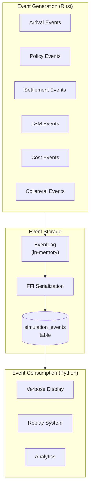
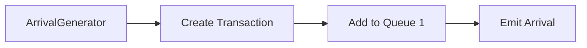
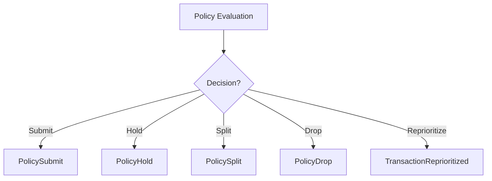
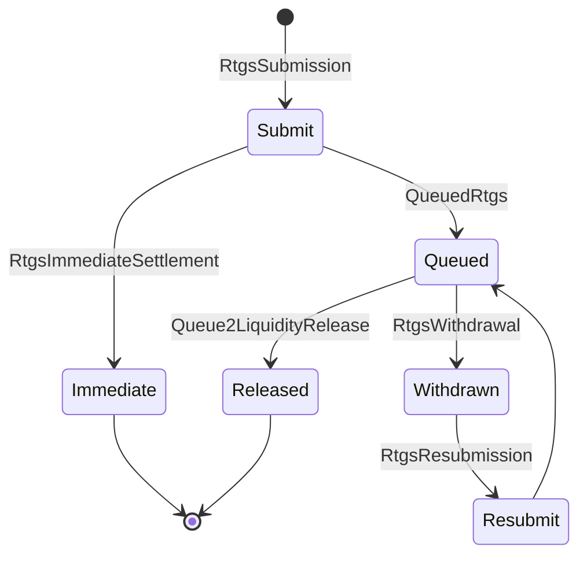
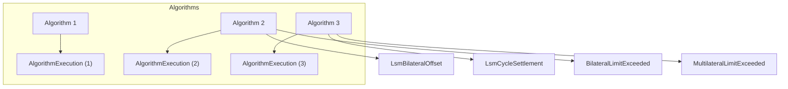
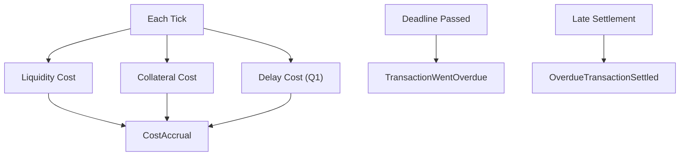
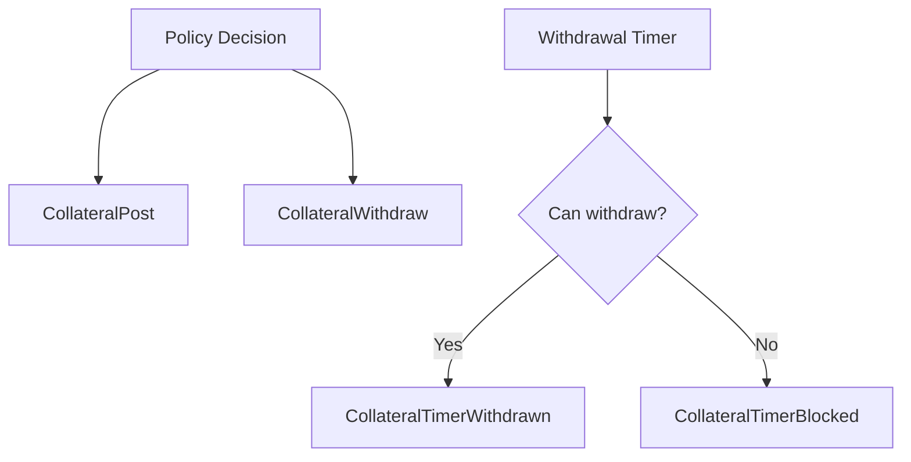
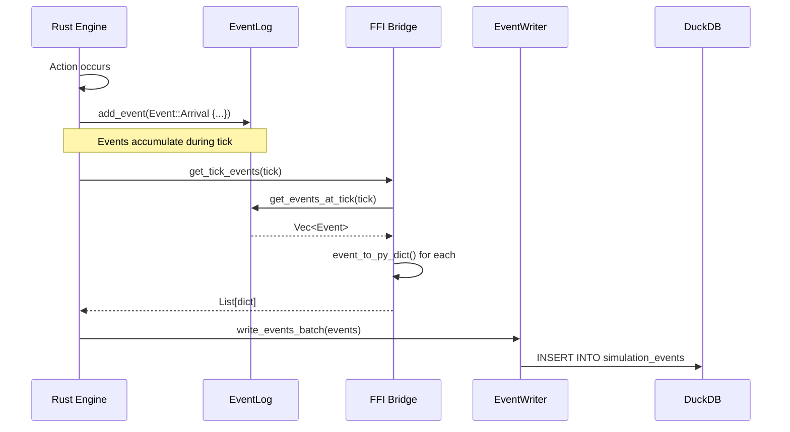
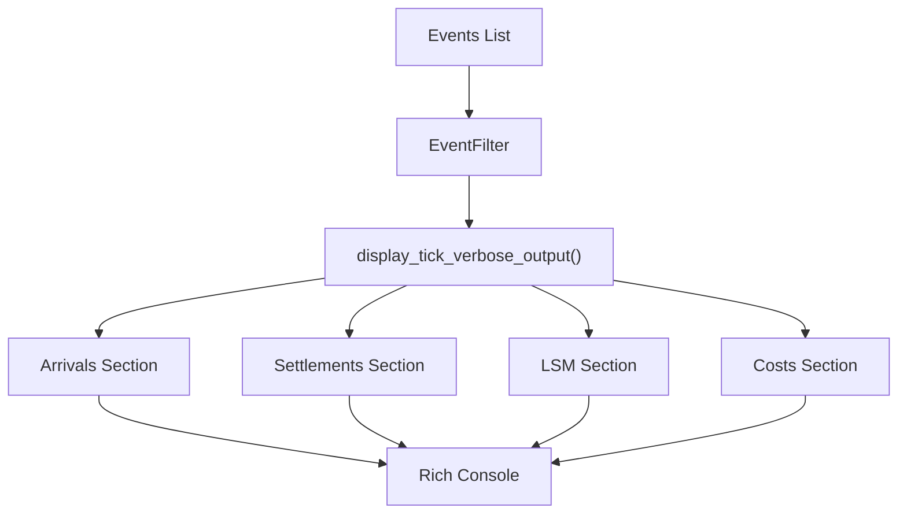
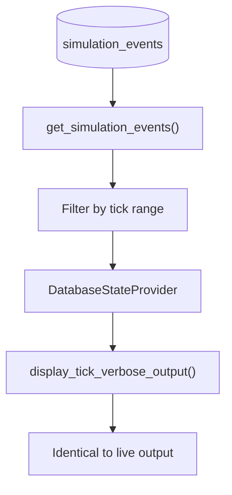

# Event System

**Version**: 1.0
**Last Updated**: 2025-11-28

---

## Overview

SimCash uses an event-sourced architecture where all simulation activity is recorded as immutable events. The system generates **50+ event types** providing a complete audit trail.

---

## Event Architecture



---

## Event Categories

### 1. Arrival Events

Events when transactions enter the system.

| Event | Description | Key Fields |
|-------|-------------|------------|
| `Arrival` | Transaction arrives at bank | tick, tx_id, sender_id, receiver_id, amount, priority, deadline_tick, divisible |



---

### 2. Policy Events

Events from cash manager policy decisions.

| Event | Description | Key Fields |
|-------|-------------|------------|
| `PolicySubmit` | Transaction released to RTGS | tick, tx_id, agent_id |
| `PolicyHold` | Transaction held in Q1 | tick, tx_id, agent_id, reason |
| `PolicyDrop` | Transaction dropped | tick, tx_id, agent_id, reason |
| `PolicySplit` | Transaction split | tick, original_tx_id, child_tx_ids, num_splits |
| `TransactionReprioritized` | Priority changed | tick, tx_id, old_priority, new_priority |
| `PriorityEscalated` | Auto-escalation | tick, tx_id, old_priority, new_priority, ticks_until_deadline |
| `BankBudgetSet` | Release budget configured | tick, agent_id, budget_max, focus_counterparties |
| `StateRegisterSet` | Policy memory updated | tick, agent_id, register_name, value |



---

### 3. Settlement Events

Events from RTGS settlement processing.

| Event | Description | Key Fields |
|-------|-------------|------------|
| `RtgsImmediateSettlement` | Settled on submission | tick, tx_id, amount, sender_balance_before, sender_balance_after |
| `QueuedRtgs` | Queued for liquidity | tick, tx_id, queue_position |
| `Queue2LiquidityRelease` | Settled from queue | tick, tx_id, queue_wait_ticks, release_reason |
| `RtgsSubmission` | Submitted to Q2 | tick, tx_id, declared_priority |
| `RtgsWithdrawal` | Withdrawn from Q2 | tick, tx_id, reason |
| `RtgsResubmission` | Resubmitted to Q2 | tick, tx_id, new_priority |



---

### 4. LSM Events

Events from Liquidity-Saving Mechanism optimization.

| Event | Description | Key Fields |
|-------|-------------|------------|
| `LsmBilateralOffset` | Bilateral netting | tick, agent_a, agent_b, amount_a, amount_b, net_amount, tx_ids |
| `LsmCycleSettlement` | Cycle settlement | tick, agents, tx_ids, tx_amounts, net_positions, max_net_outflow |
| `BilateralLimitExceeded` | T2 bilateral limit | tick, agent_id, counterparty_id, limit, attempted_outflow |
| `MultilateralLimitExceeded` | T2 multilateral limit | tick, agent_id, limit, attempted_outflow |
| `AlgorithmExecution` | Algorithm completed | tick, algorithm_number, settled_count, settled_value |
| `EntryDispositionOffset` | Entry-time offset | tick, submitted_tx_id, offset_tx_id, net_amount |



---

### 5. Cost Events

Events related to cost accrual.

| Event | Description | Key Fields |
|-------|-------------|------------|
| `CostAccrual` | Cost charged | tick, agent_id, cost_type, amount, tx_id (if applicable) |
| `TransactionWentOverdue` | Deadline passed | tick, tx_id, deadline_tick, penalty_amount |
| `OverdueTransactionSettled` | Late settlement | tick, tx_id, ticks_overdue, total_overdue_cost |



---

### 6. Collateral Events

Events related to collateral management.

| Event | Description | Key Fields |
|-------|-------------|------------|
| `CollateralPost` | Collateral posted | tick, agent_id, amount, reason, posted_before, posted_after |
| `CollateralWithdraw` | Collateral withdrawn | tick, agent_id, amount, reason |
| `CollateralTimerWithdrawn` | Auto-withdrawal | tick, agent_id, amount, original_tick |
| `CollateralTimerBlocked` | Auto-withdrawal blocked | tick, agent_id, amount, reason |



---

### 7. System Events

| Event | Description | Key Fields |
|-------|-------------|------------|
| `EndOfDay` | Day processing | tick, day, queue2_size, unsettled_count |
| `ScenarioEventExecuted` | External event | tick, event_type, details |

---

## Event Structure

### Event Enum (Rust)

**Source**: `backend/src/models/event.rs`

```rust
pub enum Event {
    Arrival {
        tick: usize,
        tx_id: String,
        sender_id: String,
        receiver_id: String,
        amount: i64,
        priority: u8,
        deadline_tick: usize,
        divisible: bool,
    },

    PolicySubmit {
        tick: usize,
        tx_id: String,
        agent_id: String,
    },

    RtgsImmediateSettlement {
        tick: usize,
        tx_id: String,
        amount: i64,
        sender_id: String,
        receiver_id: String,
        sender_balance_before: i64,
        sender_balance_after: i64,
    },

    LsmBilateralOffset {
        tick: usize,
        agent_a: String,
        agent_b: String,
        amount_a: i64,
        amount_b: i64,
        net_amount: i64,
        tx_ids: Vec<String>,
    },

    // ... 50+ more variants
}
```

### Serialized Format (Python Dict)

Events are serialized to flat dictionaries for FFI:

```python
{
    "event_type": "Arrival",
    "tick": 42,
    "tx_id": "tx-abc-123",
    "sender_id": "BANK_A",
    "receiver_id": "BANK_B",
    "amount": 100000,
    "priority": 5,
    "deadline_tick": 142,
    "divisible": True
}
```

---

## Event Flow

### Generation to Storage



### Database Schema

```sql
CREATE TABLE simulation_events (
    simulation_id VARCHAR NOT NULL,
    tick INTEGER NOT NULL,
    event_id INTEGER NOT NULL,
    event_type VARCHAR NOT NULL,
    tx_id VARCHAR,
    agent_id VARCHAR,
    day INTEGER NOT NULL,
    details JSON NOT NULL,
    PRIMARY KEY (simulation_id, tick, event_id)
);

CREATE INDEX idx_events_type ON simulation_events(event_type);
CREATE INDEX idx_events_tx ON simulation_events(tx_id);
CREATE INDEX idx_events_agent ON simulation_events(agent_id);
```

---

## Event Consumption

### Verbose Display



### Replay System



### Analytics

```python
# Query events for analysis
events = get_simulation_events(
    conn,
    simulation_id,
    event_type="LsmBilateralOffset",
    tick_min=0,
    tick_max=100
)

# Aggregate metrics
total_offset_value = sum(e['net_amount'] for e in events['events'])
```

---

## Event Design Principles

### 1. Self-Contained

Events include ALL data needed for display:

```rust
// GOOD: All display data included
Event::LsmBilateralOffset {
    tick,
    agent_a: "BANK_A".to_string(),
    agent_b: "BANK_B".to_string(),
    amount_a: 100000,
    amount_b: 80000,
    net_amount: 20000,
    tx_ids: vec!["tx-1".to_string(), "tx-2".to_string()],
}

// BAD: Requires external lookup
Event::LsmBilateralOffset {
    tick,
    tx_ids: vec!["tx-1".to_string(), "tx-2".to_string()],
    // Missing: agent IDs, amounts - would need lookup!
}
```

### 2. Flat Structure

Events serialize to flat dictionaries (no nested objects):

```python
# GOOD: Flat structure
{
    "event_type": "LsmCycleSettlement",
    "tick": 42,
    "agents": ["A", "B", "C"],  # List is OK
    "tx_ids": ["tx-1", "tx-2", "tx-3"],
    "net_positions": [2000, -1500, -500],
}

# AVOID: Nested structures
{
    "event_type": "LsmCycleSettlement",
    "cycle": {  # Nested object - harder to query
        "agents": [...],
        "transactions": [...]
    }
}
```

### 3. Immutable

Events are never modified after creation:

```rust
// Events are write-once
impl EventLog {
    pub fn add_event(&mut self, event: Event) {
        self.events.push(event);  // Append-only
    }

    // No update/delete methods!
}
```

---

## Adding New Events

### Workflow

1. **Define in Rust** (`backend/src/models/event.rs`)
2. **Add FFI serialization** (`backend/src/ffi/orchestrator.rs`)
3. **Add display logic** (`api/payment_simulator/cli/execution/display.py`)
4. **Write tests** (`api/tests/integration/test_replay_identity*.py`)
5. **Verify replay identity** (`run --verbose` = `replay --verbose`)

### Example: Adding `MyNewEvent`

```rust
// 1. Define in event.rs
pub enum Event {
    // ...
    MyNewEvent {
        tick: usize,
        agent_id: String,
        value: i64,
    },
}

// 2. Serialize in ffi/orchestrator.rs
Event::MyNewEvent { tick, agent_id, value } => {
    dict.set_item("event_type", "MyNewEvent")?;
    dict.set_item("tick", tick)?;
    dict.set_item("agent_id", agent_id)?;
    dict.set_item("value", value)?;
}

// 3. Display in display.py
if event['event_type'] == 'MyNewEvent':
    console.print(f"New Event: {event['agent_id']} = {event['value']}")
```

---

## Event Statistics

| Category | Count | Examples |
|----------|-------|----------|
| Arrival | 1 | Arrival |
| Policy | 8 | PolicySubmit, PolicyHold, PolicySplit, ... |
| Settlement | 6 | RtgsImmediateSettlement, Queue2LiquidityRelease, ... |
| LSM | 6 | LsmBilateralOffset, LsmCycleSettlement, ... |
| Cost | 3 | CostAccrual, TransactionWentOverdue, ... |
| Collateral | 4 | CollateralPost, CollateralWithdraw, ... |
| System | 2 | EndOfDay, ScenarioEventExecuted |
| **Total** | **30+** | |

---

## Related Documents

- [02-rust-core-engine.md](./02-rust-core-engine.md) - Event enum definition
- [09-persistence-layer.md](./09-persistence-layer.md) - Event storage
- [11-tick-loop-anatomy.md](./11-tick-loop-anatomy.md) - When events are generated
- [appendix-b-event-catalog.md](./appendix-b-event-catalog.md) - Complete event reference

---

*Next: [09-persistence-layer.md](./09-persistence-layer.md) - Event storage and replay*
