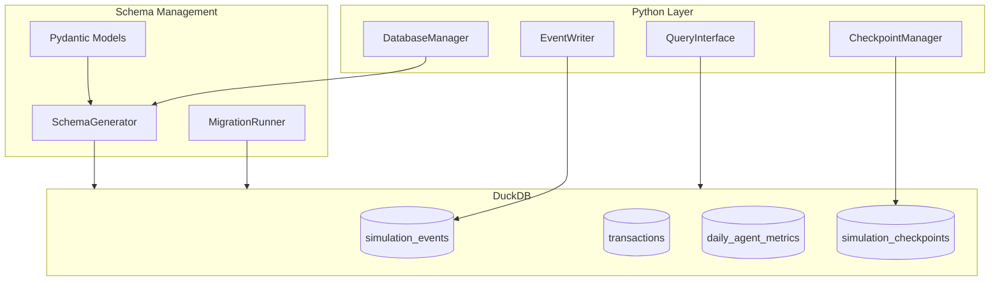
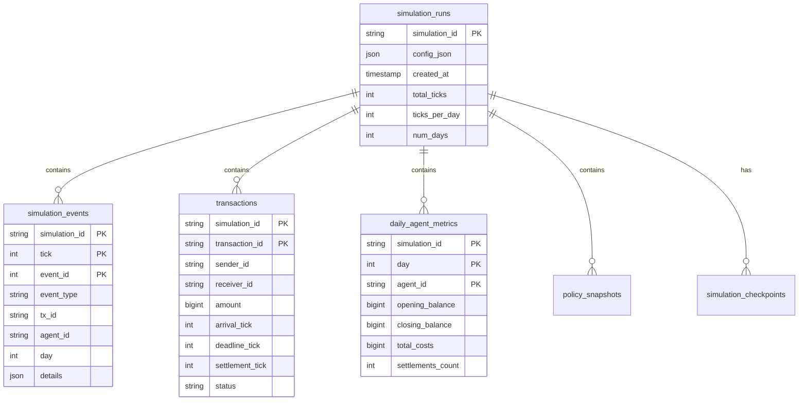
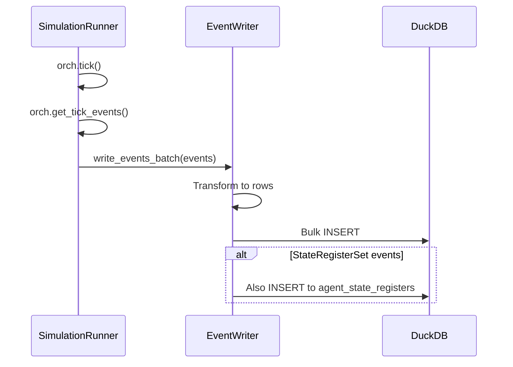
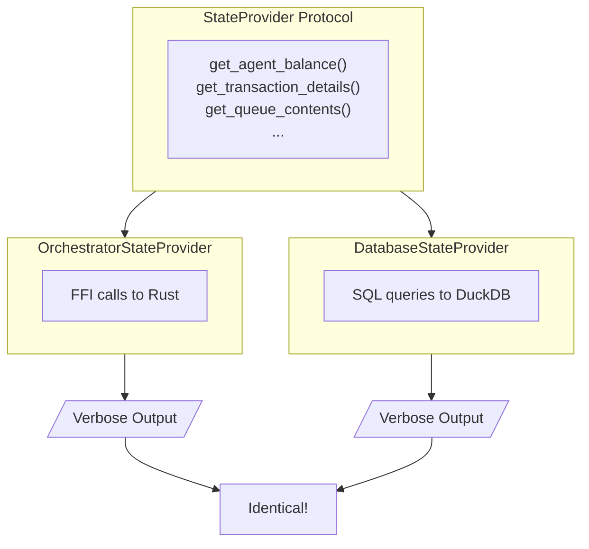
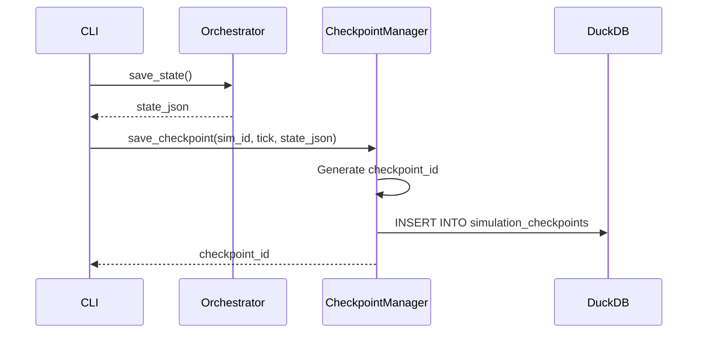
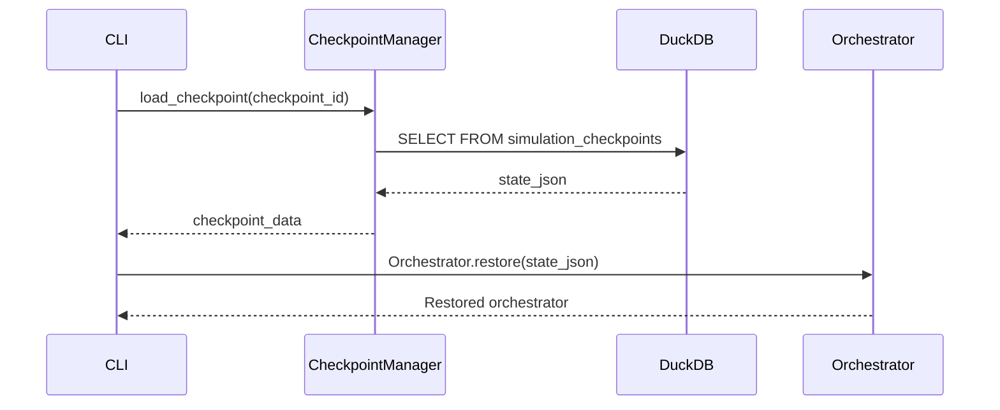
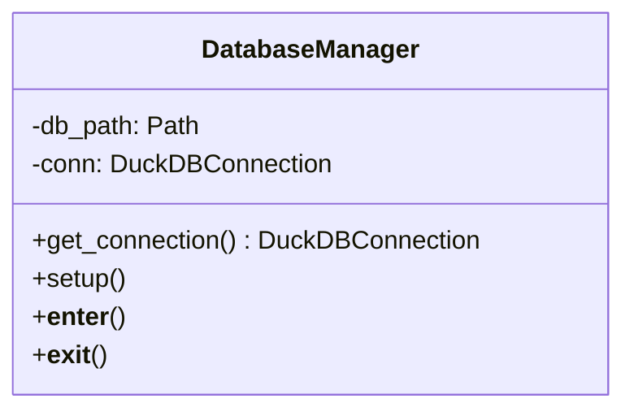
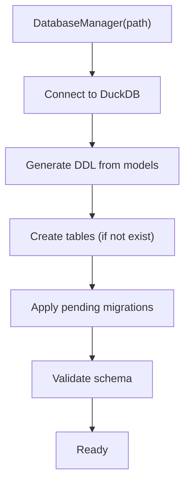
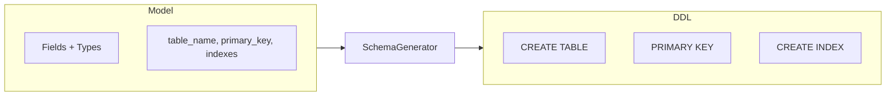
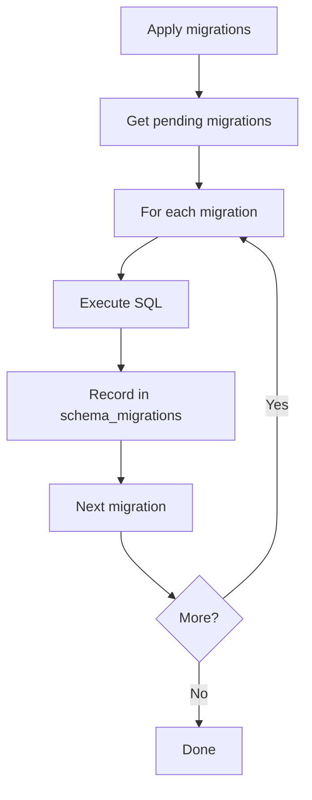

# Persistence Layer

**Version**: 1.0
**Last Updated**: 2025-11-28

---

## Overview

SimCash uses DuckDB for analytical persistence, with a schema-as-code approach using Pydantic models. The **StateProvider pattern** ensures replay identity.

---

## Architecture



---

## Database Schema

### Core Tables



### Pydantic Models

**Source**: `api/payment_simulator/persistence/models.py`

```python
class SimulationEventRecord(BaseModel):
    model_config = ConfigDict(
        table_name="simulation_events",
        primary_key=["simulation_id", "tick", "event_id"],
        indexes=["event_type", "tx_id", "agent_id"]
    )

    simulation_id: str
    tick: int
    event_id: int
    event_type: str
    tx_id: Optional[str]
    agent_id: Optional[str]
    day: int
    details: dict  # JSON column
```

---

## Event Persistence

### Event Writer

**Source**: `api/payment_simulator/persistence/event_writer.py`



### Event Storage

Events stored with full details in JSONB column:

```sql
INSERT INTO simulation_events
    (simulation_id, tick, event_id, event_type, tx_id, agent_id, day, details)
VALUES
    ('sim-123', 42, 1, 'Arrival', 'tx-abc', 'BANK_A', 0,
     '{"tick": 42, "tx_id": "tx-abc", "sender_id": "BANK_A", ...}');
```

---

## StateProvider Pattern

### Purpose

Abstract data access to ensure **replay identity**: `run --verbose` = `replay --verbose`.

### Protocol

**Source**: `api/payment_simulator/cli/execution/state_provider.py`

```python
class StateProvider(Protocol):
    def get_agent_balance(self, agent_id: str) -> int: ...
    def get_transaction_details(self, tx_id: str) -> Optional[dict]: ...
    def get_agent_queue1_contents(self, agent_id: str) -> List[str]: ...
    def get_rtgs_queue_contents(self) -> List[str]: ...
    # ... 10+ methods
```

### Implementations



### Usage

```python
# Live execution
provider = OrchestratorStateProvider(orchestrator)
display_tick_verbose_output(provider, events, tick, ...)

# Replay
provider = DatabaseStateProvider(conn, simulation_id)
display_tick_verbose_output(provider, events, tick, ...)
# Same function, same output!
```

---

## Query Interface

### Event Queries

**Source**: `api/payment_simulator/persistence/event_queries.py`

```python
def get_simulation_events(
    conn: DuckDBConnection,
    simulation_id: str,
    tick: Optional[int] = None,
    tick_min: Optional[int] = None,
    tick_max: Optional[int] = None,
    agent_id: Optional[str] = None,
    event_type: Optional[str] = None,  # Comma-separated
    limit: int = 100,
    offset: int = 0,
) -> Dict[str, Any]:
    """
    Returns: {
        "events": [...],
        "total": 1234,
        "limit": 100,
        "offset": 0,
        "filters": {...}
    }
    """
```

### Analytical Queries

**Source**: `api/payment_simulator/persistence/queries.py`

| Function | Returns | Purpose |
|----------|---------|---------|
| `get_agent_performance()` | DataFrame | Performance by agent |
| `get_settlement_rate_by_day()` | DataFrame | Settlement trends |
| `get_cost_analysis()` | DataFrame | Cost breakdown |
| `get_transaction_journeys()` | DataFrame | Lifecycle analysis |

```python
import polars as pl

# Example: Settlement rate analysis
df = get_settlement_rate_by_day(conn, simulation_id)
# Returns Polars DataFrame with zero-copy Arrow integration
```

---

## Checkpoint System

### Save Checkpoint



### Load Checkpoint



### Checkpoint Table

```sql
CREATE TABLE simulation_checkpoints (
    checkpoint_id VARCHAR PRIMARY KEY,
    simulation_id VARCHAR NOT NULL,
    checkpoint_tick INTEGER NOT NULL,
    state_json TEXT NOT NULL,  -- Serialized Rust state
    checkpoint_type VARCHAR NOT NULL,  -- manual, auto, eod, final
    description VARCHAR,
    created_at TIMESTAMP DEFAULT CURRENT_TIMESTAMP
);
```

---

## Database Manager

**Source**: `api/payment_simulator/persistence/connection.py`



### Setup Process



### Usage

```python
with DatabaseManager("simulation.db") as db:
    conn = db.get_connection()
    events = get_simulation_events(conn, sim_id, tick=42)
```

---

## Schema Generation

### Pydantic to DDL



### Type Mapping

| Python | DuckDB |
|--------|--------|
| `str` | VARCHAR |
| `int` | INTEGER |
| `float` | DOUBLE |
| `bool` | BOOLEAN |
| `dict` | JSON |
| `datetime` | TIMESTAMP |
| `Optional[T]` | T (nullable) |

---

## Migrations

**Source**: `api/payment_simulator/persistence/migrations.py`



### Migration Format

```sql
-- migrations/001_add_priority_column.sql
ALTER TABLE transactions ADD COLUMN priority INTEGER DEFAULT 5;
```

---

## Performance

### DuckDB Advantages

| Feature | Benefit |
|---------|---------|
| Columnar storage | Better compression |
| Vectorized execution | Fast analytical queries |
| Zero-copy Arrow | Polars integration |
| Embedded | No external process |

### Query Optimization

```python
# Use column projection
conn.execute("""
    SELECT event_type, COUNT(*)
    FROM simulation_events
    WHERE simulation_id = ?
    GROUP BY event_type
""", [sim_id])

# Use predicate pushdown
df = pl.read_database(
    "SELECT * FROM events WHERE tick BETWEEN 0 AND 100",
    conn
)
```

---

## Replay Identity

### Guarantee

```
run_output = payment-sim run config.yaml --verbose
replay_output = payment-sim replay db.db --verbose

assert run_output == replay_output  # Byte-for-byte
```

### Implementation

1. **Same display function**: `display_tick_verbose_output()` used for both
2. **StateProvider abstraction**: Display code doesn't know data source
3. **Complete events**: Events contain ALL display data
4. **No reconstruction**: Query only `simulation_events` table

### Verification

```bash
# Run with persistence
payment-sim run config.yaml --persist db.db --verbose > run.txt

# Replay
payment-sim replay db.db --verbose > replay.txt

# Compare (should be identical except timing)
diff <(grep -v "Duration:" run.txt) <(grep -v "Duration:" replay.txt)
```

---

## Related Documents

- [03-python-api-layer.md](./03-python-api-layer.md) - Python persistence module
- [08-event-system.md](./08-event-system.md) - Event storage
- [10-cli-architecture.md](./10-cli-architecture.md) - CLI persistence options

---

*Next: [10-cli-architecture.md](./10-cli-architecture.md) - CLI commands*
