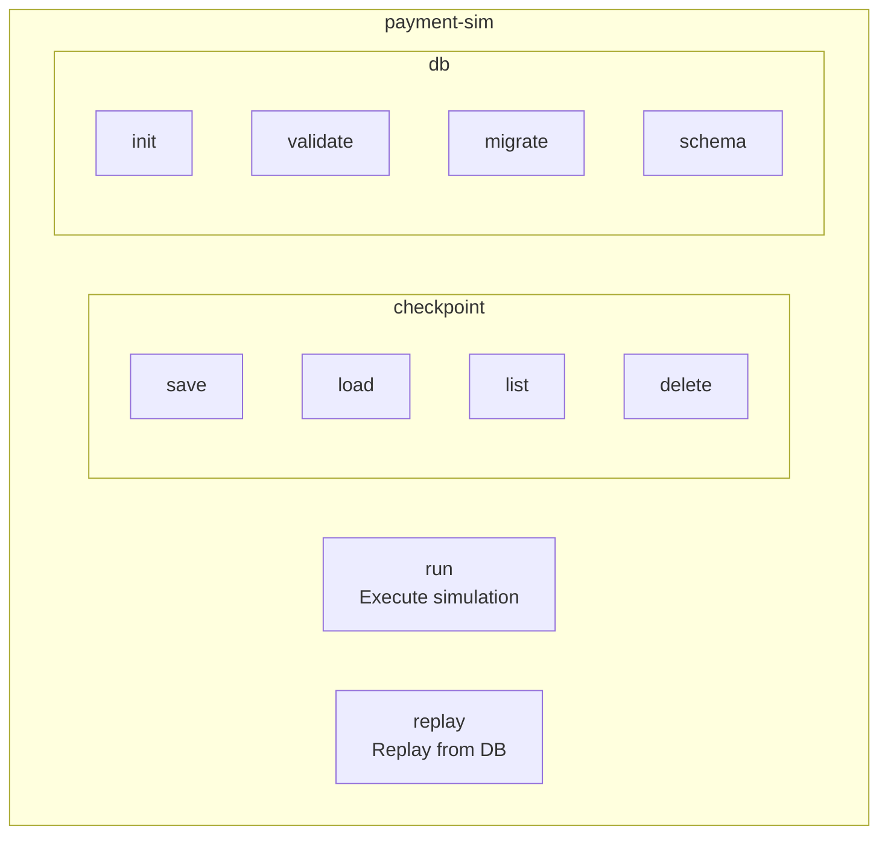
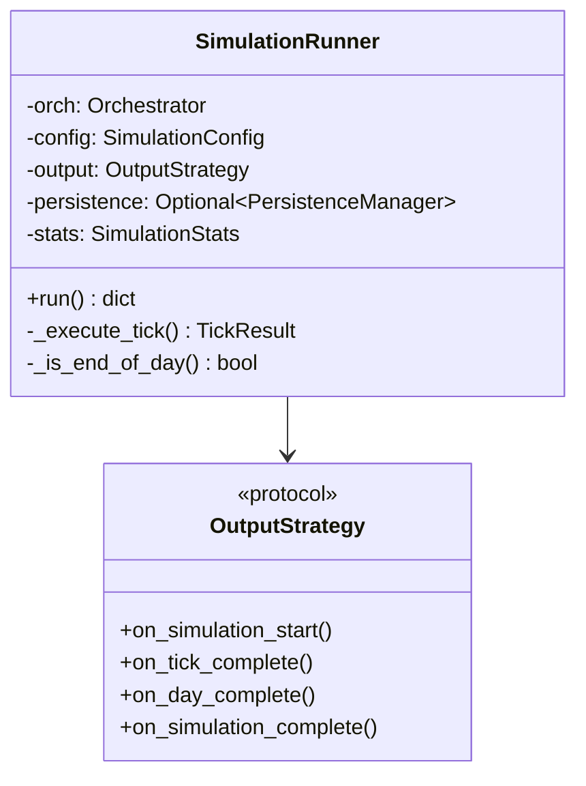
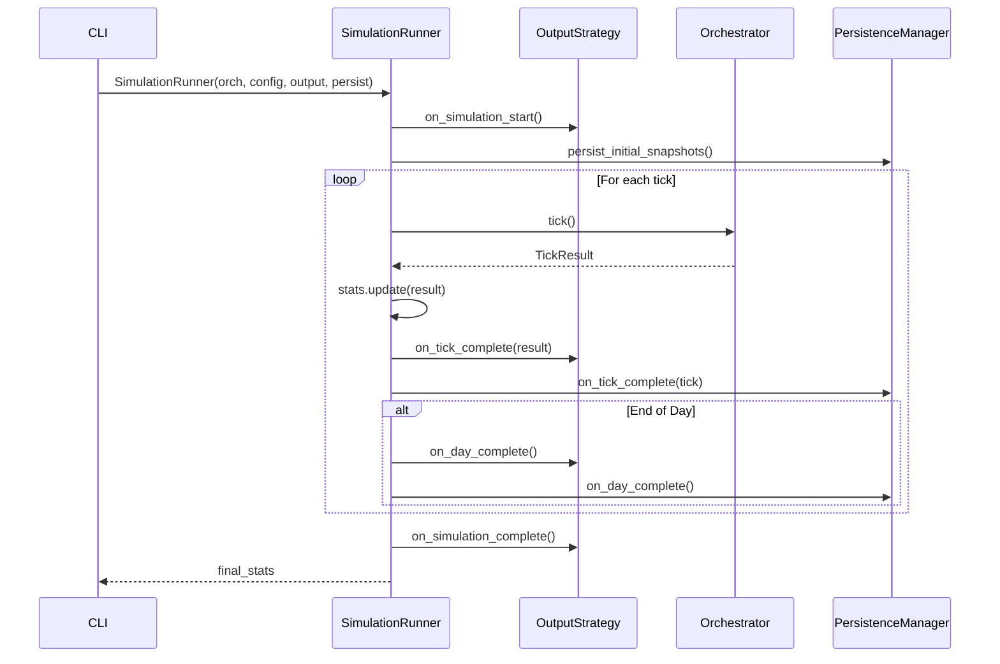
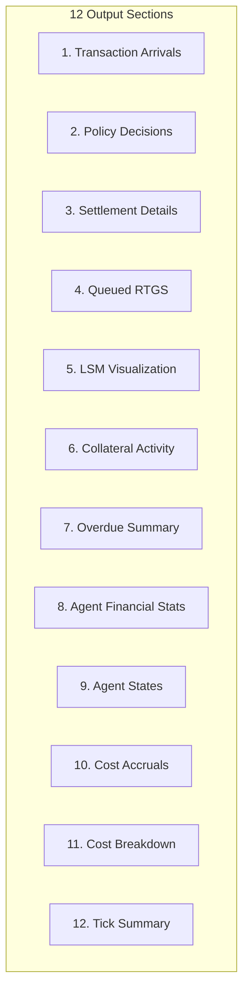
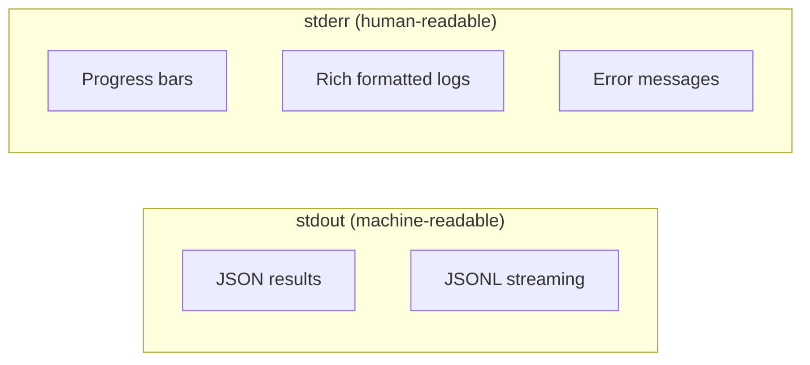
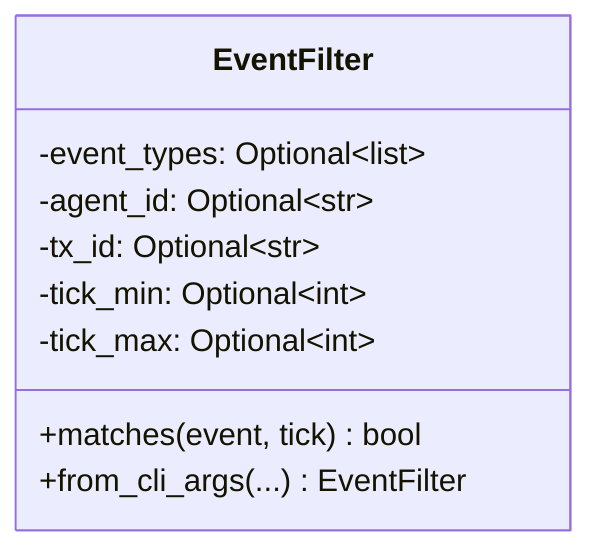
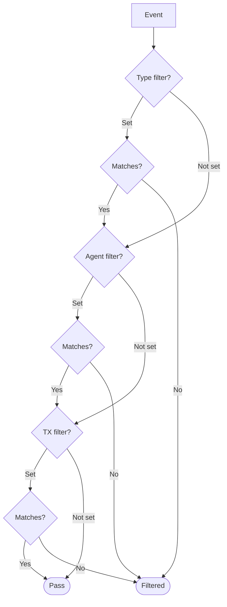
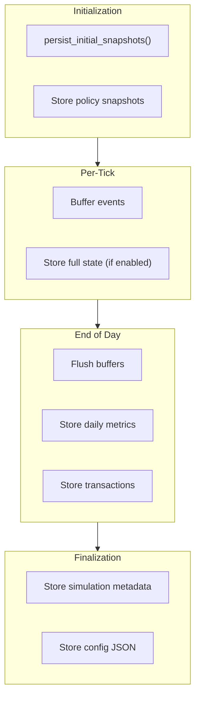
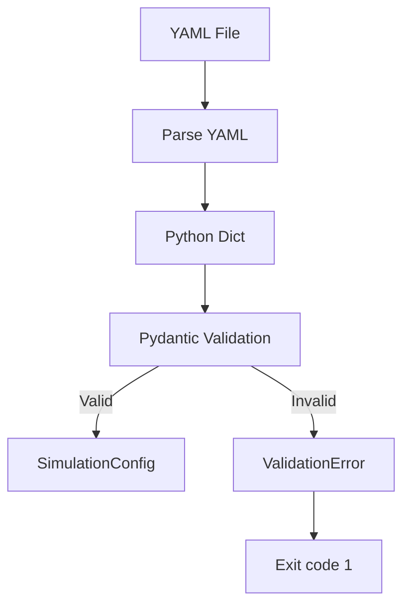

# CLI Architecture

**Version**: 1.0
**Last Updated**: 2025-11-28

---

## Overview

The CLI provides command-line access to SimCash via the `payment-sim` command, built with Typer for type-safe argument handling.

---

## Command Structure



---

## Commands

### `run` Command

Execute simulation from YAML configuration.

```bash
payment-sim run config.yaml [OPTIONS]
```

**Options**:

| Option | Type | Default | Description |
|--------|------|---------|-------------|
| `--mode` | str | normal | Output mode: normal, verbose, stream, event_stream |
| `--persist` | Path | - | Persist to database file |
| `--full-replay` | bool | false | Store full replay data |
| `--num-days` | int | 1 | Override simulation days |
| `--verbose` | bool | false | Shortcut for --mode verbose |
| `--filter-event-type` | str | - | Filter events by type |
| `--filter-agent` | str | - | Filter by agent ID |
| `--filter-tx` | str | - | Filter by transaction ID |

**Example**:
```bash
# Basic run
payment-sim run config.yaml

# Verbose with persistence
payment-sim run config.yaml --verbose --persist output.db

# Filtered event stream
payment-sim run config.yaml --mode event_stream --filter-event-type Settlement
```

### `replay` Command

Replay simulation from database.

```bash
payment-sim replay db.db [OPTIONS]
```

**Options**:

| Option | Type | Default | Description |
|--------|------|---------|-------------|
| `--tick-start` | int | 0 | Start tick |
| `--tick-end` | int | None | End tick (inclusive) |
| `--verbose` | bool | true | Verbose output |
| `--filter-event-type` | str | - | Filter events |

**Example**:
```bash
# Full replay
payment-sim replay simulation.db --verbose

# Specific tick range
payment-sim replay simulation.db --tick-start 50 --tick-end 100
```

### `checkpoint` Commands

```bash
# Save checkpoint
payment-sim checkpoint save db.db sim-123 50 --description "Before EOD"

# Load checkpoint
payment-sim checkpoint load checkpoint-abc-123

# List checkpoints
payment-sim checkpoint list sim-123

# Delete checkpoint
payment-sim checkpoint delete checkpoint-abc-123
```

### `db` Commands

```bash
# Initialize schema
payment-sim db init simulation.db

# Validate schema
payment-sim db validate simulation.db

# Apply migrations
payment-sim db migrate simulation.db

# Print DDL
payment-sim db schema
```

---

## Execution Engine

### Template Method Pattern



### Execution Flow



---

## Output Strategies

### Strategy Selection

| Mode | Strategy | Output |
|------|----------|--------|
| `normal` | QuietOutputStrategy | Final JSON only |
| `verbose` | VerboseModeOutput | Rich formatted logs |
| `stream` | StreamModeOutput | Per-tick JSONL |
| `event_stream` | EventStreamOutput | Per-event JSONL |

### Verbose Output Sections



---

## Output Conventions

### stdout vs stderr



**Rule**: Data goes to stdout, logs go to stderr.

```python
# output.py
def output_json(data):
    """Machine-readable JSON to stdout."""
    print(json.dumps(data, indent=2))

def log_info(msg):
    """Human-readable log to stderr."""
    console.print(f"[blue]{msg}[/blue]")  # console uses stderr
```

### Example Output

```bash
# Normal mode - JSON to stdout
$ payment-sim run config.yaml
{
  "simulation_id": "sim-abc-123",
  "total_ticks": 100,
  "total_settlements": 450,
  "final_settlement_rate": 0.95
}

# Verbose mode - Rich logs to stderr, JSON to stdout
$ payment-sim run config.yaml --verbose
[stderr] ═══ Tick 1 ═══
[stderr] Arrivals: BANK_A → BANK_B: $1,000.00
[stderr] Settlements: 1 immediate, 0 from queue
[stdout] {"simulation_id": "...", ...}
```

---

## Event Filtering



### Filter Application



### CLI Usage

```bash
# Filter by event type (comma-separated)
payment-sim run config.yaml --mode event_stream \
    --filter-event-type "Settlement,LsmBilateralOffset"

# Filter by agent
payment-sim run config.yaml --verbose --filter-agent BANK_A

# Filter by transaction
payment-sim replay db.db --filter-tx tx-abc-123

# Combined filters (AND logic)
payment-sim run config.yaml --mode event_stream \
    --filter-event-type Settlement \
    --filter-agent BANK_A
```

---

## Persistence Integration

### Persistence Manager



### Persistence Options

| Option | Effect |
|--------|--------|
| `--persist db.db` | Store events, metrics, transactions |
| `--full-replay` | Additionally store full tick state |

---

## Error Handling

### Exit Codes

| Code | Meaning |
|------|---------|
| 0 | Success |
| 1 | Configuration error |
| 2 | Simulation error |
| 3 | Database error |

### Error Output

```python
try:
    result = runner.run()
except ConfigurationError as e:
    log_error(f"Configuration error: {e}")
    raise typer.Exit(code=1)
except SimulationError as e:
    log_error(f"Simulation error: {e}")
    raise typer.Exit(code=2)
```

---

## Configuration

### Environment Variables

| Variable | Purpose |
|----------|---------|
| `SIMCASH_LOG_LEVEL` | Logging verbosity |
| `SIMCASH_DB_PATH` | Default database path |

### Config File Validation



---

## Related Documents

- [03-python-api-layer.md](./03-python-api-layer.md) - CLI implementation
- [09-persistence-layer.md](./09-persistence-layer.md) - Database operations
- [appendix-c-configuration-reference.md](./appendix-c-configuration-reference.md) - Config schema

---

*Next: [appendix-a-module-reference.md](./appendix-a-module-reference.md) - Complete module listing*
