# Tick Loop Anatomy

**Version**: 1.0
**Last Updated**: 2025-11-28

---

## Overview

The tick loop is the heart of SimCash, executing a 9-step process each tick to advance the simulation. This document provides a detailed breakdown of each step.

---

## High-Level Flow


> **Note**: Step 5.7 (Apply Deferred Credits) only executes when `deferred_crediting: true` is configured.

---

## Step 1: Advance Time


**Source**: `backend/src/orchestrator/engine.rs`

```rust
fn tick(&mut self) -> Result<TickResult, SimulationError> {
    // Step 1: Advance time
    self.time.advance_tick();
    let tick = self.time.current_tick();
    let day = self.time.current_day();
    // ...
}
```

**State Changes**:
- `TimeManager.current_tick` incremented

**Events Generated**: None

---

## Step 2: Check End of Day


**Source**: `backend/src/orchestrator/engine.rs`

```rust
if self.time.is_last_tick_of_day() {
    self.process_end_of_day(tick)?;
}
```

**EOD Processing**:
1. Attempt final settlement of all Queue 2 transactions
2. Apply EOD penalties to unsettled transactions
3. Reset daily metrics and budgets
4. Emit `EndOfDay` event

**State Changes**:
- Unsettled transactions marked with EOD penalty
- Agent daily counters reset
- Agent budgets reset to max

**Events Generated**: `EndOfDay`

---

## Step 3: Generate Arrivals


**Source**: `backend/src/arrivals/mod.rs`

**Sampling Process**:
1. **Count**: Poisson(λ = rate_per_tick)
2. **Amount**: Per distribution type (Normal, LogNormal, Uniform, Exponential)
3. **Receiver**: Weighted random from counterparty_weights
4. **Deadline**: arrival_tick + random(deadline_range)
5. **Priority**: Per priority_distribution (Fixed, Categorical, Uniform)

**State Changes**:
- New transactions created
- Transactions added to sender's Queue 1
- Event log updated

**Events Generated**: `Arrival` (per transaction)

---

## Step 4: Entry Disposition Offsetting


**Source**: `backend/src/settlement/lsm.rs`

**Purpose**: Check for bilateral offset opportunity at the moment of RTGS submission, before queueing.

**State Changes**:
- Transactions may be settled immediately
- Queue 2 transactions may be removed

**Events Generated**: `EntryDispositionOffset` (if offset occurs)

---

## Step 5: Policy Evaluation

```mermaid
flowchart TB
    subgraph ForAgent["For Each Agent"]
        GetQueue["Get Queue 1 contents"]
        GetQueue --> Order["Order by Queue1Ordering"]
        Order --> EvalBank["Evaluate bank_tree"]
        EvalBank --> ApplyBank["Apply bank actions<br/>(SetBudget, SetState)"]
        ApplyBank --> EvalColl["Evaluate collateral_tree"]
        EvalColl --> ApplyColl["Apply collateral actions"]
        ApplyColl --> ForTx["For each transaction"]
    end

    subgraph ForTx["Per-Transaction"]
        EvalPayment["Evaluate payment_tree"]
        EvalPayment --> Decision{"Decision?"}
        Decision -->|Submit| DoSubmit["Submit to RTGS"]
        Decision -->|Hold| DoHold["Keep in Queue 1"]
        Decision -->|Split| DoSplit["Create children"]
        Decision -->|Reprioritize| DoPrio["Change priority"]
    end

    DoSubmit --> NextTx["Next transaction"]
    DoHold --> NextTx
    DoSplit --> NextTx
    DoPrio --> NextTx

    NextTx --> MoreTx{"More?"}
    MoreTx -->|Yes| ForTx
    MoreTx -->|No| NextAgent["Next agent"]
```



**Source**: `backend/src/policy/tree/executor.rs`

**Policy Trees Evaluated**:
1. `bank_tree` - Bank-level decisions (budget, state)
2. `strategic_collateral_tree` - Proactive collateral management
3. `payment_tree` - Per-transaction release decisions
4. `end_of_tick_collateral_tree` - Reactive collateral (Step 8)

**Queue Ordering**:
- `FIFO`: Process in arrival order
- `PriorityDeadline`: Sort by priority (desc), deadline (asc), arrival (FIFO)

**State Changes**:
- Transactions moved from Q1 to Q2
- Split transactions created
- Agent budgets consumed
- Agent state registers updated
- Collateral posted/withdrawn

**Events Generated**:
- `PolicySubmit` (release)
- `PolicyHold` (hold)
- `PolicyDrop` (drop)
- `PolicySplit` (split)
- `TransactionReprioritized` (reprioritize)
- `CollateralPost` / `CollateralWithdraw`
- `BankBudgetSet`
- `StateRegisterSet`

---

## Step 6: RTGS Processing


**Source**: `backend/src/settlement/rtgs.rs`

**Process**:
1. Iterate through Queue 2 in FIFO order
2. Attempt settlement for each transaction
3. Remove settled transactions
4. Leave unsettled transactions in queue

**State Changes**:
- Agent balances updated (settled transactions)
- Transactions marked settled
- Queue 2 updated

**Events Generated**: `Queue2LiquidityRelease` (per settlement)

---

## Step 7: LSM Optimization


**Source**: `backend/src/settlement/lsm.rs`

**Algorithm Sequence**:
1. **Algorithm 1 (FIFO)**: Retry queue in order
2. **Algorithm 2 (Bilateral)**: Find A↔B pairs, net offset
3. **Algorithm 3 (Multilateral)**: Detect cycles, settle with minimal liquidity

**State Changes**:
- Transactions settled via netting
- Agent balances updated
- Queue 2 reduced

**Events Generated**:
- `AlgorithmExecution` (per algorithm)
- `LsmBilateralOffset` (per bilateral)
- `LsmCycleSettlement` (per cycle)
- `BilateralLimitExceeded` / `MultilateralLimitExceeded` (if blocked)

---

## Step 5.7: Apply Deferred Credits (Optional)

> **Conditional**: Only executes when `deferred_crediting: true`


**Source**: `backend/src/orchestrator/engine.rs` (STEP 5.7)

**Purpose**: In deferred crediting mode (Castro-compatible), credits from settlements are accumulated during the tick and applied here, before cost accrual. This prevents "within-tick recycling" of liquidity.

**Process**:
1. Check if deferred credits were accumulated
2. Iterate agents in sorted order (deterministic)
3. Credit each agent's balance with accumulated amount
4. Emit `DeferredCreditApplied` event per agent

**State Changes**:
- Agent balances credited
- Deferred credits accumulator cleared

**Events Generated**: `DeferredCreditApplied` (per receiving agent)

**Example Event**:
```json
{
  "event_type": "DeferredCreditApplied",
  "tick": 42,
  "agent_id": "BANK_B",
  "amount": 150000,
  "source_transactions": ["tx-001", "tx-002"]
}
```

---

## Step 8: Cost Accrual


**Source**: `backend/src/orchestrator/engine.rs`

**Cost Types**:

| Cost | Formula | When Applied |
|------|---------|--------------|
| Liquidity | `overdraft_bps × max(0, -balance) / ticks_per_day` | Per tick, per agent |
| Collateral | `collateral_bps × posted_collateral / ticks_per_day` | Per tick, per agent |
| Delay | `delay_per_tick × (tick - arrival_tick)` | Per tick, per Q1 transaction |
| Deadline | `deadline_penalty` (one-time) | When transaction goes overdue |
| Overdue Delay | `delay_per_tick × overdue_multiplier` | Per tick while overdue |

**State Changes**:
- Agent accumulated costs updated
- Transactions marked overdue
- Collateral timers processed

**Events Generated**:
- `CostAccrual`
- `TransactionWentOverdue`
- `CollateralTimerWithdrawn` / `CollateralTimerBlocked`

---

## Step 9: Event Logging & Return


**Source**: `backend/src/orchestrator/engine.rs`

```rust
Ok(TickResult {
    tick,
    day,
    num_arrivals: arrivals_count,
    num_settlements: settlements_count,
    queue2_size: self.state.queue_size(),
    total_costs: tick_costs,
    events: self.state.get_event_log().get_events_at_tick(tick).clone(),
})
```

---

## Complete Tick Timeline


---

## State Mutation Summary

| Step | State Mutated |
|------|--------------|
| 1. Advance Time | TimeManager.current_tick |
| 2. EOD | Daily counters, budgets, penalties |
| 3. Arrivals | New transactions, Q1 queues |
| 4. Entry Disposition | Q2 queue, balances |
| 5. Policy | Q1→Q2, splits, budgets, collateral, state registers |
| 6. RTGS | Balances (debits), transaction status, Q2 |
| 7. LSM | Balances (debits), transaction status, Q2 |
| 5.7. Deferred Credits | Balances (credits), deferred accumulator cleared |
| 8. Costs | Accumulated costs, overdue status |
| 9. Return | None (read-only) |

> **Note**: In immediate crediting mode (default), steps 6 and 7 also credit receiver balances. In deferred mode, credits are accumulated and applied in step 5.7.

---

## Event Generation Summary

| Step | Events Generated |
|------|-----------------|
| 1 | None |
| 2 | EndOfDay |
| 3 | Arrival (per transaction) |
| 4 | EntryDispositionOffset |
| 5 | PolicySubmit, PolicyHold, PolicySplit, CollateralPost, etc. |
| 6 | Queue2LiquidityRelease, RtgsImmediateSettlement |
| 7 | AlgorithmExecution, LsmBilateralOffset, LsmCycleSettlement |
| 5.7 | DeferredCreditApplied (if deferred_crediting enabled) |
| 8 | CostAccrual, TransactionWentOverdue |
| 9 | None |

---

## Related Documents

- [02-rust-core-engine.md](./02-rust-core-engine.md) - Orchestrator implementation
- [06-settlement-engines.md](./06-settlement-engines.md) - Settlement algorithms
- [07-policy-system.md](./07-policy-system.md) - Policy evaluation
- [12-cost-model.md](./12-cost-model.md) - Cost calculations

---

*Next: [12-cost-model.md](./12-cost-model.md) - Cost calculations*
