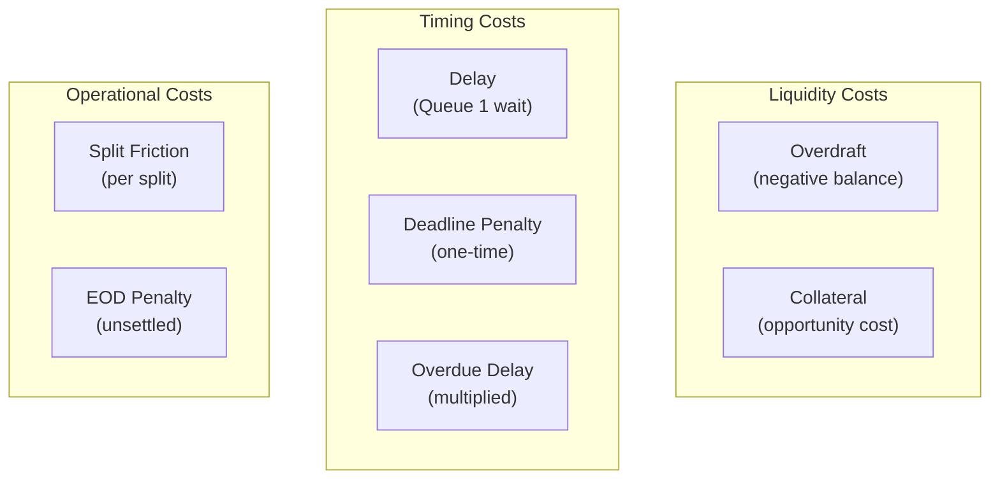
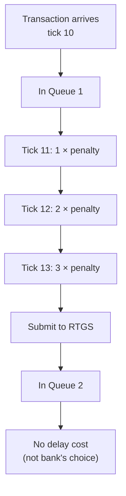
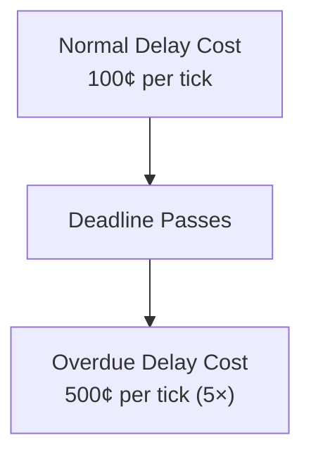
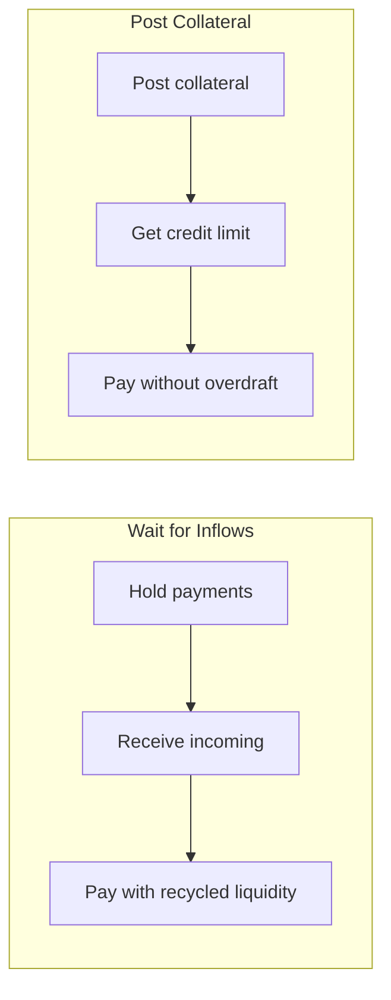
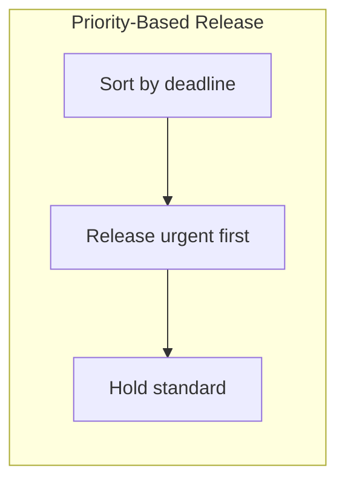
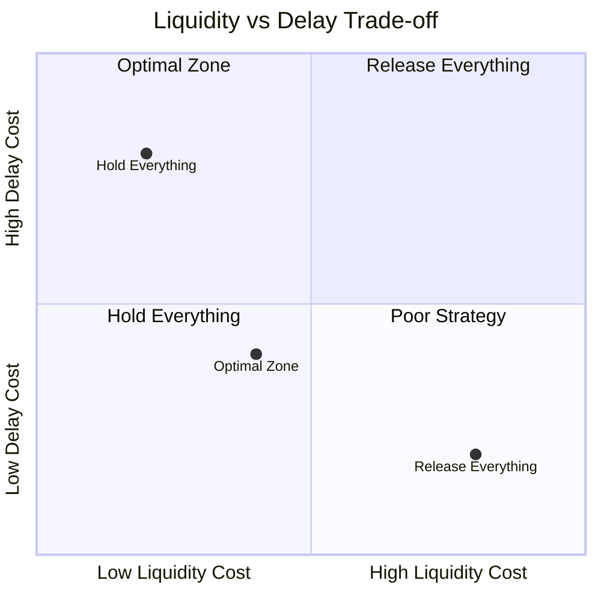

# Cost Model

**Version**: 1.0
**Last Updated**: 2025-11-28

---

## Overview

SimCash tracks five cost types that incentivize efficient payment timing and liquidity management. All costs are represented as `i64` in cents.

---

## Cost Types



---

## 1. Liquidity Costs

### Overdraft Cost

Charged per tick when balance is negative.

**Formula**:
```
overdraft_cost = overdraft_cost_bps × max(0, -balance) × (1 / ticks_per_day) / 10000
```

**Parameters**:
- `overdraft_cost_bps`: Annualized rate in basis points (e.g., 10 = 0.10%)
- `balance`: Current settlement balance (negative means overdraft)
- `ticks_per_day`: Ticks per business day

**Example**:
```
balance = -$100,000 (negative = overdraft)
overdraft_cost_bps = 10 (0.10% annualized)
ticks_per_day = 100

cost_per_tick = 10 × 100000 × (1/100) / 10000
             = 10 × 100000 × 0.01 / 10000
             = 10 cents per tick
```


### Collateral Cost

Charged per tick for posted collateral (opportunity cost).

**Formula**:
```
collateral_cost = collateral_cost_bps × posted_collateral × (1 / ticks_per_day) / 10000
```

**Parameters**:
- `collateral_cost_bps`: Annualized rate in basis points
- `posted_collateral`: Amount of collateral posted

**Example**:
```
posted_collateral = $500,000
collateral_cost_bps = 5 (0.05% annualized)
ticks_per_day = 100

cost_per_tick = 5 × 500000 × (1/100) / 10000
             = 25 cents per tick
```

---

## 2. Timing Costs

### Delay Cost (Queue 1)

Charged per tick while transaction remains in Queue 1.

**Formula**:
```
delay_cost = delay_penalty_per_tick × (current_tick - arrival_tick)
```

**Key Properties**:
- Only applies to Queue 1 (internal bank queue)
- Does NOT apply to Queue 2 (liquidity wait is not bank's choice)
- Accumulates each tick



### Deadline Penalty

One-time penalty when transaction exceeds deadline.

**Formula**:
```
if current_tick > deadline_tick:
    penalty = deadline_penalty  (one-time)
```

**Example**:
```
deadline_tick = 50
current_tick = 51
deadline_penalty = 10000 (=$100)

// At tick 51, transaction marked overdue
// One-time penalty of $100 applied
```

### Overdue Delay Cost

After deadline, delay cost is multiplied.

**Formula**:
```
overdue_delay_cost = delay_penalty_per_tick × overdue_delay_multiplier
```

**Default**: `overdue_delay_multiplier = 5.0`



---

## 3. Operational Costs

### Split Friction Cost

Charged immediately when transaction is split.

**Formula**:
```
split_cost = split_friction_cost × (num_splits - 1)
```

**Example**:
```
Original: $100,000 payment
Split into: 3 parts ($40k, $30k, $30k)
split_friction_cost = 1000 (=$10)

cost = 1000 × (3 - 1) = 2000 (=$20)
```

### EOD Unsettled Penalty

Large penalty for transactions unsettled at end of day.

**Formula**:
```
if unsettled at EOD:
    penalty = eod_unsettled_penalty × remaining_amount / original_amount
```

**Purpose**: Strongly incentivize settlement within business day.

---

## Cost Configuration

### YAML Configuration

```yaml
costs:
  overdraft_cost_bps: 10.0           # 0.10% annualized
  collateral_cost_per_tick_bps: 5.0  # 0.05% annualized
  delay_penalty_per_tick: 100        # $1 per tick
  overdue_delay_multiplier: 5.0      # 5× after deadline
  deadline_penalty: 10000            # $100 one-time
  split_friction_cost: 1000          # $10 per split
  eod_unsettled_penalty: 100000      # $1000 per unsettled tx
```

### Rust Structure

**Source**: `backend/src/orchestrator/engine.rs`

```rust
pub struct CostRates {
    pub overdraft_cost_bps: f64,
    pub collateral_cost_per_tick_bps: f64,
    pub delay_penalty_per_tick: i64,
    pub overdue_delay_multiplier: f64,
    pub deadline_penalty: i64,
    pub split_friction_cost: i64,
    pub eod_unsettled_penalty: i64,
}
```

---

## Cost Accrual Timeline

```mermaid
gantt
    title Cost Accrual During Tick
    dateFormat X
    axisFormat %s

    section Agent Costs
    Overdraft Check    :a1, 0, 2
    Collateral Check   :a2, 2, 4

    section Transaction Costs
    Delay Costs (Q1)   :t1, 4, 8
    Deadline Check     :t2, 8, 10
    Overdue Costs      :t3, 10, 12
```



---

## Cost Accumulation

### Per-Agent Tracking

```rust
pub struct CostAccumulator {
    pub liquidity_cost: i64,
    pub collateral_cost: i64,
    pub delay_cost: i64,
    pub deadline_penalty: i64,
    pub split_cost: i64,
    pub eod_penalty: i64,
}

impl CostAccumulator {
    pub fn total(&self) -> i64 {
        self.liquidity_cost
            + self.collateral_cost
            + self.delay_cost
            + self.deadline_penalty
            + self.split_cost
            + self.eod_penalty
    }
}
```

### Cost Breakdown Query

```python
costs = orch.get_agent_accumulated_costs("BANK_A")
# Returns:
{
    "liquidity_cost": 1500,
    "collateral_cost": 2500,
    "delay_cost": 5000,
    "deadline_penalty": 10000,
    "split_cost": 2000,
    "eod_penalty": 0,
    "total": 21000
}
```

---

## Cost Events

| Event | When | Fields |
|-------|------|--------|
| `CostAccrual` | Each cost charge | agent_id, cost_type, amount, tx_id |
| `TransactionWentOverdue` | Deadline passed | tx_id, deadline_tick, penalty |
| `OverdueTransactionSettled` | Late settlement | tx_id, ticks_overdue, total_cost |

---

## Cost Optimization Strategies

### Minimize Liquidity Cost



### Minimize Delay Cost



### Trade-off Analysis



---

## Example Scenario

### Setup

```yaml
costs:
  overdraft_cost_bps: 10
  delay_penalty_per_tick: 100
  deadline_penalty: 10000

agents:
  - id: BANK_A
    opening_balance: 50000  # $500
```

### Timeline

| Tick | Event | Balance | Cost |
|------|-------|---------|------|
| 10 | Arrival: $1000 payment | $500 | 0 |
| 11 | Hold in Q1 | $500 | $1 delay |
| 12 | Hold in Q1 | $500 | $2 delay |
| 13 | Submit to RTGS (insufficient) | $500 | $3 delay |
| 14 | In Q2 (waiting) | $500 | 0 (Q2) |
| 15 | Receive $600 inflow | $1100 | 0 |
| 16 | Settle from Q2 | $100 | 0 |

**Total Cost**: $6 delay

### If Released at Tick 11

| Tick | Event | Balance | Cost |
|------|-------|---------|------|
| 10 | Arrival: $1000 payment | $500 | 0 |
| 11 | Submit (overdraft) | -$500 | 0 |
| 12 | Overdraft | -$500 | ~0.5¢ |
| 13 | Overdraft | -$500 | ~0.5¢ |
| 14 | Overdraft | -$500 | ~0.5¢ |
| 15 | Receive $600 | $100 | 0 |

**Total Cost**: ~1.5¢ overdraft (much less than $6 delay!)

---

## Related Documents

- [07-policy-system.md](./07-policy-system.md) - Policy optimization
- [11-tick-loop-anatomy.md](./11-tick-loop-anatomy.md) - Cost accrual timing
- [appendix-c-configuration-reference.md](./appendix-c-configuration-reference.md) - Cost config

---

*Next: [appendix-a-module-reference.md](./appendix-a-module-reference.md) - Complete module listing*
