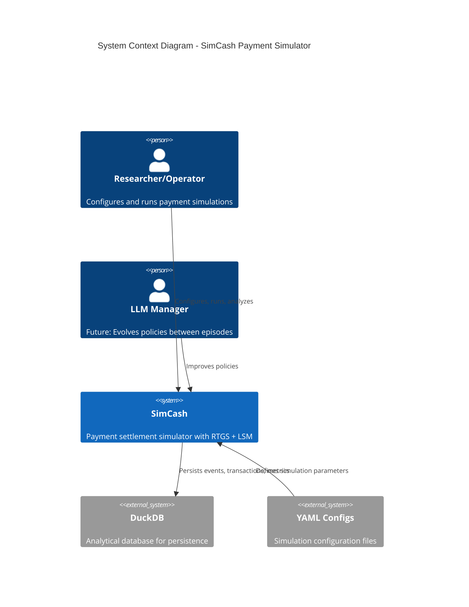
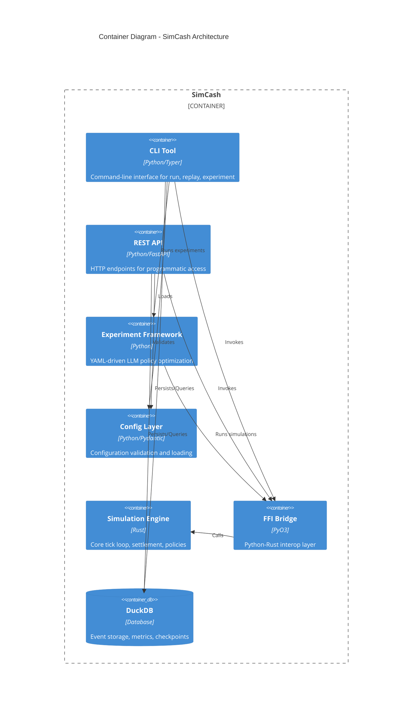
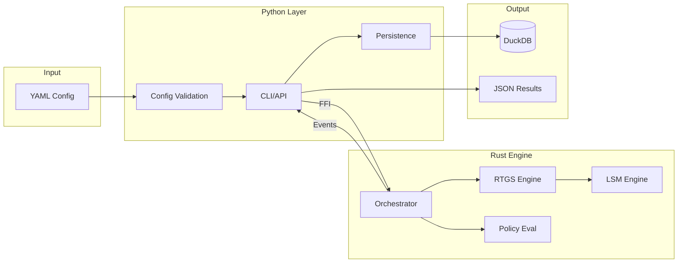

# Architecture Reference

> Technical architecture documentation for the SimCash payment simulator

SimCash is a high-performance payment simulator modeling real-time gross settlement (RTGS) between banks. It's a hybrid Rust-Python system where performance-critical simulation code lives in Rust, while Python provides developer ergonomics for configuration, orchestration, and data analysis.

## Documentation

| Document | Description |
|----------|-------------|
| [01-system-overview](01-system-overview.md) | High-level architecture, design philosophy, invariants |
| [02-rust-core-engine](02-rust-core-engine.md) | Rust backend modules, data structures, algorithms |
| [03-python-api-layer](03-python-api-layer.md) | Python layer: CLI, API, execution engine |
| [04-ffi-boundary](04-ffi-boundary.md) | PyO3 integration patterns, type conversion |
| [05-domain-models](05-domain-models.md) | Core data structures: Agent, Transaction, State |
| [06-settlement-engines](06-settlement-engines.md) | RTGS, LSM, cycle detection algorithms |
| [07-policy-system](07-policy-system.md) | Decision trees, DSL, policy evaluation |
| [08-event-system](08-event-system.md) | 50+ event types and lifecycle |
| [09-persistence-layer](09-persistence-layer.md) | DuckDB storage, StateProvider, replay |
| [10-cli-architecture](10-cli-architecture.md) | CLI commands and execution patterns |
| [11-tick-loop-anatomy](11-tick-loop-anatomy.md) | 9-step tick loop execution flow |
| [12-cost-model](12-cost-model.md) | 5 cost types and calculation formulas |
| [appendix-a-module-reference](appendix-a-module-reference.md) | Complete file and module listing |
| [appendix-b-event-catalog](appendix-b-event-catalog.md) | All event types reference |
| [appendix-c-configuration-reference](appendix-c-configuration-reference.md) | Configuration schema reference |

## System Context

## Container Architecture

## Recommended Reading Order

### For New Contributors

1. [01-system-overview](01-system-overview.md) - Understand design philosophy
2. [05-domain-models](05-domain-models.md) - Learn core data structures
3. [11-tick-loop-anatomy](11-tick-loop-anatomy.md) - See how simulation executes
4. Component-specific docs based on your focus area

### For Backend (Rust) Work

1. [02-rust-core-engine](02-rust-core-engine.md)
2. [06-settlement-engines](06-settlement-engines.md)
3. [07-policy-system](07-policy-system.md)
4. [04-ffi-boundary](04-ffi-boundary.md)

### For Frontend (Python) Work

1. [03-python-api-layer](03-python-api-layer.md)
2. [10-cli-architecture](10-cli-architecture.md)
3. [09-persistence-layer](09-persistence-layer.md)
4. [04-ffi-boundary](04-ffi-boundary.md)

## Quick Reference

### Key Statistics

| Metric | Value |
|--------|-------|
| Rust Lines of Code | 19,445 |
| Rust Source Files | 31 |
| Python Source Files | 45+ |
| Event Types | 50+ |
| Test Count | 500+ |

### Critical Invariants

1. **Money is always i64** - Integer cents, never floats
2. **Determinism** - Same seed = identical results
3. **FFI boundary minimal** - Simple types only
4. **Balance conservation** - Total system balance unchanged by settlement

### Data Flow

## Glossary

| Term | Definition |
|------|------------|
| **Tick** | Smallest discrete time unit (e.g., ~10 real-world minutes) |
| **Day** | Collection of ticks representing one business day |
| **Agent** | Participating bank with settlement account |
| **Queue 1** | Internal bank queue - strategic, policy-controlled |
| **Queue 2** | RTGS central queue - mechanical, liquidity-constrained |
| **RTGS** | Real-Time Gross Settlement |
| **LSM** | Liquidity-Saving Mechanism (bilateral/multilateral netting) |
| **FFI** | Foreign Function Interface (Python-Rust via PyO3) |
| **StateProvider** | Abstraction for data access (live vs replay) |
| **Replay Identity** | Guarantee that `run` and `replay` produce identical output |

## Related Documentation

- [Experiment Framework](../experiments/index.md) - YAML-driven LLM policy optimization
- [CLI Reference](../cli/index.md) - Command-line interface
- [LLM Module](../llm/index.md) - LLM client protocols and configuration
- [Policy Reference](../policy/index.md) - Policy DSL documentation
- [Scenario Configuration](../scenario/index.md) - YAML configuration format

---

*Last updated: 2025-12-11*
