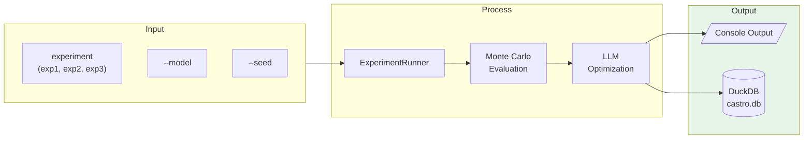
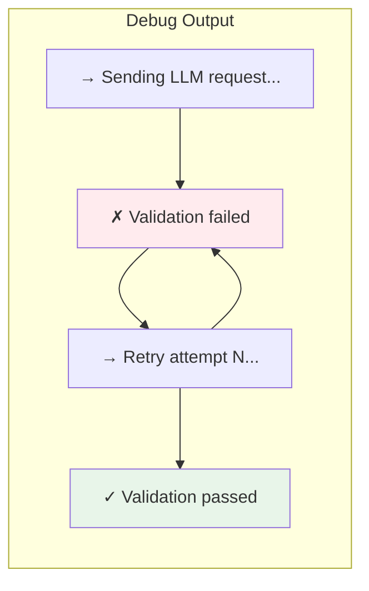
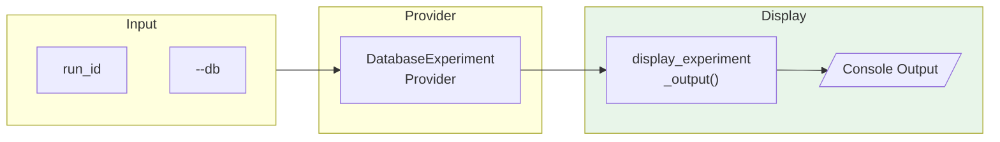
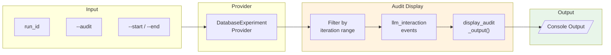
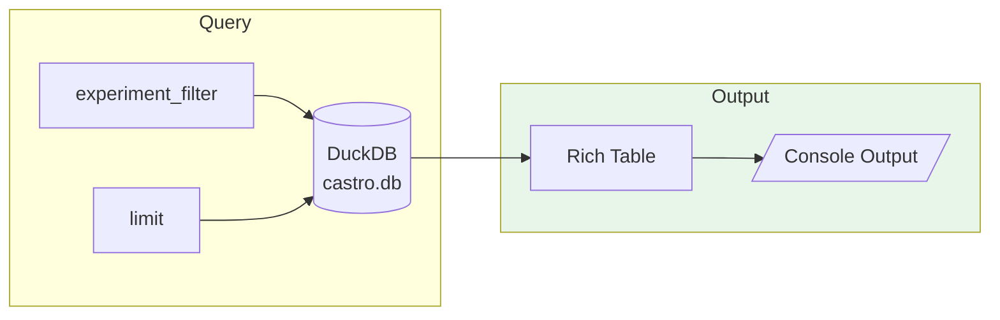

# Castro CLI Commands

**Version**: 1.0
**Last Updated**: 2025-12-09

---

## Overview

Castro provides a command-line interface for running experiments, viewing results, and replaying experiment output. All commands use the `castro` prefix.

---

## Quick Reference

| Command | Description |
|---------|-------------|
| `castro run <exp>` | Run an experiment |
| `castro replay <run_id>` | Replay experiment output |
| `castro results` | List experiment runs |
| `castro list` | List available experiments |
| `castro info <exp>` | Show experiment configuration |
| `castro validate <exp>` | Validate experiment configuration |

---

## Commands

### run

Run a Castro experiment.

```bash
castro run <experiment> [OPTIONS]
```



#### Arguments

| Argument | Description |
|----------|-------------|
| `experiment` | Experiment key: `exp1`, `exp2`, or `exp3` |

#### Options

| Option | Short | Default | Description |
|--------|-------|---------|-------------|
| `--model` | `-m` | `anthropic:claude-sonnet-4-5` | LLM model in provider:model format |
| `--thinking-budget` | `-t` | None | Token budget for Anthropic extended thinking |
| `--reasoning-effort` | `-r` | None | OpenAI reasoning effort (low/medium/high) |
| `--max-iter` | `-i` | 25 | Maximum optimization iterations |
| `--output` | `-o` | `results/` | Output directory for results |
| `--seed` | `-s` | 42 | Master seed for determinism |
| `--verbose` | `-v` | False | Enable all verbose output |
| `--verbose-policy` | | False | Show policy parameter changes |
| `--verbose-monte-carlo` | | False | Show per-seed Monte Carlo results |
| `--verbose-llm` | | False | Show LLM call metadata |
| `--verbose-rejections` | | False | Show rejection analysis |
| `--debug` | `-d` | False | Show debug output (validation errors, LLM retries) |
| `--quiet` | `-q` | False | Suppress verbose output |

#### Examples

```bash
# Run default experiment with Claude
castro run exp1

# Run with OpenAI and high reasoning effort
castro run exp1 --model openai:gpt-5.1 --reasoning-effort high

# Run with Anthropic extended thinking
castro run exp1 --model anthropic:claude-sonnet-4-5 --thinking-budget 8000

# Run with all verbose output
castro run exp1 --verbose

# Run with specific verbose modes
castro run exp1 --verbose-policy --verbose-monte-carlo

# Run with custom seed
castro run exp1 --seed 12345

# Run with debug output to diagnose stalls
castro run exp1 --debug

# Combine debug with verbose for full visibility
castro run exp1 --verbose --debug
```

#### Debug Mode

The `--debug` flag shows real-time progress during LLM optimization. This is useful for diagnosing when the simulation appears to stall:



**Debug output shows:**

| Event | Example Output |
|-------|---------------|
| LLM request starts | `→ Sending LLM request for BANK_A...` |
| Validation fails | `✗ Validation failed (attempt 1/3)` |
| Validation errors | `- Parameter 'urgency_threshold' value 25 exceeds max 20` |
| Retry starts | `→ Retry attempt 2 for BANK_A...` |
| LLM error | `✗ LLM error (attempt 1/3): Connection timeout` |
| Validation succeeds | `✓ Validation passed on attempt 2` |
| All retries exhausted | `✗ All 3 attempts exhausted for BANK_A` |

**Example debug output:**

```
Iteration 1
  Total cost: $2665.39
  ...
  Optimizing BANK_A...
    → Sending LLM request for BANK_A...
    ✗ Validation failed (attempt 1/3)
      - Parameter 'urgency_threshold' value 25 exceeds max 20
    → Retry attempt 2 for BANK_A...
    ✓ Validation passed on attempt 2
    Policy improved: $150.00 → $140.00
```

**Use cases:**

- **Diagnosing stalls**: If you see "Sending LLM request" with no follow-up, the LLM is taking a long time
- **Understanding retries**: See exactly what validation errors are causing retries
- **Debugging validation**: Identify which constraints are being violated

#### Output

```
Running exp1...
  Run ID: exp1-20251209-143022-a1b2c3

Starting 2-Agent Basic
  Description: Two banks, basic policy optimization
  Max iterations: 25
  Monte Carlo samples: 5
  LLM model: anthropic:claude-sonnet-4-5

...

┏━━━━━━━━━━━━━━━━━━━━━┳━━━━━━━━━━━━━━━━━━━━━┓
┃ Metric              ┃ Value               ┃
┡━━━━━━━━━━━━━━━━━━━━━╇━━━━━━━━━━━━━━━━━━━━━┩
│ Run ID              │ exp1-20251209-143… │
│ Final Cost          │ $120.00             │
│ Best Cost           │ $120.00             │
│ Iterations          │ 5                   │
│ Converged           │ Yes                 │
│ Convergence Reason  │ stability_reached   │
│ Duration            │ 45.3s               │
└─────────────────────┴─────────────────────┘
```

---

### replay

Replay experiment output from database.

```bash
castro replay <run_id> [OPTIONS]
```



#### Arguments

| Argument | Description |
|----------|-------------|
| `run_id` | Run ID to replay (e.g., `exp1-20251209-143022-a1b2c3`) |

#### Options

| Option | Short | Default | Description |
|--------|-------|---------|-------------|
| `--db` | `-d` | `results/castro.db` | Path to database file |
| `--verbose` | `-v` | False | Enable all verbose output |
| `--verbose-iterations` | | False | Show iteration starts |
| `--verbose-monte-carlo` | | False | Show Monte Carlo evaluations |
| `--verbose-llm` | | False | Show LLM call details |
| `--verbose-policy` | | False | Show policy changes |

#### Audit Mode Options

| Option | Short | Default | Description |
|--------|-------|---------|-------------|
| `--audit` | | False | Show detailed audit trail for each iteration |
| `--start` | | None | Start iteration for audit output (inclusive) |
| `--end` | | None | End iteration for audit output (inclusive) |

#### Examples

```bash
# Replay a specific run
castro replay exp1-20251209-143022-a1b2c3

# Replay with verbose output
castro replay exp1-20251209-143022-a1b2c3 --verbose

# Replay from a specific database
castro replay exp1-20251209-143022-a1b2c3 --db results/custom.db

# Replay with specific verbose modes
castro replay exp1-20251209-143022-a1b2c3 --verbose-monte-carlo --verbose-policy

# Show audit trail for all iterations
castro replay exp1-20251209-143022-a1b2c3 --audit

# Show audit trail for iterations 2-3 only
castro replay exp1-20251209-143022-a1b2c3 --audit --start 2 --end 3
```

#### Audit Mode

The `--audit` flag switches replay to **audit mode**, which displays detailed LLM interaction information for debugging, research, and compliance purposes.



**Audit Output Contents:**

| Section | Description |
|---------|-------------|
| **Model Info** | Model name, token counts, latency |
| **System Prompt** | Full system prompt sent to the LLM |
| **User Prompt** | Full user prompt with context and constraints |
| **Raw Response** | Raw LLM response before parsing (JSON pretty-printed) |
| **Validation** | Success status or parsing error message |

**Example Audit Output:**

```
══════════════════════════════════════════════════════════════════════
 AUDIT: Iteration 2
══════════════════════════════════════════════════════════════════════

────────────────────────────────────────────────────────────
 Agent: BANK_A
────────────────────────────────────────────────────────────
Model: anthropic:claude-sonnet-4-5
Tokens: 1,500 prompt + 200 completion = 1,700 total
Latency: 2.34s

System Prompt
┌────────────────────────────────────────────────────────────┐
│ You are optimizing payment timing policies for BANK_A...   │
└────────────────────────────────────────────────────────────┘

User Prompt
┌────────────────────────────────────────────────────────────┐
│ Current cost: $150.00. Previous best: $145.00...           │
└────────────────────────────────────────────────────────────┘

Raw Response
┌────────────────────────────────────────────────────────────┐
│ {                                                          │
│   "initial_liquidity_fraction": 0.15,                      │
│   "urgency_threshold": 8                                   │
│ }                                                          │
└────────────────────────────────────────────────────────────┘

Validation
  Policy valid
```

**Use Cases:**

- **Debugging**: Inspect prompts when policies aren't improving
- **Research**: Analyze LLM reasoning and decision patterns
- **Compliance**: Full audit trail for policy optimization decisions
- **Prompt Engineering**: Iterate on prompt design by reviewing what was sent

---

#### Replay Identity Guarantee

The output from `castro replay` is **byte-for-byte identical** to the original `castro run` output (excluding timing information):

```bash
# Run with verbose output
castro run exp1 --verbose > run_output.txt

# Get run ID from output, then replay
castro replay exp1-20251209-143022-a1b2c3 --verbose > replay_output.txt

# Compare (should be identical except Duration line)
diff <(grep -v "Duration:" run_output.txt) <(grep -v "Duration:" replay_output.txt)
```

---

### results

List experiment runs from database.

```bash
castro results [OPTIONS]
```



#### Options

| Option | Short | Default | Description |
|--------|-------|---------|-------------|
| `--db` | `-d` | `results/castro.db` | Path to database file |
| `--experiment` | `-e` | None | Filter by experiment name |
| `--limit` | `-n` | 20 | Maximum number of results to show |

#### Examples

```bash
# List all runs
castro results

# Filter by experiment
castro results --experiment exp1

# Limit results
castro results --limit 10

# Use a specific database
castro results --db results/custom.db
```

#### Output

```
                         Experiment Runs
┏━━━━━━━━━━━━━━━━━━━━━━━━━━━━━━━┳━━━━━━━━━━━━┳━━━━━━━━━━━┳━━━━━━━━━━━━┓
┃ Run ID                        ┃ Experiment ┃ Status    ┃ Final Cost ┃
┡━━━━━━━━━━━━━━━━━━━━━━━━━━━━━━━╇━━━━━━━━━━━━╇━━━━━━━━━━━╇━━━━━━━━━━━━┩
│ exp1-20251209-143022-a1b2c3   │ exp1       │ completed │ $120.00    │
│ exp2-20251209-150000-b2c3d4   │ exp2       │ completed │ $250.00    │
│ exp1-20251208-100000-c3d4e5   │ exp1       │ completed │ $135.00    │
└───────────────────────────────┴────────────┴───────────┴────────────┘

Showing 3 run(s)
```

#### Table Columns

| Column | Description |
|--------|-------------|
| Run ID | Unique identifier for replay |
| Experiment | Experiment name (exp1, exp2, exp3) |
| Status | completed, running, failed |
| Final Cost | Final system cost |
| Best Cost | Best cost achieved |
| Iterations | Total iterations run |
| Converged | Yes/No |
| Model | LLM model used |
| Started | Start timestamp |

---

### list

List available experiments.

```bash
castro list
```

#### Output

```
            Castro Experiments
┏━━━━━━┳━━━━━━━━━━━━━━━━━━━┳━━━━━━━━━━━━━━━━━━━━━━━━━━━━━━━┓
┃ Key  ┃ Name              ┃ Description                   ┃
┡━━━━━━╇━━━━━━━━━━━━━━━━━━━╇━━━━━━━━━━━━━━━━━━━━━━━━━━━━━━━┩
│ exp1 │ 2-Agent Basic     │ Two banks, basic optimization │
│ exp2 │ 5-Agent Complex   │ Five banks with correlations  │
│ exp3 │ Stress Test       │ High volume, tight deadlines  │
└──────┴───────────────────┴───────────────────────────────┘
```

---

### info

Show detailed experiment configuration.

```bash
castro info <experiment>
```

#### Arguments

| Argument | Description |
|----------|-------------|
| `experiment` | Experiment key to show details for |

#### Example

```bash
castro info exp1
```

#### Output

```
2-Agent Basic
Description: Two banks, basic policy optimization

            Configuration
┏━━━━━━━━━━━━━━━━━━━━━━━┳━━━━━━━━━━━━━━━━━━━━━━━━━━━━━━┓
┃ Setting               ┃ Value                        ┃
┡━━━━━━━━━━━━━━━━━━━━━━━╇━━━━━━━━━━━━━━━━━━━━━━━━━━━━━━┩
│ Scenario Path         │ scenarios/exp1.yaml          │
│ Master Seed           │ 42                           │
│ Output Directory      │ results/                     │
│                       │                              │
│ Monte Carlo           │                              │
│   Samples             │ 5                            │
│   Evaluation Ticks    │ 100                          │
│                       │                              │
│ Convergence           │                              │
│   Max Iterations      │ 25                           │
│   Stability Threshold │ 5.0%                         │
│   Stability Window    │ 3                            │
│                       │                              │
│ LLM                   │                              │
│   Model               │ claude-sonnet-4-5            │
│   Provider            │ anthropic                    │
│   Temperature         │ 0.0                          │
│                       │                              │
│ Agents                │                              │
│   Optimized           │ BANK_A, BANK_B               │
└───────────────────────┴──────────────────────────────┘
```

---

### validate

Validate experiment configuration.

```bash
castro validate <experiment>
```

#### Arguments

| Argument | Description |
|----------|-------------|
| `experiment` | Experiment key to validate |

#### Example

```bash
castro validate exp1
```

#### Output (Success)

```
Validating 2-Agent Basic...
  Scenario config exists: experiments/castro/scenarios/exp1.yaml
  Config structure valid
  Agents found: BANK_A, BANK_B
  All optimized agents present

Validation passed!
```

#### Output (Failure)

```
Validating exp1...
  Scenario config exists: experiments/castro/scenarios/exp1.yaml
  Config structure valid
  Agents found: BANK_A
  Warning: Optimized agents not in config: ['BANK_B']
```

---

## Exit Codes

| Code | Meaning |
|------|---------|
| 0 | Success |
| 1 | Error (missing argument, invalid config, etc.) |
| 130 | Interrupted by user (Ctrl+C) |

---

## Environment Variables

| Variable | Description |
|----------|-------------|
| `ANTHROPIC_API_KEY` | API key for Anthropic models |
| `OPENAI_API_KEY` | API key for OpenAI models |
| `GOOGLE_API_KEY` | API key for Google models |

These can also be set in a `.env` file in the experiments/castro directory.

---

## Database Location

By default, experiment results are stored in `results/castro.db`. This can be overridden with the `--db` option for `replay` and `results` commands.

---

## Model Format

Models are specified in `provider:model` format:

| Provider | Example Models |
|----------|---------------|
| `anthropic` | `claude-sonnet-4-5`, `claude-3-opus` |
| `openai` | `gpt-5.1`, `gpt-4.1`, `o1`, `o3` |
| `google` | `gemini-2.5-flash`, `gemini-2.5-pro` |

---

## Run ID Format

Run IDs follow the pattern:

```
{experiment}-{YYYYMMDD}-{HHMMSS}-{hex6}
```

Example: `exp1-20251209-143022-a1b2c3`

Components:
- `experiment`: Experiment name (exp1, exp2, exp3)
- `YYYYMMDD`: Date
- `HHMMSS`: Time
- `hex6`: 6 random hex characters for uniqueness

---

## Related Documents

- [StateProvider Pattern](state-provider.md) - How replay identity works
- [Events Model](events.md) - Event types and persistence
- [Castro Index](index.md) - Overview

---

*Previous: [events.md](events.md) - Event model and persistence*
