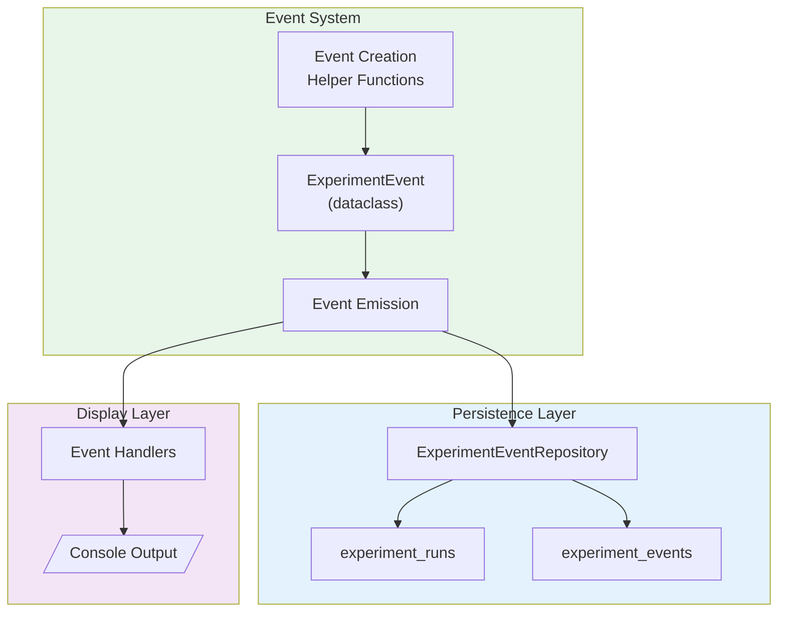
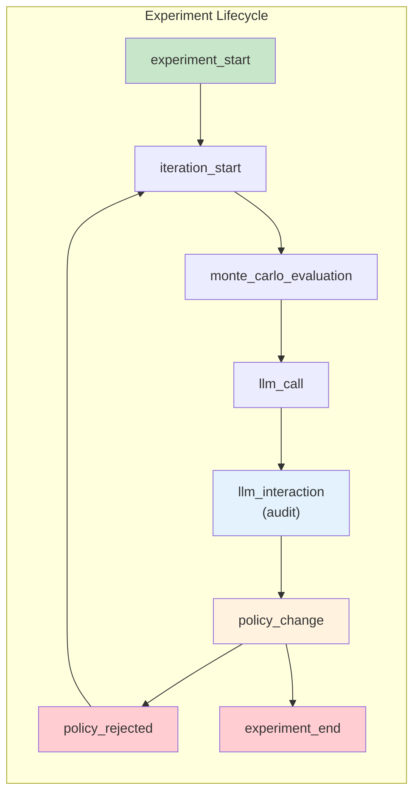
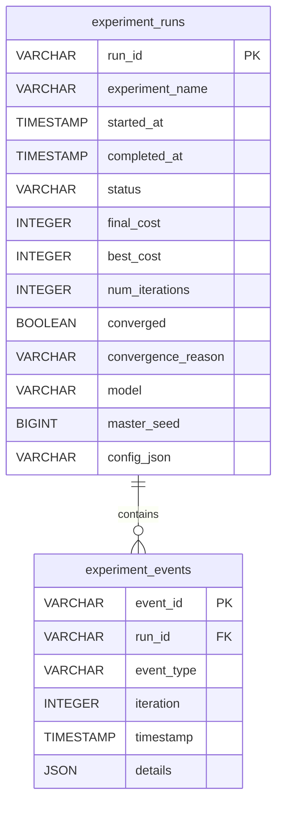
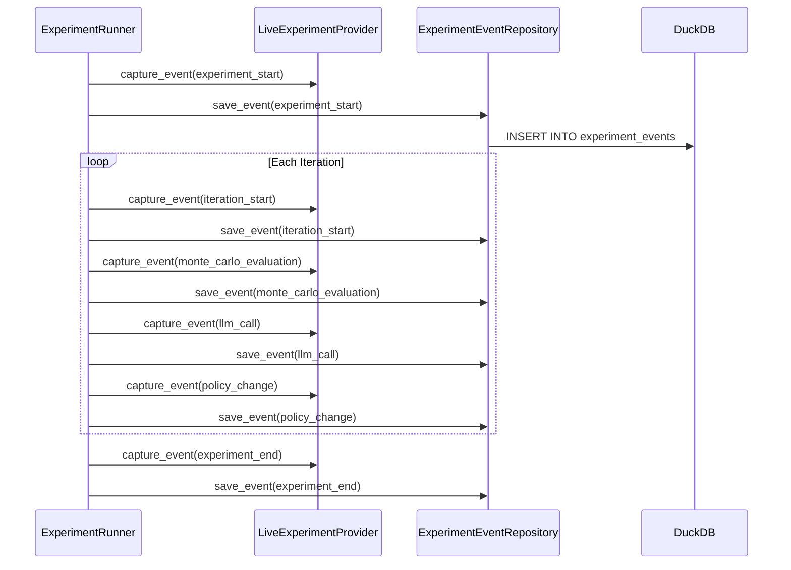
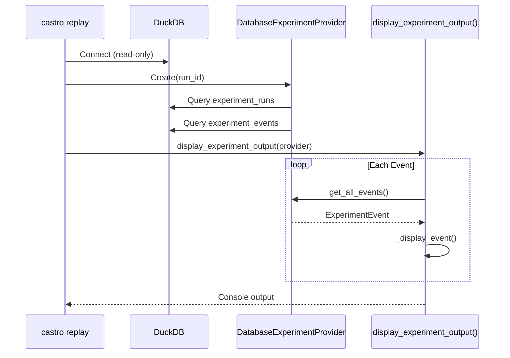

# Castro Events Model

**Version**: 1.0
**Last Updated**: 2025-12-09

---

## Overview

Events are the foundation of Castro's replay identity system. All verbose output is **driven by events**, and events are **self-contained** - they include ALL data needed for display, eliminating the need for joins or reconstruction.

---

## Architecture



---

## Design Principles

### Self-Contained Events

Events must contain ALL data needed for display. Never store just IDs that require later lookup:

```python
# CORRECT: Self-contained event
event = ExperimentEvent(
    event_type="monte_carlo_evaluation",
    run_id="exp1-20251209-143022-a1b2c3",
    iteration=1,
    timestamp=datetime.now(),
    details={
        "seed_results": [
            {"seed": 12345, "cost": 15000, "settled": 95, "total": 100},
            {"seed": 12346, "cost": 14500, "settled": 97, "total": 100},
        ],
        "mean_cost": 14750,
        "std_cost": 350,
    },
)

# WRONG: Requires lookup
event = ExperimentEvent(
    event_type="monte_carlo_evaluation",
    details={"evaluation_id": "eval-123"},  # Forces DB lookup for display!
)
```

### Immutable After Creation

Events are never modified after creation. This ensures replay produces identical output.

### Ordered by Iteration

Events are ordered by `(iteration, timestamp)` for deterministic replay.

---

## ExperimentEvent Dataclass

**Source**: `experiments/castro/castro/events.py`

```python
@dataclass
class ExperimentEvent:
    """Base event for experiment replay.

    Attributes:
        event_type: Type of event (one of EVENT_* constants)
        run_id: Unique run identifier
        iteration: Iteration number (0 for pre-iteration events)
        timestamp: When the event occurred
        details: Event-specific data (fully self-contained)
    """

    event_type: str
    run_id: str
    iteration: int
    timestamp: datetime
    details: dict[str, Any] = field(default_factory=dict)

    def to_dict(self) -> dict[str, Any]:
        """Convert event to a dictionary for serialization."""
        return {
            "event_type": self.event_type,
            "run_id": self.run_id,
            "iteration": self.iteration,
            "timestamp": self.timestamp.isoformat(),
            "details": self.details,
        }

    @classmethod
    def from_dict(cls, data: dict[str, Any]) -> ExperimentEvent:
        """Create event from a dictionary."""
        timestamp = data["timestamp"]
        if isinstance(timestamp, str):
            timestamp = datetime.fromisoformat(timestamp)

        return cls(
            event_type=data["event_type"],
            run_id=data["run_id"],
            iteration=data["iteration"],
            timestamp=timestamp,
            details=data.get("details", {}),
        )
```

---

## Event Types



### Event Type Constants

```python
EVENT_EXPERIMENT_START = "experiment_start"
EVENT_ITERATION_START = "iteration_start"
EVENT_MONTE_CARLO_EVALUATION = "monte_carlo_evaluation"
EVENT_LLM_CALL = "llm_call"
EVENT_LLM_INTERACTION = "llm_interaction"  # Full audit data for replay
EVENT_POLICY_CHANGE = "policy_change"
EVENT_POLICY_REJECTED = "policy_rejected"
EVENT_EXPERIMENT_END = "experiment_end"
```

---

## Event Type Details

### experiment_start

Emitted once at the beginning of an experiment run.

```python
create_experiment_start_event(
    run_id="exp1-20251209-143022-a1b2c3",
    experiment_name="exp1",
    description="2-agent basic optimization",
    model="anthropic:claude-sonnet-4-5",
    max_iterations=25,
    num_samples=5,
)
```

**Details fields:**
| Field | Type | Description |
|-------|------|-------------|
| `experiment_name` | str | Experiment identifier (exp1, exp2, exp3) |
| `description` | str | Human-readable description |
| `model` | str | LLM model in provider:model format |
| `max_iterations` | int | Maximum optimization iterations |
| `num_samples` | int | Monte Carlo sample count |

---

### iteration_start

Emitted at the start of each optimization iteration.

```python
create_iteration_start_event(
    run_id="exp1-20251209-143022-a1b2c3",
    iteration=1,
    total_cost=15000,
)
```

**Details fields:**
| Field | Type | Description |
|-------|------|-------------|
| `total_cost` | int | Total system cost at iteration start (cents) |

---

### monte_carlo_evaluation

Emitted after Monte Carlo sampling completes.

```python
create_monte_carlo_event(
    run_id="exp1-20251209-143022-a1b2c3",
    iteration=1,
    seed_results=[
        {"seed": 12345, "cost": 15000, "settled": 95, "total": 100, "settlement_rate": 0.95},
        {"seed": 12346, "cost": 14500, "settled": 97, "total": 100, "settlement_rate": 0.97},
    ],
    mean_cost=14750,
    std_cost=350,
)
```

**Details fields:**
| Field | Type | Description |
|-------|------|-------------|
| `seed_results` | list[dict] | Per-seed simulation results |
| `mean_cost` | int | Mean cost across all seeds (cents) |
| `std_cost` | int | Standard deviation of costs (cents) |

**seed_results item:**
| Field | Type | Description |
|-------|------|-------------|
| `seed` | int | Simulation seed used |
| `cost` | int | Total cost for this seed (cents) |
| `settled` | int | Number of transactions settled |
| `total` | int | Total transactions in simulation |
| `settlement_rate` | float | Ratio of settled/total |

---

### llm_call

Emitted when an LLM API call completes.

```python
create_llm_call_event(
    run_id="exp1-20251209-143022-a1b2c3",
    iteration=1,
    agent_id="BANK_A",
    model="anthropic:claude-sonnet-4-5",
    prompt_tokens=1500,
    completion_tokens=200,
    latency_seconds=2.5,
    context_summary={"current_cost": 15000, "best_cost": 15000},
)
```

**Details fields:**
| Field | Type | Description |
|-------|------|-------------|
| `agent_id` | str | Agent being optimized |
| `model` | str | LLM model used |
| `prompt_tokens` | int | Input token count |
| `completion_tokens` | int | Output token count |
| `latency_seconds` | float | API call latency |
| `context_summary` | dict | Key context provided to LLM |

---

### llm_interaction (Audit)

Emitted during LLM calls to capture full interaction details for audit replay. This event contains the complete prompt/response data needed for the `--audit` mode.

```python
create_llm_interaction_event(
    run_id="exp1-20251209-143022-a1b2c3",
    iteration=1,
    agent_id="BANK_A",
    system_prompt="You are optimizing payment policies...",
    user_prompt="Current cost: $150.00. Propose a new policy...",
    raw_response='{"initial_liquidity_fraction": 0.15, "urgency_threshold": 8}',
    parsed_policy={"initial_liquidity_fraction": 0.15, "urgency_threshold": 8},
    parsing_error=None,
    model="anthropic:claude-sonnet-4-5",
    prompt_tokens=1500,
    completion_tokens=200,
    latency_seconds=2.5,
)
```

**Details fields:**
| Field | Type | Description |
|-------|------|-------------|
| `agent_id` | str | Agent being optimized |
| `system_prompt` | str | Full system prompt sent to LLM |
| `user_prompt` | str | Full user prompt with context and constraints |
| `raw_response` | str | Raw LLM response text before parsing |
| `parsed_policy` | dict | None | Parsed policy dict if successful, None if failed |
| `parsing_error` | str | None | Error message if parsing failed, None if successful |
| `model` | str | LLM model used |
| `prompt_tokens` | int | Number of input tokens |
| `completion_tokens` | int | Number of output tokens |
| `latency_seconds` | float | API call latency |

**Usage Notes:**
- This event is used exclusively by the `castro replay --audit` mode
- It captures the FULL interaction for debugging and compliance
- Both `parsed_policy` and `parsing_error` are stored to show validation outcomes
- The `raw_response` is displayed with JSON pretty-printing when possible

---

### policy_change

Emitted when a policy change is proposed and evaluated.

```python
create_policy_change_event(
    run_id="exp1-20251209-143022-a1b2c3",
    iteration=1,
    agent_id="BANK_A",
    old_policy={"parameters": {"delay_threshold": 50}},
    new_policy={"parameters": {"delay_threshold": 45}},
    old_cost=15000,
    new_cost=14000,
    accepted=True,
)
```

**Details fields:**
| Field | Type | Description |
|-------|------|-------------|
| `agent_id` | str | Agent whose policy changed |
| `old_policy` | dict | Previous policy configuration |
| `new_policy` | dict | Proposed policy configuration |
| `old_cost` | int | Cost with old policy (cents) |
| `new_cost` | int | Cost with new policy (cents) |
| `accepted` | bool | Whether change was accepted |

---

### policy_rejected

Emitted when a policy fails validation or doesn't improve cost.

```python
create_policy_rejected_event(
    run_id="exp1-20251209-143022-a1b2c3",
    iteration=1,
    agent_id="BANK_A",
    proposed_policy={"parameters": {"delay_threshold": -5}},
    validation_errors=["delay_threshold must be non-negative"],
    rejection_reason="validation_failed",
)
```

**Details fields:**
| Field | Type | Description |
|-------|------|-------------|
| `agent_id` | str | Agent whose policy was rejected |
| `proposed_policy` | dict | The rejected policy |
| `validation_errors` | list[str] | Validation error messages |
| `rejection_reason` | str | Reason code (validation_failed, cost_not_improved) |
| `old_cost` | int? | Previous cost if applicable |
| `new_cost` | int? | New cost if applicable |

---

### experiment_end

Emitted once when the experiment completes.

```python
create_experiment_end_event(
    run_id="exp1-20251209-143022-a1b2c3",
    iteration=5,
    final_cost=12000,
    best_cost=12000,
    converged=True,
    convergence_reason="stability_reached",
    duration_seconds=45.3,
)
```

**Details fields:**
| Field | Type | Description |
|-------|------|-------------|
| `final_cost` | int | Final cost at experiment end (cents) |
| `best_cost` | int | Best cost achieved (cents) |
| `converged` | bool | Whether experiment converged |
| `convergence_reason` | str | Reason for stopping |
| `duration_seconds` | float | Total experiment duration |

---

## Persistence

### Database Schema

Events are persisted to DuckDB for replay:



### ExperimentEventRepository

**Source**: `experiments/castro/castro/persistence/repository.py`

```python
class ExperimentEventRepository:
    """Repository for experiment event database operations."""

    def __init__(self, conn: duckdb.DuckDBPyConnection) -> None:
        """Initialize repository with database connection."""
        self._conn = conn

    def initialize_schema(self) -> None:
        """Initialize database tables."""
        # Creates experiment_runs and experiment_events tables

    # Run Record Operations
    def save_run_record(self, record: ExperimentRunRecord) -> None: ...
    def get_run_record(self, run_id: str) -> ExperimentRunRecord | None: ...
    def update_run_status(self, run_id: str, status: str, ...) -> None: ...
    def list_runs(self, experiment_filter: str | None = None) -> list[ExperimentRunRecord]: ...

    # Event Operations
    def save_event(self, event: ExperimentEvent) -> None: ...
    def save_events_batch(self, events: list[ExperimentEvent]) -> None: ...
    def get_events_for_run(self, run_id: str) -> Iterator[ExperimentEvent]: ...
    def get_events_for_iteration(self, run_id: str, iteration: int) -> Iterator[ExperimentEvent]: ...
```

### ExperimentRunRecord

**Source**: `experiments/castro/castro/persistence/models.py`

```python
@dataclass
class ExperimentRunRecord:
    """Record for an experiment run."""

    run_id: str                           # exp1-20251209-143022-a1b2c3
    experiment_name: str                  # exp1
    started_at: datetime
    status: str                           # running, completed, failed
    completed_at: datetime | None = None
    final_cost: int | None = None
    best_cost: int | None = None
    num_iterations: int | None = None
    converged: bool | None = None
    convergence_reason: str | None = None
    model: str | None = None
    master_seed: int | None = None
    config_json: str | None = None
```

---

## Event Flow

### During Run



### During Replay



---

## Adding New Event Types

When adding a new event type, follow this workflow:

### 1. Define Event Constant

```python
# In events.py
EVENT_MY_NEW_EVENT = "my_new_event"

ALL_EVENT_TYPES.append(EVENT_MY_NEW_EVENT)
```

### 2. Create Helper Function

```python
def create_my_new_event(
    run_id: str,
    iteration: int,
    # ALL fields needed for display
    agent_id: str,
    important_value: int,
    details_list: list[dict[str, Any]],
) -> ExperimentEvent:
    """Create a my_new_event event."""
    return ExperimentEvent(
        event_type=EVENT_MY_NEW_EVENT,
        run_id=run_id,
        iteration=iteration,
        timestamp=datetime.now(),
        details={
            "agent_id": agent_id,
            "important_value": important_value,
            "details_list": details_list,
        },
    )
```

### 3. Add Display Handler

```python
# In display.py
def display_my_new_event(event: ExperimentEvent, console: Console) -> None:
    """Display my_new_event."""
    details = event.details
    console.print(f"Agent: {details['agent_id']}")
    console.print(f"Value: {details['important_value']}")

# In _display_event():
elif event_type == "my_new_event" and config.show_my_new:
    display_my_new_event(event, console)
```

### 4. Write Tests

```python
def test_my_new_event_creation():
    """my_new_event contains all required fields."""
    event = create_my_new_event(
        run_id="test-123",
        iteration=1,
        agent_id="BANK_A",
        important_value=100,
        details_list=[{"key": "value"}],
    )

    assert event.event_type == "my_new_event"
    assert event.details["agent_id"] == "BANK_A"
    assert event.details["important_value"] == 100
    assert event.details["details_list"] == [{"key": "value"}]
```

---

## Related Documents

- [StateProvider Pattern](state-provider.md) - How events drive unified display
- [CLI Commands](cli-commands.md) - Command reference
- [Castro Index](index.md) - Overview

---

*Next: [cli-commands.md](cli-commands.md) - CLI command reference*
