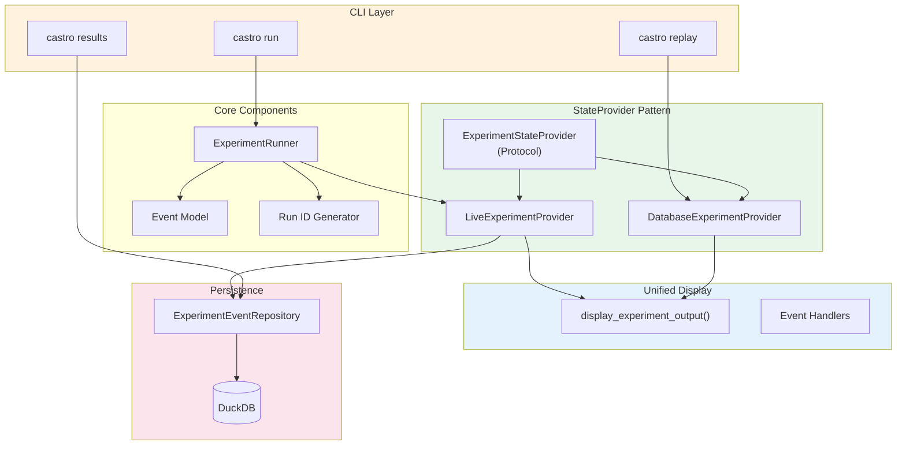

# Castro Experiments Reference

**Version**: 1.0
**Last Updated**: 2025-12-11

---

## Overview

Castro is the LLM-based policy optimization framework for SimCash. It orchestrates iterative experiments where an LLM agent proposes policy improvements based on bootstrap evaluation feedback.

This documentation covers the **Replay Identity System** that ensures experiment outputs can be perfectly replayed from database records.

---

## Quick Reference

| Command | Description |
|---------|-------------|
| `castro run exp1` | Run experiment 1 |
| `castro results` | List all experiment runs |
| `castro replay <RUN_ID>` | Replay experiment output |
| `castro replay <RUN_ID> --audit` | Replay with detailed LLM audit trail |
| `castro list` | List available experiments |
| `castro info exp1` | Show experiment configuration |

---

## Architecture Overview



---

## Key Concepts

### Run ID

Every experiment execution gets a unique identifier:

```
{experiment_name}-{YYYYMMDD}-{HHMMSS}-{hex6}
Example: exp1-20251209-143022-a1b2c3
```

### Replay Identity

The **StateProvider pattern** guarantees:

```
castro run exp1 --verbose    →  Output A
castro replay <RUN_ID>       →  Output A  (identical!)
```

### Event-Driven Architecture

All verbose output is driven by self-contained events stored in the database. No reconstruction required.

### Audit Mode

The replay command supports an **audit mode** (`--audit`) that displays detailed LLM interaction information:

```bash
# Show full audit trail for iterations 2-3
castro replay <RUN_ID> --audit --start 2 --end 3
```

Audit mode displays:
- Full system and user prompts sent to the LLM
- Raw LLM responses before parsing
- Validation results (success or parsing errors)
- Token counts and latency metrics

---

## Documentation Contents

| Document | Description |
|----------|-------------|
| [state-provider.md](state-provider.md) | StateProvider pattern and replay identity |
| [events.md](events.md) | Event model and persistence |
| [cli-commands.md](cli-commands.md) | CLI command reference |

---

## Quick Start

### Run an Experiment

```bash
# Run experiment 1
uv run castro run exp1

# Output shows Run ID:
# Starting exp1
#   Run ID: exp1-20251209-143022-a1b2c3
#   Description: 2-Period Deterministic Nash Equilibrium
#   ...
```

### List Results

```bash
# List all experiment runs
uv run castro results

# Filter by experiment
uv run castro results --experiment exp1
```

### Replay Output

```bash
# Replay exact output from a run
uv run castro replay exp1-20251209-143022-a1b2c3

# With verbose flags
uv run castro replay exp1-20251209-143022-a1b2c3 --verbose
```

---

## File Organization

```
experiments/castro/
├── castro/
│   ├── run_id.py           # Run ID generation
│   ├── events.py           # Event model (incl. llm_interaction)
│   ├── state_provider.py   # StateProvider pattern
│   ├── display.py          # Unified display functions
│   ├── audit_display.py    # Audit mode display functions
│   ├── persistence/
│   │   ├── models.py       # Database models
│   │   └── repository.py   # Database operations
│   ├── runner.py           # Experiment orchestration
│   └── experiments.py      # Experiment definitions
├── cli.py                  # CLI commands
└── tests/
    ├── test_run_id.py
    ├── test_events.py
    ├── test_state_provider.py
    ├── test_display.py
    ├── test_audit_display.py     # Audit display tests
    ├── test_cli_audit.py         # CLI audit flag tests
    ├── test_replay_audit_integration.py  # E2E audit tests
    └── test_cli_commands.py
```

---

## Related Documents

- [StateProvider Pattern](state-provider.md) - Core abstraction for replay identity
- [Event Model](events.md) - Event types and persistence
- [CLI Commands](cli-commands.md) - Command reference
- [Payment Simulator StateProvider](../api/state-provider.md) - Original pattern implementation
- [Experiments Module](../experiments/index.md) - YAML-driven experiment framework
- [LLM Module](../llm/index.md) - LLM client protocols and configuration

---

*Next: [state-provider.md](state-provider.md) - StateProvider pattern and replay identity*
