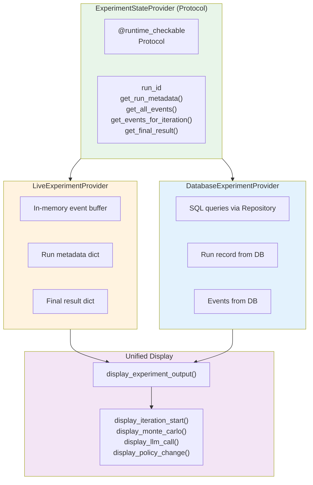
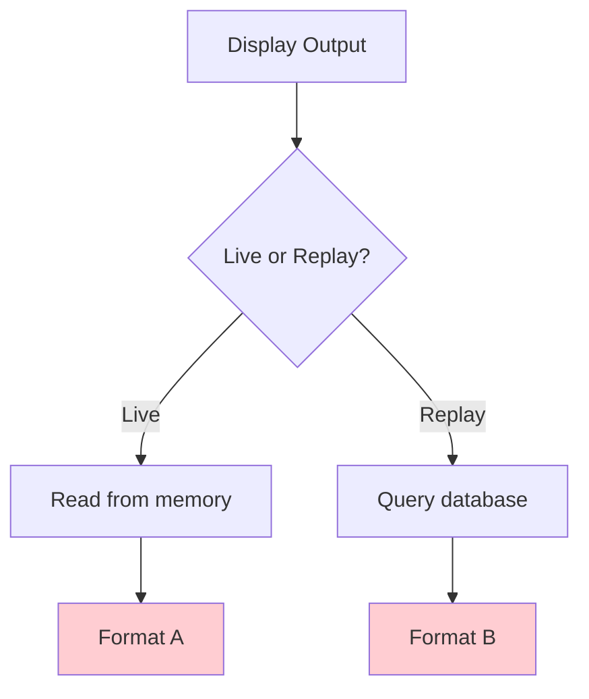
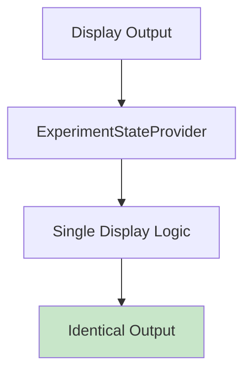
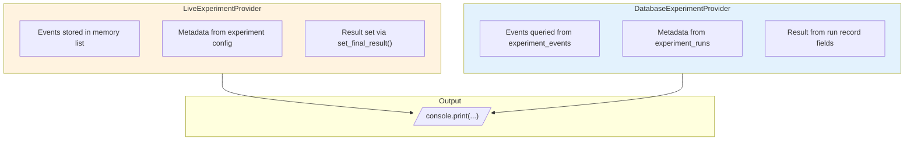
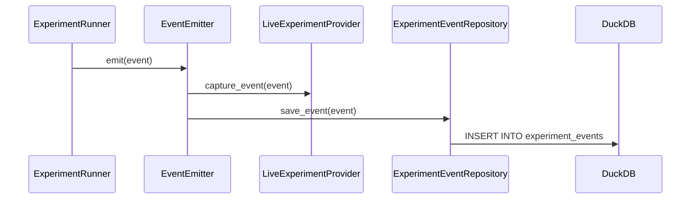
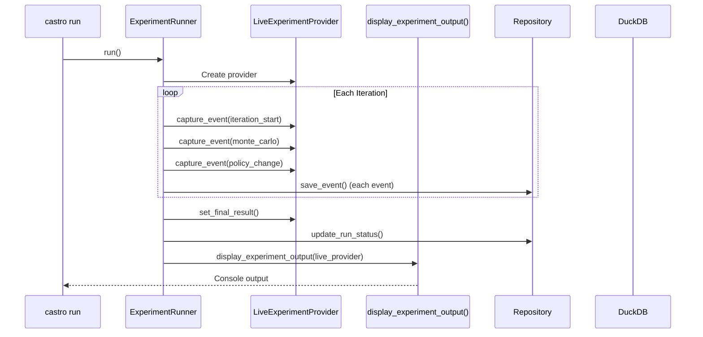
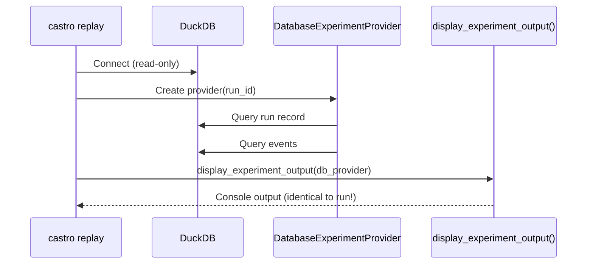

# Castro StateProvider Pattern

**Version**: 1.0
**Last Updated**: 2025-12-09

---

## Overview

The **StateProvider pattern** ensures that `castro replay` produces output identical to the original `castro run` command. This abstraction decouples display logic from data source, enabling the same display functions to work with both live experiments and database replays.

---

## Architecture



---

## Problem Solved

### Without StateProvider

Without the abstraction, display code needs separate paths for live and replay:



```python
# ❌ BAD: Duplicate code paths, potential divergence
def display_output(run_id: str, is_live: bool):
    if is_live:
        # Live path
        events = runner.get_events()
        metadata = runner.get_metadata()
    else:
        # Replay path - different logic!
        events = db.query_events(run_id)
        metadata = db.query_metadata(run_id)

    # Risk: Different formatting, missing fields, etc.
```

### With StateProvider

A single code path serves both modes through the protocol abstraction:



```python
# ✅ GOOD: Unified code path, guaranteed identity
def display_output(provider: ExperimentStateProvider):
    metadata = provider.get_run_metadata()
    events = provider.get_all_events()
    result = provider.get_final_result()

    # Same function, same output - always!
    display_experiment_output(provider, console)
```

---

## ExperimentStateProvider Protocol

**Source**: `experiments/castro/castro/state_provider.py`

```python
@runtime_checkable
class ExperimentStateProvider(Protocol):
    """Protocol for experiment state access.

    Abstracts data access to enable replay identity.
    Both live runs and database replays implement this protocol.
    """

    @property
    def run_id(self) -> str:
        """Unique run identifier."""
        ...

    def get_run_metadata(self) -> dict[str, Any] | None:
        """Get run metadata (experiment name, model, etc.)."""
        ...

    def get_all_events(self) -> Iterator[ExperimentEvent]:
        """Get all events for the run, ordered by iteration."""
        ...

    def get_events_for_iteration(self, iteration: int) -> list[ExperimentEvent]:
        """Get events for a specific iteration."""
        ...

    def get_final_result(self) -> dict[str, Any]:
        """Get final experiment result (costs, convergence, etc.)."""
        ...
```

---

## Implementations



### LiveExperimentProvider

For live experiment runs, captures events in memory:

**Source**: `experiments/castro/castro/state_provider.py`

```python
class LiveExperimentProvider:
    """StateProvider for live experiment runs.

    Captures events during execution and stores them in memory.
    Used by ExperimentRunner during the optimization loop.
    """

    def __init__(
        self,
        run_id: str,
        experiment_name: str,
        description: str,
        model: str,
        max_iterations: int,
        num_samples: int,
    ) -> None:
        self._run_id = run_id
        self._metadata = {
            "run_id": run_id,
            "experiment_name": experiment_name,
            "description": description,
            "model": model,
            "max_iterations": max_iterations,
            "num_samples": num_samples,
        }
        self._events: list[ExperimentEvent] = []
        self._final_result: dict[str, Any] = {}

    @property
    def run_id(self) -> str:
        return self._run_id

    def capture_event(self, event: ExperimentEvent) -> None:
        """Capture an event during execution."""
        self._events.append(event)

    def get_all_events(self) -> Iterator[ExperimentEvent]:
        """Yield all captured events."""
        yield from self._events

    def set_final_result(
        self,
        final_cost: int,
        best_cost: int,
        converged: bool,
        convergence_reason: str,
        num_iterations: int,
        duration_seconds: float,
    ) -> None:
        """Set the final result after experiment completes."""
        self._final_result = {
            "final_cost": final_cost,
            "best_cost": best_cost,
            "converged": converged,
            "convergence_reason": convergence_reason,
            "num_iterations": num_iterations,
            "duration_seconds": duration_seconds,
        }
```

### DatabaseExperimentProvider

For replay, queries events from database:

```python
class DatabaseExperimentProvider:
    """StateProvider for database replay.

    Reads experiment data from DuckDB for replay.
    Used by `castro replay` command.
    """

    def __init__(self, conn: duckdb.DuckDBPyConnection, run_id: str) -> None:
        self._conn = conn
        self._run_id = run_id
        self._repo = ExperimentEventRepository(conn)

    @property
    def run_id(self) -> str:
        return self._run_id

    def get_run_metadata(self) -> dict[str, Any] | None:
        """Query run metadata from database."""
        record = self._repo.get_run_record(self._run_id)
        if record is None:
            return None
        return {
            "run_id": record.run_id,
            "experiment_name": record.experiment_name,
            "model": record.model,
            "started_at": record.started_at,
            "status": record.status,
        }

    def get_all_events(self) -> Iterator[ExperimentEvent]:
        """Query all events from database, ordered by iteration."""
        yield from self._repo.get_events_for_run(self._run_id)

    def get_final_result(self) -> dict[str, Any]:
        """Query final result from run record."""
        record = self._repo.get_run_record(self._run_id)
        if record is None:
            return {}
        return {
            "final_cost": record.final_cost,
            "best_cost": record.best_cost,
            "converged": record.converged,
            "convergence_reason": record.convergence_reason,
            "num_iterations": record.num_iterations,
        }
```

---

## EventEmitter

Bridges live capture and persistence:



```python
class EventEmitter:
    """Bridges event capture and persistence.

    Emits events to both the live provider (for display)
    and the repository (for persistence).
    """

    def __init__(
        self,
        provider: LiveExperimentProvider,
        repository: ExperimentEventRepository,
    ) -> None:
        self._provider = provider
        self._repository = repository

    def emit(self, event: ExperimentEvent) -> None:
        """Emit event to both provider and database."""
        self._provider.capture_event(event)
        self._repository.save_event(event)
```

---

## Unified Display Function

**Source**: `experiments/castro/castro/display.py`

```python
def display_experiment_output(
    provider: ExperimentStateProvider,
    console: Console | None = None,
    verbose_config: VerboseConfig | None = None,
) -> None:
    """Display experiment output from any provider.

    This is the SINGLE SOURCE OF TRUTH for experiment output.
    Both `castro run` and `castro replay` use this function.

    Args:
        provider: ExperimentStateProvider (live or database)
        console: Rich Console for output (default: new Console)
        verbose_config: VerboseConfig controlling what to show
    """
    console = console or Console()
    verbose_config = verbose_config or VerboseConfig.all_enabled()

    # Display header with run metadata
    metadata = provider.get_run_metadata()
    if metadata:
        _display_header(metadata, console)

    # Display events
    for event in provider.get_all_events():
        _display_event(event, console, verbose_config)

    # Display final results
    result = provider.get_final_result()
    if result:
        _display_final_results(result, console)
```

---

## Data Flow

### Run Mode



### Replay Mode



---

## VerboseConfig

Controls which event types are displayed:

```python
@dataclass
class VerboseConfig:
    """Configuration for verbose output."""

    show_iterations: bool = False
    show_monte_carlo: bool = False
    show_llm_calls: bool = False
    show_policy_changes: bool = False
    show_rejections: bool = False

    @classmethod
    def all_enabled(cls) -> VerboseConfig:
        """Create config with all verbose output enabled."""
        return cls(
            show_iterations=True,
            show_monte_carlo=True,
            show_llm_calls=True,
            show_policy_changes=True,
            show_rejections=True,
        )

    @classmethod
    def from_flags(
        cls,
        verbose: bool = False,
        verbose_iterations: bool = False,
        verbose_monte_carlo: bool = False,
        verbose_llm: bool = False,
        verbose_policy: bool = False,
    ) -> VerboseConfig:
        """Create config from CLI flags."""
        if verbose:
            return cls.all_enabled()
        return cls(
            show_iterations=verbose_iterations,
            show_monte_carlo=verbose_monte_carlo,
            show_llm_calls=verbose_llm,
            show_policy_changes=verbose_policy,
        )
```

---

## Replay Identity Guarantee

### The Invariant

```
For any experiment run R:
  output(castro run R) == output(castro replay R.run_id)
```

Excluding timing information (duration), all output is identical.

### How It's Achieved

1. **Single Display Function**: Both modes use `display_experiment_output()`
2. **Protocol Abstraction**: Display code only sees `ExperimentStateProvider`
3. **Self-Contained Events**: Events contain ALL data needed for display
4. **No Reconstruction**: Database provider queries events directly, no manual reconstruction

### Verification

```bash
# Run with verbose output
uv run castro run exp1 --verbose > run_output.txt

# Get run ID from output, then replay
uv run castro replay exp1-20251209-143022-a1b2c3 --verbose > replay_output.txt

# Compare (should be identical except Duration line)
diff <(grep -v "Duration:" run_output.txt) <(grep -v "Duration:" replay_output.txt)
```

---

## CLI Usage

### Run Command

```bash
# Run experiment (generates unique Run ID)
uv run castro run exp1

# Output includes:
# Starting exp1
#   Run ID: exp1-20251209-143022-a1b2c3
#   ...
```

### Replay Command

```bash
# Replay with same verbose settings as run
uv run castro replay exp1-20251209-143022-a1b2c3 --verbose

# Selective verbose flags
uv run castro replay exp1-20251209-143022-a1b2c3 --verbose-monte-carlo
```

### Results Command

```bash
# List all runs
uv run castro results

# Filter by experiment
uv run castro results --experiment exp1

# Output:
# ┏━━━━━━━━━━━━━━━━━━━━━━━━━━━━━━━┳━━━━━━━━━━━━┳━━━━━━━━━━━┓
# ┃ Run ID                        ┃ Experiment ┃ Status    ┃
# ┡━━━━━━━━━━━━━━━━━━━━━━━━━━━━━━━╇━━━━━━━━━━━━╇━━━━━━━━━━━┩
# │ exp1-20251209-143022-a1b2c3   │ exp1       │ completed │
# └───────────────────────────────┴────────────┴───────────┘
```

---

## Testing

### Protocol Compliance

```python
def test_live_provider_implements_protocol():
    """LiveExperimentProvider implements ExperimentStateProvider."""
    provider = LiveExperimentProvider(
        run_id="test-123",
        experiment_name="exp1",
        ...
    )
    assert isinstance(provider, ExperimentStateProvider)


def test_database_provider_implements_protocol():
    """DatabaseExperimentProvider implements ExperimentStateProvider."""
    conn = duckdb.connect(":memory:")
    provider = DatabaseExperimentProvider(conn=conn, run_id="test-123")
    assert isinstance(provider, ExperimentStateProvider)
```

### Display Identity

```python
def test_display_same_output_for_both_providers():
    """Both providers produce identical display output."""
    # Create live provider with events
    live = LiveExperimentProvider(...)
    live.capture_event(create_experiment_start_event(...))

    # Save to database
    repo.save_event(event)

    # Create database provider
    db_provider = DatabaseExperimentProvider(conn, run_id)

    # Capture output from both
    live_output = capture_display(live)
    db_output = capture_display(db_provider)

    assert live_output == db_output
```

---

## Anti-Patterns

### ❌ Accessing Data Source Directly

```python
# BAD: Display code knows about data source
def display_results(is_live: bool, runner=None, conn=None, run_id=None):
    if is_live:
        events = runner.get_events()  # Live-specific
    else:
        events = query_db(conn, run_id)  # DB-specific
```

### ✅ Using StateProvider

```python
# GOOD: Display code only knows protocol
def display_results(provider: ExperimentStateProvider):
    events = provider.get_all_events()  # Works for both!
```

### ❌ Reconstructing Events in Replay

```python
# BAD: Manual reconstruction is fragile
def replay_monte_carlo(conn, run_id, iteration):
    # Query raw data and reconstruct - error prone!
    seeds = query_seeds(conn, run_id, iteration)
    costs = query_costs(conn, run_id, iteration)
    return {"seeds": seeds, "costs": costs}
```

### ✅ Storing Complete Events

```python
# GOOD: Events are self-contained
event = create_monte_carlo_event(
    run_id=run_id,
    iteration=iteration,
    seed_results=[...],  # ALL data included
    mean_cost=15000,
    std_cost=500,
)
```

---

## Related Documents

- [Events Model](events.md) - Event types and persistence
- [CLI Commands](cli-commands.md) - Command reference
- [Castro Index](index.md) - Overview
- [Payment Simulator StateProvider](../api/state-provider.md) - Original pattern

---

*Next: [events.md](events.md) - Event model and persistence*
