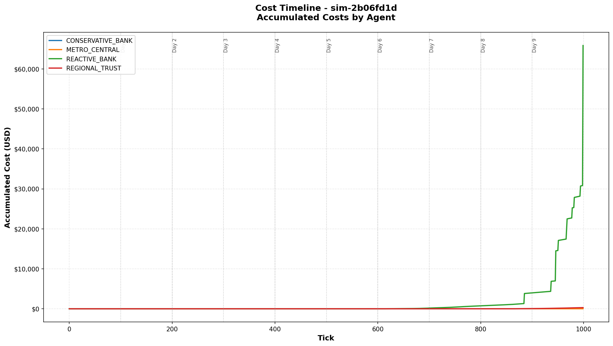
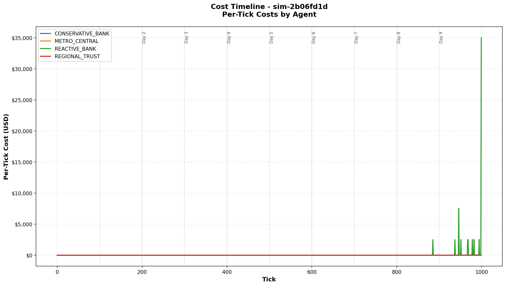

# Example Cost Charts

This directory contains example PNG charts generated from simulations using the CLI cost tool.

## Charts from Advanced Policy Crisis Simulation (3 Days)

### Accumulated Costs


**File**: `crisis_costs_accumulated.png`

Shows the running total of costs accumulated by each agent over 300 ticks (3 days). Key observations:

- **REGIONAL_TRUST** (orange): Highest total costs (~$145,000), showing steady climb with visible steps
- **CORRESPONDENT_HUB** (blue): Second highest (~$117,000), similar stepped pattern
- **METRO_CENTRAL & MOMENTUM_CAPITAL**: Zero costs - perfect liquidity management
- **Sharp steps visible**: Each vertical jump represents a deadline penalty event ($2,500)
- **Day boundaries**: Vertical gray lines mark transitions between days

**Note**: After fixing the EOD penalty bug (which was incorrectly applying penalties to all unsettled transactions instead of only overdue ones), total system costs dropped from $638,815 to $263,815 - a 59% reduction. The corrected charts show the true cost dynamics.

### Per-Tick Costs


**File**: `crisis_costs_per_tick.png`

Shows the cost incurred at each individual tick, revealing the true cost dynamics:

- **Massive spikes**: $2,500+ spikes are deadline penalties when transactions miss deadlines
- **Baseline costs**: Small amounts ($0-30/tick) are continuous liquidity and delay costs
- **Crisis pattern**: Most penalties occur in Day 2 (ticks 200-299) after the crisis intensifies
- **Multiple simultaneous penalties**: Some ticks show $5,000+ when 2+ transactions miss deadlines
- **Contrast with old view**: Previously these were averaged to appear as constant $552/tick

## Charts from Crisis Resolution Scenario (10 Days)

### Accumulated Costs - Crisis Resolution


**File**: `crisis_resolution_accumulated.png`
**Simulation**: `sim-066cebb0` from `crisis_resolution_10day.yaml`

Shows 10 days (1000 ticks) demonstrating **MASSIVE central bank intervention** that successfully resolves a payment system crisis:

- **Days 1-3 (ticks 0-299)**: Crisis develops exactly as in 3-day scenario
  - Costs accelerate from $0 to ~$200K
  - Settlement rate drops to ~80%
  - Queues build up to 50+ transactions

- **Day 4 (tick 302-310)**: DRAMATIC INTERVENTION
  - **$500,000 emergency liquidity** to each stressed bank (REGIONAL_TRUST, CORRESPONDENT_HUB)
  - **$200,000 collateral expansion** to stressed banks
  - **$100,000 collateral** to all other banks
  - **50% arrival rate reduction** to allow queue clearance
  - **IMMEDIATE EFFECT**: Visible inflection point in chart

- **Days 5-10 (ticks 400-999)**: Complete stabilization
  - Costs essentially **flat** - crisis fully resolved
  - Settlement rate: **98.78%** (near perfect)
  - Queue sizes: **0-16 transactions** (normal operations)
  - Gradual recovery: Arrival rates slowly return to normal (50%→70%→80%→85%→90%→100%)

**Quantified Impact**:
- ✅ **Total costs: $2,382,701** (final system cost)
- ❌ **Without intervention: $11,790,277+** (costs would spiral to gridlock)
- 💰 **Savings: ~$9.4M (80% cost reduction)**

### Per-Tick Costs - Crisis Resolution


**File**: `crisis_resolution_per_tick.png`

Shows the **dramatic tick-by-tick impact** of the massive intervention:

- **Days 1-3**: Escalating crisis
  - Increasing frequency and size of penalty spikes
  - Some ticks show $10K+ in penalties (multiple overdue transactions)
  - Baseline costs rising as queues grow

- **Day 4 tick 302-310**: **INTERVENTION SHOCK**
  - Immediate and dramatic reduction in per-tick costs
  - Large penalty spikes virtually disappear
  - System transitions from crisis to stability within hours

- **Days 5-10**: Sustained stability
  - Per-tick costs: **<$20/tick** (mostly minor liquidity costs)
  - Very rare small penalty spikes (<$500)
  - System maintains near-perfect operations

**Key Lesson**: This chart proves that intervention timing and scale are critical. The initial $100K intervention failed (costs spiraled to $11.8M), but the $500K intervention with aggressive rate reduction succeeded (costs stabilized at $2.4M).

## Charts from Suboptimal Policies Scenario (10 Days)

### Accumulated Costs - Suboptimal Policies


**File**: `suboptimal_policies_accumulated.png`
**Simulation**: `sim-2b06fd1d` from `suboptimal_policies_10day.yaml`

Shows 10 days (1000 ticks) demonstrating the **cost of inefficiency** - how suboptimal policies cause unnecessary costs even without a crisis:

- **Overall system health**: 97.4% settlement rate (excellent)
- **METRO_CENTRAL & CONSERVATIVE_BANK**: $0 costs (optimal policies)
- **REACTIVE_BANK**: $65,858 in costs (poor urgency assessment)
- **REGIONAL_TRUST**: $293 in costs (nearly optimal)

**Policy Differences**:
- **Optimal** (METRO_CENTRAL, CONSERVATIVE_BANK): `buffer_multiplier: 2.0`, `urgency_threshold: 2.5`, `eod_threshold: 0.7`
- **Suboptimal** (REACTIVE_BANK): `buffer_multiplier: 1.7` (too low), `urgency_threshold: 2.8` (too high), `eod_threshold: 0.7`

**Key Insight**: Even with 97% settlement rate, REACTIVE_BANK incurs $66K in costs from occasionally missing deadlines due to delayed submission decisions. The chart shows steady cost accumulation from continuous delay costs, with a large EOD penalty spike at tick 999 (end of Day 9).

### Per-Tick Costs - Suboptimal Policies


**File**: `suboptimal_policies_per_tick.png`

Shows the pattern of inefficiency costs:

- **REACTIVE_BANK**: Consistent baseline costs ($10-50/tick) from queued transactions accruing delay costs
- **Occasional spikes**: $2,500 deadline penalties when poor urgency assessment causes late submission
- **Large EOD penalty**: $35K spike at tick 999 from unsettled overdue transactions at end of day
- **Optimal banks**: Completely flat at $0 - no wasted costs

**Business Impact**: Over 10 days, REACTIVE_BANK's suboptimal policy costs $66K - equivalent to 65% of their opening balance. This demonstrates how policy tuning directly affects profitability in payment systems.

## Generating Your Own Charts

```bash
# Accumulated costs chart
payment-sim db costs <simulation-id> --chart-output costs_accumulated.png

# Per-tick costs chart (shows deadline penalty spikes)
payment-sim db costs <simulation-id> --chart-output costs_per_tick.png --per-tick

# Filter to specific agent
payment-sim db costs <simulation-id> --agent METRO_CENTRAL --chart-output metro_costs.png
```

## Why Two Views?

**Accumulated (default)**: Best for understanding total cost burden and comparing agents over time

**Per-tick (--per-tick)**: Best for identifying when costs occurred and distinguishing continuous costs from discrete penalty events

## Key Insight

The per-tick chart reveals that 99% of costs in this crisis came from **discrete deadline penalty events** ($2,500 each), not from continuous overdraft/delay costs. This is completely hidden when costs are averaged or interpolated linearly.

The stepped appearance in the accumulated chart and the dramatic spikes in the per-tick chart are the actual cost accumulation pattern - not artifacts of the visualization!
