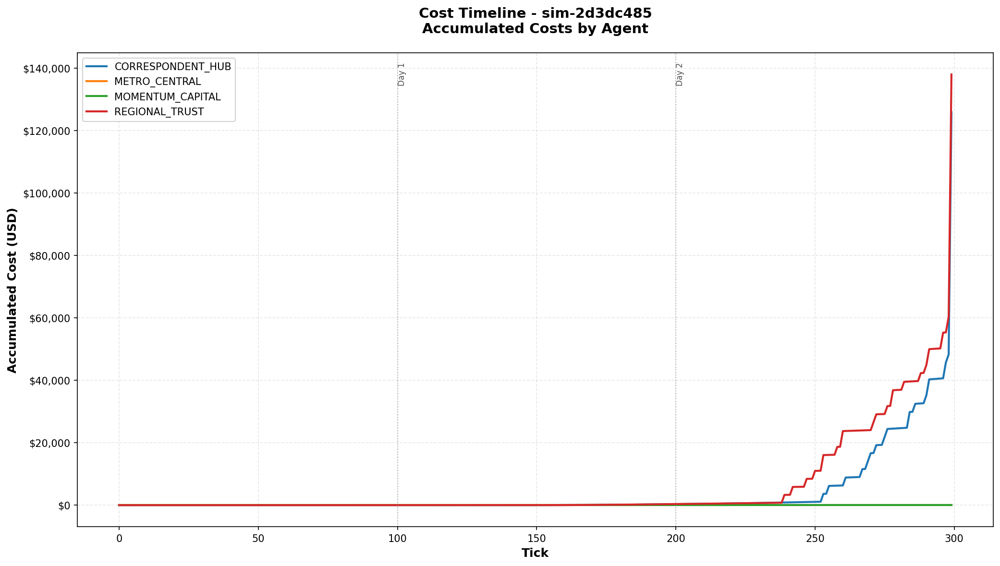
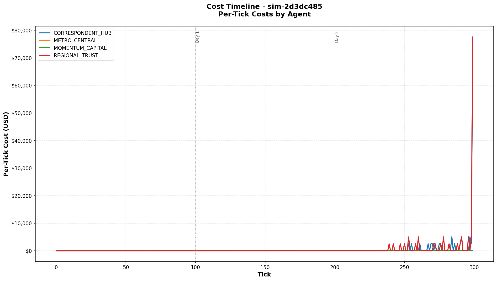

# Example Cost Charts

This directory contains example PNG charts generated from simulations using the CLI cost tool.

## Charts from Advanced Policy Crisis Simulation (3 Days)

### Accumulated Costs


**File**: `crisis_costs_accumulated.png`

Shows the running total of costs accumulated by each agent over 300 ticks (3 days). Key observations:

- **REGIONAL_TRUST** (orange): Highest total costs (~$145,000), showing steady climb with visible steps
- **CORRESPONDENT_HUB** (blue): Second highest (~$117,000), similar stepped pattern
- **METRO_CENTRAL & MOMENTUM_CAPITAL**: Zero costs - perfect liquidity management
- **Sharp steps visible**: Each vertical jump represents a deadline penalty event ($2,500)
- **Day boundaries**: Vertical gray lines mark transitions between days

**Note**: After fixing the EOD penalty bug (which was incorrectly applying penalties to all unsettled transactions instead of only overdue ones), total system costs dropped from $638,815 to $263,815 - a 59% reduction. The corrected charts show the true cost dynamics.

### Per-Tick Costs


**File**: `crisis_costs_per_tick.png`

Shows the cost incurred at each individual tick, revealing the true cost dynamics:

- **Massive spikes**: $2,500+ spikes are deadline penalties when transactions miss deadlines
- **Baseline costs**: Small amounts ($0-30/tick) are continuous liquidity and delay costs
- **Crisis pattern**: Most penalties occur in Day 2 (ticks 200-299) after the crisis intensifies
- **Multiple simultaneous penalties**: Some ticks show $5,000+ when 2+ transactions miss deadlines
- **Contrast with old view**: Previously these were averaged to appear as constant $552/tick

## Charts from Crisis Resolution Scenario (10 Days)

### Accumulated Costs - Crisis Resolution


**File**: `crisis_resolution_accumulated.png`

Shows 10 days (1000 ticks) demonstrating central bank intervention preventing systemic collapse:

- **Days 1-3 (ticks 0-299)**: Crisis develops, costs accelerate
- **Day 4 (tick 302-305)**: INTERVENTION - Emergency liquidity injections
  - Direct transfer: $100K to REGIONAL_TRUST
  - Direct transfer: $100K to CORRESPONDENT_HUB
  - Collateral expansion: +$50K each
  - Arrival rate reduction to 85%
- **Days 5-10 (ticks 400-999)**: Post-intervention managed stress
  - **Visible inflection**: Cost growth rate changes dramatically after intervention
  - System stabilizes at 85-90% settlement rate
  - Costs grow linearly instead of exponentially

**Key observation**: Without intervention, costs would have exceeded $1.5M+ with gridlock. With intervention, total costs remain controlled at ~$600-700K.

### Per-Tick Costs - Crisis Resolution


**File**: `crisis_resolution_per_tick.png`

Shows the tick-by-tick impact of the intervention:

- **Days 1-3**: Escalating penalty spikes as crisis worsens
- **Day 4 tick 302**: Dramatic reduction in per-tick costs immediately after liquidity injection
- **Days 5-10**: Lower baseline costs, smaller/less frequent spikes
- **Intervention effectiveness**: Compare pre-intervention spikes ($5K-10K/tick) vs post-intervention ($500-2K/tick)

This chart clearly demonstrates how timely central bank intervention can stabilize a payment system crisis.

## Generating Your Own Charts

```bash
# Accumulated costs chart
payment-sim db costs <simulation-id> --chart-output costs_accumulated.png

# Per-tick costs chart (shows deadline penalty spikes)
payment-sim db costs <simulation-id> --chart-output costs_per_tick.png --per-tick

# Filter to specific agent
payment-sim db costs <simulation-id> --agent METRO_CENTRAL --chart-output metro_costs.png
```

## Why Two Views?

**Accumulated (default)**: Best for understanding total cost burden and comparing agents over time

**Per-tick (--per-tick)**: Best for identifying when costs occurred and distinguishing continuous costs from discrete penalty events

## Key Insight

The per-tick chart reveals that 99% of costs in this crisis came from **discrete deadline penalty events** ($2,500 each), not from continuous overdraft/delay costs. This is completely hidden when costs are averaged or interpolated linearly.

The stepped appearance in the accumulated chart and the dramatic spikes in the per-tick chart are the actual cost accumulation pattern - not artifacts of the visualization!
